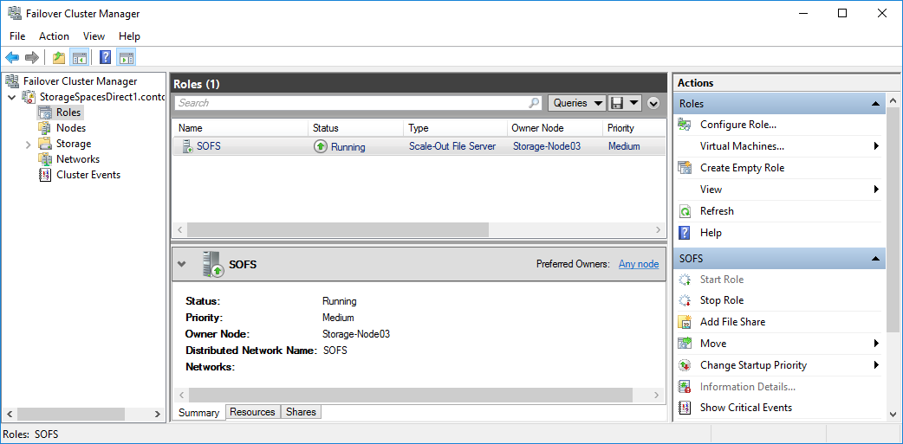

# Deploy Storage Spaces Direct

> Applies to: Windows Server 2019, Windows Server 2016

This topic provides step-by-step instructions to deploy [Storage Spaces Direct](storage-spaces-direct-overview.md).

> [!Tip]
> Looking to acquire Hyper-Converged Infrastructure? Microsoft recommends purchasing a validated hardware/software solution from our partners, which include deployment tools and procedures. These solutions are designed, assembled, and validated against our reference architecture to ensure compatibility and reliability, so you get up and running quickly. For Windows Server 2019 solutions, visit the [Azure Stack HCI solutions website](https://azure.microsoft.com/overview/azure-stack/hci). For Windows Server 2016 solutions, learn more at [Windows Server Software-Defined](https://microsoft.com/wssd).

> [!Tip]
> You can use Hyper-V virtual machines, including in Microsoft Azure, to [evaluate Storage Spaces Direct without hardware](storage-spaces-direct-in-vm.md). You may also want to review the handy [Windows Server rapid lab deployment scripts](https://aka.ms/wslab), which we use for training purposes.

## Before you start

Review the [Storage Spaces Direct hardware requirements](Storage-Spaces-Direct-Hardware-Requirements.md) and skim this document to familiarize yourself with the overall approach and important notes associated with some steps.

Gather the following information:

- **Deployment option.** Storage Spaces Direct supports [two deployment options: hyper-converged and converged](storage-spaces-direct-overview.md#deployment-options), also known as disaggregated. Familiarize yourself with the advantages of each to decide which is right for you. Steps 1-3 below apply to both deployment options. Step 4 is only needed for converged deployment.

- **Server names.** Get familiar with your organization's naming policies for computers, files, paths, and other resources. You'll need to provision several servers, each with unique names.

- **Domain name.** Get familiar with your organization's policies for domain naming and domain joining.  You'll be joining the servers to your domain, and you'll need to specify the domain name. 

- **RDMA networking.** There are two types of RDMA protocols: iWarp and RoCE. Note which one your network adapters use, and if RoCE, also note the version (v1 or v2). For RoCE, also note the model of your top-of-rack switch.

- **VLAN ID.** Note the VLAN ID to be used for management OS network adapters on the servers, if any. You should be able to obtain this from your network administrator.

## Step 1: Deploy Windows Server

### Step 1.1: Install the operating system

The first step is to install Windows Server on every server that will be in the cluster. Storage Spaces Direct requires Windows Server 2016 Datacenter Edition. You can use the Server Core installation option, or Server with Desktop Experience.

When you install Windows Server using the Setup wizard, you can choose between *Windows Server* (referring to Server Core) and *Windows Server (Server with Desktop Experience)*, which is the equivalent of the *Full* installation option available in Windows Server 2012 R2. If you don't choose, you'll get the Server Core installation option. For more information, see [Installation Options for Windows Server 2016](../../get-started/Windows-Server-2016.md).

### Step 1.2: Connect to the servers

This guide focuses the Server Core installation option and deploying/managing remotely from a separate management system, which must have:

- Windows Server 2016 with the same updates as the servers it's managing
- Network connectivity to the servers it's managing
- Joined to the same domain or a fully trusted domain
- Remote Server Administration Tools (RSAT) and PowerShell modules for Hyper-V and Failover Clustering. RSAT tools and PowerShell modules are available on Windows Server and can be installed without installing other features. You can also install the [Remote Server Administration Tools](https://www.microsoft.com/download/details.aspx?id=45520) on a Windows 10 management PC.

On the Management system install the Failover Cluster and Hyper-V management tools. This can be done through Server Manager using the **Add Roles and Features** wizard. On the **Features** page, select **Remote Server Administration Tools**, and then select the tools to install.

Enter the PS session and use either the server name or the IP address of the node you want to connect to. You'll be prompted for a password after you execute this command, enter the administrator password you specified when setting up Windows.

   ```PowerShell
   Enter-PSSession -ComputerName <myComputerName> -Credential LocalHost\Administrator
   ```

   Here's an example of doing the same thing in a way that is more useful in scripts, in case you need to do this more than once:

   ```PowerShell
   $myServer1 = "myServer-1"
   $user = "$myServer1\Administrator"

   Enter-PSSession -ComputerName $myServer1 -Credential $user
   ```

> [!TIP]
> If you're deploying remotely from a management system, you might get an error like *WinRM cannot process the request.* To fix this, use Windows PowerShell to add each server to the Trusted Hosts list on your management computer:  
>   
> `Set-Item WSMAN:\Localhost\Client\TrustedHosts -Value Server01 -Force`
>  
> Note: the trusted hosts list supports wildcards, like `Server*`.
>
> To view your Trusted Hosts list, type `Get-Item WSMAN:\Localhost\Client\TrustedHosts`.  
>   
> To empty the list, type `Clear-Item WSMAN:\Localhost\Client\TrustedHost`.  

### Step 1.3: Join the domain and add domain accounts

So far you've configured the individual servers with the local administrator account, `<ComputerName>\Administrator`.

To manage Storage Spaces Direct, you'll need to join the servers to a domain and use an Active Directory Domain Services domain account that is in the Administrators group on every server.

From the management system, open a PowerShell console with Administrator privileges. Use `Enter-PSSession` to connect to each server and  run the following cmdlet, substituting your own computer name, domain name, and domain credentials:

```PowerShell  
Add-Computer -NewName "Server01" -DomainName "contoso.com" -Credential "CONTOSO\User" -Restart -Force  
```

If your storage administrator account isn't a member of the Domain Admins group, add your storage administrator account to the local Administrators group on each node - or better yet, add the group you use for storage administrators. You can use the following command (or write a Windows PowerShell function to do so - see [Use PowerShell to Add Domain Users to a Local Group](http://blogs.technet.com/b/heyscriptingguy/archive/2010/08/19/use-powershell-to-add-domain-users-to-a-local-group.aspx) for more info):

```
Net localgroup Administrators <Domain\Account> /add
```

### Step 1.4: Install roles and features

The next step is to install server roles on every server. You can do this by using [Windows Admin Center](../../manage/windows-admin-center/use/manage-servers.md), [Server Manager](../../administration/server-manager/install-or-uninstall-roles-role-services-or-features.md)), or PowerShell. Here are the roles to install:

- Failover Clustering
- Hyper-V
- File Server (if you want to host any file shares, such as for a converged deployment)
- Data-Center-Bridging (if you're using RoCEv2 instead of iWARP network adapters)
- RSAT-Clustering-PowerShell
- Hyper-V-PowerShell

To install via PowerShell, use the [Install-WindowsFeature](https://docs.microsoft.com/powershell/module/microsoft.windows.servermanager.migration/install-windowsfeature) cmdlet. You can use it on a single server like this:

```PowerShell
Install-WindowsFeature -Name "Hyper-V", "Failover-Clustering", "Data-Center-Bridging", "RSAT-Clustering-PowerShell", "Hyper-V-PowerShell", "FS-FileServer"
```

To run the command on all servers in the cluster as the same time, use this little bit of script, modifying the list of variables at the beginning of the script to fit your environment.

```PowerShell
# Fill in these variables with your values
$ServerList = "Server01", "Server02", "Server03", "Server04"
$FeatureList = "Hyper-V", "Failover-Clustering", "Data-Center-Bridging", "RSAT-Clustering-PowerShell", "Hyper-V-PowerShell", "FS-FileServer"

# This part runs the Install-WindowsFeature cmdlet on all servers in $ServerList, passing the list of features into the scriptblock with the "Using" scope modifier so you don't have to hard-code them here.
Invoke-Command ($ServerList) {
    Install-WindowsFeature -Name $Using:Featurelist
}
```

## Step 2: Configure the network

If you're deploying Storage Spaces Direct inside virtual machines, skip this section.

Storage Spaces Direct requires high-bandwidth, low-latency networking between servers in the cluster. At least 10 GbE networking is required and remote direct memory access (RDMA) is recommended. You can use either iWARP or RoCE as long as it has the Windows Server 2016 logo, but iWARP is usually easier to set up.

> [!Important]
> Depending on your networking equipment, and especially with RoCE v2, some configuration of the top-of-rack switch may be required. Correct switch configuration is important to ensure reliability and performance of Storage Spaces Direct.

Windows Server 2016 introduces switch-embedded teaming (SET) within the Hyper-V virtual switch. This allows the same physical NIC ports to be used for all network traffic while using RDMA, reducing the number of physical NIC ports required. Switch-embedded teaming is recommended for Storage Spaces Direct.

For instructions to set up networking for Storage Spaces Direct, see [Windows Server 2016 Converged NIC and Guest RDMA Deployment Guide](https://github.com/Microsoft/SDN/blob/master/Diagnostics/S2D%20WS2016_ConvergedNIC_Configuration.docx).

## Step 3: Configure Storage Spaces Direct

The following steps are done on a management system that is the same version as the servers being configured. The following steps should NOT be run remotely using a PowerShell session, but instead run in a local PowerShell session on the management system, with administrative permissions.

### Step 3.1: Clean drives

Before you enable Storage Spaces Direct, ensure your drives are empty: no old partitions or other data. Run the following script, substituting your computer names, to remove all any old partitions or other data.

> [!Warning]
> This script will permanently remove any data on any drives other than the operating system boot drive!

```PowerShell
# Fill in these variables with your values
$ServerList = "Server01", "Server02", "Server03", "Server04"

Invoke-Command ($ServerList) {
    Update-StorageProviderCache
    Get-StoragePool | ? IsPrimordial -eq $false | Set-StoragePool -IsReadOnly:$false -ErrorAction SilentlyContinue
    Get-StoragePool | ? IsPrimordial -eq $false | Get-VirtualDisk | Remove-VirtualDisk -Confirm:$false -ErrorAction SilentlyContinue
    Get-StoragePool | ? IsPrimordial -eq $false | Remove-StoragePool -Confirm:$false -ErrorAction SilentlyContinue
    Get-PhysicalDisk | Reset-PhysicalDisk -ErrorAction SilentlyContinue
    Get-Disk | ? Number -ne $null | ? IsBoot -ne $true | ? IsSystem -ne $true | ? PartitionStyle -ne RAW | % {
        $_ | Set-Disk -isoffline:$false
        $_ | Set-Disk -isreadonly:$false
        $_ | Clear-Disk -RemoveData -RemoveOEM -Confirm:$false
        $_ | Set-Disk -isreadonly:$true
        $_ | Set-Disk -isoffline:$true
    }
    Get-Disk | Where Number -Ne $Null | Where IsBoot -Ne $True | Where IsSystem -Ne $True | Where PartitionStyle -Eq RAW | Group -NoElement -Property FriendlyName
} | Sort -Property PsComputerName, Count
```

The output will look like this, where **Count** is the number of drives of each model in each server:

```
Count Name                          PSComputerName
----- ----                          --------------
4     ATA SSDSC2BA800G4n            Server01
10    ATA ST4000NM0033              Server01
4     ATA SSDSC2BA800G4n            Server02
10    ATA ST4000NM0033              Server02
4     ATA SSDSC2BA800G4n            Server03
10    ATA ST4000NM0033              Server03
4     ATA SSDSC2BA800G4n            Server04
10    ATA ST4000NM0033              Server04
```

### Step 3.2: Validate the cluster

In this step, you'll run the cluster validation tool to ensure that the server nodes are configured correctly to create a cluster using Storage Spaces Direct. When cluster validation (`Test-Cluster`) is run before the cluster is created, it runs the tests that verify that the configuration appears suitable to successfully function as a failover cluster. The example directly below uses the `-Include` parameter, and then the specific categories of tests are specified. This ensures that the Storage Spaces Direct specific tests are included in the validation.

Use the following PowerShell command to validate a set of servers for use as a Storage Spaces Direct cluster.

```PowerShell
Test-Cluster –Node <MachineName1, MachineName2, MachineName3, MachineName4> –Include "Storage Spaces Direct", "Inventory", "Network", "System Configuration"
```

### Step 3.3: Create the cluster

In this step, you'll create a cluster with the nodes that you have validated for cluster creation in the preceding step using the following PowerShell cmdlet.

When creating the cluster, you'll get a warning that states - "There were issues while creating the clustered role that may prevent it from starting. For more information, view the report file below." You can safely ignore this warning. It's due to no disks being available for the cluster quorum. Its recommended that a file share witness or cloud witness is configured after creating the cluster.

> [!Note]
> If the servers are using static IP addresses, modify the following command to reflect the static IP address by adding the following parameter and specifying the IP address:–StaticAddress &lt;X.X.X.X&gt;.
> In the following command the ClusterName placeholder should be replaced with a netbios name that is unique and 15 characters or less.
> ```PowerShell
> New-Cluster –Name <ClusterName> –Node <MachineName1,MachineName2,MachineName3,MachineName4> –NoStorage
> ```

After the cluster is created, it can take time for DNS entry for the cluster name to be replicated. The time is dependent on the environment and DNS replication configuration. If resolving the cluster isn't successful, in most cases you can be successful with using the machine name of a node that is an active member of the cluster may be used instead of the cluster name.

### Step 3.4: Configure a cluster witness

We recommend that you configure a witness for the cluster, so clusters with three or more servers can withstand two servers failing or being offline. A two-server deployment requires a cluster witness, otherwise either server going offline causes the other to become unavailable as well. With these systems, you can use a file share as a witness, or use cloud witness. 

For more info, see the following topics:

- [Configure and manage quorum](../../failover-clustering/manage-cluster-quorum.md)
- [Deploy a Cloud Witness for a Failover Cluster](../../failover-clustering/deploy-cloud-witness.md)

### Step 3.5: Enable Storage Spaces Direct

After creating the cluster, use the `Enable-ClusterStorageSpacesDirect` PowerShell cmdlet, which will put the storage system into the Storage Spaces Direct mode and do the following automatically:

-   **Create a pool:** Creates a single large pool that has a name like "S2D on Cluster1".

-   **Configures the Storage Spaces Direct caches:** If there is more than one media (drive) type available for Storage Spaces Direct use, it enables the fastest as cache devices (read and write in most cases)

-   **Tiers:** Creates two tiers as default tiers. One is called "Capacity" and the other called "Performance". The cmdlet analyzes the devices and configures each tier with the mix of device types and resiliency.

From the management system, in a PowerShell command windows opened with Administrator privileges, initiate the following command. The cluster name is the name of the cluster that you created in the previous steps. If this command is run locally on one of the nodes, the -CimSession parameter is not necessary.

```PowerShell
Enable-ClusterStorageSpacesDirect –CimSession <ClusterName>
```

To enable Storage Spaces Direct using the above command, you can also use the node name instead of the cluster name. Using the node name may be more reliable due to DNS replication delays that may occur with the newly created cluster name.

When this command is finished, which may take several minutes, the system will be ready for volumes to be created.

### Step 3.6: Create volumes

We recommend using the `New-Volume` cmdlet as it provides the fastest and most straightforward experience. This single cmdlet automatically creates the virtual disk, partitions and formats it, creates the volume with matching name, and adds it to cluster shared volumes – all in one easy step.

For more information, check out [Creating volumes in Storage Spaces Direct](create-volumes.md).

### Step 3.7: Optionally enable the CSV cache

You can optionally enable the cluster shared volume (CSV) cache to use system memory (RAM) as a write-through block-level cache of read operations that aren't already cached by the Windows cache manager. This can improve performance for applications such as Hyper-V. The CSV cache can boost the performance of read requests and is also useful for Scale-Out File Server scenarios.

Enabling the CSV cache reduces the amount of memory available to run VMs on a hyper-converged cluster, so you'll have to balance storage performance with memory available to VHDs.

To set the size of the CSV cache, open a PowerShell session on the management system with an account that has administrator permissions on the storage cluster, and then use this script, changing the `$ClusterName` and `$CSVCacheSize` variables as appropriate (this example sets a 2 GB CSV cache per server):

```PowerShell
$ClusterName = "StorageSpacesDirect1"
$CSVCacheSize = 2048 #Size in MB

Write-Output "Setting the CSV cache..."
(Get-Cluster $ClusterName).BlockCacheSize = $CSVCacheSize

$CSVCurrentCacheSize = (Get-Cluster $ClusterName).BlockCacheSize
Write-Output "$ClusterName CSV cache size: $CSVCurrentCacheSize MB"
```

For more info, see [Using the CSV in-memory read cache](csv-cache.md).

### Step 3.8: Deploy virtual machines for hyper-converged deployments

If you're deploying a hyper-converged cluster, the last step is to provision virtual machines on the Storage Spaces Direct cluster.

The virtual machine's files should be stored on the systems CSV namespace (example: c:\\ClusterStorage\\Volume1) just like clustered VMs on failover clusters.

You can use in-box tools or other tools to manage the storage and virtual machines, such as System Center Virtual Machine Manager.

## Step 4: Deploy Scale-Out File Server for converged solutions

If you're deploying a converged solution, the next step is to create a Scale-Out File Server instance and setup some file shares. If you're deploying a hyper-converged cluster - you're finished and don't need this section.

### Step 4.1: Create the Scale-Out File Server role

The next step in setting up the cluster services for your file server is creating the clustered file server role, which is when you create the Scale-Out File Server instance on which your continuously available file shares are hosted.

#### To create a Scale-Out File Server role by using Server Manager

1. In Failover Cluster Manager, select the cluster, go to **Roles**, and then click **Configure Role…**.<br>The High Availability Wizard appears.
2. On the **Select Role** page, click **File Server**.
3. On the **File Server Type** page, click **Scale-Out File Server for application data**.
4. On the **Client Access Point** page, type a name for the Scale-Out File Server.
5. Verify that the role was successfully set up by going to **Roles** and confirming that the **Status** column shows **Running** next to the clustered file server role you created, as shown in Figure 1.

   

    **Figure 1** Failover Cluster Manager showing the Scale-Out File Server with the Running status

> [!NOTE]
>  After creating the clustered role, there might be some network propagation delays that could prevent you from creating file shares on it for a few minutes, or potentially longer.  
  
#### To create a Scale-Out File Server role by using Windows PowerShell

 In a Windows PowerShell session that's connected to the file server cluster, enter the following commands to create the Scale-Out File Server role, changing *FSCLUSTER* to match the name of your cluster, and *SOFS* to match the name you want to give the Scale-Out File Server role:

```PowerShell
Add-ClusterScaleOutFileServerRole -Name SOFS -Cluster FSCLUSTER
```

> [!NOTE]
>  After creating the clustered role, there might be some network propagation delays that could prevent you from creating file shares on it for a few minutes, or potentially longer. If the SOFS role fails immediately and won't start, it might be because the cluster's computer object doesn't have permission to create a computer account for the SOFS role. For help with that, see this blog post: [Scale-Out File Server Role Fails To Start With Event IDs 1205, 1069, and 1194](http://www.aidanfinn.com/?p=14142).

### Step 4.2: Create file shares

After you've created your virtual disks and added them to CSVs, it's time to create file shares on them - one file share per CSV per virtual disk. System Center Virtual Machine Manager (VMM) is probably the handiest way to do this because it handles permissions for you, but if you don't have it in your environment, you can use Windows PowerShell to partially automate the deployment.

Use the scripts included in the [SMB Share Configuration for Hyper-V Workloads](http://gallery.technet.microsoft.com/SMB-Share-Configuration-4a36272a) script, which partially automates the process of creating groups and shares. It's written for Hyper-V workloads, so if you're deploying other workloads, you might have to modify the settings or perform additional steps after you create the shares. For example, if you're using Microsoft SQL Server, the SQL Server service account must be granted full control on the share and the file system.

> [!NOTE]
>  You'll have to update the group membership when you add cluster nodes unless you use System Center Virtual Machine Manager to create your shares.

To create file shares by using PowerShell scripts, do the following:

1. Download the scripts included in [SMB Share Configuration for Hyper-V Workloads](http://gallery.technet.microsoft.com/SMB-Share-Configuration-4a36272a) to one of the nodes of the file server cluster.
2. Open a Windows PowerShell session with Domain Administrator credentials on the management system, and then use the following script to create an Active Directory group for the Hyper-V computer objects, changing the values for the variables as appropriate for your environment:

    ```PowerShell
    # Replace the values of these variables
    $HyperVClusterName = "Compute01"
    $HyperVObjectADGroupSamName = "Hyper-VServerComputerAccounts" <#No spaces#>
    $ScriptFolder = "C:\Scripts\SetupSMBSharesWithHyperV"

    # Start of script itself
    CD $ScriptFolder
    .\ADGroupSetup.ps1 -HyperVObjectADGroupSamName $HyperVObjectADGroupSamName -HyperVClusterName $HyperVClusterName
    ```
3. Open a Windows PowerShell session with Administrator credentials on one of the storage nodes, and then use the following script to create shares for each CSV and grant administrative permissions for the shares to the Domain Admins group and the compute cluster.

    ```PowerShell
    # Replace the values of these variables
    $StorageClusterName = "StorageSpacesDirect1"
    $HyperVObjectADGroupSamName = "Hyper-VServerComputerAccounts" <#No spaces#>
    $SOFSName = "SOFS"
    $SharePrefix = "Share"
    $ScriptFolder = "C:\Scripts\SetupSMBSharesWithHyperV"

    # Start of the script itself
    CD $ScriptFolder
    Get-ClusterSharedVolume -Cluster $StorageClusterName | ForEach-Object
    {
        $ShareName = $SharePrefix + $_.SharedVolumeInfo.friendlyvolumename.trimstart("C:\ClusterStorage\Volume")
        Write-host "Creating share $ShareName on "$_.name "on Volume: " $_.SharedVolumeInfo.friendlyvolumename
        .\FileShareSetup.ps1 -HyperVClusterName $StorageClusterName -CSVVolumeNumber $_.SharedVolumeInfo.friendlyvolumename.trimstart("C:\ClusterStorage\Volume") -ScaleOutFSName $SOFSName -ShareName $ShareName -HyperVObjectADGroupSamName $HyperVObjectADGroupSamName
    }
    ```

### Step 4.3 Enable Kerberos constrained delegation

To setup Kerberos constrained delegation for remote scenario management and increased Live Migration security, from one of the storage cluster nodes, use the KCDSetup.ps1 script included in [SMB Share Configuration for Hyper-V Workloads](http://gallery.technet.microsoft.com/SMB-Share-Configuration-4a36272a). Here's a little wrapper for the script:

```PowerShell
$HyperVClusterName = "Compute01"
$ScaleOutFSName = "SOFS"
$ScriptFolder = "C:\Scripts\SetupSMBSharesWithHyperV"

CD $ScriptFolder
.\KCDSetup.ps1 -HyperVClusterName $HyperVClusterName -ScaleOutFSName $ScaleOutFSName -EnableLM
```

## Next steps

After deploying your clustered file server, we recommend testing the performance of your solution using synthetic workloads prior to bringing up any real workloads. This lets you confirm that the solution is performing properly and work out any lingering issues before adding the complexity of workloads. For more info, see [Test Storage Spaces Performance Using Synthetic Workloads](https://technet.microsoft.com/library/dn894707.aspx).

## See also

-   [Storage Spaces Direct in Windows Server 2016](storage-spaces-direct-overview.md)
-   [Understand the cache in Storage Spaces Direct](understand-the-cache.md)
-   [Planning volumes in Storage Spaces Direct](plan-volumes.md)
-   [Storage Spaces Fault Tolerance](storage-spaces-fault-tolerance.md)
-   [Storage Spaces Direct Hardware Requirements](Storage-Spaces-Direct-Hardware-Requirements.md)
-   [To RDMA, or not to RDMA – that is the question](https://blogs.technet.microsoft.com/filecab/2017/03/27/to-rdma-or-not-to-rdma-that-is-the-question/) (TechNet blog)
