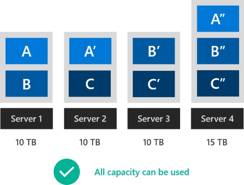

# Symmetry considerations for Storage Spaces Direct 

> Applies To: Windows Server 2016

[Storage Spaces Direct](storage-spaces-direct-overview.md) works best when every server has exactly the same drives.

In reality, we recognize this is not always practical: Storage Spaces Direct is designed to run for years and to scale as the needs of your organization grow. Today, you may buy spacious 3 TB hard drives; next year, it may become impossible to find ones that small. Therefore, some amount of mixing-and-matching is supported.

This topic explains the constraints and provides examples of supported and unsupported configurations.

## Constraints

### Same types of drives in every server

All servers must have the same [types of drives](choosing-drives.md#drive-types).

For example, if one server has NVMe, they must *all* have NVMe.

### Same number of each type in every server

All servers must have the same number of drives of each type.

For example, if one server has *six* HDD, they must all have *six* HDD.

   > [!NOTE]
   > It is okay for the number of drives to differ temporarily during failures or while adding or removing drives.

### Same drive models in every server

It is recommended (but not required) to use drives of the same model and firmware version. If you can't, select drives which are as similar as possible and verify that they don't have any conflicting requirements, such as system, adapter, or driver incompatibility.

It is not advisable to mix-and-match drives of the same type with sharply different performance or endurance characteristics (unless one is cache and the other is capacity) because Storage Spaces Direct distributes IO evenly and does not discriminate based on model.

### Same drive sizes in every server

It is recommended (but not required) to use drives of the same size (per type, unless one is cache and the other is capacity).

To mix-and-match cache drives of different sizes will not uniformly boost cache performance: only IO to [bindings](understand-the-cache.md#server-side-architecture) with larger cache drives may see improved performance. See [Understanding the cache](understand-the-cache.md) to learn more.

To mix-and-match capacity drives of different sizes may result in stranded capacity – see the next section.

   > [!WARNING]
   > Capacity drives of different sizes in different servers may result in stranded capacity.

## Understand: Stranded capacity

Storage Spaces Direct is robust to capacity imbalance across drives and across servers. Even if the imbalance is severe, everything will continue to work seamlessly. However, depending on your scale and resiliency, capacity that is not available in every server may not be usable.

To see why this happens, suppose each colored square below represents one copy of mirrored data. For example, the squares marked A, A', and A'' are three copies of the same extent of data. To preserve server fault tolerance, these copies of the same data *must* be stored in different servers.

### Example with stranded capacity

As drawn, Server 1 and Server 2 are full. Server 3 has larger drives, therefore its total capacity is larger. However, to store more three-way mirror data on Server 3 would require copies on Server 1 and Server 2 too, which are already full. The remaining capacity on Server 3 cannot be used. If the three servers had 10 TB, 10 TB, and 15 TB of capacity respectively, the last 5 TB on the third server would be stranded capacity.

### Example without stranded capacity

With four servers of 10 TB, 10 TB, 10 TB, and 15 TB capacity respectively, and three-way mirror resiliency, it *is* possible to validly place copies in a way that uses all available capacity. Whenever this is possible, the Storage Spaces Direct allocator will find and use the optimal placement, leaving no stranded capacity.

The number of servers, the resiliency, the severity of the capacity imbalance, and other factors affect whether there is stranded capacity. **The most prudent general rule is to assume that only capacity available in every server is guaranteed to be usable.**

## Examples

Here are some supported and unsupported configurations:

### Different models between servers

The first two servers use NVMe model "X" but the third server uses NVMe model "Z", which is very similar.

| Server 1                    | Server 2                    | Server 3                     |
|-----------------------------|-----------------------------|------------------------------|
| 2 x NVMe Model X (cache)    | 2 x NVMe Model X (cache)    | 2 x NVMe Model **Z** (cache) |
| 10 x SSD Model Y (capacity) | 10 x SSD Model Y (capacity) | 10 x SSD Model Y (capacity)  |

This is supported.

### Different models within server

Every server uses some different mix of HDD models "Y" and "Z", which are very similar.

| Server 1                       | Server 2                       | Server 3                       |
|--------------------------------|--------------------------------|--------------------------------|
| 2 x SSD Model X (cache)        | 2 x SSD Model X (cache)        | 2 x SSD Model X (cache)        |
| **7** x HDD Model Y (capacity) | **5** x HDD Model Y (capacity) | **1** x HDD Model Y (capacity) |
| **3** x HDD Model Z (capacity) | **5** x HDD Model Z (capacity) | **9** x HDD Model Z (capacity) |

This is supported.

### Different sizes across servers

The first two servers use 4 TB HDD but the third server uses 6 TB HDD, which are very similar.

| Server 1                | Server 2                | Server 3                    |
|-------------------------|-------------------------|-----------------------------|
| 2 x 800 GB NVMe (cache) | 2 x 800 GB NVMe (cache) | 2 x 800 GB NVMe (cache)     |
| 4 x 4 TB HDD (capacity) | 4 x 4 TB HDD (capacity) | 4 x **6** TB HDD (capacity) |

This is supported.

### Different sizes within server

Every server uses some different mix of 1.2 TB and 1.6 TB SSD, which are very similar.

| Server 1                   | Server 2                   | Server 3                 |
|----------------------------|----------------------------|--------------------------|
| 3 x 1.2 TB SSD (cache)     | 2 x 1.2 TB SSD (cache)     | 4 x 1.2 TB SSD (cache)   |
| 1 x **1.6 TB** SSD (cache) | 2 x **1.6 TB** SSD (cache) | -                        |
| 20 x 4 TB HDD (capacity)   | 20 x 4 TB HDD (capacity)   | 20 x 4 TB HDD (capacity) |

This is supported.

### Different types of drives across servers

Server 1 has NVMe but the others don't.

| Server 1             | Server 2            | Server 3            |
|----------------------|---------------------|---------------------|
| 6 x **NVMe** (cache) | -                   | -                   |
| -                    | 6 x SSD (cache)     | 6 x SSD (cache)     |
| 18 x HDD (capacity)  | 18 x HDD (capacity) | 18 x HDD (capacity) |

This is not supported.

### Different number of each type across servers

Server 3 has more drives than the others.

| Server 1            | Server 2            | Server 3                |
|---------------------|---------------------|-------------------------|
| 2 x NVMe (cache)    | 2 x NVMe (cache)    | **4** x NVMe (cache)    |
| 10 x HDD (capacity) | 10 x HDD (capacity) | **20** x HDD (capacity) |

This is not supported.

## Summary

In summary, every server in the cluster must have the same types of drives and the same number of each type, but mixing drive models and drive sizes is supported.

| Constraint                               | Required?     |
|------------------------------------------|---------------|
| Same types of drives in every server     | **Required**  |
| Same number of each type in every server | **Required**  |
| Same drive models in every server        | Recommended   |
| Same drive sizes in every server         | Recommended   |

## See also

- [Storage Spaces Direct hardware requirements](storage-spaces-direct-hardware-requirements.md)
- [Storage Spaces Direct overview](storage-spaces-direct-overview.md)
