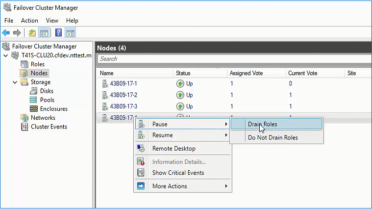
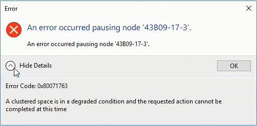
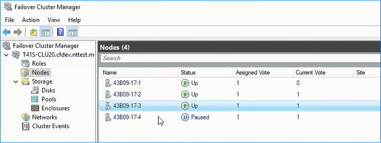
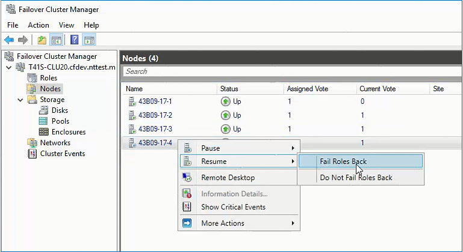

# Taking a Storage Spaces Direct server offline for maintenance

> Applies to: Windows Server 2019, Windows Server 2016

This topic provides guidance on how to properly restart or shutdown servers with [Storage Spaces Direct](storage-spaces-direct-overview.md).

With Storage Spaces Direct, taking a server offline (bringing it down) also means taking offline portions of the storage that is shared across all servers in the cluster. Doing so requires pausing (suspending) the server you want to take offline, moving roles to other servers in the cluster, and verifying that all data is available on the other servers in the cluster so that the data remains safe and accessible throughout the maintenance.

Use the following procedures to properly pause a server in a Storage Spaces Direct cluster before taking it offline. 

   > [!IMPORTANT]
   > To install updates on a Storage Spaces Direct cluster, use Cluster-Aware Updating (CAU), which automatically performs the procedures in this topic so you don't have to when installing updates. For more info, see [Cluster Aware Updating (CAU)](https://technet.microsoft.com/library/hh831694.aspx).

## Verifying it's safe to take the server offline

Before taking a server offline for maintenance, verify that all your volumes are healthy.

To do so, open a PowerShell session with Administrator permissions and then run the following command to view volume status:

```PowerShell
Get-VirtualDisk 
```

Here's an example of what the output might look like:
```
FriendlyName ResiliencySettingName OperationalStatus HealthStatus IsManualAttach Size
------------ --------------------- ----------------- ------------ -------------- ----
MyVolume1    Mirror                OK                Healthy      True           1 TB
MyVolume2    Mirror                OK                Healthy      True           1 TB
MyVolume3    Mirror                OK                Healthy      True           1 TB
```

Verify that the **HealthStatus** property for every volume (virtual disk) is **Healthy**.

To do this in Failover Cluster Manager, go to **Storage** > **Disks**.

Verify that the **Status** column for every volume (virtual disk) shows **Online**.

## Pausing and draining the server

Before restarting or shutting down the server, pause and drain (move off) any roles such as virtual machines running on it. This also gives Storage Spaces Direct an opportunity to gracefully flush and commit data to ensure the shutdown is transparent to any applications running on that server.

   > [!IMPORTANT]
   > Always pause and drain clustered servers before restarting or shutting them down.

In PowerShell, run the following cmdlet (as Administrator) to pause and drain.

```PowerShell
Suspend-ClusterNode -Drain
```

To do this in Failover Cluster Manager, go to **Nodes**, right-click the node, and then select **Pause** > **Drain Roles**.



All virtual machines will begin live migrating to other servers in the cluster. This can take a few minutes.

   > [!NOTE]
   > When you pause and drain the cluster node properly, Windows performs an automatic safety check to ensure it is safe to proceed. If there are unhealthy volumes, it will stop and alert you that it's not safe to proceed.



## Shutting down the server

Once the server has completed draining, it will show as **Paused** in Failover Cluster Manager and PowerShell.



You can now safely restart or shut it down, just like you would normally (for example, by using the Restart-Computer or Stop-Computer PowerShell cmdlets).

```PowerShell
Get-VirtualDisk 

FriendlyName ResiliencySettingName OperationalStatus HealthStatus IsManualAttach Size
------------ --------------------- ----------------- ------------ -------------- ----
MyVolume1    Mirror                Incomplete        Warning      True           1 TB
MyVolume2    Mirror                Incomplete        Warning      True           1 TB
MyVolume3    Mirror                Incomplete        Warning      True           1 TB
```

Incomplete or Degraded Operational Status is normal when nodes are shutting down or starting/stopping the cluster service on a node and should not cause concern. All your volumes remain online and accessible.

## Resuming the server

When you are ready for the server to begin hosting workloads again, resume it.

In PowerShell, run the following cmdlet (as Administrator) to resume.

```PowerShell
Resume-ClusterNode
```

To move the roles that were previously running on this server back, use the optional **-Failback** flag.

```PowerShell
Resume-ClusterNode –Failback Immediate
```

To do this in Failover Cluster Manager, go to **Nodes**, right-click the node, and then select **Resume** > **Fail Roles Back**.



## Waiting for storage to resync

When the server resumes, any new writes that happened while it was unavailable need to resync. This happens automatically. Using intelligent change tracking, it's not necessary for *all* data to be scanned or synchronized; only the changes. This process is throttled to mitigate impact to production workloads. Depending on how long the server was paused, and how much new data as written, it may take many minutes to complete.

You must wait for re-syncing to complete before taking any others servers in the cluster offline.

In PowerShell, run the following cmdlet (as Administrator) to monitor progress.

```PowerShell
Get-StorageJob
```
Here's some example output, showing the resync (repair) jobs:
```
Name   IsBackgroundTask ElapsedTime JobState  PercentComplete BytesProcessed BytesTotal
----   ---------------- ----------- --------  --------------- -------------- ----------
Repair True             00:06:23    Running   65              11477975040    17448304640
Repair True             00:06:40    Running   66              15987900416    23890755584
Repair True             00:06:52    Running   68              20104802841    22104819713
```

The **BytesTotal** shows how much storage needs to resync. The **PercentComplete** displays progress.

   > [!WARNING]
   > It's not safe to take another server offline until these repair jobs finish.

During this time, your volumes will continue to show as **Warning**, which is normal. 

For example, if you use the `Get-VirtualDisk` cmdlet, you might see the following output:
```
FriendlyName ResiliencySettingName OperationalStatus HealthStatus IsManualAttach Size
------------ --------------------- ----------------- ------------ -------------- ----
MyVolume1    Mirror                InService         Warning      True           1 TB
MyVolume2    Mirror                InService         Warning      True           1 TB
MyVolume3    Mirror                InService         Warning      True           1 TB
```

Once the jobs complete, verify that volumes show **Healthy** again by using the `Get-VirtualDisk` cmdlet. Here's some example output:

```
FriendlyName ResiliencySettingName OperationalStatus HealthStatus IsManualAttach Size
------------ --------------------- ----------------- ------------ -------------- ----
MyVolume1    Mirror                OK                Healthy      True           1 TB
MyVolume2    Mirror                OK                Healthy      True           1 TB
MyVolume3    Mirror                OK                Healthy      True           1 TB
```

It's now safe to pause and restart other servers in the cluster.

## How to update Storage Spaces Direct nodes offline
Use the following steps to path your Storage Spaces Direct system quickly. It involves scheduling a maintenance window and taking the system down for patching. If there is a critical security update that you need applied quickly or maybe you need to ensure patching completes in your maintenance window, this method may be for you. This process brings down the Storage Spaces Direct cluster, patches it, and brings it all up again. The trade-off is downtime to the hosted resources.

1. Plan your maintenance window.
2. Take the virtual disks offline.
3. Stop the cluster to take the storage pool offline. Run the  **Stop-Cluster** cmdlet or use Failover Cluster Manager to stop the cluster.
4. Set the cluster service to **Disabled** in Services.msc on each node. This prevents the cluster service from starting up while being patched.
5. Apply the Windows Server Cumulative Update and any required Servicing Stack Updates to all nodes. (You can update all nodes at the same time, no need to wait since the cluster is down).  
6. Restart the nodes, and ensure everything looks good.
7. Set the cluster service back to **Automatic** on each node.
8. Start the cluster. Run the **Start-Cluster** cmdlet or use Failover Cluster Manager. 

   Give it a few minutes.  Make sure the storage pool is healthy.
9. Bring the virtual disks back online.
10. Monitor the status of the virtual disks by running the **Get-Volume** and **Get-VirtualDisk** cmdlets.


## See also

- [Storage Spaces Direct overview](storage-spaces-direct-overview.md)
- [Cluster Aware Updating (CAU)](https://technet.microsoft.com/library/hh831694.aspx)
