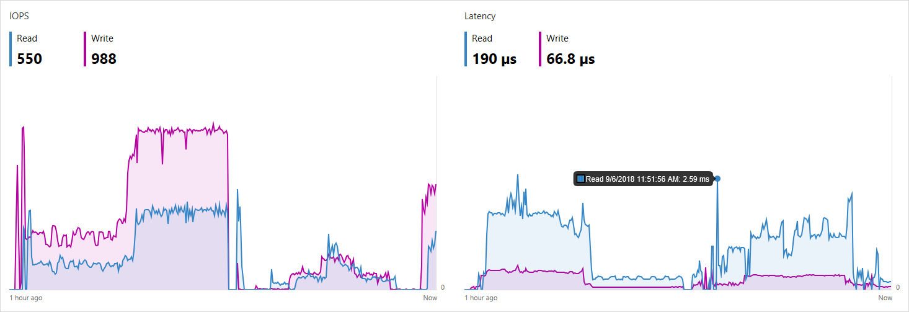
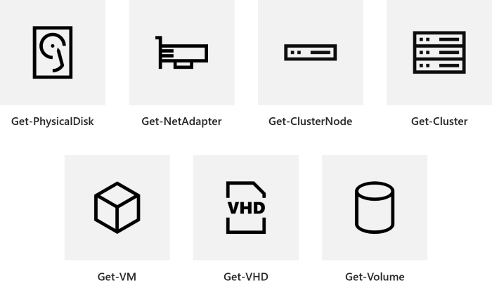
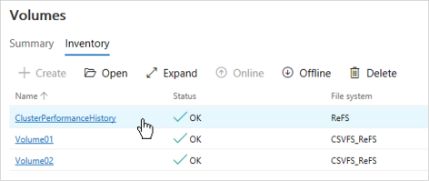

# Performance history for Storage Spaces Direct

> Applies to: Windows Server 2019

Performance history is a new feature that gives [Storage Spaces Direct](storage-spaces-direct-overview.md) administrators easy access to historical compute, memory, network, and storage measurements across host servers, drives, volumes, virtual machines, and more. Performance history is collected automatically and stored on the cluster for up to one year.

   > [!IMPORTANT]
   > This feature is new in Windows Server 2019. It is not available in Windows Server 2016.

## Get started

Performance history is collected by default with Storage Spaces Direct in Windows Server 2019. You do not need to install, configure, or start anything. An Internet connection is not required, System Center is not required, and an external database is not required.

To see your cluster's performance history graphically, use [Windows Admin Center](../../manage/windows-admin-center/understand/windows-admin-center.md):



To query and process it programmatically, use the new `Get-ClusterPerf` cmdlet. See [Usage in PowerShell](#usage-in-powershell).

## What's collected

Performance history is collected for 7 types of objects:



Each object type has many series: for example, `ClusterNode.Cpu.Usage` is collected for each server.

For details of what's collected for each object type and how to interpret them, refer to these sub-topics:

| Object             | Series                                                                               |
|--------------------|--------------------------------------------------------------------------------------|
| Drives             | [What's collected for drives](performance-history-for-drives.md)                     |
| Network adapters   | [What's collected for network adapters](performance-history-for-network-adapters.md) |
| Servers            | [What's collected for servers](performance-history-for-servers.md)                   |
| Virtual hard disks | [What's collected for virtual hard disks](performance-history-for-vhds.md)           |
| Virtual machines   | [What's collected for virtual machines](performance-history-for-vms.md)              |
| Volumes            | [What's collected for volumes](performance-history-for-volumes.md)                   |
| Clusters           | [What's collected for clusters](performance-history-for-clusters.md)                 |

Many series are aggregated across peer objects to their parent: for example, `NetAdapter.Bandwidth.Inbound` is collected for each network adapter separately and aggregated to the overall server; likewise `ClusterNode.Cpu.Usage` is aggregated to the overall cluster; and so on.

## Timeframes

Performance history is stored for up to one year, with diminishing granularity. For the most recent hour, measurements are available every ten seconds. Thereafter, they are intelligently merged (by averaging or summing, as appropriate) into less granular series that span more time. For the most recent day, measurements are available every five minutes; for the most recent week, every fifteen minutes; and so on.

In Windows Admin Center, you can select the timeframe in the upper-right above the chart.


In PowerShell, use the `-TimeFrame` parameter.

Here are the available timeframes:

| Timeframe   | Measurement frequency | Retained for |
|-------------|-----------------------|--------------|
| `LastHour`  | Every 10 secs         | 1 hour       |
| `LastDay`   | Every 5 minutes       | 25 hours     |
| `LastWeek`  | Every 15 minutes      | 8 days       |
| `LastMonth` | Every 1 hour          | 35 days      |
| `LastYear`  | Every 1 day           | 400 days     |

## Usage in PowerShell

Use the `Get-ClusterPerformanceHistory` cmdlet to query and process performance history in PowerShell.

```PowerShell
Get-ClusterPerformanceHistory
```

   > [!TIP]
   > Use the **Get-ClusterPerf** alias to save some keystrokes.

### Example

Get the CPU usage of virtual machine *MyVM* for the last hour:

```PowerShell
Get-VM "MyVM" | Get-ClusterPerf -VMSeriesName "VM.Cpu.Usage" -TimeFrame LastHour
```

For more advanced examples, see the published [sample scripts](performance-history-scripting.md) that provide starter code to find peak values, calculate averages, plot trend lines, run outlier detection, and more.

### Specify the object

You can specify the object you want by the pipeline. This works with 7 types of objects:

| Object from pipeline | Example     |
|----------------------|-------------|
| `Get-PhysicalDisk`   | <code>Get-PhysicalDisk -SerialNumber "XYZ456" &#124; Get-ClusterPerf</code>         |
| `Get-NetAdapter`     | <code>Get-NetAdapter "Ethernet" &#124; Get-ClusterPerf</code>                       |
| `Get-ClusterNode`    | <code>Get-ClusterNode "Server123" &#124; Get-ClusterPerf</code>                     |
| `Get-VHD`            | <code>Get-VHD "C:\ClusterStorage\MyVolume\MyVHD.vhdx" &#124; Get-ClusterPerf</code> |
| `Get-VM`             | <code>Get-VM "MyVM" &#124; Get-ClusterPerf</code>                                   |
| `Get-Volume`         | <code>Get-Volume -FriendlyName "MyVolume"  &#124; Get-ClusterPerf</code>            |
| `Get-Cluster`        | <code>Get-Cluster "MyCluster" &#124; Get-ClusterPerf</code>                         |

If you don't specify, performance history for the overall cluster is returned.

### Specify the series

You can specify the series you want with these parameters:


| Parameter                 | Example                       | List                                                                                 |
|---------------------------|-------------------------------|--------------------------------------------------------------------------------------|
| `-PhysicalDiskSeriesName` | `"PhysicalDisk.Iops.Read"`    | [What's collected for drives](performance-history-for-drives.md)                     |
| `-NetAdapterSeriesName`   | `"NetAdapter.Bandwidth.Outbound"` | [What's collected for network adapters](performance-history-for-network-adapters.md) |
| `-ClusterNodeSeriesName`  | `"ClusterNode.Cpu.Usage"`     | [What's collected for servers](performance-history-for-servers.md)                   |
| `-VHDSeriesName`          | `"Vhd.Size.Current"`          | [What's collected for virtual hard disks](performance-history-for-vhds.md)           |
| `-VMSeriesName`           | `"Vm.Memory.Assigned"`        | [What's collected for virtual machines](performance-history-for-vms.md)              |
| `-VolumeSeriesName`       | `"Volume.Latency.Write"`      | [What's collected for volumes](performance-history-for-volumes.md)                   |
| `-ClusterSeriesName`      | `"PhysicalDisk.Size.Total"`   | [What's collected for clusters](performance-history-for-clusters.md)                 |


   > [!TIP]
   > Use tab completion to discover available series.

If you don't specify, every series available for the specified object is returned.

### Specify the timeframe

You can specify the timeframe of history you want with the `-TimeFrame` parameter.

   > [!TIP]
   > Use tab completion to discover available timeframes.

If you don't specify, the `MostRecent` measurement is returned.

## How it works

### Performance history storage

Shortly after Storage Spaces Direct is enabled, an approximately 10 GB volume named `ClusterPerformanceHistory` is created and an instance of the Extensible Storage Engine (also known as Microsoft JET) is provisioned there. This lightweight database stores the performance history without any Administrator involvement or management.



The volume is backed by Storage Spaces and uses either simple, two-way mirror, or three-way mirror resiliency, depending on the number of nodes in the cluster. It is repaired after drive or server failures just like any other volume in Storage Spaces Direct.

The volume uses ReFS but is not Cluster Shared Volume (CSV), so it only appears on the Cluster Group owner node. Besides being automatically created, there is nothing special about this volume: you can see it, browse it, resize it, or delete it (not recommended). If something goes wrong, see [Troubleshooting](#troubleshooting).

### Object discovery and data collection

Performance history automatically discovers relevant objects, such as virtual machines, anywhere in the cluster and begins streaming their performance counters. The counters are aggregated, synchronized, and inserted into the database. Streaming runs continuously and is optimized for minimal system impact.

Collection is handled by the Health Service, which is highly available: if the node where it's running goes down, it will resume moments later on another node in the cluster. Performance history may lapse briefly, but it will resume automatically. You can see the Health Service and its owner node by running `Get-ClusterResource Health` in PowerShell.

### Handling measurement gaps

When measurements are merged into less granular series that span more time, as described in [Timeframes](#timeframes), periods of missing data are excluded. For example, if the server was down for 30 minutes, then running at 50% CPU for the next 30 minutes, the `ClusterNode.Cpu.Usage` average for the hour will be recorded correctly as 50% (not 25%).

### Extensibility and customization

Performance history is scripting-friendly. Use PowerShell to pull any available history directly from the database to build automated reporting or alerting, export history for safekeeping, roll your own visualizations, etc. See the published [sample scripts](performance-history-scripting.md) for helpful starter code.

It's not possible to collect history for additional objects, timeframes, or series.

The measurement frequency and retention period are not currently configurable.

## Start or stop performance history

### How do I enable this feature?

Unless you `Stop-ClusterPerformanceHistory`, performance history is enabled by default.

To re-enable it, run this PowerShell cmdlet as Administrator:

```PowerShell
Start-ClusterPerformanceHistory
```

### How do I disable this feature?

To stop collecting performance history, run this PowerShell cmdlet as Administrator:

```PowerShell
Stop-ClusterPerformanceHistory
```

To delete existing measurements, use the `-DeleteHistory` flag:

```PowerShell
Stop-ClusterPerformanceHistory -DeleteHistory
```

   > [!TIP]
   > During initial deployment, you can prevent performance history from starting by setting the `-CollectPerformanceHistory` parameter of `Enable-ClusterStorageSpacesDirect` to `$False`.

## Troubleshooting

### The cmdlet doesn't work

An error message like "*The term 'Get-ClusterPerf' is not recognized as the name of a cmdlet*" means the feature is not available or installed. Verify that you have Windows Server Insider Preview build 17692 or later, that you've installed Failover Clustering, and that you're running Storage Spaces Direct.

   > [!NOTE]
   > This feature is not available on Windows Server 2016 or earlier.

### No data available 

If a chart shows "*No data available*" as pictured, here's how to troubleshoot:


1. If the object was newly added or created, wait for it to be discovered (up to 15 minutes).

2. Refresh the page, or wait for the next background refresh (up to 30 seconds).

3. Certain special objects are excluded from performance history – for example, virtual machines that aren't clustered, and volumes that don't use the Cluster Shared Volume (CSV) filesystem. Check the sub-topic for the object type, like [Performance history for volumes](performance-history-for-volumes.md), for the fine print.

4. If the problem persists, open PowerShell as Administrator and run the `Get-ClusterPerf` cmdlet. The cmdlet includes troubleshooting logic to identify common problems, such as if the ClusterPerformanceHistory volume is missing, and provides remediation instructions.

5. If the command in the previous step returns nothing, you can try restarting the Health Service (which collects performance history) by running `Stop-ClusterResource Health ; Start-ClusterResource Health` in PowerShell.

## See also

- [Storage Spaces Direct overview](storage-spaces-direct-overview.md)
