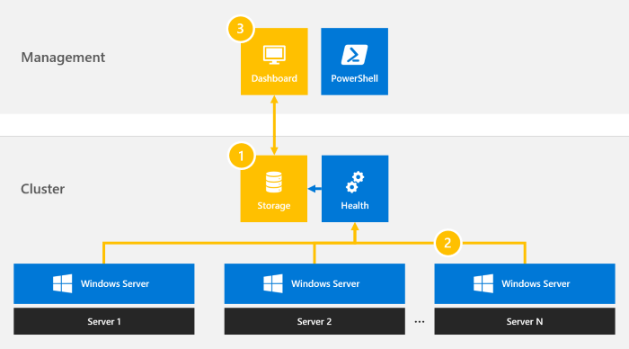

# Performance history for Storage Spaces Direct

> Applies To: Windows Server Insider Preview build 17090 and later

Performance history is a new feature that gives [Storage Spaces Direct](storage-spaces-direct-overview.md) administrators easy access to historical compute, memory, network, and storage measurements across host servers, drives, volumes, virtual machines, and more. Performance history is collected automatically and stored on the cluster for up to one year.

   > [!IMPORTANT]
   > This feature is new in Windows Server Insider Preview build 17090 and later. It is not available in Windows Server 2016. To try this feature, we suggest a clean OS install, not an in-place upgrade.

(PLACEHOLDER FOR OVERVIEW VIDEO)

## Get started

When released, performance history will be collected by default. You will not need to install, configure, or start anything. An external database is not required. An Internet connection is not required. System Center, Operations Management Suite, and Azure are not required.

In Insider Preview builds, it is necessary to run the following PowerShell cmdlets (just copy/paste and run) to enable the feature. Run these after you enable Storage Spaces Direct. The change may take several minutes to take effect.

```PowerShell
Get-StorageSubSystem Cluster* | Set-StorageHealthSetting -Name "System.PerformanceHistory.AutoProvision.Enabled" -Value "True"
Get-ClusterResource Health | Set-ClusterParameter -Name Providers -Value @("{bb20ff2e-7127-4d86-9f52-906f891230be}","{e24b3e7e-a73a-4108-b79f-894cc1184295}","{a8c23fac-e655-4f0b-9ee2-fb70e71634df}","{89290bad-72c0-43c2-aa41-217818de7528}","{c06b98bf-0dbc-4259-ae0d-5801eda8e7e1}","{29d1f3ee-dbcf-44e9-b0cc-085bfa362499}","{7547C610-BD45-4E54-971B-8D319BF0A7A6}") 
Stop-ClusterResource Health
Start-ClusterResource Health
```

To see your cluster's performance history, use [Project Honolulu (Technical Preview)](/../manage/honolulu/honolulu), the next-generation in-box management tool for Windows Server, or the new `Get-ClusterPerformanceHistory` cmdlet. See [Usage in PowerShell](#usage-in-powershell) for details.

(PLACEHOLDER FOR TUTORIAL VIDEO)

## How it works



1. When Storage Spaces Direct is enabled, the [Health Service](../../failover-clustering/health-service-overview.md) creates an approximately 10 GB three-way mirror volume named ClusterPerformanceHistory and provisions an instance of the Extensible Storage Engine (also known as Microsoft JET) there. This lightweight database stores the performance history.

2. The Health Service automatically discovers relevant objects, such as virtual machines, anywhere in the cluster and begins streaming their performance counters. The counters are aggregated, synchronized, and inserted into the database. Streaming runs continously and is optimized for minimal system impact.

3. You can see performance history in Project Honolulu (Technical Preview) or in PowerShell. Performance history is stored for up to one year, with diminishing granularity. Queries are served directly from the database for consistent, snappy performance and to minimize system impact.

## What's collected

### Objects

Performance history is collected for 7 types of objects: drives, network adapters, servers, virtual machines, virtual hard disk files, volumes, and the overall cluster. In many cases, history is aggregated across peer objects to their parent: for example, `networkadapter.bytes.inbound` is collected for each network adapter separately, and also aggregated to the overall server; likewise, `node.cpu.usage` is collected for each server separately, and also aggregated to the overall cluster; and so on.


### Timeframes

Performance history is stored for up to one year, with diminishing granularity. For the most recent hour, measurements are available every ten seconds. Thereafter, they are intelligently merged (by averaging or summing, as appropriate) into less granular series that span more time. For the most recent day, measurements are available every five minutes; for the most recent week, every fifteen minutues; and so on.

In Project Honolulu, you can select the timeframe in the upper-right above the chart.


In PowerShell, use the `-TimeFrame` parameter.

Here are the available timeframes:

| Timeframe  | Measurement frequency | Retained for |
|------------|-----------------------|--------------|
| Last hour  | Every 10 secs         | 1 hour       |
| Last day   | Every 5 minutes       | 25 hours     |
| Last week  | Every 15 minutes      | 8 days       |
| Last month | Every 1 hour          | 35 days      |
| Last year  | Every Daily           | 400 days     |

### Series

#### Drive

These series are collected for each drive:

| Series                        | Unit             | Description                                                                 |
|-------------------------------|------------------|-----------------------------------------------------------------------------|
| physicaldisk.iops.read        | per second       | Number of read operations per second completed by the drive.                |
| physicaldisk.iops.write       | per second       | Number of write operations per second completed by the drive.               |
| physicaldisk.iops.total       | per second       | Total number of read or write operations per second completed by the drive. |
| physicaldisk.throughput.read  | bytes per second | Quantity of data read from the drive per second.                            |
| physicaldisk.throughput.write | bytes per second | Quantity of data written to the drive per second.                           |
| physicaldisk.throughput.total | bytes per second | Total quantity of data read from or written to the drive per second.        |
| physicaldisk.latency.read     | seconds          | Average latency of read operations from the drive.                          |
| physicaldisk.latency.write    | seconds          | Average latency of write operations to the drive.                           |
| physicaldisk.latency.average  | seconds          | Average latency of all operations to or from the drive.                     |
| physicaldisk.size.total       | bytes            | The total storage capacity of the drive.                                    |
| physicaldisk.size.used        | bytes            | The used storage capacity of the drive.                                     |

   > [!NOTE]
   > Performance history is only collected for drives in the cluster storage subsystem. This excludes the OS boot drive in each server. Performance history cannot be collected for drives in a server that is down. Collection resumes automatically when the server comes back up.

#### Network adapter

These series are collected for each network adapter:

| Series                             | Unit             | Description                                                                                        |
|------------------------------------|------------------|----------------------------------------------------------------------------------------------------|
| networkadapter.bytes.inbound       | bytes per second | Rate of data received by the network adapter.                                                      |
| networkadapter.bytes.outbound      | bytes per second | Rate of data sent by the network adapter.                                                          |
| networkadapter.bytes.total         | bytes per second | Total rate of data received or sent by the network adapter.                                        |
| networkadapter.bytes.rdma.inbound  | bytes per second | Rate of data received via remote direct memory access (RDMA) by the network adapter.               |
| networkadapter.bytes.rdma.outbound | bytes per second | Rate of data sent via remote direct memory access (RDMA) by the network adapter.                   |
| networkadapter.bytes.rdma.total    | bytes per second | Total rate of data received or sent via remote direct memory access (RDMA) by the network adapter. |

   > [!NOTE]
   > Network adapter performance history is only collected for physical network adapters. Remote Direct Memory Access (RDMA) performance history is only collected for network adapters with RDMA enabled.

   > [!NOTE]
   > Network adapter performance history is recorded in bytes per second, not bits per second. One 10 GbE network adapter can send and receive approximately 1,000,000,000 bits = 125,000,000 bytes = 1.25 GB per second at its theoretical maximum.

#### Server

All network adapter series, such as `networkadapter.bytes.total`, are aggregated for all network adapters attached to the server. Drive capacity series, such as `physicaldisk.size.total`, are aggregated for all drives attached to the server.  In addition, these series are collected for each server:

| Series                  | Unit    | Description                                                           |
|-------------------------|---------|-----------------------------------------------------------------------|
| node.cpu.usage          | percent | Percentage of processor time that is not idle.                        |
| node.cpu.usage.guest    | percent | Percentage of processor time used for guest (virtual machine) demand. |
| node.cpu.usage.host     | percent | Percentage of processor time used for host demand.                    |
| node.memory.total       | bytes   | The total physical memory of the server.                              |
| node.memory.available   | bytes   | The available memory of the server.                                   |
| node.memory.usage       | bytes   | The allocated (not available) memory of the server.                   |
| node.memory.usage.guest | bytes   | The memory allocated to guest (virtual machine) demand.               |
| node.memory.usage.host  | bytes   | The memory allocated to host demand.                                  |

   > [!NOTE]
   > Performance history cannot be collected for a server that is down. Collection resumes automatically when the server comes back up.

#### Virtual hard disk (VHD)

These series are collected for each virtual hard disk file:

| Series                  | Unit             | Description                                                                                                      |
|-------------------------|------------------|------------------------------------------------------------------------------------------------------------------|
| vhd.iops.read           | per second       | Number of read operations per second completed by the virtual hard disk.                                         |
| vhd.iops.write          | per second       | Number of write operations per second completed by the virtual hard disk.                                        |
| vhd.iops.total          | per second       | Total number of read or write operations per second completed by the virtual hard disk.                          |
| vhd.throughput.read     | bytes per second | Quantity of data read from the virtual hard disk per second.                                                     |
| vhd.throughput.write    | bytes per second | Quantity of data written to the virtual hard disk per second.                                                    |
| vhd.throughput.total    | bytes per second | Total quantity of data read from or written to the virtual hard disk per second.                                 |
| vhd.latency.average     | seconds          | Average latency of all operations to or from the virtual hard disk.                                              |
| vhd.size.current        | bytes            | The current file size of the virtual hard disk, if dynamically expanding. If fixed, the series is not collected. |
| vhd.size.maximum        | bytes            | The maximum size of the virtual hard disk, if dynamically expanding. If fixed, the is the size.                  |

   > [!NOTE]
   > Virtual hard disk performance history is only collected for VHDs attached to running, clustered virtual machines. Although performance history is collected for both VHD and VHDX formats, it is not collected for shared VHDX files – yet.

#### Virtual machine (VM)

All virtual hard disk series, such as `vhd.iops.total`, are aggregated for all VHDs attached to the virtual machine. In addition, these series are collected for each virtual machine:

| Series                               | Unit             | Description                                                                                                  |
|--------------------------------------|------------------|--------------------------------------------------------------------------------------------------------------|
| virtualmachine.cpu.usage             | percent          | Percentage the virtual machine is using of its host server's processor(s).                                   |
| virtualmachine.memory.assigned       | bytes            | The quantity of memory assigned to the virtual machine.                                                      |
| virtualmachine.memory.available      | bytes            | The quantity of memory that remains available, of the amount assigned.                                       |
| virtualmachine.memory.maximum        | bytes            | If using dynamic memory, this is the maximum quantity of memory that may be assigned to the virtual machine. |
| virtualmachine.memory.minimum        | bytes            | If using dynamic memory, this is the minimum quantity of memory that may be assigned to the virtual machine. |
| virtualmachine.memory.pressure       | -                | The ratio of memory demanded by the virtual machine over memory allocated to the virtual machine.            |
| virtualmachine.memory.startup        | bytes            | The quantity of memory required for the virtual machine to start.                                            |
| virtualmachine.memory.total          | bytes            | Total memory. |
| virtualnetworkadapter.bytes.inbound  | bytes per second | Rate of data received by the virtual machine across all its virtual network adapters.                        |
| virtualnetworkadapter.bytes.outbound | bytes per second | Rate of data sent by the virtual machine across all its virtual network adapters.                            |
| virtualnetworkadapter.bytes.total    | bytes per second | Total rate of data received or sent by the virtual machine across all its virtual network adapters.          |

   > [!NOTE]
   > Virtual machine performance history is only collected for running, clustered virtual machines.

#### Volume

These series are collected for each volume:

| Series                  | Unit             | Description                                                                   |
|-------------------------|------------------|-------------------------------------------------------------------------------|
| volume.iops.read        | per second       | Number of read operations per second completed by this volume.                |
| volume.iops.write       | per second       | Number of write operations per second completed by this volume.               |
| volume.iops.total       | per second       | Total number of read or write operations per second completed by this volume. |
| volume.throughput.read  | bytes per second | Quantity of data read from this volume per second.                            |
| volume.throughput.write | bytes per second | Quantity of data written to this volume per second.                           |
| volume.throughput.total | bytes per second | Total quantity of data read from or written to this volume per second.        |
| volume.latency.read     | seconds          | Average latency of read operations from this volume.                          |
| volume.latency.write    | seconds          | Average latency of write operations to this volume.                           |
| volume.latency.average  | seconds          | Average latency of all operations to or from this volume.                     |
| volume.size.total       | bytes            | The total storage capacity of the volume.                                     |
| volume.size.available   | bytes            | The available storage capacity of the volume.                                 |

   > [!NOTE]
   > Volume performance history is only collected for Cluster Shared Volume (CSV) instances. This excludes the OS boot volume in each server and any other non-CSV storage. It may take several minutes for collection to begin for newly created or renamed volumes.

#### Cluster

All server series, such as `node.cpu.usage`, are aggregated for all servers in the cluster.

All volume series, such as `volume.iops.total`, are aggregated for all volumes in the cluster.

And drive capacity series, such as `physicaldisk.size.total`, are aggregated for all drives in the cluster.

## Usage in PowerShell

See performance history in PowerShell with the `Get-ClusterPerformanceHistory` cmdlet.

```PowerShell
Get-ClusterPerformanceHistory
```

   > [!TIP]
   > Use the **Get-ClusterPerf** alias to save some keystrokes.

Optionally, you can specify the object, timeframe, and/or series you want.

### Specify the object

Specify an object via the pipeline to see its performance history. This works with 7 object types:

#### Drive

Use the [Get-PhysicalDisk](https://docs.microsoft.com/powershell/module/storage/get-physicaldisk) cmdlet:

```PowerShell
Get-PhysicalDisk -SerialNumber <SerialNumber> | Get-ClusterPerf
```

#### Network adapter

Use the [Get-NetAdapter](https://docs.microsoft.com/powershell/module/netadapter/get-netadapter) cmdlet:

```PowerShell
Get-NetAdapter <Name> | Get-ClusterPerf
```

#### Server

Use the [Get-ClusterNode](https://docs.microsoft.com/powershell/module/failoverclusters/get-clusternode) cmdlet:

```PowerShell
Get-ClusterNode <Name> | Get-ClusterPerf
```

#### Virtual hard disk (VHD)

Use the [Get-VHD](https://docs.microsoft.com/powershell/module/hyper-v/get-vhd) cmdlet:

```PowerShell
Get-VHD <Path> | Get-ClusterPerf
```

To get the path of every virtual hard disk from the virtual machine:

```PowerShell
(Get-VM <Name>).HardDrives | Select Path
```

   > [!NOTE]
   > The Get-VHD cmdlet requires a file path to be provided.

#### Virtual machine (VM)

Use the [Get-VM](https://docs.microsoft.com/powershell/module/hyper-v/get-vm) cmdlet:

```PowerShell
Get-VM <Name> | Get-ClusterPerf
```

   > [!NOTE]
   > The Get-VM cmdlet only returns virtual machines on the local (or specified) server, not across the cluster.

#### Volume

Use the [Get-Volume](https://docs.microsoft.com/powershell/module/storage/get-volume) cmdlet:

```PowerShell
Get-Volume -FriendlyName <FriendlyName> | Get-ClusterPerf
```

#### Server

Use the [Get-Cluster](https://docs.microsoft.com/powershell/module/failoverclusters/get-cluster) cmdlet:

```PowerShell
Get-Cluster | Get-ClusterPerf
```

### Specify the timeframe

Specify the timeframe of history you want with the `-TimeFrame` parameter. Possible values are `MostRecent` (default), `LastHour`, `LastDay`, `LastWeek`, `LastMonth`, and `LastYear`.

   > [!TIP]
   > Consider specifying the series you want too.

### Specify the series

Specify the series you want with the `PhysicalDiskSeriesName`, `NetAdapterSeriesName`, `ClusterNodeSeriesName`, `VHDSeriesName`, `VirtualMachineSeriesName`, `VolumeSeriesName`, or `ClusterSeriesName` parameters. See the cmdlet help, the documentation above, or use tab-completion to discover available series names.

For example, this cmdlet gets the CPU usage of the virtual machine named *MyVM* for the last hour.

```PowerShell
Get-VM "MyVM" | Get-ClusterPerf -TimeFrame LastHour -VirtualMachineSeriesName "VirtualMachine.Cpu.Usage"
```

To print the series of measurements to the PowerShell console, run:

```PowerShell
$Measurements = Get-VM "MyVM" | Get-ClusterPerf -TimeFrame LastHour -VirtualMachineSeriesName "VirtualMachine.Cpu.Usage"
($Measurements).Group
```

To save them to a text file, run:

```PowerShell
($Measurements).Group >> file.txt
```

## Frequently asked questions

### How are failures handled?

The Health Service, which collects measurements and inserts them into the database, is highly available. If the server where it is running fails, it will resume moments later on another server in the cluster. There will be a very brief lapse in performance history collection, but it's quick. Resiliency for the database storage is provided by three-way mirroring. The ClusterPerformanceHistory volume is repaired after drive or server failures just like any other volume in Storage Spaces Direct.

### How do I disable this feature?

If you have already enabled Storage Spaces Direct, there are two steps:

1. Remove the path to the volume. This prevents the Health Service from collecting new measurements.

```PowerShell
Get-StorageSubSystem Cluster* | Remove-StorageHealthSetting -Name "System.PerformanceHistory.Path"
```

2. Delete the volume to delete existing measurements.

```PowerShell
Remove-VirtualDisk "ClusterPerformanceHistory"
```

If you have not yet enabled Storage Spaces Direct, use the `-CollectPerformanceHistory` parameter of the `Enable-ClusterS2D` cmdlet. Set it to `$False`.

```PowerShell
Enable-ClusterS2D -CollectPerformanceHistory $False
```

### What extensibility is available?

We designed cluster performance history to be scripting-friendly. You can use PowerShell to pull any available history from the database to build automated reporting or alerting, export it for safekeeping, roll your own visualizations, and much more. However, it is not currently possible to collect history for additional objects, timeframes, or series.

## Troubleshooting

### The cmdlet doesn't work

An error message like "*The term 'Get-ClusterPerf' is not recognized as the name of a cmdlet*" means the feature is not available or installed. Verify that you have Windows Server Insider Preview build 17090 or later and that you're running Storage Spaces Direct.

   > [!NOTE]
   > This feature is not available on Windows Server 2016 or earlier. 

### The cmdlet works but does nothing

If the cmdlet doesn't return the latest measurement (within the last ten seconds), performance history collection may have lapsed or stopped. Collection is managed by the *Health* cluster resource. Verify that it is present and Online:

```PowerShell
Get-ClusterResource Health
```

If the cluster resource is stopped, start it:

```PowerShell
Start-ClusterResource Health
```

Measurements are stored on the volume name ClusterPerformanceHistory. Verify that it is present and OK:

```PowerShell
Get-Volume -FriendlyName "ClusterPerformanceHistory"
```

### The volume is deleted or missing

To provision the ClusterPerformanceHistory volume again:

1. Confirm the volume is deleted:

```PowerShell
Remove-VirtualDisk "ClusterPerformanceHistory"
```

2.	Remove the path to the volume:

```PowerShell
Get-StorageSubSystem Cluster* | Remove-StorageHealthSetting -Name "System.PerformanceHistory.Path"
```

3.	Set `AutoProvision` back to `True`:

```PowerShell
Get-StorageSubSystem Cluster* | Set-StorageHealthSetting -Name "System.PerformanceHistory.AutoProvision.Enabled" -Value "True"
```

It may take several minutes for the changes to take effect.

## See also

- [Storage Spaces Direct overview](storage-spaces-direct-overview.md)
