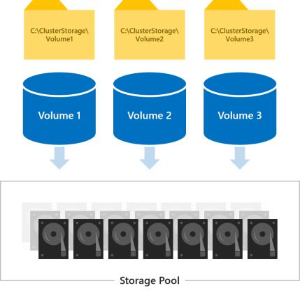
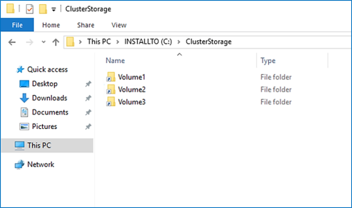
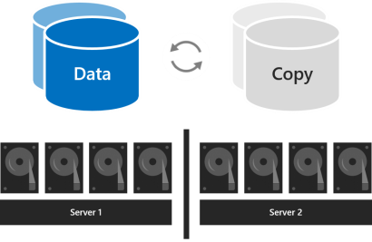
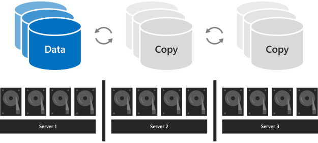
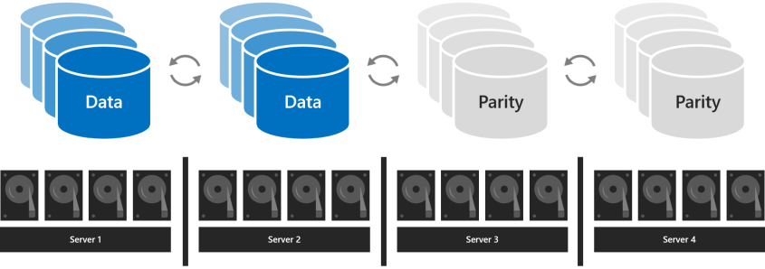
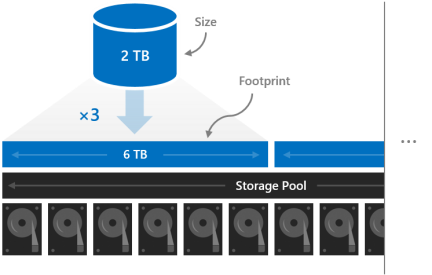
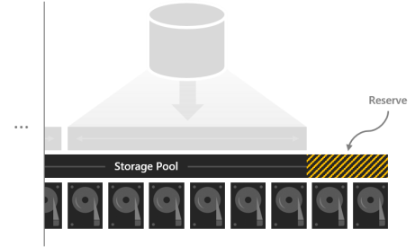
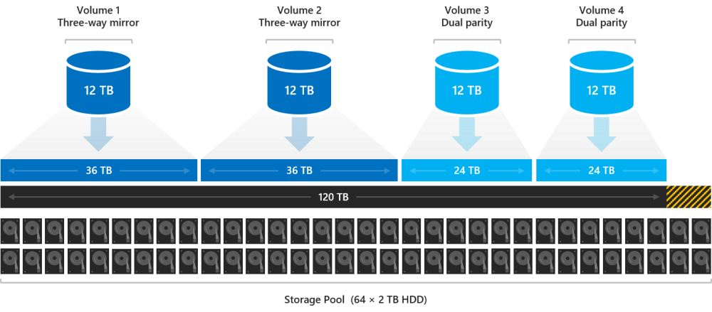

# Planning volumes in Storage Spaces Direct

> Applies to: Windows Server 2019, Windows Server 2016

This topic provides guidance for how to plan volumes in Storage Spaces Direct to meet the performance and capacity needs of your workloads, including choosing their filesystem, resiliency type, and size.

## Review: What are volumes

Volumes are where you put the files your workloads need, such as VHD or VHDX files for Hyper-V virtual machines. Volumes combine the drives in the storage pool to introduce the fault tolerance, scalability, and performance benefits of Storage Spaces Direct.

   >[!NOTE]
   > Throughout documentation for Storage Spaces Direct, we use term "volume" to refer jointly to the volume and the virtual disk under it, including functionality provided by other built-in Windows features such as Cluster Shared Volumes (CSV) and ReFS. Understanding these implementation-level distinctions is not necessary to plan and deploy Storage Spaces Direct successfully.



All volumes are accessible by all servers in the cluster at the same time. Once created, they show up at **C:\ClusterStorage\\** on all servers.



## Choosing how many volumes to create

We recommend making the number of volumes a multiple of the number of servers in your cluster. For example, if you have 4 servers, you will experience more consistent performance with 4 total volumes than with 3 or 5. This allows the cluster to distribute volume "ownership" (one server handles metadata orchestration for each volume) evenly among servers.

We recommend limiting the total number of volumes to:

| Windows Server 2016          | Windows Server 2019          |
|------------------------------|------------------------------|
| Up to 32 volumes per cluster | Up to 64 volumes per cluster |

## Choosing the filesystem

We recommend using the new [Resilient File System (ReFS)](../refs/refs-overview.md) for Storage Spaces Direct. ReFS is the premier filesystem purpose-built for virtualization and offers many advantages, including dramatic performance accelerations and built-in protection against data corruption. It supports nearly all key NTFS features, including Data Deduplication in Windows Server, version 1709 and later. See the ReFS [feature comparison table](../refs/refs-overview.md#feature-comparison) for details.

If your workload requires a feature that ReFS doesn't support yet, you can use NTFS instead.

   > [!TIP]
   > Volumes with different file systems can coexist in the same cluster.

## Choosing the resiliency type

Volumes in Storage Spaces Direct provide resiliency to protect against hardware problems, such as drive or server failures, and to enable continuous availability throughout server maintenance, such as software updates.

   > [!NOTE]
   > Which resiliency types you can choose is independent of which types of drives you have.

### With two servers

With two servers in the cluster, you can use two-way mirroring. If you're running Windows Server 2019, you can also use nested resiliency.

Two-way mirroring keeps two copies of all data, one copy on the drives in each server. Its storage efficiency is 50%—to write 1 TB of data, you need at least 2 TB of physical storage capacity in the storage pool. Two-way mirroring can safely tolerate one hardware failure at a time (one server or drive).



Nested resiliency (available only on Windows Server 2019) provides data resiliency between servers with two-way mirroring, then adds resiliency within a server with two-way mirroring or mirror-accelerated parity. Nesting provides data resilience even when one server is restarting or unavailable. Its storage efficiency is 25% with nested two-way mirroring and around 35-40% for nested mirror-accelerated parity. Nested resiliency can safely tolerate two hardware failures at a time (two drives, or a server and a drive on the remaining server). Because of this added data resilience, we recommend using nested resiliency on production deployments of two-server clusters, if you're running Windows Server 2019. For more info, see [Nested resiliency](nested-resiliency.md).


### With three servers

With three servers, you should use three-way mirroring for better fault tolerance and performance. Three-way mirroring keeps three copies of all data, one copy on the drives in each server. Its storage efficiency is 33.3% – to write 1 TB of data, you need at least 3 TB of physical storage capacity in the storage pool. Three-way mirroring can safely tolerate [at least two hardware problems (drive or server) at a time](storage-spaces-fault-tolerance.md#examples). If 2 nodes become unavailable the storage pool will lose quorum, since 2/3 of the disks are not available, and the virtual disks will be unaccessible. However, a node can be down and one or more disks on another node can fail and the virtual disks will remain online. For example, if you're rebooting one server when suddenly another drive or server fails, all data remains safe and continuously accessible.



### With four or more servers

With four or more servers, you can choose for each volume whether to use three-way mirroring, dual parity (often called "erasure coding"), or mix the two with mirror-accelerated parity.

Dual parity provides the same fault tolerance as three-way mirroring but with better storage efficiency. With four servers, its storage efficiency is 50.0%—to store 2 TB of data, you need 4 TB of physical storage capacity in the storage pool. This increases to 66.7% storage efficiency with seven servers, and continues up to 80.0% storage efficiency. The tradeoff is that parity encoding is more compute-intensive, which can limit its performance.



Which resiliency type to use depends on the needs of your workload. Here's a table that summarizes which workloads are a good fit for each resiliency type, as well as the performance and storage efficiency of each resiliency type.

| Resiliency type | Capacity efficiency | Speed | Workloads |
| ------------------- | ----------------------  | --------- | ------------- |
| **Mirror**         | <br>Three-way mirror: 33% <br>Two-way-mirror: 50%     |<br> Highest performance  | Virtualized workloads<br> Databases<br>Other high performance workloads |
| **Mirror-accelerated parity** |<br> Depends on proportion of mirror and parity | <br>Much slower than mirror, but up to twice as fast as dual-parity<br> Best for large sequential writes and reads | Archival and backup<br> Virtualized desktop infrastructure     |
| **Dual-parity**               | <br>4 servers: 50% <br>16 servers: up to 80% | <br>Highest I/O latency & CPU usage on writes<br> Best for large sequential writes and reads | Archival and backup<br> Virtualized desktop infrastructure  |

#### When performance matters most

Workloads that have strict latency requirements or that need lots of mixed random IOPS, such as SQL Server databases or performance-sensitive Hyper-V virtual machines, should run on volumes that use mirroring to maximize performance.

   >[!TIP]
   > Mirroring is faster than any other resiliency type. We use mirroring for nearly all our performance examples.

#### When capacity matters most

Workloads that write infrequently, such as data warehouses or "cold" storage, should run on volumes that use dual parity to maximize storage efficiency. Certain other workloads, such as traditional file servers, virtual desktop infrastructure (VDI), or others that don't create lots of fast-drifting random IO traffic and/or don't require the best performance may also use dual parity, at your discretion. Parity inevitably increases CPU utilization and IO latency, particularly on writes, compared to mirroring.

#### When data is written in bulk

Workloads that write in large, sequential passes, such as archival or backup targets, have another option that is new in Windows Server 2016: one volume can mix mirroring and dual parity. Writes land first in the mirrored portion and are gradually moved into the parity portion later. This accelerates ingestion and reduces resource utilization when large writes arrive by allowing the compute-intensive parity encoding to happen over a longer time. When sizing the portions, consider that the quantity of writes that happen at once (such as one daily backup) should comfortably fit in the mirror portion. For example, if you ingest 100 GB once daily, consider using mirroring for 150 GB to 200 GB, and dual parity for the rest.

The resulting storage efficiency depends on the proportions you choose. See [this demo](https://www.youtube.com/watch?v=-LK2ViRGbWs&t=36m55s) for some examples.

   > [!TIP]
   > If you observe an abrupt decrease in write performance partway through data ingestion, it may indicate that the mirror portion is not large enough or that mirror-accelerated parity isn't well suited for your use case. As an example, if write performance decreases from 400 MB/s to 40 MB/s, consider expanding the mirror portion or switching to three-way mirror.

### About deployments with NVMe, SSD, and HDD

In deployments with two types of drives, the faster drives provide caching while the slower drives provide capacity. This happens automatically – for more information, see [Understanding the cache in Storage Spaces Direct](understand-the-cache.md). In such deployments, all volumes ultimately reside on the same type of drives – the capacity drives.

In deployments with all three types of drives, only the fastest drives (NVMe) provide caching, leaving two types of drives (SSD and HDD) to provide capacity. For each volume, you can choose whether it resides entirely on the SSD tier, entirely on the HDD tier, or whether it spans the two.

   > [!IMPORTANT]
   > We recommend using the SSD tier to place your most performance-sensitive workloads on all-flash.

## Choosing the size of volumes

We recommend limiting the size of each volume to:

| Windows Server 2016 | Windows Server 2019 |
| ------------------- | ------------------- |
| Up to 32 TB         | Up to 64 TB         |

   > [!TIP]
   > If you use a backup solution that relies on the Volume Shadow Copy service (VSS) and the Volsnap software provider—as is common with file server workloads—limiting the volume size to 10 TB will improve performance and reliability. Backup solutions that use the newer Hyper-V RCT API and/or ReFS block cloning and/or the native SQL backup APIs perform well up to 32 TB and beyond.

### Footprint

The size of a volume refers to its usable capacity, the amount of data it can store. This is provided by the **-Size** parameter of the **New-Volume** cmdlet and then appears in the **Size** property when you run the **Get-Volume** cmdlet.

Size is distinct from volume's *footprint*, the total physical storage capacity it occupies on the storage pool. The footprint depends on its resiliency type. For example, volumes that use three-way mirroring have a footprint three times their size.

The footprints of your volumes need to fit in the storage pool.



### Reserve capacity

Leaving some capacity in the storage pool unallocated gives volumes space to repair "in-place" after drives fail, improving data safety and performance. If there is sufficient capacity, an immediate, in-place, parallel repair can restore volumes to full resiliency even before the failed drives are replaced. This happens automatically.

We recommend reserving the equivalent of one capacity drive per server, up to 4 drives. You may reserve more at your discretion, but this minimum recommendation guarantees an immediate, in-place, parallel repair can succeed after the failure of any drive.



For example, if you have 2 servers and you are using 1 TB capacity drives, set aside 2 x 1 = 2 TB of the pool as reserve. If you have 3 servers and 1 TB capacity drives, set aside 3 x 1 = 3 TB as reserve. If you have 4 or more servers and 1 TB capacity drives, set aside 4 x 1 = 4 TB as reserve.

   >[!NOTE]
   > In clusters with drives of all three types (NVMe + SSD + HDD), we recommend reserving the equivalent of one SSD plus one HDD per server, up to 4 drives of each.

## Example: Capacity planning

Consider one four-server cluster. Each server has some cache drives plus sixteen 2 TB drives for capacity.

```
4 servers x 16 drives each x 2 TB each = 128 TB
```

From this 128 TB in the storage pool, we set aside four drives, or 8 TB, so that in-place repairs can happen without any rush to replace drives after they fail. This leaves 120 TB of physical storage capacity in the pool with which we can create volumes.

```
128 TB – (4 x 2 TB) = 120 TB
```

Suppose we need our deployment to host some highly active Hyper-V virtual machines, but we also have lots of cold storage – old files and backups we need to retain. Because we have four servers, let's create four volumes.

Let's put the virtual machines on the first two volumes, *Volume1* and *Volume2*. We choose ReFS as the filesystem (for the faster creation and checkpoints) and three-way mirroring for resiliency to maximize performance. Let's put the cold storage on the other two volumes, *Volume 3* and *Volume 4*. We choose NTFS as the filesystem (for Data Deduplication) and dual parity for resiliency to maximize capacity.

We aren't required to make all volumes the same size, but for simplicity, let's – for example, we can make them all 12 TB.

*Volume1* and *Volume2* will each occupy 12 TB x 33.3% efficiency = 36 TB of physical storage capacity.

*Volume3* and *Volume4* will each occupy 12 TB x 50.0% efficiency = 24 TB of physical storage capacity.

```
36 TB + 36 TB + 24 TB + 24 TB = 120 TB
```

The four volumes fit exactly on the physical storage capacity available in our pool. Perfect!



   >[!TIP]
   > You don't need to create all the volumes right away. You can always extend volumes or create new volumes later.

For simplicity, this example uses decimal (base-10) units throughout, meaning 1 TB = 1,000,000,000,000 bytes. However, storage quantities in Windows appear in binary (base-2) units. For example, each 2 TB drive would appear as 1.82 TiB in Windows. Likewise, the 128 TB storage pool would appear as 116.41 TiB. This is expected.

## Usage

See [Creating volumes in Storage Spaces Direct](create-volumes.md).

### See also

- [Storage Spaces Direct overview](storage-spaces-direct-overview.md)
- [Choosing drives for Storage Spaces Direct](choosing-drives.md)
- [Fault tolerance and storage efficiency](storage-spaces-fault-tolerance.md)
