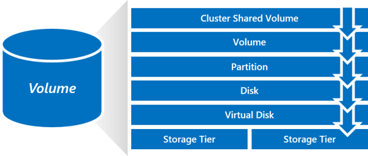

# Extending volumes in Storage Spaces Direct
> Applies To: Windows Server 2016

This topic provides instructions for resizing volumes in Storage Spaces Direct.

## Prerequisites

### Capacity in the storage pool

Before you resize a volume, make sure you have enough capacity in the storage pool to accommodate its new, larger footprint. For example, when resizing a three-way mirror volume from 1 TB to 2 TB, its footprint would grow from 3 TB to 6 TB. For the resize to succeed, you would need at least (6 - 3) = +3 TB unallocated in the storage pool.

### Familiarity with volumes in SM-API

In Storage Spaces Direct, every "volume" is comprised of several stacked objects: the cluster shared volume, which is a volume; the partition; the disk, which is a virtual disk; and one or more storage tiers (if applicable). To resize a volume, you will need to resize several of these objects.



To familiarize yourself with them, try running **Get-** with the corresponding noun in PowerShell.

For example:

```
Get-VirtualDisk
```

To follow associations from one object to the next, pipe one **Get-** cmdlet into another.

For example, here's how to get from a virtual disk up to its volume:

```
Get-VirtualDisk <FriendlyName> | Get-Disk | Get-Partition | Get-Volume 
```

## Suspend IO

Before you begin, we recommend temporarily suspending all IO to the volume.

Stop your workloads and then run:

```
Get-ClusterSharedVolume <Name> | Suspend-ClusterResource
```

## Step 1 – Resize virtual disk

The virtual disk may use storage tiers, or not, depending on how it was created.

To check, run the following cmdlet:

```
Get-VirtualDisk <FriendlyName> | Get-StorageTier 
```

If the cmdlet returns nothing, the virtual disk does not use storage tiers.

### No storage tiers

If the virtual disk has no storage tiers, you can resize it directly using the **Resize-VirtualDisk** cmdlet.

Provide the new size in the **-Size** parameter.

```
Get-VirtualDisk <FriendlyName> | Resize-VirtualDisk -Size <Size>
```

When you resize the **VirtualDisk**, the **Disk** follows automatically and is resized too.


### With storage tiers

If the virtual disk uses storage tiers, you can resize each tier separately using the **Resize-StorageTier** cmdlet.

Get the names of the storage tiers by following the associations from the virtual disk.

```
Get-VirtualDisk <FriendlyName> | Get-StorageTier | Select FriendlyName
```

Then, for each tier, provide the new size in the **-Size** parameter.

```
Get-StorageTier <FriendlyName> | Resize-StorageTier -Size <Size>
```

> [!TIP]
> If your tiers are different physical media types (such as **MediaType = SSD** and **MediaType = HDD**) you need to ensure you have enough capacity of each media type in the storage pool to accommodate the new, larger footprint of each tier.

When you resize the **StorageTier**(s), the **VirtualDisk** and **Disk** follow automatically and are resized too.


## Step 2 – Resize partition

Next, resize the partition using the **Resize-Partition** cmdlet. The virtual disk is expected to have two partitions: the first is Reserved and should not be modified; the one you need to resize has **PartitionNumber = 2** and **Type = Basic**.

Provide the new size in the **-Size** parameter. We recommend using the maximum supported size, as shown below.

```
# Choose virtual disk
$VirtualDisk = Get-VirtualDisk <FriendlyName>

# Get its partition
$Partition = $VirtualDisk | Get-Disk | Get-Partition | Where PartitionNumber -Eq 2

# Resize to its maximum supported size 
$Partition | Resize-Partition -Size ($Partition | Get-PartitionSupportedSize).SizeMax
```

When you resize the **Partition**, the **Volume** and **ClusterSharedVolume** follow automatically and are resized too.


That's it! You're done!	

> [!TIP]
> You can verify the volume has the new size by running **Get-Volume**.

## Resume IO

Last, don't forget to allow IO to the volume to resume, and then resume your workloads.

```
Get-ClusterSharedVolume <Name> | Resume-ClusterResource
```

## See also

- [Storage Spaces Direct in Windows Server 2016](storage-spaces-direct-overview.md)
