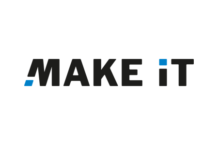
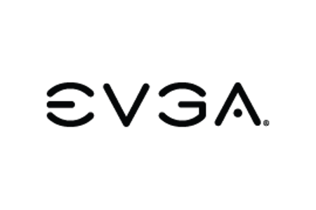
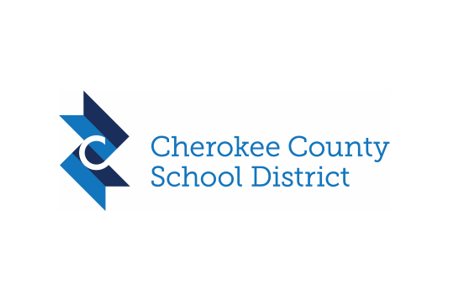
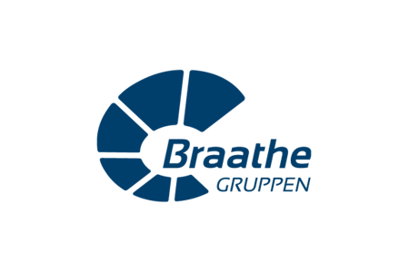
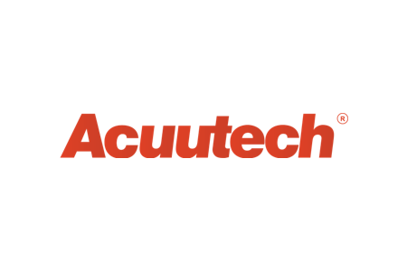
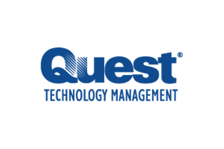

# Storage Spaces Direct overview

>Applies to: Windows Server 2016

Storage Spaces Direct uses industry-standard servers with local-attached drives to create highly available, highly scalable software-defined storage at a fraction of the cost of traditional SAN or NAS arrays. Its converged or hyper-converged architecture radically simplifies procurement and deployment, while features such as caching, storage tiers, and erasure coding, together with the latest hardware innovations such as RDMA networking and NVMe drives, deliver unrivaled efficiency and performance.

Storage Spaces Direct is included in Windows Server 2016 Datacenter and [Windows Server Insider Preview Builds](https://insider.windows.com/en-us/for-business-getting-started-server/). 

For other applications of Storage Spaces, such as Shared SAS clusters and stand-alone servers, see [Storage Spaces overview](overview.md). If you're looking for info about using Storage Spaces on a Windows 10 PC, see [Storage Spaces in Windows 10](https://support.microsoft.com/help/12438/windows-10-storage-spaces).

<table>
    <tr style="border: 0;">
        <td style="padding: 5px; border: 0;">
            <strong>Understand</a></strong>
            <ul>
			  <li>Overview (you are here)</li>
			  <li><a href="understand-the-cache.md">Understand the cache</a></li>
			  <li><a href="storage-spaces-fault-tolerance.md">Fault tolerance and storage efficiency</a></li>
              <li><a href="drive-symmetry-considerations.md">Drive symmetry considerations</a></li>
              <li><a href="understand-quorum.md">Understanding cluster and pool quorum</a></li>
		  	</ul>
        </td>
        <td style="padding: 5px; border: 0;">
            <strong>Plan</a></strong>
            <ul>
			  <li><a href="storage-spaces-direct-hardware-requirements.md">Hardware requirements</a></li>
              <li><a href="csv-cache.md">Using the CSV in-memory read cache</li>
			  <li><a href="choosing-drives.md">Choose drives</a></li>
			  <li><a href="plan-volumes.md">Plan volumes</a></li>
              <li><a href="storage-spaces-direct-in-vm.md">Using guest VM clusters</a></li>
              <li><a href="storage-spaces-direct-disaster-recovery.md">Disaster recovery</a></li>
		    </ul>
        </td>
    </tr>
    <tr style="border: 0;">
        <td style="padding: 5px; border: 0;">
            <strong>Deploy</a></strong>
            <ul>
			  <li><a href="deploy-storage-spaces-direct.md">Deploy Storage Spaces Direct</a></li>
			  <li><a href="create-volumes.md">Create volumes</a></li>
              <li><a href="../../failover-clustering/manage-cluster-quorum.md">Configure quorum</a>   </li>
		    </ul>
        </td>        
        <td style="padding: 5px; border: 0;">
            <strong>Manage</a></strong>
            <ul>
              <li><a href="../../manage/windows-admin-center/use/manage-hyper-converged.md">Manage with Windows Admin Center</a></li>
			  <li><a href="add-nodes.md">Add servers or drives</a></li>
			  <li><a href="maintain-servers.md">Taking a server offline for maintenance</li>
			  <li><a href="remove-servers.md">Remove servers</a></li>
			  <li><a href="resize-volumes.md">Extend volumes</a></li>
			  <li><a href="../update-firmware.md">Update drive firmware</a></li>
		    </ul>
        </td>
    </tr>
    <tr style="border: 0;">
         <td style="padding: 5px; border: 0;">
            <strong>Troubleshooting</a></strong>
            <ul>
              <li><a href="storage-spaces-states.md">Troubleshoot health and operational states</a></li>
              <li><a href="data-collection.md">Collect diagnostic data with Storage Spaces Direct</a></li>
            </ul>
         <td style="padding: 5px; border: 0;">
            <strong>Insider Preview content</a></strong>
            <ul>
                <li><a href="cluster-sets.md">Cluster sets</a></li>
                <li><a href="performance-history.md">Performance history</a></li>
                <li><a href="delimit-volume-allocation.md">Delimit the allocation of volumes</a></li>
            </ul>
    </tr>
</table>

## Videos

**Quick Video Overview (5 minutes)**

<iframe src="https://www.youtube-nocookie.com/embed/raeUiNtMk0E" width="560" height="315" allowfullscreen></iframe>

**Storage Spaces Direct at Microsoft Ignite 2017 (1 hour)**

[Watch on YouTube](https://www.youtube.com/watch?v=YDr2sqNB-3c)

**Launch Event at Microsoft Ignite 2016 (1 hour)**

[Watch on YouTube](https://www.youtube.com/watch?v=-LK2ViRGbWs)

## Key benefits

<table>
	<tr style="border: 0;">
		<td style="padding: 10px; border: 0; width:100px">
			
		</td>
		<td style="padding: 10px; border: 0;">
			<b>Simplicity.</b> Go from industry-standard servers running Windows Server 2016 to your first Storage Spaces Direct cluster in under 15 minutes. For System Center users, deployment is just one checkbox.
		</td>
	</tr>
	<tr style="border: 0;">
		<td style="padding: 10px; border: 0; width:100px">
			
		</td>
		<td style="padding: 10px; border: 0;">
			<b>Unrivaled Performance.</b> Whether all-flash or hybrid, Storage Spaces Direct easily exceeds <a href="https://blogs.technet.microsoft.com/filecab/2016/07/26/storage-iops-update-with-storage-spaces-direct/">150,000 mixed 4k random IOPS per server</a> with consistent, low latency thanks to its hypervisor-embedded architecture, its built-in read/write cache, and support for cutting-edge NVMe drives mounted directly on the PCIe bus.
		</td>
	</tr>
	<tr style="border: 0;">
		<td style="padding: 10px; border: 0; width:100px">
			
		</td>
		<td style="padding: 10px; border: 0;">
			<b>Fault Tolerance. </b> Built-in resiliency handles drive, server, or component failures with continuous availability. Larger deployments can also be configured for <a href="../../failover-clustering/fault-domains.md">chassis and rack fault tolerance</a>. When hardware fails, just swap it out; the software heals itself, with no complicated management steps.
		</td>
	</tr>
	<tr style="border: 0;">
		<td style="padding: 10px; border: 0; width:100px">
			
		</td>
		<td style="padding: 10px; border: 0;">
			<b>Resource Efficiency.</b> Erasure coding delivers up to 2.4x greater storage efficiency, with unique innovations like Local Reconstruction Codes and ReFS real-time tiers to extend these gains to hard disk drives and mixed hot/cold workloads, all while minimizing CPU consumption to give resources back to where they're needed most - the VMs.
		</td>
	</tr>
	<tr style="border: 0;">
		<td style="padding: 10px; border: 0; width:100px">
			
		</td>
		<td style="padding: 10px; border: 0;">
			<b>Manageability.</b> Use <a href="../storage-qos/storage-qos-overview.md">Storage QoS Controls</a> to keep overly busy VMs in check with minimum and maximum per-VM IOPS limits. The <a href="../../failover-clustering/health-service-overview.md">Health Service</a> provides continuous built-in monitoring and alerting, and new APIs make it easy to collect rich, cluster-wide performance and capacity metrics.
		</td>
	</tr>
	<tr style="border: 0;">
		<td style="padding: 10px; border: 0; width:100px">
			
		</td>
		<td style="padding: 10px; border: 0;">
			<b>Scalability.</b> Go up to 16 servers and over 400 drives, for up to 1 petabyte (1,000 terabytes) of storage per cluster. To scale out, simply add drives or add more servers; Storage Spaces Direct will automatically onboard new drives and begin using them. Storage efficiency and performance improve predictably at scale.
		</td>
	</tr>
</table>

## Deployment options

Storage Spaces Direct was designed for two distinct deployment options:

### Converged

**Storage and compute in separate clusters.** The converged deployment option, also known as 'disaggregated', layers a Scale-out File Server (SoFS) atop Storage Spaces Direct to provide network-attached storage over SMB3 file shares. This allows for scaling compute/workload independently from the storage cluster, essential for larger-scale deployments such as Hyper-V IaaS (Infrastructure as a Service) for service providers and enterprises.

### Hyper-Converged

**One cluster for compute and storage.** The hyper-converged deployment option runs Hyper-V virtual machines or SQL Server databases directly on the servers providing the storage, storing their files on the local volumes. This eliminates the need to configure file server access and permissions, and reduces hardware costs for small-to-medium business or remote office/branch office deployments. See [Deploy Storage Spaces Direct](deploy-storage-spaces-direct.md).

## How it works

Storage Spaces Direct is the evolution of Storage Spaces, first introduced in Windows Server 2012. It leverages many of the features you know today in Windows Server, such as Failover Clustering, the Cluster Shared Volume (CSV) file system, Server Message Block (SMB) 3, and of course Storage Spaces. It also introduces new technology, most notably the Software Storage Bus.

Here's an overview of the Storage Spaces Direct stack:

**Networking Hardware.** Storage Spaces Direct uses SMB3, including SMB Direct and SMB Multichannel, over Ethernet to communicate between servers. We strongly recommend 10+ GbE with remote-direct memory access (RDMA), either iWARP or RoCE.

**Storage Hardware.** From 2 to 16 servers with local-attached SATA, SAS, or NVMe drives. Each server must have at least 2 solid-state drives, and at least 4 additional drives. The SATA and SAS devices should be behind a host-bus adapter (HBA) and SAS expander. We strongly recommend the meticulously engineered and extensively validated platforms from our partners (coming soon).

**Failover Clustering.** The built-in clustering feature of Windows Server is used to connect the servers.

**Software Storage Bus.** The Software Storage Bus is new in Storage Spaces Direct. It spans the cluster and establishes a software-defined storage fabric whereby all the servers can see all of each other's local drives. You can think of it as replacing costly and restrictive Fibre Channel or Shared SAS cabling.

**Storage Bus Layer Cache.** The [Software Storage Bus](software-storage-bus-overview.md) dynamically binds the fastest drives present (e.g. SSD) to slower drives (e.g. HDDs) to provide server-side read/write caching that accelerates IO and boosts throughput.

**Storage Pool.** The collection of drives that form the basis of Storage Spaces is called the storage pool. It is automatically created, and all eligible drives are automatically discovered and added to it. We strongly recommend you use one pool per cluster, with the default settings. Read our [Deep Dive into the Storage Pool](https://blogs.technet.microsoft.com/filecab/2016/11/21/deep-dive-pool-in-spaces-direct/) to learn more.

**Storage Spaces.** Storage Spaces provides fault tolerance to virtual "disks" using [mirroring, erasure coding, or both](storage-spaces-fault-tolerance.md). You can think of it as distributed, software-defined RAID using the drives in the pool. In Storage Spaces Direct, these virtual disks typically have resiliency to two simultaneous drive or server failures (e.g. 3-way mirroring, with each data copy in a different server) though chassis and rack fault tolerance is also available.

**Resilient File System (ReFS).** ReFS is the premier filesystem purpose-built for virtualization. It includes dramatic accelerations for .vhdx file operations such as creation, expansion, and checkpoint merging, and built-in checksums to detect and correct bit errors. It also introduces real-time tiers that rotate data between so-called "hot" and "cold" storage tiers in real-time based on usage.

**Cluster Shared Volumes.** The CSV file system unifies all the ReFS volumes into a single namespace accessible through any server, so that to each server, every volume looks and acts like it's mounted locally.

**Scale-Out File Server.** This final layer is necessary in converged deployments only. It provides remote file access using the SMB3 access protocol to clients, such as another cluster running Hyper-V, over the network, effectively turning Storage Spaces Direct into network-attached storage (NAS).

## Customer stories

There are [over 10,000 clusters](https://blogs.technet.microsoft.com/filecab/2018/03/27/storage-spaces-direct-momentum/) worldwide running Storage Spaces Direct. Organizations of all sizes, from small businesses deploying just two nodes, to large enterprises and governments deploying hundreds of nodes, depend on Storage Spaces Direct for their critical applications and infrastructure.

Click any logo to read the full customer story:

    
    
    
    
    
    
    
    
    
    
    
    
    
    
    
    
    
    
    

## Management tools

The following tools can be used to manage and/or monitor Storage Spaces Direct:

| Name | Graphical or command-line? | Paid or included? |
|-----------------|----------------------------|-------------------|
| [Windows Admin Center](../../manage/windows-admin-center/overview.md)     | Graphical    | Included |
| Server Manager & Failover Cluster Manager                                 | Graphical    | Included |
| Windows PowerShell                                                        | Command-line | Included |
| [System Center Virtual Machine Manager (SCVMM)](https://technet.microsoft.com/system-center-docs/vmm/manage/manage-storage-spaces-direct-vmm) & [Operations Manager (SCOM)](https://www.microsoft.com/download/details.aspx?id=54700) | Graphical    | Paid     |

## Get started

Try Storage Spaces Direct [in Microsoft Azure](https://blogs.technet.microsoft.com/filecab/2016/05/05/s2dazuretp5/), or download a 180-day-licensed evaluation copy of Windows Server from [Windows Server Evaluations](https://go.microsoft.com/fwlink/?linkid=842602).

## See also

-   [Fault tolerance and storage efficiency](storage-spaces-fault-tolerance.md)
-   [Storage Replica](../storage-replica/storage-replica-overview.md)
-   [Storage Spaces Direct throughput with iWARP](https://blogs.technet.microsoft.com/filecab/2017/03/13/storage-spaces-direct-throughput-with-iwarp) (TechNet blog)
-   [What's New in Failover Clustering in Windows Server](../../failover-clustering/whats-new-in-failover-clustering.md)  
-   [Storage Quality of Service](../storage-qos/storage-qos-overview.md)
-   [Windows IT Pro Support](https://www.microsoft.com/itpro/windows/support)
