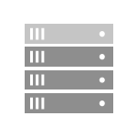

# Storage Spaces Direct overview

Storage Spaces Direct is a feature of Azure Local and Windows Server that enables you to cluster servers with internal storage into a software-defined storage solution.

This article provides an overview of Storage Spaces Direct, how it works, when to use it, and its key benefits. You can also explore videos and real-world customer stories in this article to learn more about Storage Spaces Direct.

To get started, try [Storage Spaces Direct](https://techcommunity.microsoft.com/t5/storage-at-microsoft/bg-p/FileCAB) in Microsoft Azure, or download a 180-day-licensed evaluation copy of Windows Server from [Windows Server Evaluations](https://go.microsoft.com/fwlink/?linkid=842602). To know the minimum hardware requirements for Storage Spaces Direct on Windows Server and Azure Local, see [System requirements for Windows Server](/windows-server/storage/storage-spaces/storage-spaces-direct-hardware-requirements) and [System requirements for Azure Local](/azure/azure-local/concepts/system-requirements?tabs=azure-public), respectively. To deploy Storage Spaces Direct as part of Azure Local, see [Deploy the Azure Local operating system](/azure/azure-local/deploy/operating-system).

## What is Storage Spaces Direct?

Storage Spaces Direct is a software-defined storage solution that allows you to share storage resources in your converged and hyperconverged IT infrastructure. It enables you to combine internal storage drives on a cluster of physical servers (2 and up to 16) into a software-defined pool of storage. This storage pool has cache, tiers, resiliency, and erasure coding across columns—all configured and managed automatically.

You can scale out the storage capacity of your cluster by adding more drives or adding more servers in the cluster. Storage Spaces Direct automatically onboards the new drives and rebalances the storage pool. It also automatically uses the fastest storage media present to provide built-in and always-on cache.

Storage Spaces Direct is a core technology of Azure Local, versions 21H2 and 20H2. It’s also included in the Datacenter editions of Windows Server 2022, Windows Server 2019, Windows Server 2016, [Windows Server Insider Preview Builds](https://insider.windows.com/for-business-getting-started-server/) and Azure Edition of Windows Server 2022.

You can deploy Storage Spaces Direct on a cluster of physical servers or on virtual machine (VM) guest clusters.

Deploying Storage Spaces Direct on VM guest clusters delivers virtual shared storage across a set of VMs on top of a private or public cloud. In production environments, this deployment is supported only in Windows Server. For information about how to deploy Storage Spaces Direct on VM guest clusters in Windows Server, see [Using Storage Spaces Direct in guest virtual machine clusters](storage-spaces-direct-in-vm.md).

## How it works

Storage Spaces Direct applies many of the features in Windows Server, such as Failover Clustering, the Cluster Shared Volume (CSV) file system, Server Message Block (SMB) 3, and Storage Spaces. It also introduces a new technology called Software Storage Bus.

Storage Spaces Direct creates a software-defined storage solution by combining the internal storage drives on a cluster of industry-standard servers. You start by connecting your servers with internal storage drives over Ethernet to form a cluster—no special cable or storage fabric is required. When you enable Storage Spaces Direct on this cluster, it combines the storage drives from each of those servers into one software-defined pool of virtually shared storage.

You then create volumes from that pool of storage, into which you can store your data. These volumes run CSV file system. This means that to each server these volumes look and act as if they're mounted locally. With built-in fault tolerance in these volumes, your data stays online and accessible even if a drive fails or the entire node goes offline.

In these volumes, you can place your files, such as .vhd and .vhdx for VMs. You can use the cluster running Storage Spaces Direct as:

- Scale-out File Server (SoFS) by exposing the volumes over the network as SMB3 File Shares.
- Hyperconverged system by enabling Hyper-V on the cluster and placing your VMs directly on top of the volumes.

The following section describes the features and components of a Storage Spaces Direct stack.

:::image type="content" source="media/storage-spaces-direct-overview/converged-full-stack.png" alt-text="Storage Spaces Direct Stack.":::

**Networking Hardware.** Storage Spaces Direct uses SMB3, including SMB Direct and SMB Multichannel, over Ethernet to communicate between servers. We strongly recommend using 10+ GbE with remote-direct memory access (RDMA), either iWARP or RoCE.

**Storage Hardware.** Storage Spaces Direct requires 2 and up to 16 Microsoft-approved servers with direct-attached SATA, SAS, NVMe, or persistent memory drives that are physically attached to just one server each. Each server must have at least two solid-state drives, and at least four more drives. The SATA and SAS devices should be behind a host-bus adapter (HBA) and SAS expander.

**Failover Clustering.** Storage Spaces Direct uses the built-in clustering feature of Azure Local and Windows Server to connect the servers.

**Software Storage Bus.** The Software Storage Bus spans the cluster and establishes a software-defined storage fabric whereby all the servers can see all of each other's local drives. You can think of it as replacing costly and restrictive Fibre Channel or Shared SAS cabling.

**Storage Bus Layer Cache.** The Software Storage Bus dynamically binds the fastest drives present (for example, SSD) to slower drives (for example, HDDs) to provide server-side read/write caching that accelerates IO and boosts throughput.

**Storage Pool.** The collection of drives that form the basis of Storage Spaces is called the storage pool. It's automatically created, and all eligible drives are automatically discovered and added to it. We strongly recommend you use one pool per cluster, with the default settings. To learn more about the Storage Pool, see the [Deep Dive into the Storage Pool](https://techcommunity.microsoft.com/t5/storage-at-microsoft/deep-dive-the-storage-pool-in-storage-spaces-direct/ba-p/425959) blog.

**Storage Spaces.** Storage Spaces provides fault tolerance to "virtual disks" using [mirroring, erasure coding, or both](fault-tolerance.md). You can think of it as distributed, software-defined RAID using the drives in the pool. In Storage Spaces Direct, these virtual disks typically have resiliency to two simultaneous drive or server failures (for example, 3-way mirroring, with each data copy in a different server)—though chassis and rack fault tolerance is also available.

**Resilient File System (ReFS).** ReFS is the premier filesystem purpose-built for virtualization. It includes dramatic accelerations for .vhdx file operations, such as creation, expansion, and checkpoint merging, and built-in checksums to detect and correct bit errors. It also introduces real-time tiers that rotate data between "hot" and "cold" storage tiers in real-time, based on usage.

**Cluster Shared Volumes.** The CSV file system unifies all the ReFS volumes into a single namespace accessible through any server. To each server, every volume looks and acts like it's mounted locally.

**Scale-Out File Server.** This final layer is necessary only in converged deployments. It provides remote file access by using the SMB3 access protocol to clients, such as another cluster running Hyper-V, over the network, effectively turning Storage Spaces Direct into network-attached storage (NAS).

## Key benefits

Storage Spaces Direct offers the following key benefits:

| Image | Description |
|--|--|
|  | **Simplicity.** Go from industry-standard servers running Windows Server or Azure Local, to your first Storage Spaces Direct cluster in under 15 minutes. For System Center users, deployment is just one checkbox. |
|  | **High performance.** Whether all-flash or hybrid, Storage Spaces Direct can exceed [13.7 million IOPS per server](https://techcommunity.microsoft.com/t5/storage-at-microsoft/the-new-hci-industry-record-13-7-million-iops-with-windows/ba-p/428314). The hypervisor-embedded architecture of Storage Spaces Direct provides consistent, low latency, built-in read/write cache, and support for cutting-edge NVMe drives mounted directly on the PCIe bus. |
|  | **Fault tolerance.** Built-in resiliency handles drive, server, or component failures with continuous availability. Larger deployments can also be configured for [chassis and rack fault tolerance](/windows-server/failover-clustering/fault-domains). When hardware fails, just swap it out; the software heals itself, with no complicated management steps. |
|  | **Resource efficiency.** Erasure coding delivers up to 2.4x greater storage efficiency, with unique innovations, such as Local Reconstruction Codes and ReFS real-time tiers to extend these gains to hard disk drives and mixed hot or cold workloads, all while minimizing CPU consumption to give resources back to where they're needed the most—to the VMs. |
|  | **Manageability**. Use [Storage QoS Controls](/windows-server/storage/storage-qos/storage-qos-overview) to keep busy VMs in check with minimum and maximum per-VM IOPS limits. The [Health Service](/azure/service-health/service-health-overview) provides continuous built-in monitoring and alerting. New APIs make it easy to collect rich, cluster-wide performance and capacity metrics. |
|  | **Scalability**. Go up to 16 servers and over 400 drives, for up to 4 petabyte (4,000 terabytes) of storage per cluster. To scale out, add more drives or add more servers; Storage Spaces Direct automatically onboards new drives and begin using them. Storage efficiency and performance improve predictably at scale. |

## When to use it

Storage Spaces Direct is a core technology of Azure Local and Windows Server. It provides an ideal network storage solution when you want to:

- Scale up or scale out your network storage capacity. You can add more drives or add more servers to expand your network storage capacity, still keeping your data secured and accessible. If a drive within the storage pool fails or the entire node goes offline, all data stays online and accessible.
- Share the same set of data from different locations at the same time. The storage pool that Storage Spaces Direct creates looks and acts like a network share. Your network users can access the stored data anytime from any location, without worrying about the physical location of their stored data.
- Use a mix of storage media. With Storage Spaces Direct, you can combine different types of storage media in your server cluster to form the software-defined storage pool. The software automatically decides which media to use based on data—active data on faster media and other infrequently used data on slower media.

## Deployment options

Storage Spaces Direct supports the following two deployment options:

- Hyperconverged
- Converged

> [!NOTE]
> Azure Local supports only hyperconverged deployment.

### Hyperconverged deployment

In a hyperconverged deployment, you use single cluster for both compute and storage. The hyperconverged deployment option runs Hyper-V virtual machines or SQL Server databases directly on the servers providing the storage—storing their files on the local volumes. This eliminates the need to configure file server access and permissions, which in turn reduces hardware costs for small-to-medium business and remote or branch office deployments. To deploy Storage Spaces Direct on Windows Server, see [Deploy Storage Spaces Direct on Windows Server](/windows-server/storage/storage-spaces/deploy-storage-spaces-direct). To deploy Storage Spaces Direct as part of Azure Local, see [About Azure Local deployment](/azure/azure-local/deploy/deployment-introduction).

:::image type="content" source="media/storage-spaces-direct-overview/hyper-converged-minimal.png" alt-text="Storage Spaces Direct serves storage to Hyper-V VMs in the same cluster.":::

### Converged deployment

In a converged deployment, you use separate clusters for storage and compute. The converged deployment option, also known as 'disaggregated,' layers a Scale-out File Server (SoFS) atop Storage Spaces Direct to provide network-attached storage over SMB3 file shares. This allows for scaling compute and workload independently from the storage cluster, essential for larger-scale deployments such as Hyper-V IaaS (Infrastructure as a Service) for service providers and enterprises.

:::image type="content" source="media/storage-spaces-direct-overview/converged-minimal.png" alt-text="Storage Spaces Direct serves storage using the Scale-Out File Server feature to Hyper-V VMs in another server or cluster.":::

## Manage and monitor

You can use the following tools to manage and monitor Storage Spaces Direct:

| Name | Graphical or command-line? | Paid or included? |
|-----------------|----------------------------|-------------------|
| [Windows Admin Center](/windows-server/manage/windows-admin-center/overview)     | Graphical    | Included |
| Server Manager & Failover Cluster Manager                                 | Graphical    | Included |
| Windows PowerShell                                                        | Command-line | Included |
| [System Center Virtual Machine Manager (SCVMM)](/system-center/vmm/s2d?view=sc-vmm-2019&preserve-view=true)  & [Operations Manager](/system-center/scom/welcome?view=sc-om-2019&preserve-view=true) | Graphical    | Paid     |

## Videos

**Storage Spaces Direct Overview (5 minutes)**

> [!Video https://www.youtube-nocookie.com/embed/raeUiNtMk0E]

**Storage Spaces Direct at Microsoft Ignite 2018 (1 hour)**

> [!Video https://www.youtube-nocookie.com/embed/5kaUiW3qo30]

**Storage Spaces Direct at Microsoft Ignite 2017 (1 hour)**

> [!Video https://www.youtube-nocookie.com/embed/YDr2sqNB-3c]

**Storage Spaces Direct launch event at Microsoft Ignite 2016 (1 hour)**

> [!Video https://www.youtube-nocookie.com/embed/LK2ViRGbWs]

## Customer stories

There are [over 10,000 clusters](https://techcommunity.microsoft.com/t5/storage-at-microsoft/storage-spaces-direct-10-000-clusters-and-counting/ba-p/428185) worldwide running Storage Spaces Direct. Organizations of all sizes, from small businesses deploying just two nodes, to large enterprises and governments deploying hundreds of nodes, depend on Storage Spaces Direct for their critical applications and infrastructure.

Visit [Microsoft.com/HCI](https://www.microsoft.com/hci) to read their stories.

<!-->:::image type="content" source="media/storage-spaces-direct-overview/customer-stories.png" alt-text="Grid of customer logos." link="https://azure.microsoft.com/products/local/":::-->

## Additional references

- [Fault tolerance and storage efficiency](fault-tolerance.md)
- [Storage Replica](/windows-server/storage/storage-replica/storage-replica-overview)
- [Storage at Microsoft blog](https://techcommunity.microsoft.com/t5/storage-at-microsoft/bg-p/FileCAB)
- [Storage Spaces Direct throughput with iWARP](https://techcommunity.microsoft.com/t5/storage-at-microsoft/bg-p/FileCAB) (TechNet blog)
- [What's New in Failover Clustering in Windows Server](/windows-server/failover-clustering/whats-new-in-failover-clustering)
- [Storage Quality of Service](/windows-server/storage/storage-qos/storage-qos-overview)
- [Windows IT Pro Support](https://www.microsoft.com/itpro/windows/support)

