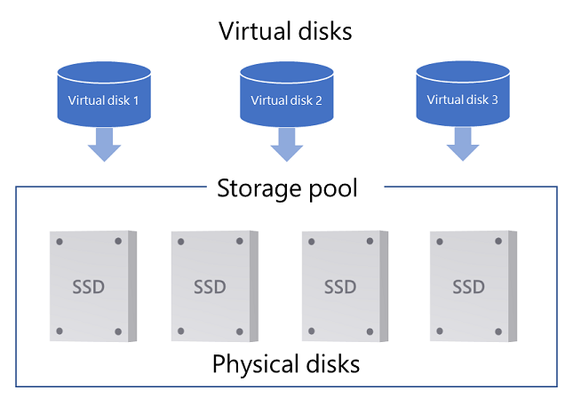
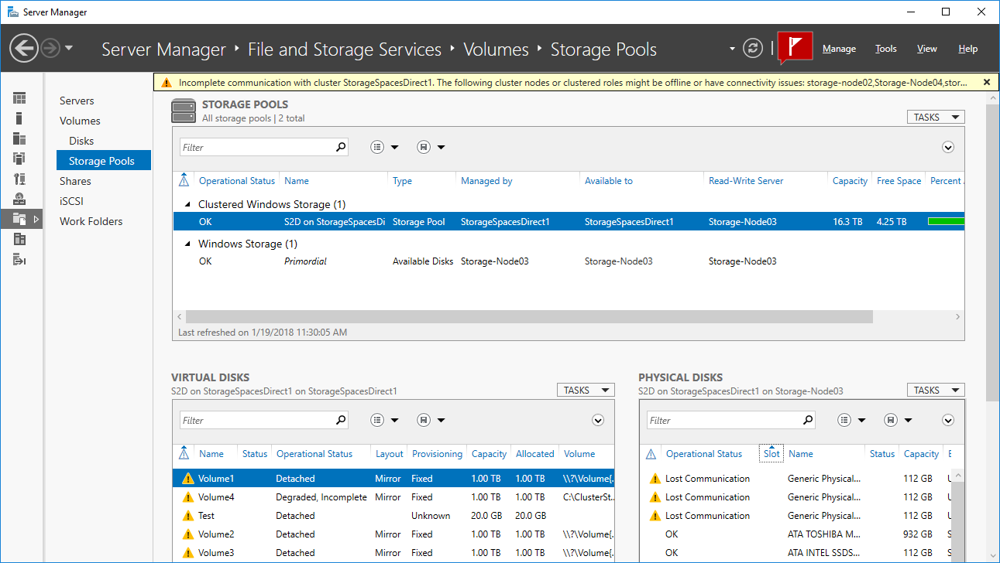

# Troubleshoot Storage Spaces Direct health and operational states

> Applies to: Windows Server 2019, Windows Server 2016, Windows Server 2012 R2, Windows Server 2012, Windows Server (Semi-Annual Channel), Windows 10, Windows 8.1

This topic describes the health and operational states of storage pools, virtual disks (which sit underneath volumes in Storage Spaces), and drives in [Storage Spaces Direct](storage-spaces-direct-overview.md) and [Storage Spaces](overview.md). These states can be invaluable when trying to troubleshoot various issues such as why you can't delete a virtual disk because of a read-only configuration. It also discusses why a drive can't be added to a pool (the CannotPoolReason).

Storage Spaces has three primary objects - *physical disks* (hard drives, SSDs, etc.) that are added to a *storage pool*, virtualizing the storage so that you can create *virtual disks* from free space in the pool, as shown here. Pool metadata is written to each drive in the pool. Volumes are created on top of the virtual disks and store your files, but we're not going to talk about volumes here.



You can view health and operational states in Server Manager, or with PowerShell. Here's an example of a variety of (mostly bad) health and operational states on a Storage Spaces Direct cluster that's missing most of its cluster nodes (right-click the column headers to add **Operational Status**). This isn't a happy cluster.



## Storage pool states

Every storage pool has a health status - **Healthy**, **Warning**, or **Unknown**/**Unhealthy**, as well as one or more operational states.

To find out what state a pool is in, use the following PowerShell commands:

```PowerShell
Get-StoragePool -IsPrimordial $False | Select-Object HealthStatus, OperationalStatus, ReadOnlyReason
```

Here's an example output showing a storage pool in the Unknown health state with the Read-only operational status:

```
FriendlyName                OperationalStatus HealthStatus IsPrimordial IsReadOnly
------------                ----------------- ------------ ------------ ----------
S2D on StorageSpacesDirect1 Read-only         Unknown      False        True
```

The following sections list the health and operational states.

### Pool health state: Healthy

|Operational state    |Description|
|---------            |---------  |
|OK|The storage pool is healthy.|

### Pool health state: Warning

When the storage pool is in the **Warning** health state, it means that the pool is accessible, but one or more drives failed or are missing. As a result, your storage pool might have reduced resilience.

|Operational state    |Description|
|---------            |---------  |
|Degraded|There are failed or missing drives in the storage pool. This condition occurs only with drives hosting pool metadata. <br><br>**Action**: Check the state of your drives and replace any failed drives before there are additional failures.|

### Pool health state: Unknown or Unhealthy

When a storage pool is in the **Unknown** or **Unhealthy** health state, it means that the storage pool is read-only and can't be modified until the pool is returned to the **Warning** or **OK** health states.

|Operational state    |Read-only reason |Description|
|---------            |---------       |--------   |
|Read-only|Incomplete|This can occur if the storage pool loses its [quorum](understand-quorum.md), which means that most drives in the pool have failed or are offline for some reason. When a pool loses its quorum, Storage Spaces automatically sets the pool configuration to read-only until enough drives become available again.<br><br>**Action:** <br>1. Reconnect any missing drives, and if you're using Storage Spaces Direct, bring all servers online. <br>2. Set the pool back to read-write by opening a PowerShell session with administrative permissions and then typing:<br><br> <code>Get-StoragePool <PoolName> -IsPrimordial $False \| Set-StoragePool -IsReadOnly $false</code>|
||Policy|An administrator set the storage pool to read-only.<br><br>**Action:** To set a clustered storage pool to read-write access in Failover Cluster Manager, go to **Pools**, right-click the pool and then select **Bring Online**.<br><br>For other servers and PCs, open a PowerShell session with administrative permissions and then type:<br><br><code>Get-StoragePool <PoolName> \| Set-StoragePool -IsReadOnly $false</code><br><br> |
||Starting|Storage Spaces is starting or waiting for drives to be connected in the pool. This should be a temporary state. Once completely started, the pool should transition to a different operational state.<br><br>**Action:** If the pool stays in the *Starting* state, make sure that all drives in the pool are connected properly.|

See also [Modifying a Storage Pool that has a Read-Only Configuration](https://social.technet.microsoft.com/wiki/contents/articles/14861.modifying-a-storage-pool-that-has-a-read-only-configuration.aspx).

## Virtual disk states

In Storage Spaces, volumes are placed on virtual disks (storage spaces) that are carved out of free space in a pool. Every virtual disk has a health status - **Healthy**, **Warning**, **Unhealthy**, or **Unknown** as well as one or more operational states.

To find out what state virtual disks are in, use the following PowerShell commands:

```PowerShell
Get-VirtualDisk | Select-Object FriendlyName,HealthStatus, OperationalStatus, DetachedReason
```

Here's an example of output showing a detached virtual disk and a degraded/incomplete virtual disk:

```
FriendlyName HealthStatus OperationalStatus      DetachedReason
------------ ------------ -----------------      --------------
Volume1      Unknown      Detached               By Policy
Volume2      Warning      {Degraded, Incomplete} None
```

The following sections list the health and operational states.

### Virtual disk health state: Healthy

|Operational state    |Description|
|---------            |---------          |
|OK    |The virtual disk is healthy.|
|Suboptimal    |Data isn't written evenly across drives. <br><br>**Action**: Optimize drive usage in the storage pool by running the [Optimize-StoragePool](https://technet.microsoft.com/itpro/powershell/windows/storage/optimize-storagepool) cmdlet.|

### Virtual disk health state: Warning

When the virtual disk is in a **Warning** health state, it means that one or more copies of your data are unavailable, but Storage Spaces can still read at least one copy of your data.

|Operational state    |Description|
|---------            |---------          |
|In service            |Windows is repairing the virtual disk, such as after adding or removing a drive. When the repair is complete, the virtual disk should return to the OK health state.|
|Incomplete           |The resilience of the virtual disk is reduced because one or more drives failed or are missing. However, the missing drives contain up-to-date copies of your data.<br><br> **Action**: <br>1. Reconnect any missing drives, replace any failed drives, and if you're using Storage Spaces Direct, bring online any servers that are offline. <br>2. If you're not using Storage Spaces Direct, next repair the virtual disk using the [Repair-VirtualDisk](https://technet.microsoft.com/itpro/powershell/windows/storage/repair-virtualdisk) cmdlet.<br> Storage Spaces Direct automatically starts a repair if needed after reconnecting or replacing a drive.|
|Degraded             |The resilience of the virtual disk is reduced because one or more drives failed or are missing, and there are outdated copies of your data on these drives. <br><br>**Action**: <br> 1. Reconnect any missing drives, replace any failed drives, and if you're using Storage Spaces Direct, bring online any servers that are offline. <br> 2. If you're not using Storage Spaces Direct, next repair the virtual disk using the [Repair-VirtualDisk](https://technet.microsoft.com/itpro/powershell/windows/storage/repair-virtualdisk) cmdlet. <br>Storage Spaces Direct automatically starts a repair if needed after reconnecting or replacing a drive.|

### Virtual disk health state: Unhealthy

When a virtual disk is in an **Unhealthy** health state, some or all of the data on the virtual disk is currently inaccessible.

|Operational state    |Description|
|---------            |--------   |
|No redundancy|The virtual disk has lost data because too many drives failed.<br><br>**Action**: Replace failed drives and then restore your data from backup.|

### Virtual disk health state: Information/Unknown

The virtual disk can also be in the **Information** health state (as shown in the Storage Spaces Control Panel item) or **Unknown** health state (as shown in PowerShell) if an administrator took the virtual disk offline or the virtual disk has become detached.

|Operational state    |Detached reason |Description|
|---------            |---------       |--------   |
|Detached             |By Policy            |An administrator took the virtual disk offline, or set the virtual disk to require manual attachment, in which case you'll have to manually attach the virtual disk every time Windows restarts.,<br><br>**Action**: Bring the virtual disk back online. To do so when the virtual disk is in a clustered storage pool, in Failover Cluster Manager select **Storage** > **Pools** > **Virtual Disks**, select the virtual disk that shows the **Offline** status and then select **Bring Online**. <br><br>To bring a virtual disk back online when not in a cluster, open a PowerShell session as an Administrator and then try using the following command:<br><br> <code>Get-VirtualDisk \| Where-Object -Filter { $_.OperationalStatus -eq "Detached" } \| Connect-VirtualDisk</code><br><br>To automatically attach all non-clustered virtual disks after Windows restarts, open a PowerShell session as an Administrator and then use the following command:<br><br> <code>Get-VirtualDisk \| Set-VirtualDisk -ismanualattach $false</code>|
|            |Majority Disks Unhealthy |Too many drives used by this virtual disk failed, are missing, or have stale data.   <br><br>**Action**: <br> 1. Reconnect any missing drives, and if you're using Storage Spaces Direct, bring online any servers that are offline. <br> 2. After all drives and servers are online, replace any failed drives. See [Health Service](../../failover-clustering/health-service-overview.md) for details. <br>Storage Spaces Direct automatically starts a repair if needed after reconnecting or replacing a drive.<br>3. If you're not using Storage Spaces Direct, next repair the virtual disk using the [Repair-VirtualDisk](https://technet.microsoft.com/itpro/powershell/windows/storage/repair-virtualdisk) cmdlet.  <br><br>If more disks failed than you have copies of your data and the virtual disk wasn't repaired in-between failures, all data on the virtual disk is permanently lost. In this unfortunate case, delete the virtual disk, create a new virtual disk, and then restore from a backup.|
|                     |Incomplete |Not enough drives are present to read the virtual disk.    <br><br>**Action**: <br> 1. Reconnect any missing drives, and if you're using Storage Spaces Direct, bring online any servers that are offline. <br> 2. After all drives and servers are online, replace any failed drives. See [Health Service](../../failover-clustering/health-service-overview.md) for details. <br>Storage Spaces Direct automatically starts a repair if needed after reconnecting or replacing a drive.<br>3. If you're not using Storage Spaces Direct, next repair the virtual disk using the [Repair-VirtualDisk](https://technet.microsoft.com/itpro/powershell/windows/storage/repair-virtualdisk) cmdlet.<br><br>If more disks failed than you have copies of your data and the virtual disk wasn't repaired in-between failures, all data on the virtual disk is permanently lost. In this unfortunate case, delete the virtual disk, create a new virtual disk, and then restore from a backup.|
| |Timeout|Attaching the virtual disk took too long <br><br> **Action:** This shouldn't happen often, so you might try see if the condition passes in time. Or you can try disconnecting the virtual disk with the [Disconnect-VirtualDisk](https://docs.microsoft.com/powershell/module/storage/disconnect-virtualdisk?view=win10-ps) cmdlet, then using the [Connect-VirtualDisk](https://docs.microsoft.com/powershell/module/storage/connect-virtualdisk?view=win10-ps)  cmdlet to reconnect it. |

## Drive (physical disk) states

The following sections describe the health states a drive can be in. Drives in a pool are represented in PowerShell as *physical disk* objects.

### Drive health state: Healthy

|Operational state    |Description|
|---------            |---------          |
|OK|The drive is healthy.|
|In service|The drive is performing some internal housekeeping operations. When the action is complete, the drive should return to the *OK* health state.|

### Drive health state: Warning

A drive in the Warning state can read and write data successfully but has an issue.

|Operational state    |Description|
|---------            |---------          |
|Lost communication|The drive is missing. If you're using Storage Spaces Direct, this could be because a server is down.<br><br>**Action**: If you're using Storage Spaces Direct, bring all servers back online. If that doesn't fix it, reconnect the drive, replace it, or try getting detailed diagnostic info about this drive by following the steps in Troubleshooting using Windows Error Reporting > [Physical disk timed out](../../failover-clustering/troubleshooting-using-wer-reports.md#physical-disk-timed-out).|
|Removing from pool|Storage Spaces is in the process of removing the drive from its storage pool. <br><br> This is a temporary state. After the removal is complete, if the drive is still attached to the system, the drive transitions to another operational state (usually OK) in a primordial pool.|
|Starting maintenance mode|Storage Spaces is in the process of putting the drive in maintenance mode after an administrator put the drive in maintenance mode. This is a temporary state - the drive should soon be in the *In maintenance mode* state.|
|In maintenance mode|An administrator placed the drive in maintenance mode, halting reads and writes from the drive. This is usually done before updating drive firmware, or when testing failures.<br><br>**Action**: To take the drive out of maintenance mode, use the [Disable-StorageMaintenanceMode](https://technet.microsoft.com/itpro/powershell/windows/storage/disable-storagemaintenancemode) cmdlet.|
|Stopping maintenance mode|An administrator took the drive out of maintenance mode, and Storage Spaces is in the process of bringing the drive back online. This is a temporary state - the drive should soon be in another state - ideally *Healthy*.|
|Predictive failure|The drive reported that it's close to failing.<br><br>**Action**: Replace the drive.|
|IO error|There was a temporary error accessing the drive.<br><br>**Action**: <br>1. If the drive doesn't transition back to the **OK** state, you can try using the [Reset-PhysicalDisk](https://docs.microsoft.com/powershell/module/storage/reset-physicaldisk) cmdlet to wipe the drive. <br> 2. Use [Repair-VirtualDisk](https://docs.microsoft.com/powershell/module/storage/repair-virtualdisk) to restore the resiliency of affected virtual disks. <br>3. If this keeps happening, replace the drive.|
|Transient error|There was a temporary error with the drive. This usually means the drive was unresponsive, but it could also mean that the Storage Spaces protective partition was inappropriately removed from the drive. <br><br>**Action**: <br>1. If the drive doesn't transition back to the **OK** state, you can try using the [Reset-PhysicalDisk](https://docs.microsoft.com/powershell/module/storage/reset-physicaldisk) cmdlet to wipe the drive. <br> 2. Use [Repair-VirtualDisk](https://docs.microsoft.com/powershell/module/storage/repair-virtualdisk) to restore the resiliency of affected virtual disks. <br>3. If this keeps happening, replace the drive, or try getting detailed diagnostic info about this drive by following the steps in Troubleshooting using Windows Error Reporting > [Physical disk failed to come online](../../failover-clustering/troubleshooting-using-wer-reports.md#physical-disk-failed-to-come-online).|
|Abnormal latency|The drive is performing slowly, as measured by the Health Service in Storage Spaces Direct.<br><br>**Action**: If this keeps happening, replace the drive so it doesn't reduce the performance of Storage Spaces as a whole.

### Drive health state: Unhealthy

A drive in the Unhealthy state can't currently be written to or accessed.

|Operational state    |Description|
|---------            |---------          |
|Not usable|This drive can't be used by Storage Spaces. For more info see [Storage Spaces Direct hardware requirements](storage-spaces-direct-hardware-requirements.md); if you're not using Storage Spaces Direct, see [Storage Spaces overview](https://technet.microsoft.com/library/hh831739(v=ws.11).aspx#Requirements).|
|Split|The drive has become separated from the pool.<br><br>**Action**: Reset the drive, erasing all data from the drive and adding it back to the pool as an empty drive. To do so, open a PowerShell session as an administrator, run the [Reset-PhysicalDisk](https://technet.microsoft.com/itpro/powershell/windows/storage/reset-physicaldisk) cmdlet, and then run [Repair-VirtualDisk](https://technet.microsoft.com/itpro/powershell/windows/storage/repair-virtualdisk). <br><br>To get detailed diagnostic info about this drive, follow the steps in Troubleshooting using Windows Error Reporting > [Physical disk failed to come online](../../failover-clustering/troubleshooting-using-wer-reports.md#physical-disk-failed-to-come-online).|
|Stale metadata|Storage Spaces found old metadata on the drive.<br><br>**Action**: This should be a temporary state. If the drive doesn't transition back to OK, you can run [Repair-VirtualDisk](https://technet.microsoft.com/itpro/powershell/windows/storage/repair-virtualdisk) to start a repair operation on affected virtual disks. If that doesn't resolve the issue, you can reset the drive with the [Reset-PhysicalDisk](https://technet.microsoft.com/itpro/powershell/windows/storage/reset-physicaldisk) cmdlet, wiping all data from the drive, and then run [Repair-VirtualDisk](https://technet.microsoft.com/itpro/powershell/windows/storage/repair-virtualdisk).|
|Unrecognized metadata|Storage Spaces found unrecognized metadata on the drive, which usually means that the drive has metadata from a different pool on it.<br><br>**Action**: To wipe the drive and add it to the current pool, reset the drive. To reset the drive, open a PowerShell session as an administrator, run the [Reset-PhysicalDisk](https://technet.microsoft.com/itpro/powershell/windows/storage/reset-physicaldisk) cmdlet, and then run [Repair-VirtualDisk](https://technet.microsoft.com/itpro/powershell/windows/storage/repair-virtualdisk).|
|Failed media|The drive failed and won't be used by Storage Spaces anymore.<br><br>**Action**: Replace the drive. <br><br>To get detailed diagnostic info about this drive, follow the steps in Troubleshooting using Windows Error Reporting > [Physical disk failed to come online](../../failover-clustering/troubleshooting-using-wer-reports.md#physical-disk-failed-to-come-online).|
|Device hardware failure|There was a hardware failure on this drive. <br><br>**Action**: Replace the drive.|
|Updating firmware|Windows is updating the firmware on the drive. This is a temporary state that usually lasts less than a minute and during which time other drives in the pool handle all reads and writes. For more info, see [Update drive firmware](../update-firmware.md).|
|Starting|The drive is getting ready for operation. This should be a temporary state - once complete, the drive should transition to a different operational state.|

## Reasons a drive can't be pooled

Some drives just aren't ready to be in a storage pool. You can find out why a drive isn't eligible for pooling by looking at the `CannotPoolReason` property of a physical disk. Here's an example PowerShell script to display the CannotPoolReason property:

```PowerShell
Get-PhysicalDisk | Format-Table FriendlyName,MediaType,Size,CanPool,CannotPoolReason
```

Here's an example output:

```
FriendlyName          MediaType          Size CanPool CannotPoolReason
------------          ---------          ---- ------- ----------------
ATA MZ7LM120HCFD00D3  SSD        120034123776   False Insufficient Capacity
Msft Virtual Disk     SSD         10737418240    True
Generic Physical Disk SSD        119990648832   False In a Pool
```

The following table gives a little more detail on each of the reasons.

|Reason|Description|
|---|---|
|In a pool|The drive already belongs to a storage pool. <br><br>Drives can belong to only a single storage pool at a time. To use this drive in another storage pool, first remove the drive from its existing pool, which tells Storage Spaces to move the data on the drive to other drives on the pool. Or reset the drive if the drive has been disconnected from its pool without notifying Storage Spaces. <br><br>To safely remove a drive from a storage pool, use [Remove-PhysicalDisk](https://technet.microsoft.com/itpro/powershell/windows/storage/remove-physicaldisk), or go to Server Manager > **File and Storage Services** > **Storage Pools**, > **Physical Disks**, right-click the drive and then select **Remove Disk**.<br><br>To reset a drive, use [Reset-PhysicalDisk](https://technet.microsoft.com/itpro/powershell/windows/storage/reset-physicaldisk).|
|Not healthy|The drive isn't in a healthy state and might need to be replaced.|
|Removable media|The drive is classified as a removable drive. <br><br>Storage Spaces doesn't support media that are recognized by Windows as removable, such as Blu-Ray drives. Although many fixed drives are in removable slots, in general, media that are *classified* by Windows as removable aren't suitable for use with Storage Spaces.|
|In use by cluster|The drive is currently used by a Failover Cluster.|
|Offline|The drive is offline. <br><br>To bring all offline drives online and set to read/write, open a PowerShell session as an administrator and use the following scripts:<br><br><code>Get-Disk \| Where-Object -Property OperationalStatus -EQ "Offline" \| Set-Disk -IsOffline $false</code><br><br><code>Get-Disk \| Where-Object -Property IsReadOnly -EQ $true \| Set-Disk -IsReadOnly $false</code>|
|Insufficient capacity|This typically occurs when there are partitions taking up the free space on the drive. <br><br>**Action**: Delete any volumes on the drive, erasing all data on the drive. One way to do that is to use the [Clear-Disk](https://docs.microsoft.com/powershell/module/storage/clear-disk?view=win10-ps) PowerShell cmdlet.|
|Verification in progress|The [Health Service](../../failover-clustering/health-service-overview.md#supported-components-document) is checking to see if the drive or firmware on the drive is approved for use by the server administrator.|
|Verification failed|The [Health Service](../../failover-clustering/health-service-overview.md#supported-components-document) couldn't check to see if the drive or firmware on the drive is approved for use by the server administrator.|
|Firmware not compliant|The firmware on the physical drive isn't in the list of approved firmware revisions specified by the server administrator by using the [Health Service](../../failover-clustering/health-service-overview.md#supported-components-document). |
|Hardware not compliant|The drive isn't in the list of approved storage models specified by the server administrator by using the [Health Service](../../failover-clustering/health-service-overview.md#supported-components-document).|

## See also

- [Storage Spaces Direct](storage-spaces-direct-overview.md)
- [Storage Spaces Direct hardware requirements](storage-spaces-direct-hardware-requirements.md)
- [Understanding cluster and pool quorum](understand-quorum.md)