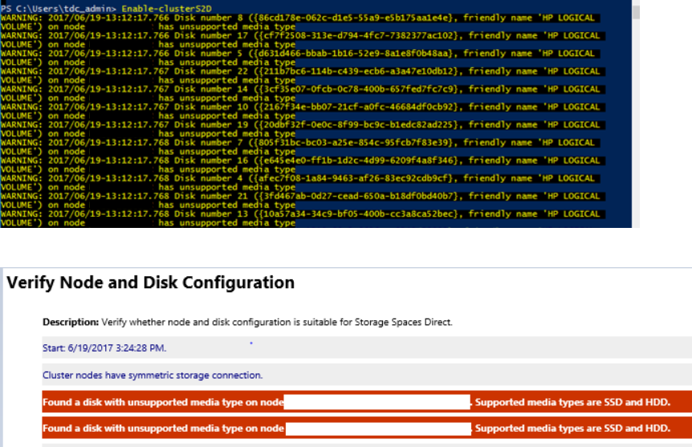

# Troubleshoot Storage Spaces Direct

> Applies to: Windows Server 2019, Windows Server 2016

Use the following information to troubleshoot your Storage Spaces Direct deployment.

In general, start with the following steps:

1. Confirm the make/model of SSD is certified for Windows Server 2016 and Windows Server 2019 using the Windows Server Catalog. Confirm with vendor that the drives are supported for Storage Spaces Direct.
2. Inspect the storage for any faulty drives. Use storage management software to check the status of the drives. If any of the drives are faulty, work with your vendor. 
3. Update storage and drive firmware if necessary.
   Ensure the latest Windows Updates are installed on all nodes. You can get the latest updates for Windows Server 2016 from [Windows 10 and Windows Server 2016 update history](https://aka.ms/update2016) and for Windows Server 2019 from [Windows 10 and Windows Server 2019 update history](https://support.microsoft.com/help/4464619).
4. Update network adapter drivers and firmware.
5. Run cluster validation and review the Storage Space Direct section, ensure the drives that will used for the cache are reported correctly and no errors.

If you're still having issues, review the scenarios below.

## Virtual disk resources are in No Redundancy state
The nodes of a Storage Spaces Direct system restart unexpectedly because of a crash or power failure. Then, one or more of the virtual disks may not come online, and you see the description "Not enough redundancy information."

|FriendlyName|ResiliencySettingName| OperationalStatus| HealthStatus| IsManualAttach|Size| PSComputerName|
|------------|---------------------| -----------------| ------------| --------------|-----| --------------|
|Disk4| Mirror| OK|  Healthy| True|  10 TB|  Node-01.conto...|
|Disk3         |Mirror                 |OK                          |Healthy       |True            |10 TB | Node-01.conto...|
|Disk2         |Mirror                 |No Redundancy               |Unhealthy     |True            |10 TB | Node-01.conto...|
|Disk1         |Mirror                 |{No Redundancy, InService}  |Unhealthy     |True            |10 TB | Node-01.conto...| 

Additionally, after an attempt to bring the virtual disk online, the following information is logged in the Cluster log (DiskRecoveryAction).  

```
[Verbose] 00002904.00001040::YYYY/MM/DD-12:03:44.891 INFO [RES] Physical Disk <DiskName>: OnlineThread: SuGetSpace returned 0.
[Verbose] 00002904.00001040:: YYYY/MM/DD -12:03:44.891 WARN [RES] Physical Disk < DiskName>: Underlying virtual disk is in 'no redundancy' state; its volume(s) may fail to mount.
[Verbose] 00002904.00001040:: YYYY/MM/DD -12:03:44.891 ERR [RES] Physical Disk <DiskName>: Failing online due to virtual disk in 'no redundancy' state. If you would like to attempt to online the disk anyway, first set this resource's private property 'DiskRecoveryAction' to 1. We will try to bring the disk online for recovery, but even if successful, its volume(s) or CSV may be unavailable. 
``` 

The **No Redundancy Operational Status** can occur if a disk failed or if the system is unable to access data on the virtual disk. This issue can occur if a reboot occurs on a node during maintenance on the nodes.

To fix this issue, follow these steps:

1. Remove the affected Virtual Disks from CSV. This will put them in the "Available storage" group in the cluster and start showing as a ResourceType of "Physical Disk."

   ```powershell
   Remove-ClusterSharedVolume -name "VdiskName"
   ``` 
2. On the node that owns the Available Storage group, run the following command on every disk that's in a No Redundancy state. To identify which node the “Available Storage” group is on you can run the following command.

   ```powershell
   Get-ClusterGroup
   ```
3. Set the disk recovery action and then start the disk(s).
   ```powershell
   Get-ClusterResource "VdiskName" | Set-ClusterParameter -Name DiskRecoveryAction -Value 1
   Start-ClusterResource -Name "VdiskName"
   ```
4. A repair should automatically start. Wait for the repair to finish. It may go into a suspended state and start again. To monitor the progress: 
    - Run **Get-StorageJob** to monitor the status of the repair and to see when it is completed.
    - Run **Get-VirtualDisk** and verify that the Space returns a HealthStatus of Healthy.
5. After the repair finishes and the Virtual Disks are Healthy, change the Virtual Disk parameters back.

   ```powershell
    Get-ClusterResource "VdiskName" | Set-ClusterParameter -Name DiskRecoveryAction -Value 0
   ```
6. Take the disk(s) offline and then online again to have the DiskRecoveryAction take effect:

   ```powershell
   Stop-ClusterResource "VdiskName"
   Start-ClusterResource "VdiskName"
   ``` 
7. Add the affected Virtual Disks back to CSV.

   ```powershell
   Add-ClusterSharedVolume -name "VdiskName"
   ```

**DiskRecoveryAction** is an override switch that enables attaching the Space volume in read-write mode without any checks. The property enables you to do diagnostics into why a volume won't come online. It's very similar to Maintenance Mode but you can invoke it on a resource in a Failed state. It also lets you access the data, which can be helpful in situations such as "No Redundancy," where you can get access to whatever data you can and copy it. The DiskRecoveryAction property was added in the February 22, 2018, update, KB 4077525.


## Detached status in a cluster 

When you run the **Get-VirtualDisk** cmdlet, the OperationalStatus for one or more Storage Spaces Direct virtual disks is Detached. However, the HealthStatus reported by the **Get-PhysicalDisk** cmdlet indicates that all the physical disks are in a Healthy state.

The following is an example of the output from the **Get-VirtualDisk** cmdlet.

|FriendlyName|  ResiliencySettingName|  OperationalStatus|   HealthStatus|  IsManualAttach|  Size|   PSComputerName|
|-|-|-|-|-|-|-|
|Disk4|         Mirror|                 OK|                  Healthy|       True|            10 TB|  Node-01.conto...|
|Disk3|         Mirror|                 OK|                  Healthy|       True|            10 TB|  Node-01.conto...|
|Disk2|         Mirror|                 Detached|            Unknown|       True|            10 TB|  Node-01.conto...|
|Disk1|         Mirror|                 Detached|            Unknown|       True|            10 TB|  Node-01.conto...| 


Additionally, the following events may be logged on the nodes:

```
Log Name: Microsoft-Windows-StorageSpaces-Driver/Operational
Source: Microsoft-Windows-StorageSpaces-Driver 
Event ID: 311 
Level: Error
User: SYSTEM 
Computer: Node#.contoso.local 
Description: Virtual disk {GUID} requires a data integrity scan.  

Data on the disk is out-of-sync and a data integrity scan is required. 

To start the scan, run the following command:   
Get-ScheduledTask -TaskName "Data Integrity Scan for Crash Recovery" | Start-ScheduledTask                

Once you have resolved the condition listed above, you can online the disk by using the following commands in PowerShell:   

Get-VirtualDisk | ?{ $_.ObjectId -Match "{GUID}" } | Get-Disk | Set-Disk -IsReadOnly $false 
Get-VirtualDisk | ?{ $_.ObjectId -Match "{GUID}" } | Get-Disk | Set-Disk -IsOffline  $false
------------------------------------------------------------

Log Name: System
Source: Microsoft-Windows-ReFS 
Event ID: 134
Level: Error 
User: SYSTEM
Computer: Node#.contoso.local 
Description: The file system was unable to write metadata to the media backing volume <VolumeId>. A write failed with status "A device which does not exist was specified." ReFS will take the volume offline. It may be mounted again automatically.
------------------------------------------------------------
Log Name: Microsoft-Windows-ReFS/Operational
Source: Microsoft-Windows-ReFS 
Event ID: 5 
Level: Error 
User: SYSTEM 
Computer: Node#.contoso.local 
Description: ReFS failed to mount the volume. 
Context: 0xffffbb89f53f4180 
Error: A device which does not exist was specified.
Volume GUID:{00000000-0000-0000-0000-000000000000} 
DeviceName: 
Volume Name:
``` 

The **Detached Operational Status** can occur if the dirty region tracking (DRT) log is full. Storage Spaces uses dirty region tracking (DRT) for mirrored spaces to make sure that when a power failure occurs, any in-flight updates to metadata are logged to make sure that the storage space can redo or undo operations to bring the storage space back into a flexible and consistent state when power is restored and the system comes back up. If the DRT log is full, the virtual disk can't be brought online until the DRT metadata is synchronized and flushed. This process requires running a full scan, which can take several hours to finish.

To fix this issue, follow these steps:
1. Remove the affected Virtual Disks from CSV.

   ```powershell
   Remove-ClusterSharedVolume -name "VdiskName"
   ``` 
2. Run the following commands on every disk that's not coming online. 

   ```powershell
   Get-ClusterResource -Name "VdiskName" | Set-ClusterParameter DiskRunChkDsk 7
   Start-ClusterResource -Name "VdiskName"
   ``` 
3. Run the following command on every node in which the detached volume is online. 

   ```powershell
   Get-ScheduledTask -TaskName "Data Integrity Scan for Crash Recovery" | Start-ScheduledTask 
   ```
   This task should be initiated on all nodes on which the detached volume is online. A repair should automatically start. Wait for the repair to finish. It may go into a suspended state and start again. To monitor the progress: 
   - Run **Get-StorageJob** to monitor the status of the repair and to see when it is completed.
   - Run **Get-VirtualDisk** and verify the Space returns a HealthStatus of Healthy.
     - The "Data Integrity Scan for Crash Recovery" is a task that doesn't show as a storage job, and there is no progress indicator. If the task is showing as running, it is running. When it completes, it will show completed.

       Additionally, you can view the status of a running schedule task by using the following cmdlet: 
       ```powershell
       Get-ScheduledTask | ? State -eq running
       ``` 
4. As soon as the “Data Integrity Scan for Crash Recovery" is finished, the repair finishes and the Virtual Disks are Healthy, change the Virtual Disk parameters back. 

   ```powershell
   Get-ClusterResource -Name "VdiskName" | Set-ClusterParameter DiskRunChkDsk 0 
   ```

5. Take the disk(s) offline and then online again to have the DiskRecoveryAction take effect:

   ```powershell
   Stop-ClusterResource "VdiskName"
   Start-ClusterResource "VdiskName"
   ``` 

6. Add the affected Virtual Disks back to CSV.    

   ```powershell
   Add-ClusterSharedVolume -name "VdiskName"
   ```  
   **DiskRunChkdsk value 7** is used to attach the Space volume and have the partition in read-only mode. This enables Spaces to self-discover and self-heal by triggering a repair. Repair will run automatically once mounted. It also allows you to access the data, which can be helpful to get access to whatever data you can to copy. For some fault conditions, such as a full DRT log, you need to run the Data Integrity Scan for Crash Recovery scheduled task.

**Data Integrity Scan for Crash Recovery task** is used to synchronize and clear a full dirty region tracking (DRT) log. This task can take several hours to complete. The "Data Integrity Scan for Crash Recovery" is a task that doesn't show as a storage job, and there is no progress indicator. If the task is showing as running, it is running. When it completes, it will show as completed. If you cancel the task or restart a node while this task is running, the task will need to start over from the beginning.

For more information, see [Troubleshooting Storage Spaces Direct health and operational states](storage-spaces-states.md).

## Event 5120 with STATUS_IO_TIMEOUT c00000b5 

> [!Important]
> **For Windows Server 2016:** To reduce the chance of experiencing these symptoms while applying the update with the fix, it is recommended to use the Storage Maintenance Mode procedure below to install the [October 18, 2018, cumulative update for Windows Server 2016](https://support.microsoft.com/help/4462928) or a later version when the nodes currently have installed a Windows Server 2016 cumulative update that was released from [May 8, 2018](https://support.microsoft.com/help/4103723) to [October 9, 2018](https://support.microsoft.com/help/KB4462917).

You might get event 5120 with STATUS_IO_TIMEOUT c00000b5 after you restart a node on Windows Server 2016 with cumulative update that were released from [May 8, 2018 KB 4103723](https://support.microsoft.com/help/4103723) to [October 9, 2018 KB 4462917](https://support.microsoft.com/help/4462917) installed.

When you restart the node, Event 5120 is logged in the System event log and includes one of the following error codes:

```
Event Source: Microsoft-Windows-FailoverClustering
Event ID: 5120
Description:    Cluster Shared Volume 'CSVName' ('Cluster Virtual Disk (CSVName)') has entered a paused state because of 'STATUS_IO_TIMEOUT(c00000b5)'. All I/O will temporarily be queued until a path to the volume is reestablished. 

Cluster Shared Volume ‘CSVName' ('Cluster Virtual Disk (CSVName)') has entered a paused state because of 'STATUS_CONNECTION_DISCONNECTED(c000020c)'. All I/O will temporarily be queued until a path to the volume is reestablished.    
```

When an Event 5120 is logged, a live dump is generated to collect debugging information that may cause additional symptoms or have a performance effect. Generating the live dump creates a brief pause to enable taking a snapshot of memory to write the dump file. Systems that have lots of memory and are under stress may cause nodes to drop out of cluster membership and also cause the following Event 1135 to be logged.

```
Event source: Microsoft-Windows-FailoverClustering
Event ID: 1135  
Description: Cluster node 'NODENAME'was removed from the active failover cluster membership. The Cluster service on this node may have stopped. This could also be due to the node having lost communication with other active nodes in the failover cluster. Run the Validate a Configuration wizard to check your network configuration. If the condition persists, check for hardware or software errors related to the network adapters on this node. Also check for failures in any other network components to which the node is connected such as hubs, switches, or bridges.
```

A change introduced in May 8, 2018 to Windows Server 2016, which was a cumulative update to add SMB Resilient Handles for the Storage Spaces Direct intra-cluster SMB network sessions. This was done to improve resiliency to transient network failures and improve how RoCE handles network congestion. These improvements also inadvertently increased time-outs when SMB connections try to reconnect and waits to time-out when a node is restarted. These issues can affect a system that is under stress. During unplanned downtime, IO pauses of up to 60 seconds have also been observed while the system waits for connections to time-out. To fix this issue, install the [October 18, 2018, cumulative update for Windows Server 2016](https://support.microsoft.com/help/4462928) or a later version.

*Note* This update aligns the CSV time-outs with SMB connection time-outs to fix this issue. It does not implement the changes to disable live dump generation mentioned in the Workaround section.

### Shutdown process flow:

1. Run the Get-VirtualDisk cmdlet, and make sure that the HealthStatus value is Healthy.
2. Drain the node by running the following cmdlet:

   ```powershell
   Suspend-ClusterNode -Drain
   ```
3. Put the disks on that node in Storage Maintenance Mode by running the following cmdlet: 

   ```powershell
   Get-StorageFaultDomain -type StorageScaleUnit | Where-Object {$_.FriendlyName -eq "<NodeName>"} | Enable-StorageMaintenanceMode
   ```
4. Run the **Get-PhysicalDisk** cmdlet, and make sure that the OperationalStatus value is In Maintenance Mode.
5. Run the **Restart-Computer** cmdlet to restart the node.
6. After node restarts, remove the disks on that node from Storage Maintenance Mode by running the following cmdlet:

   ```powershell
   Get-StorageFaultDomain -type StorageScaleUnit | Where-Object {$_.FriendlyName -eq "<NodeName>"} | Disable-StorageMaintenanceMode
   ```
7. Resume the node by running the following cmdlet:

   ```powershell
   Resume-ClusterNode
   ```
8. Check the status of the resync jobs by running the following cmdlet:

   ```powershell
   Get-StorageJob
   ```

### Disabling live dumps
To mitigate the effect of live dump generation on systems that have lots of memory and are under stress, you may additionally want to disable live dump generation. Three options are provided below.

>[!Caution]
>This procedure can prevent the collection of diagnostic information that Microsoft Support may need to investigate this problem. A Support agent may have to ask you to re-enable live dump generation based on specific troubleshooting scenarios.

There are two methods to disable live dumps, as described below.

#### Method 1 (recommended in this scenario)
To completely disable all dumps, including live dumps system-wide, follow these steps:

1. Create the following registry key: HKLM\System\CurrentControlSet\Control\CrashControl\ForceDumpsDisabled
2. Under the new **ForceDumpsDisabled** key, create a REG_DWORD property as GuardedHost, and then set its value to 0x10000000.
3. Apply the new registry key to each cluster node.

>[!NOTE]
>You have to restart the computer for the nregistry change to take effect.

After this registry key is set, live dump creation will fail and generate a "STATUS_NOT_SUPPORTED" error.

#### Method 2
By default, Windows Error Reporting will allow only one LiveDump per report type per 7 days and only 1 LiveDump per machine per 5 days. You can change that by setting the following registry keys to only allow one LiveDump on the machine forever.
```
reg add "HKLM\Software\Microsoft\Windows\Windows Error Reporting\FullLiveKernelReports" /v SystemThrottleThreshold /t REG_DWORD /d 0xFFFFFFFF /f
```
```
reg add "HKLM\Software\Microsoft\Windows\Windows Error Reporting\FullLiveKernelReports" /v ComponentThrottleThreshold /t REG_DWORD /d 0xFFFFFFFF /f
```

*Note* You have to restart the computer for the change to take effect.

### Method 3
To disable cluster generation of live dumps (such as when an Event 5120 is logged), run the following cmdlet:

```powershell
(Get-Cluster).DumpPolicy = ((Get-Cluster).DumpPolicy -band 0xFFFFFFFFFFFFFFFE)
```
This cmdlet has an immediate effect on all cluster nodes without a computer restart.

## Slow IO performance

If you are seeing slow IO performance, check if cache is enabled in your Storage Spaces Direct configuration. 

There are two ways to check: 


1. Using the cluster log. Open the cluster log in text editor of choice and search for "[=== SBL Disks ===]." This will be a list of the disk on the node the log was generated on. 

     Cache Enabled Disks Example: Note here that the state is CacheDiskStateInitializedAndBound and there is a GUID present here. 

   ```
   [=== SBL Disks ===]
    {26e2e40f-a243-1196-49e3-8522f987df76},3,false,true,1,48,{1ff348f1-d10d-7a1a-d781-4734f4440481},CacheDiskStateInitializedAndBound,1,8087,54,false,false,HGST    ,HUH721010AL4200 ,        7PG3N2ER,A21D,{d5e27a3b-42fb-410a-81c6-9d8cc12da20c},[R/M 0 R/U 0 R/T 0 W/M 0 W/U 0 W/T 0],
    ```

    Cache Not Enabled: Here we can see there is no GUID present and the state is CacheDiskStateNonHybrid. 
    ```
   [=== SBL Disks ===]
    {426f7f04-e975-fc9d-28fd-72a32f811b7d},12,false,true,1,24,{00000000-0000-0000-0000-000000000000},CacheDiskStateNonHybrid,0,0,0,false,false,HGST    ,HUH721010AL4200 ,        7PGXXG6C,A21D,{d5e27a3b-42fb-410a-81c6-9d8cc12da20c},[R/M 0 R/U 0 R/T 0 W/M 0 W/U 0 W/T 0],
    ```

    Cache Not Enabled: When all disks are of the same type case is not enabled by default. Here we can see there is no GUID present and the state is CacheDiskStateIneligibleDataPartition. 
    ```
    {d543f90c-798b-d2fe-7f0a-cb226c77eeed},10,false,false,1,20,{00000000-0000-0000-0000-000000000000},CacheDiskStateIneligibleDataPartition,0,0,0,false,false,NVMe    ,INTEL SSDPE7KX02,  PHLF7330004V2P0LGN,0170,{79b4d631-976f-4c94-a783-df950389fd38},[R/M 0 R/U 0 R/T 0 W/M 0 W/U 0 W/T 0], 
    ```  
2. Using Get-PhysicalDisk.xml from the SDDCDiagnosticInfo
    1. Open the XML file using "$d = Import-Clixml GetPhysicalDisk.XML"
    2. Run "ipmo storage"
    3. run "$d". Note that Usage is Auto-Select, not Journal
   You'll see output like this: 

   |FriendlyName|  SerialNumber| MediaType| CanPool| OperationalStatus| HealthStatus| Usage| Size|
   |-----------|------------|---------| -------| -----------------| ------------| -----| ----|
   |NVMe INTEL SSDPE7KX02| PHLF733000372P0LGN| SSD| False|   OK|                Healthy|      Auto-Select 1.82 TB|
   |NVMe INTEL SSDPE7KX02 |PHLF7504008J2P0LGN| SSD|  False|    OK|                Healthy| Auto-Select| 1.82 TB|
   |NVMe INTEL SSDPE7KX02| PHLF7504005F2P0LGN| SSD|  False|  OK|                Healthy| Auto-Select| 1.82 TB|
   |NVMe INTEL SSDPE7KX02 |PHLF7504002A2P0LGN| SSD| False| OK|    Healthy| Auto-Select| 1.82 TB|
   |NVMe INTEL SSDPE7KX02| PHLF7504004T2P0LGN |SSD| False|OK|       Healthy| Auto-Select| 1.82 TB|
   |NVMe INTEL SSDPE7KX02 |PHLF7504002E2P0LGN| SSD| False| OK|      Healthy| Auto-Select| 1.82 TB|
   |NVMe INTEL SSDPE7KX02 |PHLF7330002Z2P0LGN| SSD| False| OK|      Healthy|Auto-Select| 1.82 TB|
   |NVMe INTEL SSDPE7KX02 |PHLF733000272P0LGN |SSD| False| OK|  Healthy| Auto-Select| 1.82 TB|
   |NVMe INTEL SSDPE7KX02 |PHLF7330001J2P0LGN |SSD| False| OK| Healthy| Auto-Select| 1.82 TB|
   |NVMe INTEL SSDPE7KX02| PHLF733000302P0LGN |SSD| False| OK|Healthy| Auto-Select| 1.82 TB|
   |NVMe INTEL SSDPE7KX02| PHLF7330004D2P0LGN |SSD| False| OK| Healthy| Auto-Select |1.82 TB|

## How to destroy an existing cluster so you can use the same disks again

In a Storage Spaces Direct cluster, once you disable Storage Spaces Direct and use the clean-up process described in [Clean drives](deploy-storage-spaces-direct.md#step-31-clean-drives), the clustered storage pool still remains in an Offline state, and the Health Service is removed from cluster.

The next step is to remove the phantom storage pool: 
   ```powershell
   Get-ClusterResource -Name "Cluster Pool 1" | Remove-ClusterResource
   ```

Now, if you run **Get-PhysicalDisk** on any of the nodes, you'll see all the disks that were in the pool. For example, in a lab with a 4-Node cluster with 4 SAS disks, 100GB each presented to each node. In that case, after Storage Space Direct is disabled, which removes the SBL (Storage Bus Layer) but leaves the filter, if you run **Get-PhysicalDisk**, it should report 4 disks excluding the local OS disk. Instead it reported 16 instead. This is the same for all nodes in the cluster. When you run a **Get-Disk** command, you'll see the locally attached disks numbered as 0, 1, 2 and so on, as seen in this sample output:

|Number| Friendly Name| Serial Number|HealthStatus|OperationalStatus|Total Size| Partition Style|
|-|-|-|-|-|-|-|-|
|0|Msft Virtu...  ||Healthy | Online|  127 GB| GPT|
||Msft Virtu... ||Healthy| Offline| 100 GB| RAW|
||Msft Virtu... ||Healthy| Offline| 100 GB| RAW|
||Msft Virtu... ||Healthy| Offline| 100 GB| RAW|
||Msft Virtu... ||Healthy| Offline| 100 GB| RAW|
|1|Msft Virtu...||Healthy| Offline| 100 GB| RAW|
||Msft Virtu... ||Healthy| Offline| 100 GB| RAW|
|2|Msft Virtu...||Healthy| Offline| 100 GB| RAW|
||Msft Virtu... ||Healthy| Offline| 100 GB| RAW|
||Msft Virtu... ||Healthy| Offline| 100 GB| RAW|
||Msft Virtu... ||Healthy| Offline| 100 GB| RAW|
||Msft Virtu... ||Healthy| Offline| 100 GB| RAW|
|4|Msft Virtu...||Healthy| Offline| 100 GB| RAW|
|3|Msft Virtu...||Healthy| Offline| 100 GB| RAW|
||Msft Virtu... ||Healthy| Offline| 100 GB| RAW|
||Msft Virtu... ||Healthy| Offline| 100 GB| RAW|
||Msft Virtu... ||Healthy| Offline| 100 GB| RAW|


## Error message about "unsupported media type" when you create an Storage Spaces Direct cluster using Enable-ClusterS2D  

You might see errors similar to this when you run the **Enable-ClusterS2D** cmdlet:



To fix this issue, ensure the HBA adapter is configured in HBA mode. No HBA should be configured in RAID mode.  

## Enable-ClusterStorageSpacesDirect hangs at 'Waiting until SBL disks are surfaced' or at 27%

You will see the following information in the validation report:

    Disk <identifier> connected to node <nodename> returned a SCSI Port Association and the corresponding enclosure device could not be found. The hardware is not compatible with Storage Spaces Direct (S2D), contact the hardware vendor to verify support for SCSI Enclosure Services (SES). 


The issue is with the HPE SAS expander card that lies between the disks and the HBA card. The SAS expander creates a duplicate ID between the first drive connected to the expander and the expander itself.  This has been resolved in [HPE Smart Array Controllers SAS Expander Firmware: 4.02](https://support.hpe.com/hpsc/swd/public/detail?sp4ts.oid=7304566&swItemId=MTX_ef8d0bf4006542e194854eea6a&swEnvOid=4184#tab3).

## Intel SSD DC P4600 series has a non-unique NGUID
You might see an issue where an Intel SSD DC P4600 series device seems to be reporting similar 16 byte NGUID for multiple namespaces such as 0100000001000000E4D25C000014E214 or 0100000001000000E4D25C0000EEE214 in the example below.


|               uniqueid               | deviceid | MediaType | BusType |               serialnumber               |      size      | canpool | friendlyname | OperationalStatus |
|--------------------------------------|----------|-----------|---------|------------------------------------------|----------------|---------|--------------|-------------------|
|           5000CCA251D12E30           |    0     |    HDD    |   SAS   |                 7PKR197G                 | 10000831348736 |  False  |     HGST     |  HUH721010AL4200  |
| eui.0100000001000000E4D25C000014E214 |    4     |    SSD    |  NVMe   | 0100_0000_0100_0000_E4D2_5C00_0014_E214. | 1600321314816  |  True   |    INTEL     |   SSDPE2KE016T7   |
| eui.0100000001000000E4D25C000014E214 |    5     |    SSD    |  NVMe   | 0100_0000_0100_0000_E4D2_5C00_0014_E214. | 1600321314816  |  True   |    INTEL     |   SSDPE2KE016T7   |
| eui.0100000001000000E4D25C0000EEE214 |    6     |    SSD    |  NVMe   | 0100_0000_0100_0000_E4D2_5C00_00EE_E214. | 1600321314816  |  True   |    INTEL     |   SSDPE2KE016T7   |
| eui.0100000001000000E4D25C0000EEE214 |    7     |    SSD    |  NVMe   | 0100_0000_0100_0000_E4D2_5C00_00EE_E214. | 1600321314816  |  True   |    INTEL     |   SSDPE2KE016T7   |

To fix this issue, update the firmware on the Intel drives to the latest version.  Firmware version QDV101B1 from May 2018 is known to resolve this issue.

The [May 2018 release of the Intel SSD Data Center Tool](https://downloadmirror.intel.com/27778/eng/Intel_SSD_Data_Center_Tool_3_0_12_Release_Notes_330715-026.pdf) includes a firmware update, QDV101B1, for the Intel SSD DC P4600 series.


## Physical Disk "Healthy," and Operational Status is "Removing from Pool" 

In a Windows Server 2016 Storage Spaces Direct cluster, you might see the HealthStatus for one ore more physical disks as "Healthy," while the OperationalStatus is "(Removing from Pool, OK)." 

"Removing from Pool" is an intent set when **Remove-PhysicalDisk** is called but stored in Health to maintain state and allow recovery if the remove operation fails. You can manually change the OperationalStatus to Healthy with one of the following methods:

- Remove the physical disk from the pool, and then add it back.
- Run the [Clear-PhysicalDiskHealthData.ps1 script](https://go.microsoft.com/fwlink/?linkid=2034205) to clear the intent. (Available for download as a .TXT file. You'll need to save it as a .PS1 file before you can run it.)

Here are some examples showing how to run the script:

- Use the **SerialNumber** parameter to specify the disk you need to set to Healthy. You can get the serial number from **WMI MSFT_PhysicalDisk** or **Get-PhysicalDIsk**. (We're just using 0s for the serial number below.)

   ```powershell
   Clear-PhysicalDiskHealthData -Intent -Policy -SerialNumber 000000000000000 -Verbose -Force
    ```

- Use the **UniqueId** parameter to specify the disk (again from **WMI MSFT_PhysicalDisk** or **Get-PhysicalDIsk**).

   ```powershell
   Clear-PhysicalDiskHealthData -Intent -Policy -UniqueId 00000000000000000 -Verbose -Force
   ```

## File copy is slow

You might seen an issue using File Explorer to copy a large VHD to the virtual disk - the file copy is taking longer than expected.

Using File Explorer, Robocopy or Xcopy to copy a large VHD to the virtual disk is not a recommended method to as this will result in slower than expected performance. The copy process does not go through the Storage Spaces Direct stack, which sits lower on the storage stack, and instead acts like a local copy process.

If you want to test Storage Spaces Direct performance, we recommend using VMFleet and Diskspd to load and stress test the servers to get a base line and set expectations of the Storage Spaces Direct performance.

## Expected events that you would see on rest of the nodes during the reboot of a node. 

It is safe to ignore these events: 

    Event ID 205: Windows lost communication with physical disk {XXXXXXXXXXXXXXXXXXXX }. This can occur if a cable failed or was disconnected, or if the disk itself failed. 

    Event ID 203: Windows lost communication with physical disk {xxxxxxxxxxxxxxxxxxxxxxxx }. This can occur if a cable failed or was disconnected, or if the disk itself failed. 

If you're running Azure VMs, you can ignore this event:

    Event ID 32: The driver detected that the device \Device\Harddisk5\DR5 has its write cache enabled. Data corruption may occur. 

## Slow performance or "Lost Communication," "IO Error," "Detached," or "No Redundancy" errors for deployments that use Intel P3x00 NVMe devices

We've identified a critical issue that affects some Storage Spaces Direct users who are using hardware based on the Intel P3x00 family of NVM Express (NVMe) devices with firmware versions before "Maintenance Release 8." 

>[!NOTE]
> Individual OEMs may have devices that are based on the Intel P3x00 family of NVMe devices with unique firmware version strings. Contact your OEM for more information of the latest firmware version.

If you are using hardware in your deployment based on the Intel P3x00 family of NVMe devices, we recommend that you immediately apply the latest available firmware (at least Maintenance Release 8). This [Microsoft Support article](https://support.microsoft.com/help/4052341/slow-performance-or-lost-communication-io-error-detached-or-no-redunda) provides additional information about this issue. 
