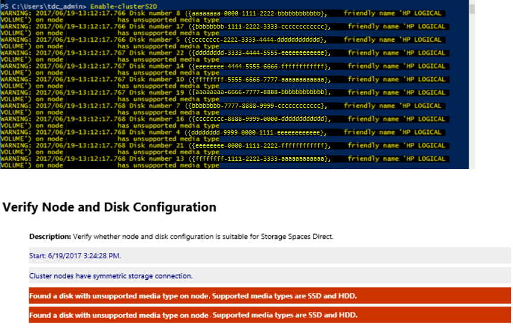

# Troubleshoot Storage Spaces Direct

> Applies to: Azure Stack HCI, versions 22H2 and 21H2; Windows Server 2022, Windows Server 2019, Windows Server 2016

Use the information in this article to troubleshoot your Storage Spaces Direct deployment.

In general, start with these steps:

1. Confirm the make and model of SSD is certified for Windows Server 2016 and Windows Server 2019 by using the Windows Server Catalog. Confirm with the vendor that the drives are supported for Storage Spaces Direct.
1. Inspect the storage for any faulty drives. Use storage management software to check the status of the drives. If any of the drives are faulty, work with your vendor.
1. Update the storage and drive firmware if necessary.
   Ensure that the latest Windows Updates are installed on all nodes. You can get the latest updates for Windows Server 2016 from [Windows 10 and Windows Server 2016 update history](https://aka.ms/update2016). Get the latest updates for Windows Server 2019 from [Windows 10 and Windows Server 2019 update history](https://support.microsoft.com/help/4464619).
1. Update the network adapter drivers and firmware.
1. Run cluster validation and review the Storage Space Direct section. Ensure that the drives you use for the cache are reported correctly and have no errors.

If you're still having problems, review the troubleshooting information for each of the specific issues in this article.

## Virtual disk resources are in No Redundancy state

The nodes of a Storage Spaces Direct system restart unexpectedly because of a crash or power failure. Then, one or more of the virtual disks might not come online, and you see the description _Not enough redundancy information_.

|FriendlyName|ResiliencySettingName| OperationalStatus| HealthStatus| IsManualAttach|Size| PSComputerName|
|------------|---------------------| -----------------| ------------| --------------|-----| --------------|
|Disk4| Mirror| OK|  Healthy| True|  10 TB|  Node-01.conto...|
|Disk3         |Mirror                 |OK                          |Healthy       |True            |10 TB | Node-01.contoso.|
|Disk2         |Mirror                 |No Redundancy               |Unhealthy     |True            |10 TB | Node-01.contoso.|
|Disk1         |Mirror                 |{No Redundancy, InService}  |Unhealthy     |True            |10 TB | Node-01.contoso.|

Also, after an attempt to bring the virtual disk online, the following information is logged in the Cluster log, the `DiskRecoveryAction`.

```
[Verbose] 00002904.00001040::YYYY/MM/DD-12:03:44.891 INFO [RES] Physical Disk <DiskName>: OnlineThread: SuGetSpace returned 0.
[Verbose] 00002904.00001040:: YYYY/MM/DD -12:03:44.891 WARN [RES] Physical Disk < DiskName>: Underlying virtual disk is in 'no redundancy' state; its volume(s) may fail to mount.
[Verbose] 00002904.00001040:: YYYY/MM/DD -12:03:44.891 ERR [RES] Physical Disk <DiskName>: Failing online due to virtual disk in 'no redundancy' state. If you would like to attempt to online the disk anyway, first set this resource's private property 'DiskRecoveryAction' to 1. We will try to bring the disk online for recovery, but even if successful, its volume(s) or CSV may be unavailable.
```

The _No Redundancy Operational Status_ occurs if a disk failed or if the system is unable to access data on the virtual disk. This issue can happen if a reboot occurs on a node during maintenance on the nodes.

To fix this issue, follow these steps:

1. Remove the affected virtual disks from CSV. Doing so puts them in the available storage group in the cluster and starts showing as a ResourceType of `Physical Disk`.

   ```powershell
   Remove-ClusterSharedVolume -Name "CSV Name"
   ```

1. On the node that owns the Available Storage group, run the following command on every disk that's in a no redundancy state. To identify which node the Available Storage group is on, you can run this command:

   ```powershell
   Get-ClusterGroup
   ```

1. Set the disk recovery action and then start the disk(s).
   ```powershell
   Get-ClusterResource "Physical Disk Resource Name" | Set-ClusterParameter -Name DiskRecoveryAction -Value 1
   Start-ClusterResource -Name "Physical Disk Resource Name"
   ```

1. A repair should automatically start. Wait for the repair to finish. It might go into a suspended state and start again. To monitor the progress:
    - Run `Get-StorageJob` to monitor the status of the repair and to see when it's completed.
    - Run `Get-VirtualDisk` and verify that the Space returns a HealthStatus of Healthy.

1. After the repair finishes and the virtual disks are healthy, change the virtual disk parameters back.

   ```powershell
    Get-ClusterResource "Physical Disk Resource Name" | Set-ClusterParameter -Name DiskRecoveryAction -Value 0
   ```

1. Take the disk(s) offline and then online again to get the `DiskRecoveryAction` to take effect:

   ```powershell
   Stop-ClusterResource "Physical Disk Resource Name"
   Start-ClusterResource "Physical Disk Resource Name"
   ```

1. Add the affected virtual disks back to CSV.

   ```powershell
   Add-ClusterSharedVolume -Name "Physical Disk Resource Name"
   ```

`DiskRecoveryAction` is an override switch that lets you attach the Space volume in read-write mode without any checks. The property lets you diagnose why a volume isn't coming online. It's similar to maintenance mode but you can invoke it on a resource in a failed state. It also lets you access the data so you can copy it. This access is helpful in no-redundancy situations. The `DiskRecoveryAction` property was added in the February 22, 2018 in update KB 4077525.

## Detached status in a cluster

When you run the `Get-VirtualDisk` cmdlet, the `OperationalStatus` for one or more Storage Spaces Direct virtual disks is Detached. However, the HealthStatus reported by the `Get-PhysicalDisk` cmdlet indicates that all the physical disks are in a Healthy state.

This example shows the output from the `Get-VirtualDisk` cmdlet.

|FriendlyName|  ResiliencySettingName|  OperationalStatus|   HealthStatus|  IsManualAttach|  Size|   PSComputerName|
|-|-|-|-|-|-|-|
|Disk4|         Mirror|                 OK|                  Healthy|       True|            10 TB|  Node-01.contoso.|
|Disk3|         Mirror|                 OK|                  Healthy|       True|            10 TB|  Node-01.contoso.|
|Disk2|         Mirror|                 Detached|            Unknown|       True|            10 TB|  Node-01.contoso.|
|Disk1|         Mirror|                 Detached|            Unknown|       True|            10 TB|  Node-01.contoso.|

Also, the following events might be logged on the nodes:

```powershell
Log Name: Microsoft-Windows-StorageSpaces-Driver/Operational
Source: Microsoft-Windows-StorageSpaces-Driver
Event ID: 311
Level: Error
User: SYSTEM
Computer: Node#.contoso.local
Description: Virtual disk {GUID} requires a data integrity scan.

Data on the disk is out-of-sync and a data integrity scan is required.

To start the scan, run this command:
Get-ScheduledTask -TaskName "Data Integrity Scan for Crash Recovery" | Start-ScheduledTask

Once you have resolved that condition, you can online the disk by using these commands in PowerShell:

Get-VirtualDisk | ?{ $_.ObjectId -Match "{GUID}" } | Get-Disk | Set-Disk -IsReadOnly $false
Get-VirtualDisk | ?{ $_.ObjectId -Match "{GUID}" } | Get-Disk | Set-Disk -IsOffline $false
------------------------------------------------------------

Log Name: System
Source: Microsoft-Windows-ReFS
Event ID: 134
Level: Error
User: SYSTEM
Computer: Node#.contoso.local
Description: The file system was unable to write metadata to the media backing volume <VolumeId>. A write failed with status "A device which does not exist was specified." ReFS will take the volume offline. It might be mounted again automatically.
------------------------------------------------------------
Log Name: Microsoft-Windows-ReFS/Operational
Source: Microsoft-Windows-ReFS
Event ID: 5
Level: Error
User: SYSTEM
Computer: Node#.contoso.local
Description: ReFS failed to mount the volume.
Context: 0xffffbb89f53f4180
Error: A device which does not exist was specified.
Volume GUID:{00000000-0000-0000-0000-000000000000}
DeviceName:
Volume Name:
```

The `Detached Operational Status` occurs if the dirty region tracking (DRT) log is full. Storage Spaces uses dirty region tracking (DRT) for mirrored spaces to ensure that when a power failure occurs, any in-flight updates to metadata are logged. Logged updates ensure that the storage space can redo or undo operations. They return the storage space to a flexible and consistent state after power restores and the system comes back up. If the DRT log is full, the virtual disk can't be brought online until the DRT metadata is synchronized and flushed. This process requires running a full scan, which can take several hours to finish.

To fix this issue, follow these steps:

1. Remove the affected virtual disks from CSV.

   ```powershell
   Remove-ClusterSharedVolume -Name "CSV Name"
   ```

1. Run these commands on every disk that's not coming online.

   ```powershell
   Get-ClusterResource -Name "Physical Disk Resource Name" | Set-ClusterParameter DiskRunChkDsk 7
   Start-ClusterResource -Name "Physical Disk Resource Name"
   ```

1. Run the following command on every node in which the detached volume is online.

   ```powershell
   Get-ScheduledTask -TaskName "Data Integrity Scan for Crash Recovery" | Start-ScheduledTask
   ```

   Initiate this task on all nodes on which the detached volume is online. A repair should automatically start. Wait for the repair to finish. It might go into a suspended state and start again. To monitor the progress:
   - Run `Get-StorageJob` to monitor the status of the repair and to see when it's completed.
   - Run `Get-VirtualDisk` and verify the Space returns a HealthStatus of Healthy.
     - The Data Integrity Scan for Crash Recovery is a task that doesn't show as a storage job, and there's no progress indicator. If the task is showing as running, it's running. When it completes, it shows completed.

       Also, you can view the status of a running schedule task by using this cmdlet:

       ```powershell
       Get-ScheduledTask | ? State -eq running
       ```

1. After the Data Integrity Scan for Crash Recovery completes, the repair is finished and the virtual disks are healthy. Change the virtual disk parameters back.

   ```powershell
   Get-ClusterResource -Name "Physical Disk Resource Name" | Set-ClusterParameter DiskRunChkDsk 0
   ```

1. Take the disk(s) offline and then online again to get the `DiskRecoveryAction` to take effect:

   ```powershell
   Stop-ClusterResource "Physical Disk Resource Name"
   Start-ClusterResource "Physical Disk Resource Name"
   ```

1. Add the affected virtual disks back to CSV.

   ```powershell
   Add-ClusterSharedVolume -Name "Physical Disk Resource Name"
   ```

   Use `DiskRunChkdsk value 7` to attach the Space volume and set the partition to read-only mode. This action enables Spaces to self-discover and self-heal by triggering a repair. Repair runs automatically once mounted. It also lets you access the data to copy it. For some fault conditions, such as a full DRT log, you need to run the Data Integrity Scan for Crash Recovery scheduled task.

Use the Data Integrity Scan for Crash Recovery task to synchronize and clear a full dirty region tracking (DRT) log. This task can take several hours to complete. The Data Integrity Scan for Crash Recovery is a task that doesn't show as a storage job, and there's no progress indicator. If the task is showing as running, it's running. When it completes, it shows as completed. If you cancel the task or restart a node while this task is running, the task needs to start over from the beginning.

For more information, see [Troubleshoot Storage Spaces Direct health and operational states](storage-spaces-states.md).

## Event 5120 with STATUS_IO_TIMEOUT c00000b5

> [!IMPORTANT]
> For Windows Server 2016: To reduce the chance of experiencing these symptoms while applying the update with the fix, we recommend you use the [storage maintenance mode](#shutdown-process-flow) procedure to install the [October 18, 2018, cumulative update for Windows Server 2016](https://support.microsoft.com/help/4462928) or a later version when the nodes currently have installed a Windows Server 2016 cumulative update that was released from [May 8, 2018](https://support.microsoft.com/help/4103723) to [October 9, 2018](https://support.microsoft.com/help/4462917).

You might get event 5120 with STATUS_IO_TIMEOUT c00000b5 after you restart a node on Windows Server 2016 with cumulative update that was released from [May 8, 2018 KB 4103723](https://support.microsoft.com/help/4103723) to [October 9, 2018 KB 4462917](https://support.microsoft.com/help/4462917) installed.

When you restart the node, Event 5120 is logged in the System Event log and includes one of these error codes:

```
Event Source: Microsoft-Windows-FailoverClustering
Event ID: 5120
Description:    Cluster Shared Volume 'CSVName' ('Cluster Virtual Disk (CSVName)') has entered a paused state because of 'STATUS_IO_TIMEOUT(c00000b5)'. All I/O will temporarily be queued until a path to the volume is reestablished.

Cluster Shared Volume 'CSVName' ('Cluster Virtual Disk (CSVName)') has entered a paused state because of 'STATUS_CONNECTION_DISCONNECTED(c000020c)'. All I/O will temporarily be queued until a path to the volume is reestablished.
```

When an Event 5120 is logged, a live dump generates to collect debugging information that can cause other symptoms or affect performance. When the live dump generates, it causes a brief pause. The pause enables a snapshot of memory to write the dump file. Systems with a great amount of memory and under stress might cause nodes to drop out of cluster membership and cause the following Event 1135 to be logged.

```
Event source: Microsoft-Windows-FailoverClustering
Event ID: 1135
Description: Cluster node 'NODENAME'was removed from the active failover cluster membership. The Cluster service on this node might have stopped. This could also be due to the node having lost communication with other active nodes in the failover cluster. Run the Validate a Configuration wizard to check your network configuration. If the condition persists, check for hardware or software errors related to the network adapters on this node. Also check for failures in any other network components to which the node is connected such as hubs, switches, or bridges.
```

A change introduced in May 8, 2018 to Windows Server 2016 was a cumulative update to add SMB Resilient Handles for the Storage Spaces Direct intra-cluster SMB network sessions. This update was made to improve resiliency to transient network failures and improve how RoCE handles network congestion. These improvements also inadvertently increased timeouts when SMB connections try to reconnect and waits to time out when a node is restarted. These issues can affect a system that's under stress. During unplanned downtime, IO pauses up to 60 seconds have also been observed while the system waits for connections to time out. To fix this issue, install the [October 18, 2018, cumulative update for Windows Server 2016](https://support.microsoft.com/help/4462928) or a later version.

> [!NOTE]
> This update aligns the CSV time-outs with SMB connection time-outs to fix this issue. It doesn't implement the changes to disable live dump generation mentioned in the Workaround section.

### Shutdown process flow

1. Run the Get-VirtualDisk cmdlet, and make sure that the HealthStatus value is Healthy.
1. Drain the node by running this cmdlet:

   ```powershell
   Suspend-ClusterNode -Drain
   ```

1. Put the disks on that node in storage maintenance mode by running this cmdlet:

   ```powershell
   Get-StorageFaultDomain -Type StorageScaleUnit | Where-Object {$_.FriendlyName -eq "<NodeName>"} | Enable-StorageMaintenanceMode
   ```

1. Run the `Get-PhysicalDisk` cmdlet, and make sure that the `OperationalStatus` value is `In Maintenance` mode.
1. Run the `Restart-Computer` cmdlet to restart the node.
1. After node restarts, remove the disks on that node from storage maintenance mode by running this cmdlet:

   ```powershell
   Get-StorageFaultDomain -Type StorageScaleUnit | Where-Object {$_.FriendlyName -eq "<NodeName>"} | Disable-StorageMaintenanceMode
   ```

1. Resume the node by running this cmdlet:

   ```powershell
   Resume-ClusterNode
   ```

1. Check the status of the resync jobs by running this cmdlet:

   ```powershell
   Get-StorageJob
   ```

### Disabling live dumps

To mitigate the effects of live dump generation on systems with a great amount of memory and under stress, you can disable live dump generation. These three options are provided:

- [Disable all dumps](#disable-all-dumps)
- [Allow only one LiveDump](#allow-only-one-livedump)
- [Disable cluster generation](#disable-cluster-generation)

> [!CAUTION]
> This procedure can prevent the collection of diagnostic information that Microsoft Support might need to investigate this problem. A Support agent might ask you to re-enable live dump generation based on specific troubleshooting scenarios.

#### Disable all dumps

To completely disable all dumps, including live dumps system-wide, follow these steps. Use this procedure for this scenario:

1. Create the following registry key: HKLM\System\CurrentControlSet\Control\CrashControl\ForceDumpsDisabled
2. Under the new **ForceDumpsDisabled** key, create a REG_DWORD property as GuardedHost, and then set its value to 0x10000000.
3. Apply the new registry key to each cluster node.

> [!NOTE]
> You must restart the computer for the nregistry change to take effect.

After this registry key is set, live dump creation will fail and generate a **STATUS_NOT_SUPPORTED** error.

#### Allow only one LiveDump

By default, Windows Error Reporting allows only one LiveDump per report type per seven days and only one LiveDump per machine per five days. You can change that by setting the following registry keys to only allow one LiveDump on the machine forever.

```cmd
reg add "HKLM\Software\Microsoft\Windows\Windows Error Reporting\FullLiveKernelReports" /v SystemThrottleThreshold /t REG_DWORD /d 0xFFFFFFFF /f
```

```cmd
reg add "HKLM\Software\Microsoft\Windows\Windows Error Reporting\FullLiveKernelReports" /v ComponentThrottleThreshold /t REG_DWORD /d 0xFFFFFFFF /f
```

> [!NOTE]
> You must restart the computer for the change to take effect.

#### Disable cluster generation

To disable cluster generation of live dumps (such as when an Event 5120 is logged), run this cmdlet:

```powershell
(Get-Cluster).DumpPolicy = ((Get-Cluster).DumpPolicy -Band 0xFFFFFFFFFFFFFFFE)
```

This cmdlet has an immediate effect on all cluster nodes without a computer restart.

## Slow IO performance

If you see slow IO performance, check if cache is enabled in your Storage Spaces Direct configuration.

There are two ways to check:

1. Use the cluster log. Open the cluster log with a text editor of your choice and search for "[=== SBL Disks ===]". You see a list of the disk on the node the log was generated on.

     Cache Enabled Disks Example: Notice that the state is `CacheDiskStateInitializedAndBound` and there's a GUID present here.

   ```
   [=== SBL Disks ===]
    {26e2e40f-a243-1196-49e3-8522f987df76},3,false,true,1,48,{1ff348f1-d10d-7a1a-d781-4734f4440481},CacheDiskStateInitializedAndBound,1,8087,54,false,false,HGST,HUH721010AL4200,7PG3N2ER,A21D,{d5e27a3b-42fb-410a-81c6-9d8cc12da20c},[R/M 0 R/U 0 R/T 0 W/M 0 W/U 0 W/T 0],
    ```

    Cache Not Enabled: Here you can see that there's no GUID present and the state is `CacheDiskStateNonHybrid`.

   ```
   [=== SBL Disks ===]
    {426f7f04-e975-fc9d-28fd-72a32f811b7d},12,false,true,1,24,{00000000-0000-0000-0000-000000000000},CacheDiskStateNonHybrid,0,0,0,false,false,HGST,HUH721010AL4200,7PGXXG6C,A21D,{d5e27a3b-42fb-410a-81c6-9d8cc12da20c},[R/M 0 R/U 0 R/T 0 W/M 0 W/U 0 W/T 0],
    ```

    Cache Not Enabled: When all disks are of the same type, case isn't enabled by default. Here you can see there's no GUID present and the state is `CacheDiskStateIneligibleDataPartition`.

    ```
    {d543f90c-798b-d2fe-7f0a-cb226c77eeed},10,false,false,1,20,{00000000-0000-0000-0000-000000000000},CacheDiskStateIneligibleDataPartition,0,0,0,false,false,NVMe,INTEL SSDPE7KX02,PHLF7330004V2P0LGN,0170,{79b4d631-976f-4c94-a783-df950389fd38},[R/M 0 R/U 0 R/T 0 W/M 0 W/U 0 W/T 0],
    ```

1. Use Get-PhysicalDisk.xml from the SDDCDiagnosticInfo.
    1. Open the XML file by using "$d = Import-Clixml GetPhysicalDisk.XML".
    1. Run `ipmo storage`.
    1. Run `$d`. Notice that Usage is Auto-Select, not Journal.
   
   You should see an output similar to this:

   |FriendlyName|  SerialNumber| MediaType| CanPool| OperationalStatus| HealthStatus| Usage| Size|
   |-----------|------------|---------| -------| -----------------| ------------| -----| ----|
   |NVMe INTEL SSDPE7KX02| PHLF733000372P0LGN| SSD| False|   OK|                Healthy|      Auto-Select| 1.82 TB|
   |NVMe INTEL SSDPE7KX02 |PHLF7504008J2P0LGN| SSD|  False|    OK|                Healthy| Auto-Select| 1.82 TB|
   |NVMe INTEL SSDPE7KX02| PHLF7504005F2P0LGN| SSD|  False|  OK|                Healthy| Auto-Select| 1.82 TB|
   |NVMe INTEL SSDPE7KX02 |PHLF7504002A2P0LGN| SSD| False| OK|    Healthy| Auto-Select| 1.82 TB|
   |NVMe INTEL SSDPE7KX02| PHLF7504004T2P0LGN |SSD| False|OK|       Healthy| Auto-Select| 1.82 TB|
   |NVMe INTEL SSDPE7KX02 |PHLF7504002E2P0LGN| SSD| False| OK|      Healthy| Auto-Select| 1.82 TB|
   |NVMe INTEL SSDPE7KX02 |PHLF7330002Z2P0LGN| SSD| False| OK|      Healthy|Auto-Select| 1.82 TB|
   |NVMe INTEL SSDPE7KX02 |PHLF733000272P0LGN |SSD| False| OK|  Healthy| Auto-Select| 1.82 TB|
   |NVMe INTEL SSDPE7KX02 |PHLF7330001J2P0LGN |SSD| False| OK| Healthy| Auto-Select| 1.82 TB|
   |NVMe INTEL SSDPE7KX02| PHLF733000302P0LGN |SSD| False| OK|Healthy| Auto-Select| 1.82 TB|
   |NVMe INTEL SSDPE7KX02| PHLF7330004D2P0LGN |SSD| False| OK| Healthy| Auto-Select |1.82 TB|

## How to destroy an existing cluster so you can use the same disks again

In a Storage Spaces Direct cluster, disable Storage Spaces Direct and use the clean-up process described in [Clean drives](deploy-storage-spaces-direct.md#step-31-clean-drives). The clustered storage pool still remains in an Offline state, and the Health Service is removed from cluster.

The next step is to remove the phantom storage pool:
   
   ```powershell
   Get-ClusterResource -Name "Cluster Pool 1" | Remove-ClusterResource
   ```

Now, if you run **Get-PhysicalDisk** on any of the nodes, you see all the disks that were in the pool. For example, in a lab with a 4-Node cluster with 4 SAS disks, 100 GB each presented to each node. In that case, after Storage Space Direct is disabled, which removes the SBL (Storage Bus Layer) but leaves the filter, if you run **Get-PhysicalDisk**, it should report 4 disks excluding the local OS disk. Instead it reported 16. This behavior is the same for all nodes in the cluster. When you run a **Get-Disk** command, you see the locally attached disks numbered as 0, 1, 2, and so on, as seen in this sample output:

|Number| Friendly Name| Serial Number|HealthStatus|OperationalStatus|Total Size| Partition Style|
|-|-|-|-|-|-|-|
|0|Msft Virtual ||Healthy | Online| 127 GB| GPT|
||Msft Virtual ||Healthy| Offline| 100 GB| RAW|
||Msft Virtual ||Healthy| Offline| 100 GB| RAW|
||Msft Virtual ||Healthy| Offline| 100 GB| RAW|
||Msft Virtual ||Healthy| Offline| 100 GB| RAW|
|1|Msft Virtual ||Healthy| Offline| 100 GB| RAW|
||Msft Virtual ||Healthy| Offline| 100 GB| RAW|
|2|Msft Virtual ||Healthy| Offline| 100 GB| RAW|
||Msft Virtual ||Healthy| Offline| 100 GB| RAW|
||Msft Virtual ||Healthy| Offline| 100 GB| RAW|
||Msft Virtual ||Healthy| Offline| 100 GB| RAW|
||Msft Virtual ||Healthy| Offline| 100 GB| RAW|
|4|Msft Virtual ||Healthy| Offline| 100 GB| RAW|
|3|Msft Virtual ||Healthy| Offline| 100 GB| RAW|
||Msft Virtual ||Healthy| Offline| 100 GB| RAW|
||Msft Virtual ||Healthy| Offline| 100 GB| RAW|
||Msft Virtual ||Healthy| Offline| 100 GB| RAW|

## Error message about "unsupported media type" when you create a Storage Spaces Direct cluster by using Enable-ClusterS2D

You might see similar errors when you run the **Enable-ClusterS2D** cmdlet:



To fix this issue, ensure the HBA adapter is configured in HBA mode. No HBA should be configured in RAID mode.

## Enable-ClusterStorageSpacesDirect hangs at 'Waiting until SBL disks are surfaced' or at 27%

You see the following information in the validation report:

Disk `<identifier>` connected to node `<nodename>` returned a SCSI Port Association and the corresponding enclosure device couldn't be found. The hardware isn't compatible with Storage Spaces Direct (S2D). Contact the hardware vendor to verify support for SCSI Enclosure Services (SES).

The issue is with the HPE SAS expander card that lies between the disks and the HBA card. The SAS expander creates a duplicate ID between the first drive connected to the expander and the expander itself. This issue has been resolved in [HPE Smart Array Controllers SAS Expander Firmware: 4.02](https://support.hpe.com/hpsc/swd/public/detail?sp4ts.oid=7304566&swItemId=MTX_ef8d0bf4006542e194854eea6a&swEnvOid=4184#tab3).

## Intel SSD DC P4600 series has a nonunique NGUID

You might see an issue where an Intel SSD DC P4600 series device seems to be reporting similar 16-byte NGUID for multiple namespaces such as 0100000001000000E4D25C000014E214 or 0100000001000000E4D25C0000EEE214 in this example.

|               UniqueId               | DeviceId | MediaType | BusType |               SerialNumber               |      Size      | CanPool | FriendlyName | OperationalStatus |
|--------------------------------------|----------|-----------|---------|------------------------------------------|----------------|---------|--------------|-------------------|
|           5000CCA251D12E30           |    0     |    HDD    |   SAS   |                 7PKR197G                 | 10000831348736 |  False  |     HGST     |  HUH721010AL4200  |
| eui.0100000001000000E4D25C000014E214 |    4     |    SSD    |  NVMe   | 0100_0000_0100_0000_E4D2_5C00_0014_E214. | 1600321314816  |  True   |    INTEL     |   SSDPE2KE016T7   |
| eui.0100000001000000E4D25C000014E214 |    5     |    SSD    |  NVMe   | 0100_0000_0100_0000_E4D2_5C00_0014_E214. | 1600321314816  |  True   |    INTEL     |   SSDPE2KE016T7   |
| eui.0100000001000000E4D25C0000EEE214 |    6     |    SSD    |  NVMe   | 0100_0000_0100_0000_E4D2_5C00_00EE_E214. | 1600321314816  |  True   |    INTEL     |   SSDPE2KE016T7   |
| eui.0100000001000000E4D25C0000EEE214 |    7     |    SSD    |  NVMe   | 0100_0000_0100_0000_E4D2_5C00_00EE_E214. | 1600321314816  |  True   |    INTEL     |   SSDPE2KE016T7   |

To fix this issue, update the firmware on the Intel drives to the latest version. Firmware version QDV101B1 from May 2018 is known to resolve this issue.

The [May 2018 release of the Intel SSD Data Center Tool](https://downloadmirror.intel.com/27778/eng/Intel_SSD_Data_Center_Tool_3_0_12_Release_Notes_330715-026.pdf) includes a firmware update, QDV101B1, for the Intel SSD DC P4600 series.

## HealthStatus for the physical disk and OperationalStatus

In a Windows Server 2016 Storage Spaces Direct cluster, you might see the HealthStatus for one or more physical disks as _Healthy_, while the OperationalStatus is _Removing from Pool, OK_.

The Removing from Pool status is an intent set when `Remove-PhysicalDisk` is called but stored in Health to maintain state and allow recovery if the remove operation fails. You can manually change the OperationalStatus to Healthy with one of these methods:

- Remove the physical disk from the pool, and then add it back.
- Import-Module Clear-PhysicalDiskHealthData.ps1.
- Run the [Clear-PhysicalDiskHealthData.ps1 script](https://go.microsoft.com/fwlink/?linkid=2034205) to clear the intent. This script is available for download as a .txt file. You must save it as a **ps1** file before you can run it.

Here are some examples showing how to run the script:

- Use the `SerialNumber` parameter to specify the disk you need to set to Healthy. You can get the serial number from `WMI MSFT_PhysicalDisk` or `Get-PhysicalDisk`. This example uses zeros to stand for the serial number.

   ```powershell
   Clear-PhysicalDiskHealthData -Intent -Policy -SerialNumber 000000000000000 -Verbose -Force
    ```

- Use the `UniqueId` parameter to specify the disk, again from `WMI MSFT_PhysicalDisk` or `Get-PhysicalDisk`.

   ```powershell
   Clear-PhysicalDiskHealthData -Intent -Policy -UniqueId 00000000000000000 -Verbose -Force
   ```

## File copy is slow

You might see that the file copy takes longer than expected when you use File Explorer to copy a large VHD to the virtual disk.

We don't recommend that you use File Explorer, Robocopy, or Xcopy to copy a large VHD to the virtual disk. It results in slower than expected performance. The copy process doesn't go through the Storage Spaces Direct stack, which sits lower on the storage stack, and instead acts like a local copy process.

If you want to test Storage Spaces Direct performance, we recommend you use VMFleet and Diskspd to load and stress test the servers to get a base line and set expectations of the Storage Spaces Direct performance.

## Expected events that you would see on rest of the nodes during the reboot of a node

It's safe to ignore these events:

```
Event ID 205: Windows lost communication with physical disk {XXXXXXXXXXXXXXXXXXXX}. This can occur if a cable failed or was disconnected, or if the disk itself failed.

Event ID 203: Windows lost communication with physical disk {XXXXXXXXXXXXXXXXXXXX}. This can occur if a cable failed or was disconnected, or if the disk itself failed.
```

If you're running Azure VMs, you can ignore this event: **Event ID 32: The driver detected that the device \Device\Harddisk5\DR5 has its write cache enabled. Data corruption might occur**.

## Slow performance or "Lost Communication", "IO Error", "Detached" or "No Redundancy" errors for deployments that use Intel P3x00 NVMe devices

We've identified a critical issue that affects some Storage Spaces Direct users who use hardware based on the Intel P3x00 family of NVM Express (NVMe) devices with firmware versions before "Maintenance Release 8".

> [!NOTE]
> Individual OEMs might have devices that are based on the Intel P3x00 family of NVMe devices with unique firmware version strings. Contact your OEM for more information of the latest firmware version.

If you use hardware in your deployment based on the Intel P3x00 family of NVMe devices, we recommend that you immediately apply the latest available firmware (at least Maintenance Release 8).
