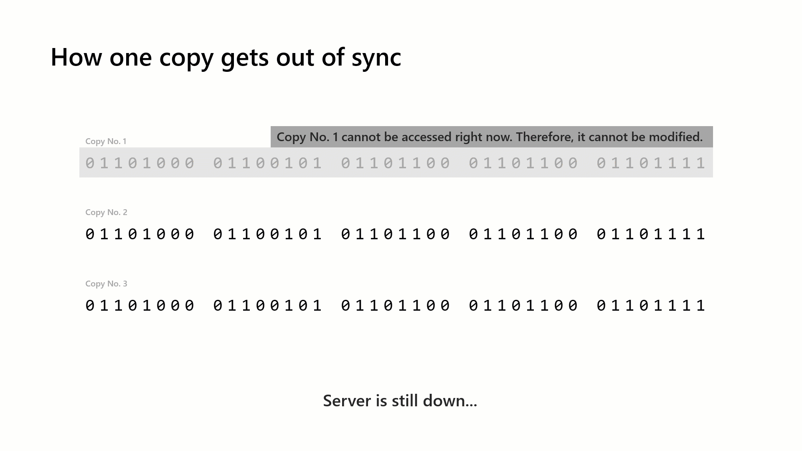
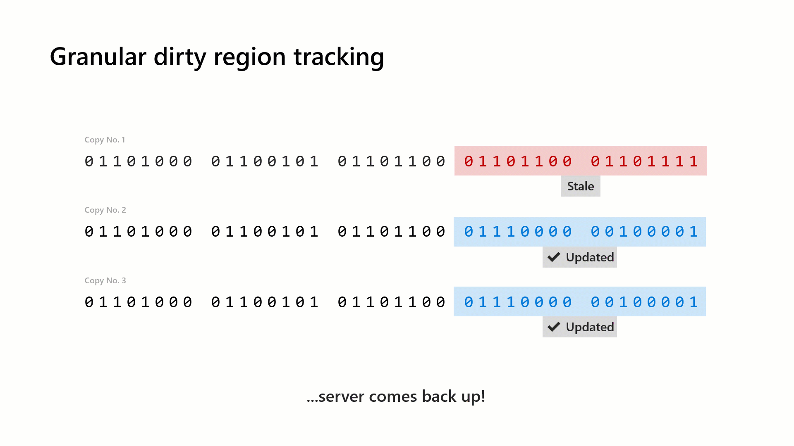
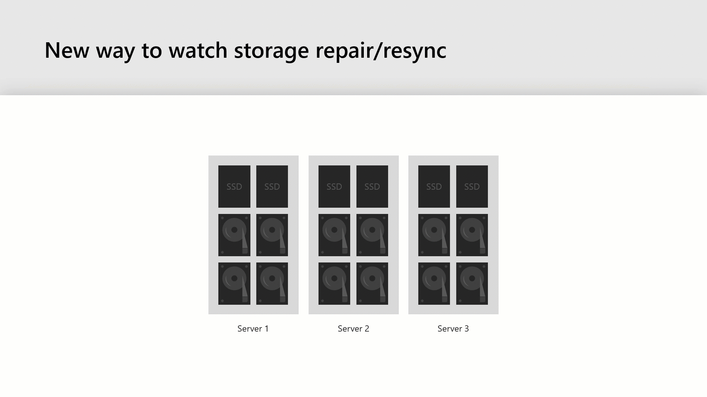

# Understand and monitor storage resync

>Applies to: Windows Server 2019

Storage resync alerts are a new capability of [Storage Spaces Direct](storage-spaces-direct-overview.md) in Windows Server 2019 that allows the Health Service to throw a fault when your storage is resyncing. The alert is useful in notifying you when resync is happening, so that you don't accidentally take more servers down (which could cause multiple fault domains to be affected, resulting in your cluster going down). 

This topic provides background and steps to understand and see storage resync in a Windows Server failover cluster with Storage Spaces Direct.

## Understanding resync

Let's start with a simple example to understand how storage gets out of sync. Keep in mind that any shared-nothing (local drives only) distributed storage solution exhibits this behavior. As you will see below, if one server node goes down, then its drives won't be updated until it comes back online - this is true for any hyper-converged architecture. 

Suppose that we want to store the string "HELLO". 


Asssuming that we have three-way mirror resiliency, we have three copies of this string. Now, if we take server #1 down temporarily (for maintanence), then we cannot access copy #1.


Suppose we update our string from "HELLO" to "HELP!" at this time.


Once we update the string, copy #2 and #3 will be successfully updated. However, copy #1 still cannot be accessed because server #1 is down temporarily (for maintanence). 



Now, we have copy #1 which has data that is out of sync. The operating system uses granular dirty region tracking to keep track of the bits that are out of sync. This way when server #1 comes back online, we can sync the changes by reading the data from copy #2 or #3 and overwriting the data in copy #1. The advantages of this approach are that we only need to copy over the data that is stale, rather than resyncing all of the data from server #2 or server #3.



So, this explains how data gets out of sync. But what does this look like at a high level? Assume for this example that we have a three server hyper-converged cluster. When server #1 is in maintenance, you will see it as being down. When you bring server #1 back up, it will start resyncing all of its storage using the granular dirty region tracking (explained above). Once the data is all back in sync, all servers will be shown as up.



## How to monitor storage resync in Windows Server 2019

Now that you understand how storage resync works, let's look at how this shows up in Windows Server 2019. We have added a new fault to the [Health Service](../../failover-clustering/health-service-overview.md) that will show up when your storage is resyncing.

To view this fault in PowerShell, run:

``` PowerShell
Get-HealthFault
```

This is a new fault in Windows Server 2019, and will appear in PowerShell, in the cluster validation report, and anywhere else that builds on Health faults. 

To get a deeper view, you can query the time series database in PowerShell as follows:

```PowerShell
Get-ClusterNode | Get-ClusterPerf -ClusterNodeSeriesName ClusterNode.Storage.Degraded
```
Here's some example output:

```
Object Description: ClusterNode Server1

Series                       Time                Value Unit
------                       ----                ----- ----
ClusterNode.Storage.Degraded 01/11/2019 16:26:48     214 GB
```

Notably, Windows Admin Center uses Health faults to set the status and color of cluster nodes. So, this new fault will cause cluster nodes to transition from red (down) to yellow (resyncing) to green (up), instead of going straight from red to green, on the HCI Dashboard.


By showing the overall storage resync progress, you can accurately know how much data is out of sync and whether your system is making forward progress. When you open Windows Admin Center and go to the *Dashboard*, you will see the new alert as follows:


The alert is useful in notifying you when resync is happening, so that you don't accidentally take more servers down (which could cause multiple fault domains to be affected, resulting in your cluster going down). 

If you navigate to the *Servers* page in Windows Admin Center, click on *Inventory*, and then choose a specific server, you can get a more detailed view of how this storage resync looks on a per-server basis. If you navigate to your server and look at the *Storage* chart, you will see the amount of data that needs to be repaired in a *purple* line with exact number right above. This amount will increase when the server is down (more data needs to be resynced), and gradually decrease when the server comes back online (data is being synced). When the amount of data that needs to be repair is 0, your storage is done resyncing - you are now free to take a server down if you need to. A screenshot of this experience in Windows Admin Center is shown below:


## How to see storage resync in Windows Server 2016

As you can see, this alert is particularly helpful in getting a holistic view of what is happening at the storage layer. It effectively summarizes the information that you can get from the Get-StorageJob cmdlet, which returns information about long-running Storage module jobs, such as a repair operation on a storage space. An example is shown below:

```PowerShell
Get-StorageJob
```

Here's example output:

```
Name                  ElapsedTime           JobState              PercentComplete       IsBackgroundTask
----                  -----------           --------              ---------------       ----------------
Regeneration          00:01:19              Running               50                    True

```

This view is a lot more granular since the storage jobs listed are per volume, you can see the list of jobs that are running, and you can track their individual progress. This cmdlet works on both Windows Server 2016 and 2019.

## See also

- [Taking a server offline for maintenance](maintain-servers.md)
- [Storage Spaces Direct overview](storage-spaces-direct-overview.md)