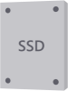
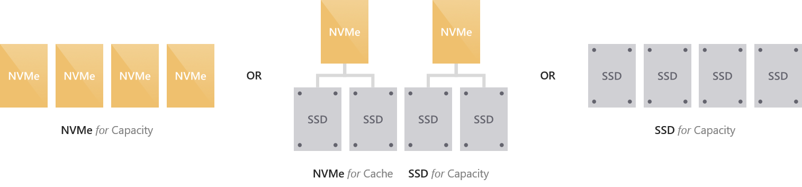
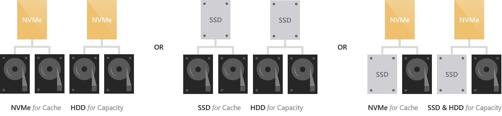
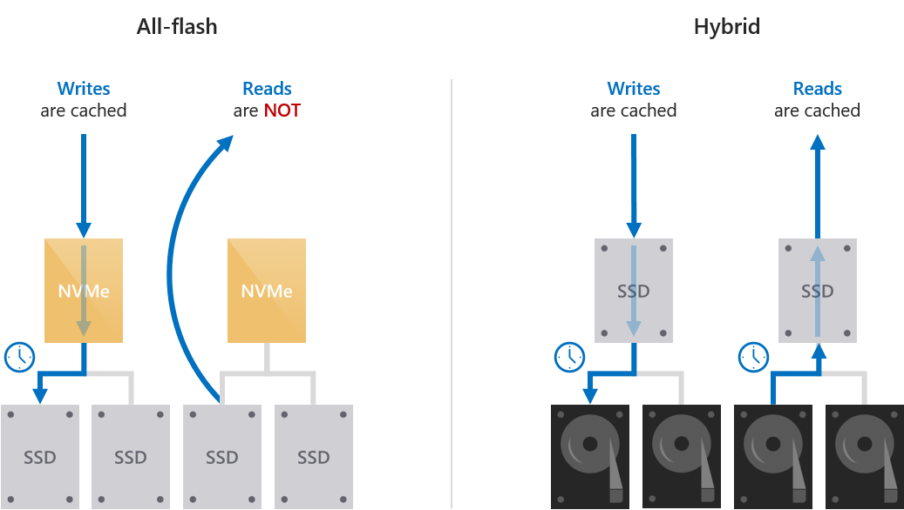
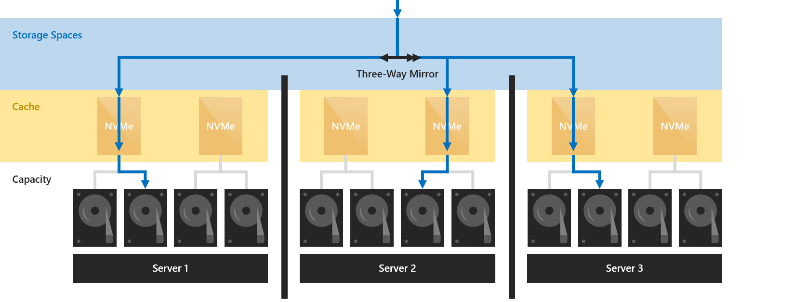
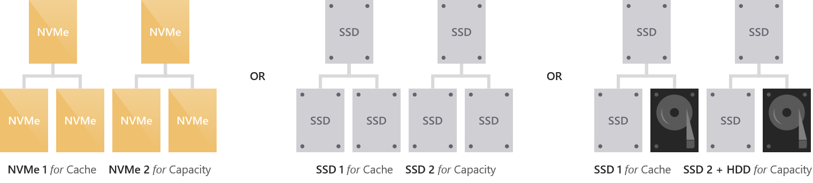
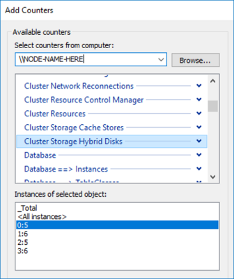

# Understanding the cache in Storage Spaces Direct

>Applies to: Windows Server 2019, Windows Server 2016

[Storage Spaces Direct](storage-spaces-direct-overview.md) features a built-in server-side cache to maximize storage performance. It is a large, persistent, real-time read *and* write cache. The cache is configured automatically when Storage Spaces Direct is enabled. In most cases, no manual management whatsoever is required.
How the cache works depends on the types of drives present.

The following video goes into details on how caching works for Storage Spaces Direct, as well as other design considerations.

<strong>Storage Spaces Direct design considerations</strong><br>(20 minutes)<br>
<iframe src="https://channel9.msdn.com/Blogs/windowsserver/Design-Considerations-for-Storage-Spaces-Direct/player" width="960" height="540" allowFullScreen frameBorder="0"></iframe>

## Drive types and deployment options

Storage Spaces Direct currently works with three types of storage devices:

<table>
	<tr style="border: 0;">
		<td style="padding: 10px; border: 0; width:70px">
			
		</td>
		<td style="padding: 10px; border: 0;" valign="middle">
			NVMe (Non-Volatile Memory Express)
		</td>
	</tr>
	<tr style="border: 0;">
		<td style="padding: 10px; border: 0; width:70px">
			
		</td>
		<td style="padding: 10px; border: 0;" valign="middle">
			SATA/SAS SSD (Solid-State Drive)
		</td>
	</tr>
	<tr style="border: 0;">
		<td style="padding: 10px; border: 0; width:70px">
			
		</td>
		<td style="padding: 10px; border: 0;" valign="middle">
			HDD (Hard Disk Drive)
		</td>
	</tr>
</table>

These can be combined in six ways, which we group into two categories: "all-flash" and "hybrid".

### All-flash deployment possibilities

All-flash deployments aim to maximize storage performance and do not include rotational hard disk drives (HDD).



### Hybrid deployment possibilities

Hybrid deployments aim to balance performance and capacity or to maximize capacity and do include rotational hard disk drives (HDD).



## Cache drives are selected automatically

In deployments with multiple types of drives, Storage Spaces Direct automatically uses all drives of the "fastest" type for caching. The remaining drives are used for capacity.

Which type is "fastest" is determined according to the following hierarchy.


For example, if you have NVMe and SSDs, the NVMe will cache for the SSDs.

If you have SSDs and HDDs, the SSDs will cache for the HDDs.

   >[!NOTE]
   > Cache drives do not contribute usable storage capacity. All data stored in the cache is also stored elsewhere, or will be once it de-stages. This means the total raw storage capacity of your deployment is the sum of your capacity drives only.

When all drives are of the same type, no cache is configured automatically. You have the option to manually configure higher-endurance drives to cache for lower-endurance drives of the same type – see the [Manual configuration](#manual-configuration) section to learn how.

   >[!TIP]
   > In all-NVMe or all-SSD deployments, especially at very small scale, having no drives "spent" on cache can improve storage efficiency meaningfully.

## Cache behavior is set automatically

The behavior of the cache is determined automatically based on the type(s) of drives that are being cached for. When caching for solid-state drives (such as NVMe caching for SSDs), only writes are cached. When caching for hard disk drives (such as SSDs caching for HDDs), both reads and writes are cached.



### Write-only caching for all-flash deployments

When caching for solid-state drives (NVMe or SSDs), only writes are cached. This reduces wear on the capacity drives because many writes and re-writes can coalesce in the cache and then de-stage only as needed, reducing the cumulative traffic to the capacity drives and extending their lifetime. For this reason, we recommend selecting [higher-endurance, write-optimized](http://whatis.techtarget.com/definition/DWPD-device-drive-writes-per-day) drives for the cache. The capacity drives may reasonably have lower write endurance.

Because reads do not significantly affect the lifespan of flash, and because solid-state drives universally offer low read latency, reads are not cached: they are served directly from the capacity drives (except when the data was written so recently that it has not yet been de-staged). This allows the cache to be dedicated entirely to writes, maximizing its effectiveness.

This results in write characteristics, such as write latency, being dictated by the cache drives, while read characteristics are dictated by the capacity drives. Both are consistent, predictable, and uniform.

### Read/write caching for hybrid deployments

When caching for hard disk drives (HDDs), both reads *and* writes are cached, to provide flash-like latency (often ~10x better) for both. The read cache stores recently and frequently read data for fast access and to minimize random traffic to the HDDs. (Because of seek and rotational delays, the latency and lost time incurred by random access to an HDD is significant.) Writes are cached to absorb bursts and, as before, to coalesce writes and re-writes and minimize the cumulative traffic to the capacity drives.

Storage Spaces Direct implements an algorithm that de-randomizes writes before de-staging them, to emulate an IO pattern to disk that seems sequential even when the actual IO coming from the workload (such as virtual machines) is random. This maximizes the IOPS and throughput to the HDDs.

### Caching in deployments with drives of all three types

When drives of all three types are present, the NVMe drives provides caching for both the SSDs and the HDDs. The behavior is as described above: only writes are cached for the SSDs, and both reads and writes are cached for the HDDs. The burden of caching for the HDDs is distributed evenly among the cache drives. 

## Summary

This table summarizes which drives are used for caching, which are used for capacity, and what the caching behavior is for each deployment possibility.

| Deployment     | Cache drives                        | Capacity drives | Cache behavior (default)  |
| -------------- | ----------------------------------- | --------------- | ------------------------- |
| All NVMe         | None (Optional: configure manually) | NVMe            | Write-only (if configured)  |
| All SSD          | None (Optional: configure manually) | SSD             | Write-only (if configured)  |
| NVMe + SSD       | NVMe                                | SSD             | Write-only                  |
| NVMe + HDD       | NVMe                                | HDD             | Read + Write                |
| SSD + HDD        | SSD                                 | HDD             | Read + Write                |
| NVMe + SSD + HDD | NVMe                                | SSD + HDD       | Read + Write for HDD, Write-only for SSD  |

## Server-side architecture

The cache is implemented at the drive level: individual cache drives within one server are bound to one or many capacity drives within the same server.

Because the cache is below the rest of the Windows software-defined storage stack, it does not have nor need any awareness of concepts such as Storage Spaces or fault tolerance. You can think of it as creating "hybrid" (part flash, part disk) drives which are then presented to Windows. As with an actual hybrid drive, the real-time movement of hot and cold data between the faster and slower portions of the physical media is nearly invisible to the outside.

Given that resiliency in Storage Spaces Direct is at least server-level (meaning data copies are always written to different servers; at most one copy per server), data in the cache benefits from the same resiliency as data not in the cache.



For example, when using three-way mirroring, three copies of any data are written to different servers, where they land in cache. Regardless of whether they are later de-staged or not, three copies will always exist.

## Drive bindings are dynamic

The binding between cache and capacity drives can have any ratio, from 1:1 up to 1:12 and beyond. It adjusts dynamically whenever drives are added or removed, such as when scaling up or after failures. This means you can add cache drives or capacity drives independently, whenever you want.


We recommend making the number of capacity drives a multiple of the number of cache drives, for symmetry. For example, if you have 4 cache drives, you will experience more even performance with 8 capacity drives (1:2 ratio) than with 7 or 9.

## Handling cache drive failures

When a cache drive fails, any writes which have not yet been de-staged are lost *to the local server*, meaning they exist only on the other copies (in other servers). Just like after any other drive failure, Storage Spaces can and does automatically recover by consulting the surviving copies.

For a brief period, the capacity drives which were bound to the lost cache drive will appear unhealthy. Once the cache rebinding has occurred (automatic) and the data repair has completed (automatic), they will resume showing as healthy.

This scenario is why at minimum two cache drives are required per server to preserve performance.


You can then replace the cache drive just like any other drive replacement.

   >[!NOTE]
   > You may need to power down to safely replace NVMe that is Add-In Card (AIC) or M.2 form factor.

## Relationship to other caches

There are several other unrelated caches in the Windows software-defined storage stack. Examples include the Storage Spaces write-back cache and the Cluster Shared Volume (CSV) in-memory read cache.

With Storage Spaces Direct, the Storage Spaces write-back cache should not be modified from its default behavior. For example, parameters such as **-WriteCacheSize** on the **New-Volume** cmdlet should not be used.

You may choose to use the CSV cache, or not – it's up to you. It is off by default in Storage Spaces Direct, but it does not conflict with the new cache described in this topic in any way. In certain scenarios it can provide valuable performance gains. For more information, see [How to Enable CSV Cache](../../failover-clustering/failover-cluster-csvs.md#enable-the-csv-cache-for-read-intensive-workloads-optional).

## Manual configuration

For most deployments, manual configuration is not required. In case you do need it, see the following sections. 

If you need to make changes to the cache device model after setup, edit the Health Service's Support Components Document, as described in [Health Service overview](../../failover-clustering/health-service-overview.md#supported-components-document).

### Specify cache drive model

In deployments where all drives are of the same type, such as all-NVMe or all-SSD deployments, no cache is configured because Windows cannot distinguish characteristics like write endurance automatically among drives of the same type.

To use higher-endurance drives to cache for lower-endurance drives of the same type, you can specify which drive model to use with the **-CacheDeviceModel** parameter of the **Enable-ClusterS2D** cmdlet. Once Storage Spaces Direct is enabled, all drives of that model will be used for caching.

   >[!TIP]
   > Be sure to match the model string exactly as it appears in the output of **Get-PhysicalDisk**.

####  Example

First, get a list of physical disks:

```PowerShell
Get-PhysicalDisk | Group Model -NoElement
```

Here's some example output:

```
Count Name
----- ----
    8 FABRIKAM NVME-1710
   16 CONTOSO NVME-1520
```

Then enter the following command, specifying the cache device model:

```PowerShell
Enable-ClusterS2D -CacheDeviceModel "FABRIKAM NVME-1710"
```

You can verify that the drives you intended are being used for caching by running **Get-PhysicalDisk** in PowerShell and verifying that their **Usage** property says **"Journal"**.

### Manual deployment possibilities

Manual configuration enables the following deployment possibilities:



### Set cache behavior

It is possible to override the default behavior of the cache. For example, you can set it to cache reads even in an all-flash deployment. We discourage modifying the behavior unless you are certain the default does not suit your workload.

To override the behavior, use **Set-ClusterStorageSpacesDirect** cmdlet and its **-CacheModeSSD** and **-CacheModeHDD** parameters. The **CacheModeSSD** parameter sets the cache behavior when caching for solid-state drives. The **CacheModeHDD** parameter sets cache behavior when caching for hard disk drives. This can be done at any time after Storage Spaces Direct is enabled.

You can use **Get-ClusterStorageSpacesDirect** to verify the behavior is set.

#### Example

First, get the Storage Spaces Direct settings:

```PowerShell
Get-ClusterStorageSpacesDirect
```

Here's some example output:

```
CacheModeHDD : ReadWrite
CacheModeSSD : WriteOnly
```

Then, do the following:

```PowerShell
Set-ClusterStorageSpacesDirect -CacheModeSSD ReadWrite

Get-ClusterS2D
```

Here's some example output:

```
CacheModeHDD : ReadWrite
CacheModeSSD : ReadWrite
```

## Sizing the cache

The cache should be sized to accommodate the working set (the data being actively read or written at any given time) of your applications and workloads.

This is especially important in hybrid deployments with hard disk drives. If the active working set exceeds the size of the cache, or if the active working set drifts too quickly, read cache misses will increase and writes will need to be de-staged more aggressively, hurting overall performance.

You can use the built-in Performance Monitor (PerfMon.exe) utility in Windows to inspect the rate of cache misses. Specifically, you can compare the **Cache Miss Reads/sec** from the **Cluster Storage Hybrid Disk** counter set to the overall read IOPS of your deployment. Each "Hybrid Disk" corresponds to one capacity drive.

For example, 2 cache drives bound to 4 capacity drives results in 4 "Hybrid Disk" object instances per server.



There is no universal rule, but if too many reads are missing the cache, it may be undersized and you should consider adding cache drives to expand your cache. You can add cache drives or capacity drives independently whenever you want.

## See also

- [Choosing drives and resiliency types](choosing-drives.md)
- [Fault tolerance and storage efficiency](storage-spaces-fault-tolerance.md)
- [Storage Spaces Direct hardware requirements](storage-spaces-direct-hardware-requirements.md)
