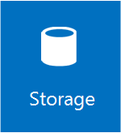

# Storage in Windows Server 2016
>Applies To: Windows Server 2016

 Storage in Windows Server 2016 provides new and improved features for software-defined datacenter (SDDC) customers focusing on virtualized workloads. Windows Server also provides extensive support for enterprise customers using file servers with existing workloads. 

To find out about what's new in storage, see [What's new in storage](whats-new-in-storage.md) and [What's new in Failover Clustering](../virtualization/failover-clustering/whats-new-in-failover-clustering.md).

For an overview of storage technologies included in Windows Server, see the following list (categorized by workload).

## Software-defined storage for virtualized workloads

### [Storage Spaces](storage-spaces/storage-spaces-direct-overview.md) (including the new Storage Spaces Direct)

Storage Spaces now includes support for Storage Spaces Direct - a new architecture for Storage Spaces clusters that uses directly attached local storage - including SATA and NVME devices. Other enhancements include the ability to optimize disk usage after adding new physical disks and faster virtual disk repair times.

### [Storage Replica](storage-replica/storage-replica-overview.md) (new)

Storage Replica enables storage-agnostic, block-level, synchronous replication between clusters or servers for disaster preparedness and recovery, as well as stretching of a failover cluster across sites for high availability. Synchronous replication enables mirroring of data in physical sites with crash-consistent volumes, ensuring zero data loss at the file system level. Asynchronous replication allows site extension beyond metropolitan ranges.

### [Storage QoS](storage-qos/storage-qos-overview.md) (new)

Storage Quality of Service (QoS) provides a way to centrally monitor and manage storage performance for virtual machines using Hyper-V and the Scale-Out File Server roles. The feature automatically improves storage resource fairness between multiple virtual machines using the same file server cluster and allows specific minimum and maximum performance goals to be configured in units of normalized IOPs.

### [Data Deduplication](data-deduplication/overview.md)

Data Deduplication is a feature of Windows Server 2016 that can help reduce the impact of redundant data on storage costs. When enabled, Data Deduplication optimizes free space on a volume by examining the data on the volume for duplication. Once identified, duplicated portions of the volume's dataset are stored once and are (optionally) compressed for additional savings. Data Deduplication optimizes redundancies without compromise data fidelity or integrity.

## General-purpose file servers

### [Work Folders](work-folders/work-folders-overview.md)

With Work Folders users can store and access work files on personal computers and devices, often referred to as bring-your-own device (BYOD), in addition to corporate PCs. Users gain a convenient location to store work files, and they can access them from anywhere. Organizations maintain control over corporate data by storing the files on centrally managed file servers, and optionally specifying user device policies such as encryption and lock-screen passwords.

### [Offline Files, Folder Redirection, and Roaming User Profiles](https://technet.microsoft.com/library/hh848267(v=ws.11).aspx)

Folder Redirection and Offline Files are used together to redirect the path of local folders (such as the Documents folder) to a network location, while caching the contents locally for increased speed and availability. Roaming User Profiles is used to redirect a user profile to a network location.  

### [DFS Replication](https://technet.microsoft.com/library/jj127250(v=ws.11).aspx)

Enables you to efficiently replicate folders (including those referred to by a DFS namespace path) across multiple servers and sites. DFS Replication uses a compression algorithm known as remote differential compression (RDC). RDC detects changes to the data in a file, and it enables DFS Replication to replicate only the changed file blocks instead of the entire file.

### [DFS Namespaces](https://technet.microsoft.com/library/jj127250(v=ws.11).aspx)

Enables you to group shared folders that are located on different servers into one or more logically structured namespaces. Each namespace appears to users as a single shared folder with a series of subfolders. However, the underlying structure of the namespace can consist of numerous file shares that are located on different servers and in multiple sites.

### [File Classification](https://technet.microsoft.com/library/dd758765(v=ws.10).aspx)

File Classification, also known as File Classification Infrastructure (FCI) provides insight into your data by automating classification processes so that you can manage your data more effectively. You can classify files and apply policies based on this classification. Example policies include dynamic access control for restricting access to files, file encryption, and file expiration. Files can be classified automatically by using file classification rules or manually by modifying the properties of a selected file or folder.

### [File Screens](https://technet.microsoft.com/library/dd758760(v=ws.10).aspx) 

File screens help you control the types of files that user can store on a file server. You can limit the extension that can be stored on your shared files. For example, you can create a file screen that does not allow files with an MP3 extension to be stored in personal shared folders on a file server. 

### [File Management Tasks](https://technet.microsoft.com/en-us/library/dd758756(v=ws.10).aspx)

File Management Tasks enables you to apply a conditional policy or action to files based on their classification. The conditions of a file management task include the file location, the classification properties, the date the file was created, the last modified date of the file, or the last time the file was accessed. The actions that a file management task can take include the ability to expire files, encrypt files, or run a custom command.

### [Quotas](https://technet.microsoft.com/en-us/library/dd758768(v=ws.10).aspx) 
Quotas allow you to limit the space that is allowed for a volume or folder, and they can be automatically applied to new folders that are created on a volume. You can also define quota templates that can be applied to new volumes or folders.

### [Storage Reports](https://technet.microsoft.com/library/dd758755(v=ws.10).aspx)

Storage reports are used to help you identify trends in disk usage and how your data is classified. You can also monitor a selected group of users for attempts to save unauthorized files.

### [iSCSI Target Server](https://technet.microsoft.com/library/hh848272(v=ws.11).aspx)

iSCSI Target Server provides block storage to other servers and applications on the network by using the Internet SCSI (iSCSI) standard.

### [iSCSI Target Boot](iscsi/iscsi-boot-overview.md)

iSCSI Target Server in Windows Server can boot hundreds of computers from a single operating system image that is stored in a centralized location. This improves efficiency, manageability, availability, and security.

## File systems, protocols, etc.

### [ReFS](https://technet.microsoft.com/library/hh831724(v=ws.11).aspx)

ReFS is a resilient file system that maximizes data availability, scales efficiently to very large data sets across diverse workloads, and provides data integrity by means of resiliency to corruption (regardless of software or hardware failures).

### [SMB](https://technet.microsoft.com/library/hh831795(v=ws.11).aspx)

The Server Message Block (SMB) protocol is a network file sharing protocol that allows applications on a computer to read and write to files and to request services from server programs in a computer network. The SMB protocol can be used on top of its TCP/IP protocol or other network protocols. Using the SMB protocol, an application (or the user of an application) can access files or other resources at a remote server. This allows applications to read, create, and update files on the remote server. It can also communicate with any server program that is set up to receive an SMB client request.

### [Storage-class memory](storage-spaces/Storage-class-memory-health.md)

Storage-class memory such as NVDIMM-N devices provide performance similar to computer memory (really fast), but with the data persistence of normal storage drives. Windows treats storage-class memory similary to normal drives (just faster), but there are some differences in the way device health is managed.

### [BitLocker](https://technet.microsoft.com/library/cc766295(v=ws.10).aspx)

BitLocker Drive Encryption stores data on volumes in an encrypted format, even if the computer is tampered with or when the operating system is not running. This helps protect against offline attacks, attacks made by disabling or circumventing the installed operating system, or made by physically removing the hard drive to attack the data separately.

### [NTFS](https://technet.microsoft.com/library/dn466522(v=ws.11).aspx) 

NTFS—the primary file system for recent versions of Windows and Windows Server—provides a full set of features including security descriptors, encryption, disk quotas, and rich metadata, and can be used with Cluster Shared Volumes (CSV) to provide continuously available volumes that can be accessed simultaneously from multiple nodes of a Failover Cluster.

### [NFS](https://technet.microsoft.com/library/jj592688(v=ws.11).aspx)

Network File System (NFS) provides a file sharing solution for enterprises that have heterogeneous environments that consist of both Windows and non-Windows computers.

## See also
* [PowerShell cmdlets in Windows Server 2016 and Windows 10](https://technet.microsoft.com/library/mt156917.aspx)
* [What's new in storage](whats-new-in-storage.md)
* [What's new in Failover Clustering](../virtualization/failover-clustering/whats-new-in-failover-clustering.md)
* [Azure Storage](https://azure.microsoft.com/en-us/documentation/services/storage/)
* [Azure StorSimple](https://www.microsoft.com/en-us/cloud-platform/azure-storsimple)
