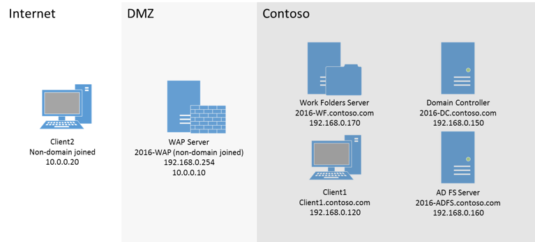

# Deploy Work Folders with AD FS and Web Application Proxy: Overview

>Applies to: Windows Server (Semi-Annual Channel), Windows Server 2016

The topics in this section provide instructions for deploying Work Folders with Active Directory Federation Services (AD FS) and Web Application Proxy. The instructions are designed to help you create a complete functioning Work Folders setup with client machines that are ready to start using Work Folders either on-premises or over the Internet.  
  
Work Folders is a component introduced in Windows Server 2012 R2 that allows information workers to sync work files between their devices. For more information about Work Folders, see [Work Folders Overview](Work-Folders-Overview.md).  
  
To enable users to sync their Work Folders across the Internet, you need to publish Work Folders through a reverse proxy, making Work Folders available externally on the Internet. Web Application Proxy, which is included in AD FS, is one option that you can use to provide reverse proxy functionality. Web Application Proxy pre-authenticates access to the Work Folders web application by using AD FS, so that users on any device can access Work Folders from outside the corporate network. 

> [!NOTE]
>   The instructions covered in this section are for a Windows Server 2016 environment. If you're using Windows Server 2012 R2, follow the [Windows Server 2012 R2 instructions](https://technet.microsoft.com/library/dn747208(v=ws.11).aspx).
  
These topics provide the following:  
  
-   Step-by-step instructions for setting up and deploying Work Folders with AD FS and Web Application Proxy via the Windows Server user interface. The instructions describe how to set up a simple test environment with self-signed certificates. You can then use the test example as a guide to help you create a production environment that uses publicly trusted certificates.  
  
## Prerequisites  
To follow the procedures and examples in these topics, you need to have the following components ready:  
  
-   An Active Directory® Domain Services forest with schema extensions in Windows Server 2012 R2 to support automatic referral of PCs and devices to the correct file server when you are using multiple file servers. It is preferable that DNS be enabled in the forest, but this is not required.  
  
-   A domain controller: A server that has the AD DS role enabled, and is configured with a domain (for the test example, contoso.com).  
  
    A domain controller running at least Windows Server 2012 R2 is needed in order to support device registration for Workplace Join. If you don't want to use Workplace Join, you can run Windows Server 2012 on the domain controller.  
  
-   Two servers that are joined to the domain (e.g., contoso.com) and that are running Windows Server 2016. One server will be for used for AD FS, and the other will be used for Work Folders.  
  
-   One server that is not domain joined and that is running Windows Server 2016. This server will run Web Application Proxy, and it must have one network card for the network domain (e.g., contoso.com) and another network card for the external network.  
  
-   One domain-joined client computer that is running Windows 7 or later.  
  
-   One non-domain-joined client computer that is running Windows 7 or later.  
  
For the test environment that we're covering in this guide, you should have the topology that is shown in the following diagram. The computers can be physical machines or virtual machines (VMs). 
  

## Deployment overview  
In this group of topics, you'll walk through a step-by-step example of setting up AD FS, Web Application Proxy, and Work Folders in a test environment. The components will be set up in this order:  
  
1.  AD FS  
  
2.  Work Folders  
  
3.  Web Application Proxy  
  
4.  The domain-joined workstation and non-domain-joined workstation  
  
You will also use a Windows PowerShell Script to create self-signed certificates.  
  
## Deployment steps  
To perform the deployment by using the Windows Server user interface, follow the steps in these topics:  
  
-   [Deploy Work Folders with AD FS and Web Application Proxy: Step 1, Set Up AD FS](deploy-work-folders-adfs-step1.md)  
  
-   [Deploy Work Folders with AD FS and Web Application Proxy: Step 2, AD FS Post-Configuration Work](deploy-work-folders-adfs-step2.md)  
  
-   [Deploy Work Folders with AD FS and Web Application Proxy: Step 3, Set Up Work Folders](deploy-work-folders-adfs-step3.md)  
  
-   [Deploy Work Folders with AD FS and Web Application Proxy: Step 4, Set Up Web Application Proxy](deploy-work-folders-adfs-step4.md)  
  
-   [Deploy Work Folders with AD FS and Web Application Proxy: Step 5, Set Up Clients](deploy-work-folders-adfs-step5.md)  

## See Also  
[Work Folders Overview](Work-Folders-Overview.md)  
[Designing a Work Folders Implementation](Plan-Work-Folders.md)  
[Deploying Work Folders](Deploy-Work-Folders.md)  
  

