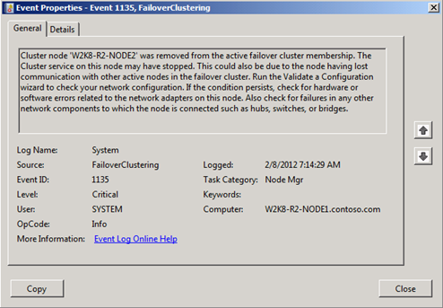
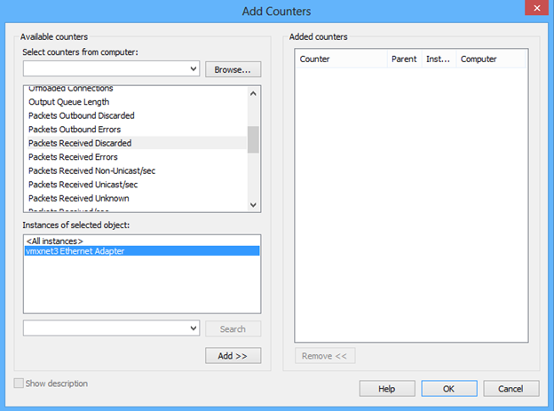

# Nodes being removed from Failover Cluster membership on VMWare ESX

This article addresses the issue of finding nodes removed from active failover cluster membership when the nodes are hosted on VMWare ESX.

## Symptom

When the issue occurs, you will see in the System Event Log of the Event Viewer:

## Resolution

One specific problem is with the VMXNET3 adapters dropping inbound network packets because the inbound buffer is set too low to handle large amounts of traffic. We can easily find out if this is a problem by using Performance Monitor to look at the “Network Interface\Packets Received Discarded” counter.

Once you have added this counter, look at the Average, Minimum, and Maximum numbers and if they are any value higher than zero, then the receive buffer needs to be adjusted up for the adapter. This problem is documented in VMWare’s Knowledge Base: [Large packet loss at the guest OS level on the VMXNET3 vNIC in ESXi 5.x / 4.x](https://kb.vmware.com/s/article/2039495).
