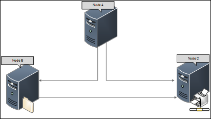
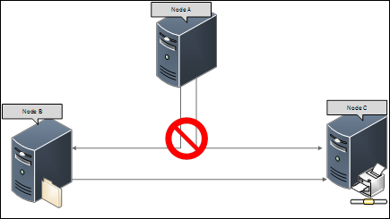
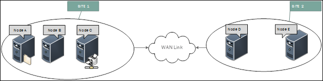
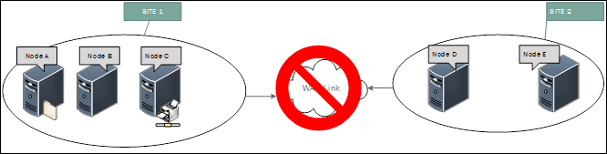
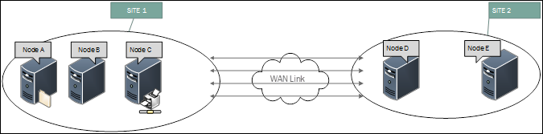
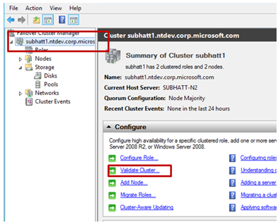
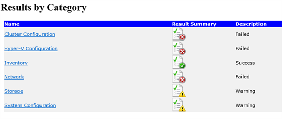
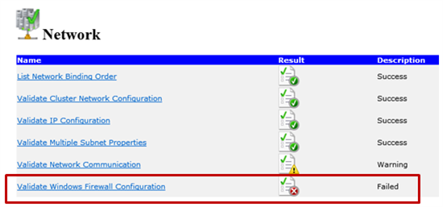
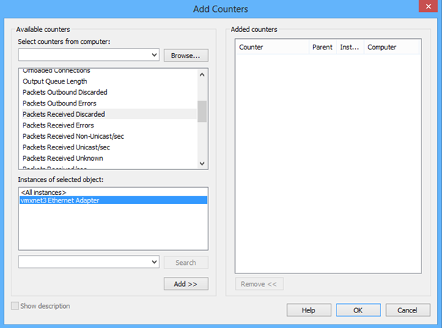

# Troubleshooting cluster issue with Event ID 1135

This article helps you diagnose and resolve Event ID 1135, which may be logged during the startup of the Cluster service in Failover Clustering environment.

## Start Page

Event ID 1135 indicates that one or more Cluster nodes were removed from the active failover cluster membership. It may be accompanied by the following symptoms:

- Cluster Failover\nodes being removed from active Failover Cluster membership:
 [Having a problem with nodes being removed from active Failover Cluster membership](/problem-nodes-failover-cluster.md)
- Event ID 1069
 [Event ID 1069 — Clustered Service or Application Availability](/previous-versions/windows/it-pro/windows-server-2008-R2-and-2008/cc756225(v=ws.10))
- Event ID 1177 for Quorum loss
 [Event ID 1177 — Quorum and Connectivity Needed for Quorum](/previous-versions/windows/it-pro/windows-server-2008-R2-and-2008/cc773498(v=ws.10))
- Event ID 1006 for Cluster service halted:
 [Event ID 1006 — Cluster Service Startup](/previous-versions/windows/it-pro/windows-server-2008-R2-and-2008/cc773418(v=ws.10))

A validation and the network tests would be recommended as one of the initial troubleshooting steps to ensure there are no configuration issues that might be a cause for problems.

### Check if installed the recommended hot fixes

The Cluster service is the essential software component that controls all aspects of failover cluster operation and manages the cluster configuration database. If you see the event ID 1135, Microsoft recommends you to install the fixes mentioned in the below KB articles and reboot all the nodes of the cluster, then observe if issue reoccurs.

- [Hotfix for Windows Server 2012 R2](https://support.microsoft.com/help/2920151)
- [Hotfix for Windows Server 2012](https://support.microsoft.com/help/2784261)
- [Hotfix for Windows Server 2008 R2](https://support.microsoft.com/help/2545685)

### Check if the cluster service running on all the nodes

Follow the following command according to your Windows operation system to validate that cluster service is continuously running and available.

#### For Windows Server 2008 R2 cluster

from elevated cmd prompt run: **cluster.exe node /stat**

#### For Windows Server 2012\ and Windows Server 2012 R2 cluster

run PS command: **cluster node /status**

Is the cluster service continuously running and available on all the nodes?

## Solution for cluster service is failing

If cluster service is failing, troubleshoot using this article: [Windows Server 2008 and 2008R2 Failover Cluster Startup Switches](/archive/blogs/askcore/windows-server-2008-and-2008r2-failover-cluster-startup-switches).


## Several scenarios of Event ID 1135

We want you to take a closer look on at the System Event logs on all the nodes of your cluster. Review the Event ID 1135 that you are seeing on the nodes and copy all the instances of this event. This will make it convenient for you to look at them and review.

```console
Event ID 1135
Cluster node ' **NODE A** ' was removed from the active failover cluster membership. The Cluster service on this node may have stopped. This could also be due to the node having lost communication with other active nodes in the failover cluster. Run the Validate a Configuration wizard to check your network configuration. If the condition persists, check for hardware or software errors related to the network adapters on this node. Also check for failures in any other network components to which the node is connected such as hubs, switches, or bridges.
```

There are three typical scenarios:

### Scenario A

You are looking at all the Events and all the nodes in the cluster are indicating that NODE A had lost communication.




It could be possible that when you are seeing the system logs on NODE A, it has events for all the remaining nodes in the cluster.

#### Solution

This quite suggests that at the time of issue, either due to network congestion or otherwise the communication to the NODE A was lost.

You should review and validate the Network configuration and communication issues. Remember to look for issues pertaining to Node A.

### Scenario B

You are looking at the Events on the nodes and let us say that your cluster is dispersed across two sites. NODE A, NODE B, and NODE C at Site 1 and NODE D & NODE E at Site 2.



On Nodes A,B, and C, you see that the events that are logged are for connectivity to Nodes D & E. Similarly, when you see the events on Nodes D & E, the events suggest that we lost communication with A, B, and C.



#### Solution

If you see similar activity, it is indicative that there was a communication failure, over the link that connects these sites. We would recommend that you review the connection across the sites, if this is over a WAN connection, we would suggest that you verify with your ISP about the connectivity.

### Scenario C

You are looking at the Events on the nodes and you see that the names of the nodes do not tally out with any particular pattern. Let us say that your cluster is dispersed across two sites. NODE A, NODE B and NODE C at Site 1 and NODE D & NODE E at Site 2.

- On Node A: You see events for Nodes B, D, E.
- On Node B: You see events for Nodes C, D, E.
- On Node C: You see events for Nodes A, B, E.
- On Node D: You see events for Nodes A, C, E.
- On Node E: You see events for Nodes B, C, D.
- Or any other combinations.



#### Solution

Such events are possible when the network channels between the nodes are choked and the cluster communication messages are not reaching in a timely manner, making the cluster to feel that the communication between the nodes is lost resulting in the removal of nodes from the cluster membership.

## Review Cluster Networks

We would recommend that you review you Cluster Networks by checking the following three options one by one to continue this troubleshooting guide.

### Check for Antivirus Exclusion

Exclude the following file system locations from virus scanning on a server that is running Cluster Services:

- The path of the FileShare Witness

- The *%Systemroot%\Cluster folder*

Configure the real-time scanning component within your antivirus software to exclude the following directories and files:

- Default virtual machine configuration directory (C:\ProgramData\Microsoft\Windows\Hyper-V)

- Custom virtual machine configuration directories

- Default virtual hard disk drive directory (C:\Users\Public\Documents\Hyper-V\Virtual Hard Disks)

- Custom virtual hard disk drive directories

- Custom replication data directories, if you are using Hyper-V Replica

- Snapshot directories

- mms.exe

    > [!NOTE]
    > This file may have to be configured as a process exclusion within the antivirus software.)

- Vmwp.exe

    > [!NOTE]
    > This file may have to be configured as a process exclusion within the antivirus software.

Additionally, when you use Live Migration together with Cluster Shared Volumes, exclude the CSV path *C:\Clusterstorage* and all its subdirectories. If you are troubleshooting failover issues or general problems with a Cluster services and antivirus software is installed, temporarily uninstall the antivirus software or check with the manufacturer of the software to determine whether the antivirus software works with Cluster services. Just disabling the antivirus software is insufficient in most cases. Even if you disable the antivirus software, the filter driver is still loaded when you restart the computer.

### Check for Network Port Configuration in Firewall

The Cluster service controls server cluster operations and manages the cluster database. A cluster is a collection of independent computers that act as a single computer. Managers, programmers, and users see the cluster as a single system. The software distributes data among the nodes of the cluster. If a node fails, other nodes provide the services and data that were formerly provided by the missing node. When a node is added or repaired, the cluster software migrates some data to that node.

System service name: **ClusSvc**

|Application|Protocol|Ports|
|---|---|---|
|Cluster Service|UDP|3343|
|Cluster Service|TCP|3343 (This port is required during a node join operation.)|
|RPC|TCP|135|
|Cluster Admin|UDP|137|
|Kerberos|UDP\TCP|464*|
|SMB|TCP|445|
|Randomly allocated high UDP ports**|UDP|Random port number between 1024 and 65535<br/>Random port number between 49152 and 65535***|
||||

> [!NOTE]
> Additionally, for successful validation on Windows Failover Clusters on Windows Server 2008 and above, allow inbound and outbound traffic for ICMP4, ICMP6.

- For more information, see [Creating a Windows Server 2012 Failover Cluster Fails with Error 0xc000005e](https://support.microsoft.com/help/2830510).

- For more information about how to customize these ports, see [Service overview and network port requirements for Windows](https://support.microsoft.com/help/832017/) in the "References" section.

This is the range in Windows Server 2012, Windows 8, Windows Server 2008 R2, Windows 7, Windows Server 2008, and Windows Vista.

Besides, run the following command to check for Network Port Configuration in Firewall. For example: This command helps determine port 3343 available\open used for Failover Cluster:

```console
netsh advfirewall firewall show rule name="Failover Clusters (UDP-In)" verbose
```

### Run the Cluster Validation report for any errors or warnings

The cluster validation tool runs a suite of tests to verify that your hardware and settings are compatible with failover clustering.

Follow these instructions:

1. Run the Cluster Validation report for any errors or warnings. For more information, see [Understanding Cluster Validation Tests: Network](/previous-versions/windows/it-pro/windows-server-2008-R2-and-2008/cc771323(v=ws.11)?redirectedfrom=MSDN)

    

2. Verify for warnings and errors for Networks. For more information, see [Understanding Cluster Validation Tests: Network](/previous-versions/windows/it-pro/windows-server-2008-R2-and-2008/cc771323(v=ws.11)?redirectedfrom=MSDN).

    
    

#### Check the List Network Binding Order

This test lists the order in which networks are bound to the adapters on each node.

The Adapters and Bindings tab lists the connections in the order in which the connections are accessed by network services. The order of these connections reflects the order in which generic TCP/IP calls/packets are sent on to the wire.

Follow the below steps to change the binding order of network adapters:

1. Click **Start**, click **Run**, type ncpa.cpl, and then click **OK**. You can see the available connections in the **LAN and High-Speed Internet** section of the **Network Connections** window.

2. On the **Advanced** menu, click **Advanced Settings**, and then click the **Adapters and Bindings** tab.

3. In the **Connections** area, select the connection that you want to move higher in the list. Use the arrow buttons to move the connection. As a general rule, the card that talks to the network (domain connectivity, routing to other networks, etc. should be the first bound (top of the list) card.

Cluster nodes are multi-homed systems. Network priority affects DNS Client for outbound network connectivity. Network adapters used for client communication should be at the top in the binding order. Non-routed networks can be placed at lower priority. In Windows Server 2012 and Windows Server2012 R2, the Cluster Network Driver (NETFT.SYS) adapter is automatically placed at the bottom in the binding order list.

#### Check the Validate Network Communication

Latency on your network could also cause this to happen. The packets may not be lost between the nodes, but they may not get to the nodes fast enough before the timeout period expires.

This test validates that tested servers can communicate with acceptable latency on all networks.

For Example: Under Validate Network Communication, you may see following messages for network latency issues.

```console
Succeeded in pinging network interface node003.contoso.com IP Address 192.168.0.2 from network interface node004.contoso.com IP Address 192.168.0.3 with maximum delay 500 after 1 attempt(s).
Either address 10.0.0.96 is not reachable from 192.168.0.2 or **the ping latency is greater than the maximum allowed 2000 ms** This may be expected, since network interfaces node003.contoso.com - Heartbeat Network and node004.contoso.com - Production Network are on different cluster networks
Either address 192.168.0.2 is not reachable from 10.0.0.96 or **the ping latency is greater than the maximum allowed 2000 ms** This may be expected, since network interfaces node004.contoso.com - Production Network and node003.contoso.com - Heartbeat Network for MSCS are on different cluster networks
```

For multi-site cluster, you may increase the time-out values. For more information, see [Configure Heartbeat and DNS Settings in a Multi-Site Failover Cluster](/previous-versions/windows/it-pro/windows-server-2008-R2-and-2008/dd197562(v=ws.10)?redirectedfrom=MSDN).

Check with ISP for any WAN connectivity issues.

Check if you encounter any of the following issues.

##### Network packets lost between nodes

1. Check Packet loss using Performance

    If the packet is lost on the wire somewhere between the nodes, then the heartbeats will fail. We can easily find out if this is a problem by using Performance Monitor to look at the "Network Interface\Packets Received Discarded" counter. Once you have added this counter, look at the Average, Minimum, and Maximum numbers and if they are any value higher than zero, then the receive buffer needs to be adjusted up for the adapter.

    

    If you are experiencing network packet lost on VmWare virtualization platform, see the "Cluster installed in the VmWare virtualization platform" section.

2. Upgrade the NIC drivers

    This issue can occurs due to outdated NIC drivers\Integration Components (IC)\VmTools or faulty NIC adapters.
    If there are network packets lost between nodes on Physical machines, please have your network adapter driver updates. Old or out-of-date network card drivers and/or firmware.
    At times, a simple misconfiguration of the network card or switch can also cause loss of heartbeats.

##### Cluster installed in the VmWare virtualization platform

Verify VMware adapter issues in case of VMware environment.

This issue may occur if the packets are dropped during high traffic bursts. Ensure that there is no traffic filtering occurring (for example, with a mail filter). After eliminating this possibility, gradually increase the number of buffers in the guest operating system and verify.

To reduce burst traffic drops, follow these steps:

1. Open Run box by using Windows Key + R.
2. Type devmgmt.msc and press **Enter**.
3. Expand **Network adapters**
4. Right-click **vmxnet3 and click Properties.**
5. Click the **Advanced** tab.
6. Click **Small Rx Buffers** and increase the value. The default value is 512 and the maximum is 8192.
7. Click **Rx Ring #1** Size and increase the value. The default value is 1024 and the maximum is 4096.

Check the following URLs to verify vmware adapter issues in case of VMware environment:

- [Nodes being removed from Failover Cluster membership on VMWare ESX?](/archive/blogs/askcore/nodes-being-removed-from-failover-cluster-membership-on-vmware-esx).

- [Large packet loss at the guest operating system level on the VMXNET3 vNIC in ESXi](https://kb.vmware.com/s/article/2039495)

##### Noticed any Network congestion

Network congestion can also cause network connectivity issues.

Verify your network is configured as per MS and vendor recommendations, see [Configuring Windows Failover Cluster Networks](/archive/blogs/askcore/configuring-windows-failover-cluster-networks).

##### Check the network configuration

If it still does not work, please check if you have seen partitioned network in cluster GUI or you have NIC teaming enabled on the heartbeat NIC.

If you see partitioned network in cluster GUI, see [“Partitioned” Cluster Networks](/archive/blogs/askcore/partitioned-cluster-networks) to troubleshoot the issue.

If you have NIC teaming enabled on the heartbeat NIC, check Teaming software functionality as per teaming vendor's recommendation.

##### Upgrade the NIC drivers

This issue can occurs due to outdated NIC drivers or faulty NIC adapters.

If there are network packets lost between nodes on Physical machines, have your network adapter driver updates. Old or out-of-date network card drivers and/or firmware.

At times, a simple misconfiguration of the network card or switch can also cause loss of heartbeats.

##### Check the network configuration

If it still does not work, check whether you have seen partitioned network in cluster GUI or you have NIC teaming enabled on the heartbeat NIC.
