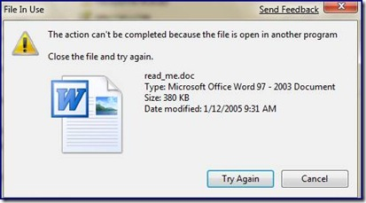
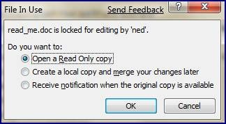
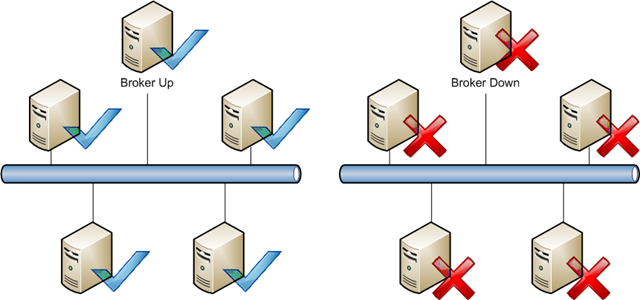
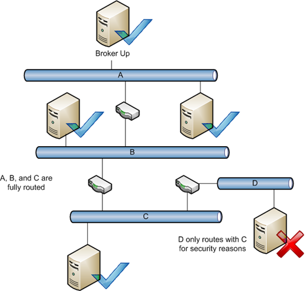
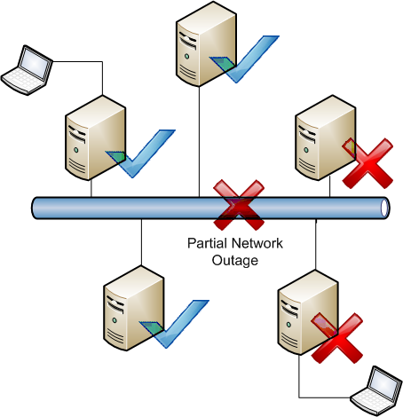
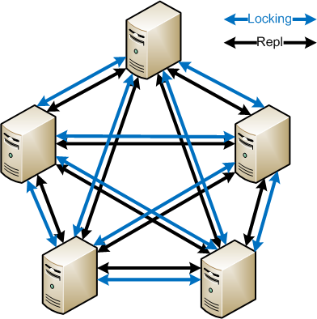

# Understanding (the Lack of) Distributed File Locking in DFSR

This article discusses the absence of a multi-host distributed file locking mechanism within Windows, and specifically within folders replicated by DFSR.

## Some Background

  - Distributed File Locking – this refers to the concept of having multiple copies of a file on several computers and when one file is opened for writing, all other copies are locked. This prevents a file from being modified on multiple servers at the same time by several users.
  - Distributed File System Replication – [DFSR](/previous-versions/windows/desktop/dfsr/distributed-file-system-replication--dfsr-) operates in a multi-master, state-based design. In state-based replication, each server in the multi-master system applies updates to its replica as they arrive, without exchanging log files (it instead uses version vectors to maintain “up-to-dateness” information). No one server is ever arbitrarily authoritative after initial sync, so it is highly available and very flexible on various network topologies.
  - Server Message Block - [SMB](/openspecs/windows_protocols/ms-smb/f210069c-7086-4dc2-885e-861d837df688) is the common protocol used in Windows for accessing files over the network. In simplified terms, it's a client-server protocol that makes use of a redirector to have remote file systems appear to be local file systems. It is not specific to Windows and is quite common – a well known non-Microsoft example is Samba, which allows Linux, Mac, and other operating systems to act as SMB clients/servers and participate in Windows networks.

It's important to make a clear delineation of where DFSR and SMB live in your replicated data environment. SMB allows users to access their files, and it has no awareness of DFSR. Likewise, DFSR (using the RPC protocol) keeps files in sync between servers and has no awareness of SMB. Don't confuse distributed locking as defined in this post and [Opportunistic Locking](/windows/win32/fileio/opportunistic-locks).

So here's where things can go pear-shaped, as the Brits say.

Since users can modify data on multiple servers, and since each Windows server only knows about a file lock on itself, *and* since [DFSR doesn't know anything about those locks on other servers](/previous-versions/windows/it-pro/windows-server-2003/cc773238(v=ws.10)), it becomes possible for users to overwrite each other's changes. DFSR uses a “last writer wins” conflict algorithm, so someone has to lose and the person to save last gets to keep their changes. The losing file copy is chucked into the *ConflictAndDeleted* folder.

Now, this is far *less* common than people like to believe. Typically, true shared files are modified in a local environment; in the branch office or in the same row of cubicles. They are usually worked on by people on the same team, so people are generally aware of colleagues modifying data. And since they are usually in the same site, the odds are much higher that all the users working on a shared doc will be using the same server. Windows SMB handles the situation here. When a user has a file locked for modification and his coworker tries to edit it, the other user will get an error like:

And if the application opening the file is really clever, like Word 2007, it might give you:

DFSR does have a mechanism for locked files, but it is only within the server's own context. DFSR will not replicate a file in or out if its local copy has an exclusive lock. But this doesn't prevent anyone on another server from modifying the file.

Back on topic, the issue of shared data being modified geographically *does* exist, and for some folks it's pretty gnarly. We're occasionally asked why DFSR doesn't handle this locking and take of everything with a wave of the magic wand. It turns out this is an interesting and difficult scenario to solve for a multi-master replication system. Let's explore.

## Third-Party Solutions

There are some vendor solutions that take on this problem, which they typically tackle through one or more of the following methods\*:

  - Use of a broker mechanism

> Having a central ‘traffic cop' allows one server to be aware of all the other servers and which files they have locked by users. Unfortunately this also means that there is often a single point of failure in the distributed locking system.

  - Requirement for a fully routed network

> Since a central broker must be able to talk to all servers participating in file replication, this removes the ability to handle complex network topologies. Ring topologies and multi hub-and-spoke topologies are not usually possible. In a non-fully routed network, some servers may not be able to directly contact each other or a broker, and can only talk to a partner who himself can talk to another server – and so on. This is fine in a multi-master environment, but not with a brokering mechanism.

  - Are limited to a pair of servers

> Some solutions limit the topology to a pair of servers in order to simplify their distributed locking mechanism. For larger environments this is may not be feasible.

  - Make use of agents on clients and servers
  - Do not use multi-master replication
  - Do not make use of MS clustering
  - Make use of specialty appliances

***\*** Note that I say typically\! Please do not post death threats because you have a solution that does/does not implement one or more of those methods\!*

## Deeper Thoughts

As you think further about this issue, some fundamental issues start to crop up. For example, if we have four servers with data that can be modified by users in four sites, and the WAN connection to one of them goes offline, what do we do? The users can still access their individual servers – but should we let them? We don't want them to make changes that conflict, but we definitely want them to keep working and making our company money. If we arbitrarily block changes at that point, no users can work even though there may not actually be any conflicts happening\! There's no way to tell the other servers that the file is in use and you're back at square one.

Then there's SMB itself and the error handling of reporting locks. We can't really change how SMB reports sharing violations as we'd break a ton of applications and clients wouldn't understand new extended error messages anyways. Applications like Word 2007 do some undercover trickery to figure out who is locking files, but the vast majority of applications don't know who has a file in use (or even that SMB exists. Really.). So when a user gets the message ‘This file is in use' it's not particularly actionable – should they all call the help desk? Does the help desk have access to all the file servers to see which users are accessing files? Messy.

Since we want multi-master for high availability, a broker system is less desirable; we might need to have something running on all servers that allows them all to communicate even through non-fully routed networks. This will require very complex synchronization techniques. It will add some overhead on the network (although probably not much) and it will need to be lightning fast to make sure that we are not holding up the user in their work; it needs to outrun file replication itself - in fact, it might need to actually be tied to replication somehow. It will also have to account for server outages that are network related and not server crashes, somehow.

And then we're back to special client software for this scenario that better understands the locks and can give the user some useful info (“Go call Susie in accounting and tell her to release that doc”, “Sorry, the file locking topology is broken and your administrator is preventing you from opening this file until it's fixed”, etc). Getting this to play nicely with the millions of applications running in Windows will definitely be interesting. There are plenty of OS's that would not be supported or get the software – Windows 2000 is out of mainstream support and XP soon will be. Linux and Mac clients wouldn't have this software until they felt it was important, so the customer would have to hope their vendors made something analogous.

## More information

Right now the easiest way to control this situation in DFSR is to use DFS Namespaces to guide users to predictable locations, with a consistent namespace. By correctly configuring your DFSN site topology and server links, you force users to all share the same local server and only allow them to access remote computers when their ‘main' server is down. For most environments, this works quite well. Alternative to DFSR, SharePoint is an option because of its check-out/check-in system. BranchCache (coming in Windows Server 2008 R2 and Windows 7) may be an option for you as it is designed for easing the reading of files in a branch scenario, but in the end the authoritative data will still live on one server only – more on this [here](/previous-versions/windows/it-pro/windows-server-2012-R2-and-2012/jj127252(v=ws.11)). And again, those vendors have their solutions.

