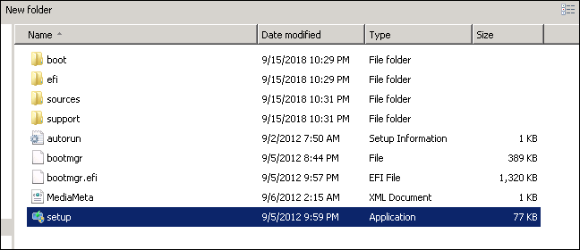
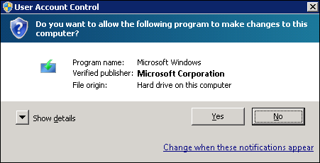
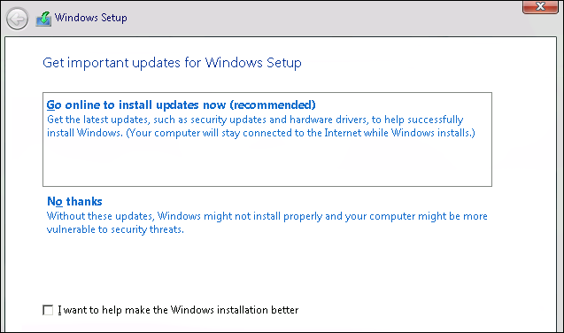
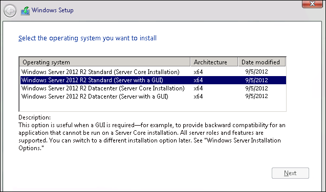
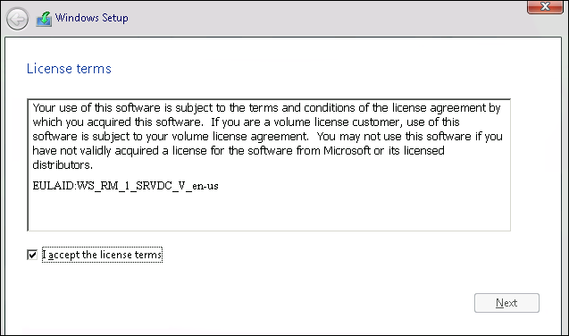
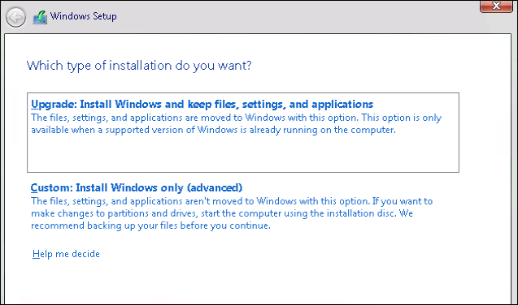
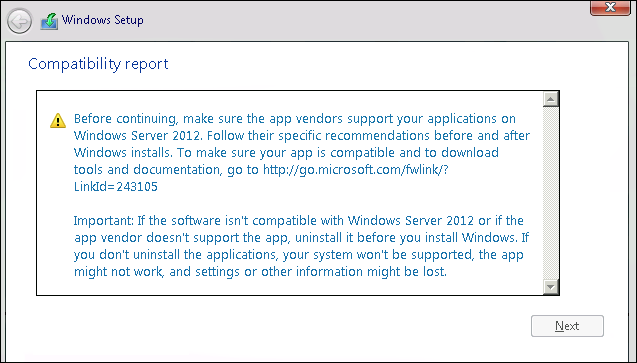
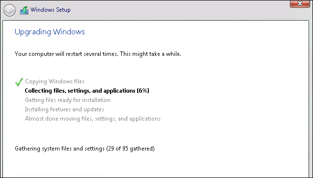

# Upgrade Windows Server 2008 R2 to Windows Server 2012 R2

If you want to keep the same hardware and all the server roles you've already set up without flattening the server, you'll want to do an in-place upgrade. An in-place upgrade allows you to go from an older operating system to a newer one, while keeping your settings, server roles, and data intact. This article helps you to move from Windows Server 2008 R2 to Windows Server 2012 R2.

To upgrade to Windows Server 2019, use this topic first to upgrade to Windows Server 2012 R2, and then [upgrade from Windows Server 2012 R2 to Windows Server 2019](upgrade-2012r2-to-2019.md).

## Before you begin your in-place upgrade

Before you start your Windows Server upgrade, we recommend that you collect some information from your devices, for diagnostic and troubleshooting purposes. Because this information is intended for use only if your upgrade fails, you must make sure that you store the information somewhere that you can get to it off of your device.

### To collect your info

1. Open a command prompt, go to `c:\Windows\system32`, and then type **systeminfo.exe**.

2. Copy, paste, and store the resulting system information somewhere off of your device.

3. Type **ipconfig /all** into the command prompt, and then copy and paste the resulting configuration information into the same location as above.

4. Open the Registry Editor, go to the HKEY_LOCAL_MACHINE\SOFTWARE\Microsoft\WindowsNT\CurrentVersion hive, and then copy and paste the Windows Server **BuildLabEx** (version) and **EditionID** (edition) into the same location as above.

After you've collected all of your Windows Server-related information, we highly recommend that you backup your operating system, apps, and virtual machines. You must also **Shut down**, **Quick migrate**, or **Live migrate** any virtual machines currently running on the server. You can't have any virtual machines running during the in-place upgrade.

## To perform the upgrade

1. Make sure the **BuildLabEx** value says you're running Windows Server 2008 R2.

2. Locate the Windows Server 2012 R2 Setup media, and then select **setup.exe**.

    

3. Select **Yes** to start the setup process.

    

4. On the Windows Server 2012 R2 screen, select **Install now**.

5. For internet-connected devices, select **Go online to install updates now (recommended)**.

    

6. Select the Windows Server 2012 R2 edition you want to install, and then select **Next**.

    

7. Select **I accept the license terms** to accept the terms of your licensing agreement, based on your distribution channel (such as, Retail, Volume License, OEM, ODM, and so on), and then select **Next**.

    

8. Select **Upgrade: Install Windows and keep files, settings, and applications** to choose to do an in-place upgrade.

    

9. Setup reminds you to make sure your apps are compatible with Windows Server 2012 R2, using the information in the [Windows Server installation and upgrade](https://docs.microsoft.com/windows-server/get-started/installation-and-upgrade) article, and then select **Next**.

    

10. If you see a page that tells you upgrade isn't recommended, you can ignore it and select **Confirm**. It was put in place to prompt for clean installations, but it isn't necessary.

    

    The in-place upgrade starts, showing you the **Upgrading Windows** screen with its progress. After the upgrade finishes, your server will restart.

## After your upgrade is done

After your upgrade completes, you must make sure the upgrade to Windows Server 2012 R2 was successful.

### To make sure your upgrade was successful

1. Open the Registry Editor, go to the HKEY_LOCAL_MACHINE\SOFTWARE\Microsoft\WindowsNT\CurrentVersion hive, and view the **ProductName**. You should see your edition of Windows Server 2012 R2, for example **Windows Server 2012 R2 Datacenter**.

2. Make sure all of your applications are running and that your client connections to the applications are successful.

If you think something might have gone wrong during your upgrade, copy and zip the `%SystemRoot%\Panther` (usually `C:\Windows\Panther`) directory and contact Microsoft support.

## Next steps

You can perform one more upgrade to go from Windows Server 2012 R2 to Windows Server 2019. For detailed instructions, see [Upgrade Windows Server 2012 R2 to Windows Server 2019](upgrade-2012r2-to-2019.md).

## Related articles

- For more details and information about Windows Server 2012 R2, see [Windows Server 2012 R2 and Windows Server 2012](https://docs.microsoft.com/previous-versions/windows/it-pro/windows-server-2012-R2-and-2012/hh801901(v=ws.11)).
