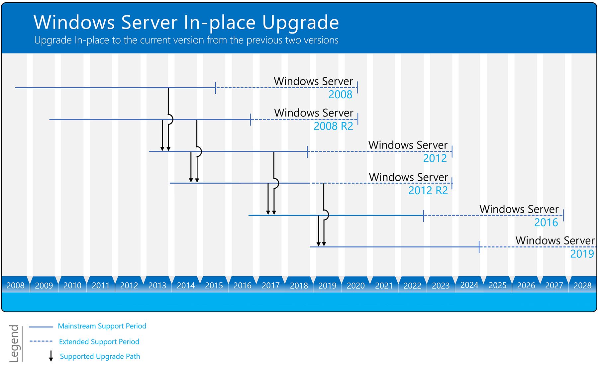

# Overview about Windows Server upgrades

The process of upgrading to a newer version of Windows Server can vary greatly depending on which operating system you are starting with and the pathway you take. We use the following terms to distinguish among different actions, any of which could be involved in a new Windows Server deployment.

- **Upgrade.** Also known as an "in-place upgrade". You move from an older version of the operating system to a newer version, while staying on the same physical hardware. **This is the method we will be covering in this section.**

    >[!Important]
    >In-place upgrades might also be supported by public or private cloud companies; however, you must check with your cloud provider for the details. Additionally, you'll be unable to perform an in-place upgrade on any Windows Server that's configured to **Boot from VHD**.

- **Installation.** Also known as a "clean installation". You move from an older version of the operating system to a newer version, deleting the older operating system.

- **Migration.** You move from an older version of the operating system to a newer version of the operating system by transferring to a different set of hardware or virtual machine.

- **Cluster OS Rolling Upgrade.** You upgrade the operating system of your cluster nodes without stopping the Hyper-V or the Scale-Out File Server workloads. This feature allows you to avoid downtime which could impact Service Level Agreements. For more information, see [Cluster operating system rolling upgrade](../failover-clustering/cluster-operating-system-rolling-upgrade.md)

- **License conversion.** Convert a particular edition of the release to another edition of the same release in a single step with a simple command and the appropriate license key. We call this "license conversion". For example, if your server is running Windows Server 2016 Standard, you can convert it to Windows Server 2016 Datacenter.

## Which version of Windows Server should I upgrade to?

We recommend upgrading to the latest version of Windows Server: Windows Server 2019. Running the latest version of Windows Server allows you to use the latest features – including the latest security features – and delivers the best performance.

However, we realize that's not always possible. You can use the following diagram to figure out which Windows Server version you can upgrade to, based on the version you're currently on:

Windows Server can be typically be upgraded through at least one, and sometimes even two, versions. For example, Windows Server 2012 R2 and Windows Server 2016 can both be upgraded in-place to Windows Server 2019.

You can also upgrade from an evaluation version of the operating system to a retail version, from an older retail version to a newer version, or, in some cases, from a volume-licensed edition of the operating system to an ordinary retail edition. For more information about upgrade options other than in-place upgrade, see [Upgrade and conversion options for Windows Server](../get-started/supported-upgrade-paths.md).
