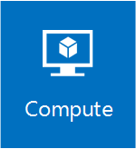

# Compute in Windows Server 2016

>Applies To: Windows Server 2016 

 Compute in Windows Server 2016 is one of the foundational technologies required to create your software defined infrastructure. Along with networking and storage, compute features deliver the flexibility you need to power the workloads for your customers.

Compute in Windows Server 2016 includes updates to Hyper-V that improve security, scalability, and reliability. Updates to failover clustering, networking, and storage make it even easier to deploy and manage these technologies when used with Hyper-V. For details, see [What's new in Hyper-V on Windows Server 2016](./hyper-v/what-s-new-in-hyper-v-on-windows.md).   

New to compute is Windows Containers, which offers another way to deploy flexible, software-based computing power. To try this out, see [Windows Containers Quick Start](https://msdn.microsoft.com/virtualization/windowscontainers/quick_start/quick_start).

>[!Note]
> To download Windows Server 2016, see [Windows Server Evaluations](https://www.microsoft.com/evalcenter/evaluate-windows-server).

## [Containers](https://msdn.microsoft.com/virtualization/windowscontainers)

Use Windows Server and Hyper-V containers to provide standardized runtime environments for development, test, and production teams.

## [Hyper-V](./hyper-v/Hyper-V-on-Windows-Server.md)

The Hyper-V technology provides computing resources through hardware virtualization. Hyper-V creates a software version of computer, called a virtual machine, which you use to run an operating system and applications. You can run multiple virtual machines at the same time, and can create and delete them as needed. 

Hyper-V requires specific hardware to create the virtualization environment. For details, see [System requirements for Hyper-V on Windows Server 2016](./hyper-v/system-requirements-for-hyper-v-on-windows.md). 

### [Hyper-V in Windows Server 2016](./hyper-v/Hyper-V-on-Windows-Server.md)
Learn more about Hyper-V, the hardware you need, the operating systems you can run in your virtual machines, and more. If you're new to Hyper-V, start with the [Hyper-V Technology Overview](./hyper-v/hyper-v-technology-overview.md).

### [Hyper-V on Windows 10](https://msdn.microsoft.com/virtualization/hyperv_on_windows/windows_welcome)
Hyper-V is available in certain versions of Windows 10, Windows 8.1, and Windows 8. Hyper-V on Windows is geared toward development and test activities and gives you a quick and easy way to run different operating systems without deploying more hardware. 

### [Microsoft Hyper-V Server 2016](https://technet.microsoft.com/hyper-v-server-docs/)
The Hyper-V technology is also available separately from Windows and Windows Server, as a free, standalone product. Hyper-V Server is commonly used as the host in a virtualized desktop infrastructure (VDI) environment.

## [Remote Desktop Services](../remote/remote-desktop-services/welcome-to-rds.md)

Remote Desktop Services in Windows Server 2016 lets users access computers, apps, and resources remotely. You can use Remote Desktop Services plus Azure services to create hosting solutions. 

## [Setup and Boot Event Collection](../administration/Get-started-with-Setup-and-Boot-Event-Collection.md)

Setup and Boot Event Collection is a new feature that allows you to designate a "collector" computer that can gather a variety of important events that occur on other computers when they boot or go through the setup process. You can then later analyze the collected events with Event Viewer, Message Analyzer, Wevtutil, or Windows PowerShell cmdlets. Previously, these events have been impossible to monitor because the infrastructure needed to collect them doesn't exist until a computer is already set up.

