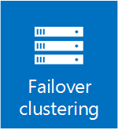

# Failover Clustering in Windows Server 2016
> Applies To: Windows Server 2016

 Failover clustering - a Windows Server feature that enables you to group multiple servers together into a fault-tolerant cluster - provides new and improved features for software-defined datacenter customers and many other workloads running clusters on physical hardware or in virtual machines.

A failover cluster is a group of independent computers that work together to increase the availability and scalability of clustered roles (formerly called clustered applications and services). The clustered servers (called nodes) are connected by physical cables and by software. If one or more of the cluster nodes fail, other nodes begin to provide service (a process known as failover). In addition, the clustered roles are proactively monitored to verify that they are working properly. If they are not working, they are restarted or moved to another node.

Failover clusters also provide Cluster Shared Volume (CSV) functionality that provides a consistent, distributed namespace that clustered roles can use to access shared storage from all nodes. With the Failover Clustering feature, users experience a minimum of disruptions in service.

Failover Clustering has many practical applications, including:
* Highly available or continuously available file share storage for applications such as Microsoft SQL Server and Hyper-V virtual machines
* Highly available clustered roles that run on physical servers or on virtual machines that are installed on servers running Hyper-V

## What's new
Here are some of the new features in Windows Server 2016 - for more details, see [What's new in Failover Clustering](whats-new-in-failover-clustering.md):

### [Cluster operating system rolling upgrades](Cluster-Operating-System-Rolling-Upgrade.md)

Enables an administrator to upgrade the operating system of the cluster nodes from without stopping the Hyper-V or the Scale-Out File Server workloads.
### [Cloud Witness for a Failover Cluster](deploy-cloud-witness.md)

A new type of quorum witness that leverages Microsoft Azure to help determine which cluster node should be considered authoritative if a node goes offline. 

### [Health Service](health-service-overview.md)

Improves the day-to-day monitoring, operations, and maintenance experience of Storage Spaces Direct clusters.

### [Fault Domains](fault-domains.md)

Enables you to define what fault domain to use with a Storage Spaces Direct cluster. A fault domain is a set of hardware that share a single point of failure, such as a server node, server chassis, or rack.

### [VM load balancing](vm-load-balancing-overview.md)

Helps load be evenly distributed across nodes in a Failover Cluster by identifying busy nodes and live-migrating VMs on these nodes to less busy nodes.

### [Simplified SMB Multichannel and multi-NIC cluster networks](smb-multichannel.md)

Enables easier configuration of multiple network adapters in a cluster.

## Planning

* [Failover Clustering Hardware Requirements and Storage Options](https://technet.microsoft.com/library/jj612869.aspx)
* [Validate Hardware for Failover Clustering](https://technet.microsoft.com/library/jj134244.aspx)
* [Network Recommendations for a Hyper-V Cluster](https://technet.microsoft.com/library/dn550728.aspx)

## Deployment

* [Installing the Failover Clustering Feature and Tools](http://go.microsoft.com/fwlink/p/?LinkId=253342)
* [Validate Hardware for a Failover Cluster](https://technet.microsoft.com/library/jj134244.aspx)
* [Prestage Cluster Computer Objects in Active Directory Domain Services](https://technet.microsoft.com/library/dn466519.aspx)
* [Creating a Failover Cluster](http://blogs.msdn.com/b/clustering/archive/2012/05/01/10299698.aspx)
* [Deploy Hyper-V over SMB](https://technet.microsoft.com/library/jj134187)
* [Deploy a Scale-Out File Server](https://technet.microsoft.com/library/hh831359)
* [iSCSI Target Block Storage, How To](https://technet.microsoft.com/library/hh848268)
* [Deploy an Active Directory Detached Cluster](https://technet.microsoft.com/library/jj556313.aspx)
* [Using Guest Clustering for High Availability](https://technet.microsoft.com/library/jj863389.aspx)
* [Deploy a Guest Cluster using a Shared Virtual Hard Disk](https://technet.microsoft.com/library/dn265980.aspx)
* [Building Your Cloud Infrastructure: Scenario Overview](https://technet.microsoft.com/library/hh831441.aspx)

## Operations
* [Configure and Manage the Quorum in a Failover Cluster](https://technet.microsoft.com/library/jj612870.aspx)
* [Use Cluster Shared Volumes in a Failover Cluster](https://technet.microsoft.com/library/jj612868.aspx)
* [Cluster-Aware Updating Overview](https://technet.microsoft.com/library/hh831694.aspx)

## Tools and settings

* [Failover Clustering PowerShell Cmdlets](http://go.microsoft.com/fwlink/p/?LinkId=233200)
* [Cluster Aware Updating PowerShell Cmdlets](https://technet.microsoft.com/library/hh847221.aspx)

## Community resources

* [High Availability (Clustering) Forum](http://go.microsoft.com/fwlink/p/?LinkId=230641)
* [Failover Clustering and Network Load Balancing Team Blog](http://blogs.msdn.com/b/clustering/)

## See also

* [Compute in Windows Server 2016](../Compute.md)
* [Storage in Windows Server 2016](../../storage/storage.md)