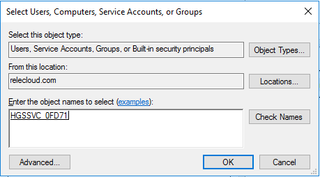

# Prepare for the Host Guardian Service deployment

>Applies To: Windows Server 2016

This topic covers HGS prerequisites and initial steps to prepare for the HGS deployment.

## Prerequisites for the Host Guardian Service

-   **Hardware**: HGS can be run on physical or virtual machines, but physical machines are recommended.

    If you want to run HGS as a three-node physical cluster (for availability), you must have three physical servers. (As a best practice for clustering, the three servers should have very similar hardware.)
  
-   **Operating system**: Windows Server 2016, Standard or Datacenter edition.

-   **Server Roles**: Host Guardian Service and supporting server roles.

-   **Configuration permissions/privileges for the fabric (host) domain**: You will need to configure DNS forwarding between the fabric (host) domain and the HGS domain. If you are using Admin-trusted attestation (AD mode), you will need to configure an Active Directory trust between the fabric domain and the HGS domain. 
    
### Supported upgrade scenarios

Before you deploy a guarded fabric, make sure the servers have installed the [latest Cumulative Update](https://support.microsoft.com/help/4000825/windows-10-and-windows-server-2016-update-history). 
If you deployed a guarded fabric before the release of the [October 27, 2016 Cumulative Update](http://support.microsoft.com/kb/3197954), the servers need to be upgraded:
- Guarded hosts can be upgraded in-place by installing the latest Cumulative Update.
- HGS servers need to be rebuilt, including configuring certificates and information about the hosts, as explained in this topic. 

Shielded VMs that ran on a guarded host with an earlier operating system version, such as TP5, can still run after the host is upgraded to Windows Server 2016. New shielded VMs cannot be created from template disks that were prepared using the template disk wizard from a Technical Preview build.

## Prepare for HGS 

These preliminary steps require permissions that the HGS and Hyper-V fabric admins might not have. 
Doing these at the start can make the deployment easier. 

### Specify the signing and encryption certificates that HGS will use

You need to configure the Host Guardian Service with two certificates for encryption and signing purposes. There are three mutually exclusive options:

| Option | Procedure |
|----|------|
| You have your own PKI certificate and a PFX file. | [Use my own PKI certificates that are not backed by an HSM](#use-my-own-pki-certificates-that-are-not-backed-by-an-hsm) |
| You have a certificate backed by a Hardware Security Module (HSM). | [Use my own certificates with an HSM](#use-your-own-certificates-with-an-hsm) |
| You are using a self-signed certificate (only recommended for test or POC environments). | [Create and use self-signed certificates](#create-and-use-self-signed-certificates) |

>**Note**&nbsp;&nbsp;Regardless of how you create the certificates, they must support RSA 2048 bit keys and their key-usage policy (EKU) must permit digital signing and encryption.

HTTPS is not needed to secure communication between HGS and a Hyper-V host, but if you choose to enable HTTPS, you will need an additional certificate. The HTTPS certificate can be one that you already have, or you can create a new certificate that you will specify when initializing the HGS server. 

| Option | Additional procedure |
|----|-----------|
| You want to enable HTTPS  | [Configure a certificate for enabling HTTPS](#configure-a-certificate-for-enabling-https) |

##### Use my own PKI certificates that are not backed by an HSM

If you have obtained certificates from a trusted Public Key Infrastructure (PKI) environment and both the certificate and your organization permit the private keys to be exported to a PFX (personal information exchange) file, you are now able to conveniently add the PFX to any one node of the HGS cluster and have it automatically configured and replicated to all other nodes in the HGS cluster.

If you are unable to obtain a PFX or are unable to obtain one with the private key intact, you will need to install the certificates (including the private key) manually on each HGS node in your cluster according to your organization's certificate enrollment processes. Certificates that are added to HGS by thumbprint reference instead of a PFX file and password require additional action, as described in the following procedure.

<!-- I think Ryan said this part can be moved to just before they initialize HGS, when the HGS svc name will be known
-->

###### To grant the HGS service access to the private keys of certificates added by thumbprint reference

1. Unlike other certificate-related tasks, you MUST repeat this process on each HGS node. Run CERTLM.MSC (which opens the Certificate Management Console for the local store).

2. Navigate to the signing certificate, right-click it, and then click **All Tasks** &gt; **Manage Private Keys**.

3. In the Security dialog box, add the group managed service account (gMSA) for HGS to the list of accounts. To do this, click **Add** and in the resulting dialog box, click **Object Types**, select **Service Accounts**, and click **OK**. Under **Enter the object names to select**, type the account name - by default, **HGSSVC** - and click **Check Names**. If you originally set up HGS in an existing domain, you'll type the name of the gMSA that you provided to the Initialize-HgsServer command.

    

4. Give the account **Read** access to the private keys for the certificate.

5. Repeat the process for the encryption certificate.
    
##### Use your own certificates with an HSM

If you plan to use certificates that reside in a Hardware Security Module (HSM), use the following high-level steps, which will vary according to your HSM vendor:

1.  Install the HSM vendor's software to ensure that the HSM is visible to Windows.

2.  Create two certificates within the HSM with RSA 2048 bit keys and key usage policies for signing and encryption purposes.

    1.  Create one encryption certificate within your HSM

    2.  Create one signing certificate within your HSM

3.  Verify that the certificates are installed in the local machine's certificate store. If they have not been automatically installed, they must be added per the HSM vendor's guidance (note that the private key remains in the HSM as expected). As before, you can add the certificate to the local machine's certificate store on any one node of the HGS cluster and it will automatically be configured and replicated to all other nodes in the HGS cluster.

4.  Finally, you must ensure that the group managed service account (gMSA) for HGS has been granted read access to the private keys for your certificate. By default, the gMSA account name is **HGSSVC**. If you originally set up HGS in an existing domain, the gMSA is the one that you provided to the Initialize-HgsServer command. The process for granting access varies between vendors, so please consult the user guide for your specific HSM for information on how to configure access for your HSM-backed certificate.

<span id="create-and-use-self-signed-certificates"/>
##### Create and use self-signed certificates (used primarily with test or proof-of-concept environments)

>**Warning**&nbsp;&nbsp;Creating self-signed certificates is not recommended outside of test/POC deployments. Use certificates that are issued by a trusted certificate authority if you are deploying in a production environment.

1.  Open an elevated Windows PowerShell console and run the following command to specify the password to use when exporting the self-signed certificate. For &lt;password&gt;, substitute a password.

    ```powershell
    $certificatePassword = ConvertTo-SecureString -AsPlainText '<password>' -Force
    ```
        
2.  Create and export the signing certificate by running the following commands. For signing (after `-DnsName`) and for `C:\signingCert`, you can leave the names as shown or substitute your preferred names.

    ```powershell
    $signingCert = New-SelfSignedCertificate -DnsName "signing.relecloud.com"

    Export-PfxCertificate -Cert $signingCert -Password $certificatePassword -FilePath 'C:\signingCert.pfx'
    ```

3.  Create and export the encryption certificate by running the following commands. For encryption (after `-DnsName`) and for `C:\encryptionCert`, you can leave the names as shown or substitute your preferred names.

    ```powershell
    $encryptionCert = New-SelfSignedCertificate -DnsName "encryption.relecloud.com"

    Export-PfxCertificate -Cert $encryptionCert -Password $certificatePassword -FilePath 'C:\encryptionCert.pfx'
    ```

##### Configure a certificate for enabling HTTPS

If you choose to enable HTTPS on your HGS server, you must have or create an additional certificate. To create a new certificate, run the following command. For `<HgsServiceName>`, choose a name that you will use as the distributed network name of your HGS server or HGS cluster.

```powershell
$HttpsCertificate = New-SelfSignedCertificate -DnsName "<HgsServiceName>.$env:userdnsdomain" -CertStoreLocation Cert:\LocalMachine\My
```

After you have chosen or created a certificate to use for HTTPS, use a command like the following to export it.

```powershell
Export-PfxCertificate -Cert $HttpsCertificate -Password $certificatePassword -FilePath 'c:\HttpsCertificate.pfx'
```

The options for specifying this certificate when initializing the HGS server are covered in [Configure the first HGS node](guarded-fabric-configure-the-first-hgs-node.md).

### Choose whether to install HGS in its own new forest or in an existing bastion forest

The Active Directory forest for HGS is sensitive because its administrators have access to the keys that control shielded VMs. 
The default installation will set up a new forest for HGS and configure other dependencies. 
This option is recommended because the environment is self-contained and known to be secure when it is created. 
For the PowerShell syntax and an example, see [install HGS in its own new forest](guarded-fabric-configure-the-first-hgs-node.md#install-hgs-in-a-new-forest).

The only technical requirement for installing HGS in an existing forest is that it be added to the root domain; non-root domains are not supported. But there are also operational requirements and security-related best practices for using an existing forest. 
Suitable forests are purposely built to serve one sensitive function, such as the forest used by [Privileged Access Management for AD DS](https://docs.microsoft.com/microsoft-identity-manager/pam/privileged-identity-management-for-active-directory-domain-services) or an [Enhanced Security Administrative Environment (ESAE) forest](https://technet.microsoft.com/windows-server-docs/security/securing-privileged-access/securing-privileged-access-reference-material#ESAE_BM). 
Such forests usually exhibit the following characteristics:

- They have few admins (separate from fabric admins)
- They have a low number of logons
- They are not general-purpose in nature 

General purpose forests such as production forests are not suitable for use by HGS. 
Fabric forests are also unsuitable because HGS needs to be isolated from fabric administrators.

#### Requirements for adding HGS to an existing forest

To add HGS to an existing bastion forest, it must be added to the root domain. 
Before you initialize HGS, you will need to join each target server of the HGS cluster to the root domain, and then add these objects:

-   A Group Managed Service Account (gMSA) that is configured for use on the machine(s) that host HGS.

-   Two Active Directory groups that you will use for Just Enough Administration (JEA). One group is for users who can perform HGS administration through JEA, and the other is for users who can only view HGS through JEA.

-   For setting up the cluster, either [prestaged cluster objects](http://go.microsoft.com/fwlink/?LinkId=746122) or, for the user who runs **Initialize-HgsServer**, permissions to prestage the cluster objects.

For the PowerShell syntax to add HGS to a forest, see [initialize HGS in an existing bastion forest](guarded-fabric-configure-the-first-hgs-node.md#install-hgs-in-an-existing-bastion-forest).

### Configure name resolution

The fabric DNS needs to be configured so that guarded hosts can resolve the name of the HGS cluster. 
For an example, see [Configure the fabric DNS](guarded-fabric-configuring-fabric-dns.md).

If you're using AD-mode attestation, the HGS domain needs DNS forwarding set up and a one-way forest trust so HGS can validate the the group membership of guarded hosts.
For an example, see [configuring DNS forwarding and domain trust](#configure-dns-forwarding-and-domain-trust).  

## See also

- [Deploying the Host Guardian Service for guarded hosts and shielded VMs](guarded-fabric-deploying-hgs-overview.md)
- [Configuration steps for Hyper-V hosts that will become guarded hosts](guarded-fabric-configure-hgs-with-authorized-hyper-v-hosts.md)
