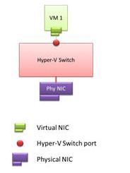

# Hyper-V Virtual Switch

>Applies To: Windows Server (Semi-Annual Channel), Windows Server 2016

This topic provides an overview of Hyper-V Virtual Switch, which provides you with the ability to connect virtual machines \(VMs\) to networks that are external to the Hyper\-V host, including your organization's intranet and the Internet. 

You can also connect to virtual networks on the server that is running Hyper\-V when you deploy Software Defined Networking \(SDN\).

> [!NOTE]  
> In addition to this topic, the following Hyper-V Virtual Switch documentation is available.  
>   
> - [Manage Hyper-V Virtual Switch](Manage-Hyper-V-Virtual-Switch.md) 
> - [Remote Direct Memory Access (RDMA) and Switch Embedded Teaming (SET)](RDMA-and-Switch-Embedded-Teaming.md)
> - [Network Switch Team Cmdlets in Windows PowerShell](https://technet.microsoft.com/library/jj553812.aspx)
> - [What's New in VMM 2016](https://docs.microsoft.com/system-center/vmm/whats-new#networking)
> - [Set up the VMM networking fabric](https://docs.microsoft.com/system-center/vmm/manage-networks)
> - [Create networks with VMM 2012](https://social.technet.microsoft.com/wiki/contents/articles/3140.create-networks-with-vmm-2012.aspx)  
> - [Hyper-V: Configure VLANs and VLAN Tagging](https://social.technet.microsoft.com/wiki/contents/articles/1306.hyper-v-configure-vlans-and-vlan-tagging.aspx)  
> - [Hyper-V: The WFP virtual switch extension should be enabled if it is required by third party extensions](https://social.technet.microsoft.com/wiki/contents/articles/13071.hyper-v-the-wfp-virtual-switch-extension-should-be-enabled-if-it-is-required-by-third-party-extensions.aspx)
>
> For more information about other networking technologies, see [Networking in Windows Server 2016](https://docs.microsoft.com/windows-server/networking/networking).
  
Hyper\-V Virtual Switch is a software-based layer-2 Ethernet network switch that is available in Hyper\-V Manager when you install the Hyper\-V server role.

Hyper-V Virtual Switch includes programmatically managed and extensible capabilities to connect VMs to both virtual networks and the physical network. In addition, Hyper-V Virtual Switch provides policy enforcement for security, isolation, and service levels.  
  
> [!NOTE]  
> Hyper-V Virtual Switch only supports Ethernet, and does not support any other wired local area network (LAN) technologies, such as Infiniband and Fibre Channel.  
  
Hyper-V Virtual Switch includes tenant isolation capabilities, traffic shaping, protection against malicious virtual machines, and simplified troubleshooting. 

With built-in support for Network Device Interface Specification \(NDIS\) filter drivers and Windows Filtering Platform \(WFP\) callout drivers, the Hyper-V Virtual Switch enables independent software vendors \(ISVs\) to create extensible plug-ins, called Virtual Switch Extensions, that can provide enhanced networking and security capabilities. Virtual Switch Extensions that you add to the Hyper-V Virtual Switch are listed in the Virtual Switch Manager feature of Hyper-V Manager.
  
In the following illustration, a VM has a virtual NIC that is connected to the Hyper-V Virtual Switch through a switch port.  
  
  
  
Hyper-V Virtual Switch capabilities provide you with more options for enforcing tenant isolation, shaping and controlling network traffic, and employing protective measures against malicious VMs.

>[!NOTE]
> In Windows Server 2016, a VM with a virtual NIC accurately displays the maximum throughput for the virtual NIC. To view the virtual NIC speed in **Network Connections**, right-click the desired virtual NIC icon and then click **Status**. The virtual NIC **Status** dialog box opens. In **Connection**, the value of **Speed** matches the speed of the physical NIC installed in the server.
  
## Uses for Hyper-V Virtual Switch

Following are some use case scenarios for Hyper-V Virtual Switch.

**Displaying statistics**: A developer at a hosted cloud vendor implements a management package that displays the current state of the Hyper-V virtual switch. The management package can query switch-wide current capabilities, configuration settings, and individual port network statistics using WMI. The status of the switch is then displayed to give administrators a quick view of the state of the switch.  
  
**Resource tracking**: A hosting company is selling hosting services priced according to the level of membership. Various membership levels include different network performance levels. The administrator allocates resources to meet the SLAs in a manner that balances network availability. The administrator programmatically tracks information such as the current usage of bandwidth assigned, and the number of virtual machine (VM) assigned virtual machine queue (VMQ) or IOV channels. The same program also periodically logs the resources in use in addition to the per-VM resources assigned for double entry tracking or resources.  
  
**Managing the order of switch extensions**: An enterprise has installed extensions on their Hyper-V host to both monitor traffic and report intrusion detection. During maintenance, some extensions may be updated causing the order of extensions to change. A simple script program is run to reorder the extensions after updates.  
  
**Forwarding extension manages VLAN ID**: A major switch company is building a forwarding extension that applies all policies for networking. One element that is managed is virtual local area network (VLAN) IDs. The virtual switch cedes control of the VLAN to a forwarding extension. The switch company's installation programmatically call a Windows Management Instrumentation (WMI) application programming interface (API) that turns on the transparency, telling the Hyper-V Virtual Switch to pass and take no action on VLAN tags.  
  
## Hyper-V Virtual Switch Functionality
 
Some of the principal features that are included in the Hyper-V Virtual Switch are:  
  
-   **ARP/ND Poisoning (spoofing) protection**: Provides protection against a malicious VM using Address Resolution Protocol (ARP) spoofing to steal IP addresses from other VMs. Provides protection against attacks that can be launched for IPv6 using Neighbor Discovery (ND) spoofing.  
  
-   **DHCP Guard protection**: Protects against a malicious VM representing itself as a Dynamic Host Configuration Protocol (DHCP) server for man-in-the-middle attacks.  
  
-   **Port ACLs**: Provides traffic filtering based on Media Access Control (MAC) or Internet Protocol (IP) addresses/ranges, which enables you to set up virtual network isolation.  
  
-   **Trunk mode to a VM**: Enables administrators to set up a specific VM as a virtual appliance, and then direct traffic from various VLANs to that VM.  
  
-   **Network traffic monitoring**: Enables administrators to review traffic that is traversing the network switch.  
  
-   **Isolated (private) VLAN**: Enables administrators to segregate traffic on multiple vlans, to more easily establish isolated tenant communities.  
  
Following is a list of capabilities that enhance Hyper-V Virtual Switch usability:  
  
-   **Bandwidth limit and burst support**: Bandwidth minimum guarantees amount of bandwidth reserved. Bandwidth maximum caps the amount of bandwidth a VM can consume.  
  
-   **Explicit Congestion Notification (ECN) marking support**:  ECN marking, also known as Data CenterTCP (DCTCP), enables the physical switch and operating system to regulate traffic flow such that the buffer resources of the switch are not flooded, which results in increased traffic throughput.  
  
-   **Diagnostics**: Diagnostics allow easy tracing and monitoring of events and packets through the virtual switch.
