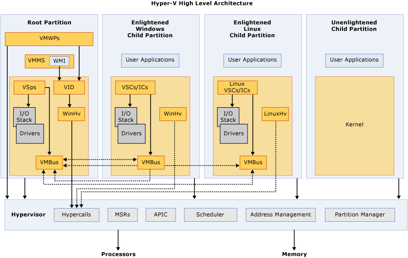

# Hyper-V Architecture

Hyper-V is a hypervisor-based virtualization technology for certain x64 versions of Windows.  The hypervisor is core to virtualization.  It is the processor-specific virtualization platform that allows multiple isolated operating systems to share a single hardware platform.

Hyper-V supports isolation in terms of a partition. A partition is a logical unit of isolation, supported by the hypervisor, in which operating systems execute. The Microsoft hypervisor must have at least one parent, or root, partition, running Windows. The virtualization management stack runs in the parent partition and has direct access to hardware devices. The root partition then creates the child partitions which host the guest operating systems. A root partition creates child partitions using the hypercall application programming interface (API).

Partitions do not have access to the physical processor, nor do they handle the processor interrupts. Instead, they have a virtual view of the processor and run in a virtual memory address region that is private to each guest partition. The hypervisor handles the interrupts to the processor, and redirects them to the respective partition. Hyper-V can also hardware accelerate the address translation between various guest virtual address spaces by using an Input Output Memory Management Unit (IOMMU) which operates independent of the memory management hardware used by the CPU. An IOMMU is used to remap physical memory addresses to the addresses that are used by the child partitions.

Child partitions also do not have direct access to other hardware resources and are presented a virtual view of the resources, as virtual devices (VDevs). Requests to the virtual devices are redirected either via the VMBus or the hypervisor to the devices in the parent partition, which handles the requests. The VMBus is a logical inter-partition communication channel. The parent partition hosts Virtualization Service Providers (VSPs) which communicate over the VMBus to handle device access requests from child partitions. Child partitions host Virtualization Service Consumers (VSCs) which redirect device requests to VSPs in the parent partition via the VMBus. This entire process is transparent to the guest operating system.

Virtual Devices can also take advantage of a Windows Server Virtualization feature, named Enlightened I/O, for storage, networking, graphics, and input subsystems. Enlightened I/O is a specialized virtualization-aware implementation of high level communication protocols (such as SCSI) that utilize the VMBus directly, bypassing any device emulation layer. This makes the communication more efficient but requires an enlightened guest that is hypervisor and VMBus aware. Hyper-V enlightened I/O and a hypervisor aware kernel is provided via installation of Hyper-V integration services. Integration components, which include virtual server client (VSC) drivers, are also available for other client operating systems. Hyper-V requires a processor that includes hardware assisted virtualization, such as is provided with Intel VT or AMD Virtualization (AMD-V) technology.

The following diagram provides a high-level overview of the architecture of a Hyper-V environment.

## Glossary

* **APIC** – Advanced Programmable Interrupt Controller – A device which allows priority levels to be assigned to its interrupt outputs.
* **Child Partition** – Partition that hosts a guest operating system - All access to physical memory and devices by a child partition is provided via the Virtual Machine Bus (VMBus) or the hypervisor.
* **Hypercall** – Interface for communication with the hypervisor - The hypercall interface accommodates access to the optimizations provided by the hypervisor.
* **Hypervisor** – A layer of software that sits between the hardware and one or more operating systems. Its primary job is to provide isolated execution environments called partitions. The hypervisor controls and arbitrates access to the underlying hardware.
* **IC** – Integration component – Component that allows child partitions to communication with other partitions and the hypervisor.
* **I/O stack** – Input/output stack
* **MSR** – Memory Service Routine
* **Root Partition** – Sometimes called parent partition.  Manages machine-level functions such as device drivers, power management, and device hot addition/removal. The root (or parent) partition is the only partition that has direct access to physical memory and devices.
* **VID** – Virtualization Infrastructure Driver – Provides partition management services, virtual processor management services, and memory management services for partitions.
* **VMBus** – Channel-based communication mechanism used for inter-partition communication and device enumeration on systems with multiple active virtualized partitions. The VMBus is installed with Hyper-V Integration Services.
* **VMMS** – Virtual Machine Management Service – Responsible for managing the state of all virtual machines in child partitions.
* **VMWP** – Virtual Machine Worker Process – A user mode component of the virtualization stack. The worker process provides virtual machine management services from the Windows Server 2008 instance in the parent partition to the guest operating systems in the child partitions. The Virtual Machine Management Service spawns a separate worker process for each running virtual machine.
* **VSC** – Virtualization Service Client – A synthetic device instance that resides in a child partition. VSCs utilize hardware resources that are provided by Virtualization Service Providers (VSPs) in the parent partition. They communicate with the corresponding VSPs in the parent partition over the VMBus to satisfy a child partitions device I/O requests.
* **VSP** – Virtualization Service Provider – Resides in the root partition and provide synthetic device support to child partitions over the Virtual Machine Bus (VMBus).
* **WinHv** – Windows Hypervisor Interface Library - WinHv is essentially a bridge between a partitioned operating system’s drivers and the hypervisor which allows drivers to call the hypervisor using standard Windows calling conventions
* **WMI** – The Virtual Machine Management Service exposes a set of Windows Management Instrumentation (WMI)-based APIs for managing and controlling virtual machines.
