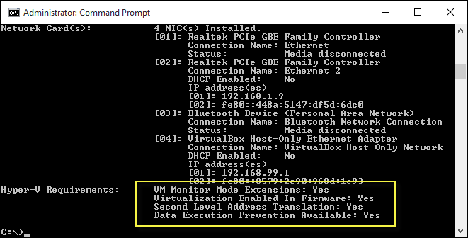

# System requirements for Hyper-V on Windows and Windows Server

Hyper-V has specific hardware requirements, and some Hyper-V features have other requirements. Use the details in this article to decide what requirements your system must meet so you can use Hyper-V the way you plan to.

:::zone pivot="windows-server"

Then review the [Windows Server catalog](https://www.windowsservercatalog.com/). Keep in mind that requirements for Hyper-V exceed the general minimum requirements for Windows Server because a virtualization environment requires more computing resources.

If you're already using Hyper-V, it's likely that you can use your existing hardware. The general hardware requirements have changed minimally from Windows Server 2012 R2, but you need newer hardware to use shielded virtual machines or discrete device assignment. Those features rely on specific hardware support, as described later in this article. Other than that, the main difference in hardware is that second-level address translation (SLAT) is now required instead of recommended.

For details about maximum supported configurations for Hyper-V, such as the number of running virtual machines, see [Plan for Hyper-V scalability in Windows Server](../hyper-v/maximum-scale-limits.md). The list of operating systems you can run in your virtual machines is covered in [Supported Windows guest operating systems for Hyper-V on Windows Server](Supported-Windows-guest-operating-systems-for-Hyper-V-on-Windows.md).

::: zone-end

:::zone pivot="windows"

## Operating system requirements

Hyper-V can be enabled on these versions of Windows:

- Windows 10 Professional or Enterprise
- Windows 11 Professional or Enterprise

::: zone-end

## General requirements

Regardless of the Hyper-V features you want to use, you need:

- A 64-bit processor with second-level address translation (SLAT). To install the Hyper-V virtualization components such as Windows hypervisor, the processor must have SLAT. However, it's not required to install Hyper-V management tools like Virtual Machine Connection (VMConnect), Hyper-V Manager, and the Hyper-V cmdlets for Windows PowerShell. See [How to check for Hyper-V requirements](#how-to-check-for-hyper-v-requirements) to find out if your processor has SLAT.

- VM Monitor Mode extensions.

- Enough memory. Plan for at least 4 GB of RAM. More memory is better. You need enough memory for the host and all virtual machines that you want to run at the same time.

- Virtualization support turned on in the BIOS or UEFI:

  - Hardware-assisted virtualization. This is available in processors that include a virtualization option: specifically processors with Intel Virtualization Technology (Intel VT) or AMD Virtualization (AMD-V) technology.

  - Hardware-enforced Data Execution Prevention (DEP) must be available and enabled. For Intel systems, this is the XD bit (execute disable bit). For AMD systems, this is the NX bit (no execute bit).

## How to check for Hyper-V requirements

Open Windows PowerShell or a command prompt and type:

```cmd
Systeminfo.exe
```

Scroll to the Hyper-V requirements section to review the report. If all listed Hyper-V requirements have a value of **Yes**, your system can run the Hyper-V role. If any item returns **No**, check the requirements listed in this document and make adjustments where possible.



## Requirements for specific features

This section lists the requirements for discrete device assignment and shielded virtual machines.

### Discrete device assignment

**Host** requirements are similar to the existing requirements for the SR-IOV feature in Hyper-V.

- The processor must have either Intel's Extended Page Table (EPT) or AMD's Nested Page Table (NPT).

- The chipset must have:

  - Interrupt remapping - Intel's VT-d with the Interrupt Remapping capability (VT-d2) or any version of AMD I/O Memory Management Unit (I/O MMU).

  - DMA remapping - Intel's VT-d with Queued Invalidations or any AMD I/O MMU.

  - Access control services (ACS) on PCI Express root ports.

- The firmware tables must expose the I/O MMU to the Windows hypervisor. This feature might be turned off in the UEFI or BIOS. For instructions, see the hardware documentation or contact your hardware manufacturer.

**Devices** need GPU or nonvolatile memory express (NVMe). For GPU, only certain devices support discrete device assignment. To verify, see the hardware documentation or contact your hardware manufacturer. For details about this feature, including how to use it and considerations, see [Discrete Device Assignment--Description and background](https://techcommunity.microsoft.com/t5/virtualization/discrete-device-assignment-description-and-background/ba-p/382262) in the Virtualization blog.

:::zone pivot="windows-server"

### Shielded virtual machines

These virtual machines rely on virtualization-based security and are available starting with Windows Server 2016.

**Host** requirements are:

- UEFI 2.3.1c. Supports secure, measured boot.

  The following two requirements are optional for virtualization-based security in general, but required for the host if you want the protection these features provide:

   - TPM v2.0. Protects platform security assets.
   - IOMMU (Intel VT-D). Enables the hypervisor to provide direct memory access (DMA) protection.

**Virtual machine** requirements are:

- Generation 2.
- Windows Server 2012 or later as the guest operating system.

::: zone-end

:::zone pivot="windows"

## Final check

If all OS, hardware, and compatibility requirements are met, you see **Hyper-V** in **Control Panel: Turn Windows features on or off**, and it has two options:

- Hyper-V platform
- Hyper-V Management Tools

> [!NOTE]
> If you see **Windows Hypervisor Platform** instead of **Hyper-V** in **Control Panel: Turn Windows features on or >off**, your system might not be compatible with Hyper-V. Check the preceding requirements.
>If you run **systeminfo** on an existing Hyper-V host, the Hyper-V Requirements section reads:
>```
>Hyper-V Requirements: A hypervisor has been detected. Features required for Hyper-V will not be displayed.
>```

::: zone-end


