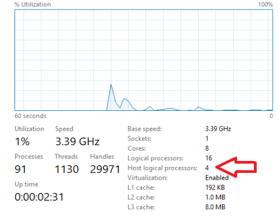

# Hyper-V Host CPU Resource Management

Hyper-V host CPU resource controls introduced in Windows Server 2016 or later allow Hyper-V administrators to better manage and allocate host server CPU resources between the “root”, or management partition, and guest VMs. 
Using these controls, administrators can dedicate a subset of the processors of a host system to the root partition. 
This can segregate the work done in a Hyper-V host from the workloads running in guest virtual machines by running them on separate subsets of the system processors.

For details about hardware for Hyper-V hosts, see [Windows 10 Hyper-V System Requirements](https://docs.microsoft.com/virtualization/hyper-v-on-windows/reference/hyper-v-requirements).

## Background

Before setting controls for Hyper-V host CPU resources, it's helpful to review the basics of the Hyper-V architecture.  
You can find a general summary in the [Hyper-V Architecture](https://docs.microsoft.com/windows-server/administration/performance-tuning/role/hyper-v-server/architecture) section.
These are important concepts for this article:

* Hyper-V creates and manages virtual machine partitions, across which compute resources are allocated and shared, under control of the hypervisor.  Partitions provide strong isolation boundaries between all guest virtual machines, and between guest VMs and the root partition.

* The root partition is itself a virtual machine partition, although it has unique properties and much greater privileges than guest virtual machines.  The root partition provides the management services that control all guest virtual machines, provides virtual device support for guests, and manages all device I/O for guest virtual machines.  Microsoft strongly recommends not running any application workloads in a host partition.

* Each virtual processor (VP) of the root partition is mapped 1:1 to an underlying logical processor (LP).  A host VP will always run on the same underlying LP – there is no migration of the root partition's VPs.  

* By default, the LPs on which host VPs run can also run guest VPs.

* A guest VP may be scheduled by the hypervisor to run on any available logical processor.  While the hypervisor scheduler takes care to consider temporal cache locality, NUMA topology, and many other factors when scheduling a guest VP, ultimately the VP could be scheduled on any host LP.

## The Minimum Root, or “Minroot” Configuration

Early versions of Hyper-V had an architectural maximum limit of 64 VPs per partition.  This applied to both the root and guest partitions.  As systems with more than 64 logical processors appeared on high-end servers, Hyper-V also evolved its host scale limits to support these larger systems, at one point supporting a host with up to 320 LPs.  However, breaking the 64 VP per partition limit at that time presented several challenges and introduced complexities that made supporting more than 64 VPs per partition prohibitive.  To address this, Hyper-V limited the number of VPs given to the root partition to 64, even if the underlying machine had many more logical processors available.  The hypervisor would continue to utilize all available LPs for running guest VPs, but artificially capped the root partition at 64.  This configuration became known as the “minimum root”, or “minroot” configuration.  Performance testing confirmed that, even on large scale systems with more than 64 LPs, the root did not need more than 64 root VPs to provide sufficient support to a large number of guest VMs and guest VPs – in fact, much less than 64 root VPs was often adequate, depending of course on the number and size of the guest VMs, the specific workloads being run, etc.

This “minroot” concept continues to be utilized today.  In fact, even as Windows Server 2016 Hyper-V increased its maximum architectural support limit for host LPs to 512 LPs, the root partition will still be limited to a maximum of 320 LPs.

## Using Minroot to Constrain and Isolate Host Compute Resources
With the high default threshold of 320 LPs in Windows Server 2016 Hyper-V, the minroot configuration will only be utilized on the very largest server systems.  However, this capability can be configured to a much lower threshold by the Hyper-V host administrator, and thus leveraged to greatly restrict the amount of host CPU resources available to the root partition.  The specific number of root LPs to utilize must of course be chosen carefully to support the maximum demands of the VMs and workloads allocated to the host.  However, reasonable values for the number of host LPs can be determined through careful assessment and monitoring of production workloads, and validated in non-production environments before broad deployment.

## Enabling and Configuring Minroot

The minroot configuration is controlled via hypervisor BCD entries. To enable minroot, from a cmd prompt with administrator privileges:

```
 	bcdedit /set hypervisorrootproc n
```
Where n is the number of root VPs. 

The system must be rebooted, and the new number of root processors will persist for the lifetime of the OS boot.  The minroot configuration cannot be changed dynamically at runtime.

If there are multiple NUMA nodes, each node will get `n/NumaNodeCount` processors.

Note that with multiple NUMA nodes, you must ensure the VM's topology is such that there are enough free LPs (i.e., LPs without root VPs) on each NUMA node to run the corresponding VM's NUMA node VPs.

## Verifying the Minroot Configuration

You can verify the host's minroot configuration using Task Manager, as shown below.



When Minroot is active, Task Manager will display the number of logical processors currently allotted to the host, in addition to the total number of logical processors in the system.
 
