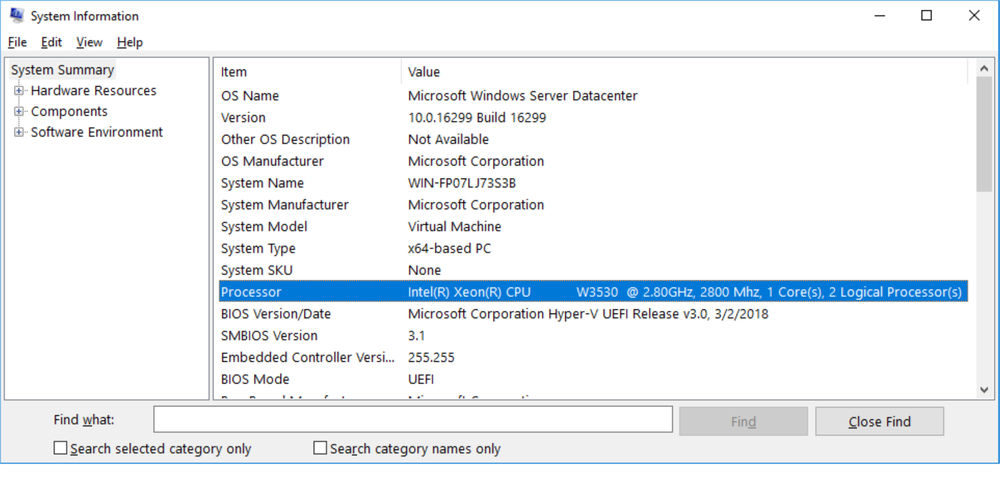
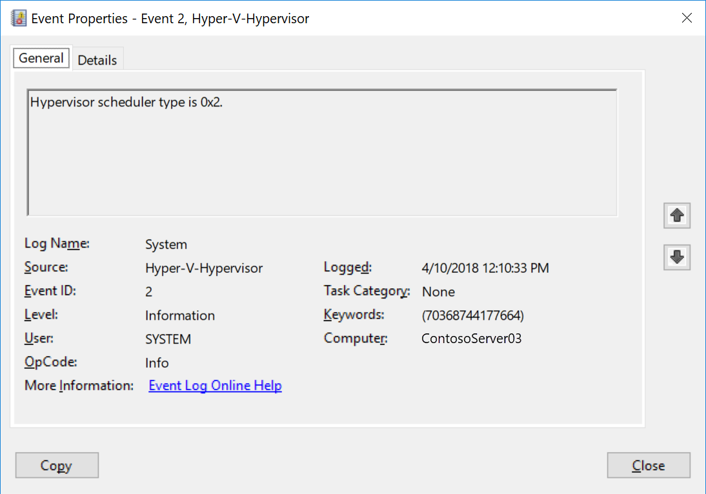
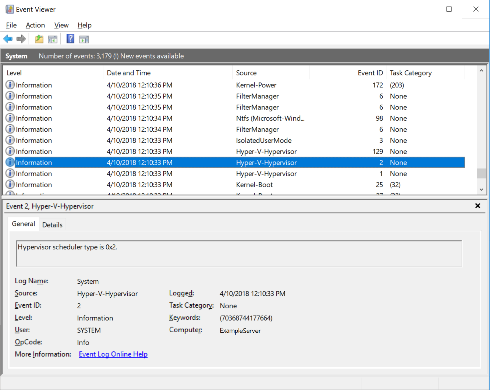
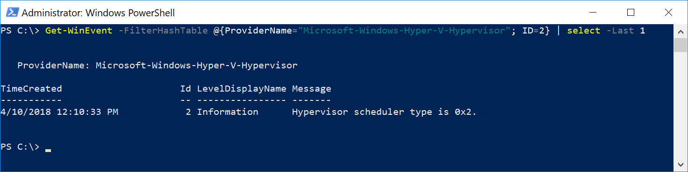

# Managing Hyper-V hypervisor scheduler types

>Applies To: Windows 10, Windows Server 2016, Windows Server, version 1709, Windows Server, version 1803,Windows Server 2019

This article describes new modes of virtual processor scheduling logic first introduced in Windows Server 2016. These modes, or scheduler types, determine how the Hyper-V hypervisor allocates and manages work across guest virtual processors. A Hyper-V host administrator can select hypervisor scheduler types that are best suited for the guest virtual machines (VMs) and configure the VMs to take advantage of the scheduling logic.

>[!NOTE]
>Updates are required to use the hypervisor scheduler features described in this document. For details, see [Required updates](#required-updates).

## Background

Before discussing the logic and controls behind Hyper-V virtual processor scheduling, it's helpful to review the basic concepts covered in this article.

### Understanding SMT

Simultaneous multithreading, or SMT, is a technique utilized in modern processor designs that allows the processor's resources to be shared by separate, independent execution threads. SMT generally offers a modest performance boost to most workloads by parallelizing computations when possible, increasing instruction throughput, though no performance gain or even a slight loss in performance may occur when contention between threads for shared processor resources occurs.
Processors supporting SMT are available from both Intel and AMD. Intel refers to their SMT offerings as Intel Hyper Threading Technology, or Intel HT.

For the purposes of this article, the descriptions of SMT and how it is utilized by Hyper-V apply equally to both Intel and AMD systems.

* For more information on Intel HT Technology, refer to [Intel Hyper-Threading Technology](https://www.intel.com/content/www/us/en/architecture-and-technology/hyper-threading/hyper-threading-technology.html)

* For more information on AMD SMT, refer to [The "Zen" Core Architecture](https://www.amd.com/en/technologies/zen-core)

## Understanding how Hyper-V virtualizes processors

Before considering hypervisor scheduler types, it's also helpful to understand the Hyper-V architecture. You can find a general summary in [Hyper-V Technology Overview](https://docs.microsoft.com/windows-server/virtualization/hyper-v/hyper-v-technology-overview). These are important concepts for this article:

* Hyper-V creates and manages virtual machine partitions, across which compute resources are allocated and shared, under control of the hypervisor. Partitions provide strong isolation boundaries between all guest virtual machines, and between guest VMs and the root partition.

* The root partition is itself a virtual machine partition, although it has unique properties and much greater privileges than guest virtual machines. The root partition provides the management services that control all guest virtual machines, provides virtual device support for guests, and manages all device I/O for guest virtual machines. Microsoft strongly recommends not running any application workloads in the root partition.

* Each virtual processor (VP) of the root partition is mapped 1:1 to an underlying logical processor (LP). A host VP will always run on the same underlying LP – there is no migration of the root partition's VPs.

* By default, the LPs on which host VPs run can also run guest VPs.

* A guest VP may be scheduled by the hypervisor to run on any available logical processor. While the hypervisor scheduler takes care to consider temporal cache locality, NUMA topology, and many other factors when scheduling a guest VP, ultimately the VP could be scheduled on any host LP.

## Hypervisor scheduler types

Starting with Windows Server 2016, the Hyper-V hypervisor supports several modes of scheduler logic, which determine how the hypervisor schedules virtual processors on the underlying logical processors. These scheduler types are:

- [The classic, fair-share scheduler](#the-classic-scheduler)
- [The core scheduler](#the-core-scheduler)
- [The root scheduler](#the-root-scheduler)

### The classic scheduler

The classic scheduler has been the default for all versions of the Windows Hyper-V hypervisor since its inception, including Windows Server 2016 Hyper-V. The classic scheduler provides a fair share, preemptive round- robin scheduling model for guest virtual processors.

The classic scheduler type is the most appropriate for the vast majority of traditional Hyper-V uses – for private clouds, hosting providers, and so on. The performance characteristics are well understood and are best optimized to support a wide range of virtualization scenarios, such as over-subscription of VPs to LPs, running many heterogeneous VMs and workloads simultaneously, running larger scale high performance VMs, supporting the full feature set of Hyper-V without restrictions, and more.

### The core scheduler

The hypervisor core scheduler is a new alternative to the classic scheduler logic, introduced in Windows Server 2016 and Windows 10 version 1607. The core scheduler offers a strong security boundary for guest workload isolation, and reduced performance variability for workloads inside of VMs that are running on an SMT-enabled virtualization host. The core scheduler allows running both SMT and non-SMT virtual machines simultaneously on the same SMT-enabled virtualization host.

The core scheduler utilizes the virtualization host's SMT topology, and optionally exposes SMT pairs to guest virtual machines, and schedules groups of guest virtual processors from the same virtual machine onto groups of SMT logical processors. This is done symmetrically so that if LPs are in groups of two, VPs are scheduled in groups of two, and a core is never shared between VMs.
When the VP is scheduled for a virtual machine without SMT enabled, that VP will consume the entire core when it runs.

The overall result of the core scheduler is that:

* Guest VPs are constrained to run on underlying physical core pairs, isolating a VM to processor core boundaries, thus reducing vulnerability to side-channel snooping attacks from malicious VMs.

* Variability in throughput is significantly reduced.

* Performance is potentially reduced, because if only one of a group of VPs can run, only one of the instruction streams in the core executes while the other is left idle.

* The OS and applications running in the guest virtual machine can utilize SMT behavior and programming interfaces (APIs) to control and distribute work across SMT threads, just as they would when run non-virtualized.

* A strong security boundary for guest workload isolation - Guest VPs are constrained to run on underlying physical core pairs, reducing vulnerability to side-channel snooping attacks.

The core scheduler will be used by default starting in Windows Server 2019. On Windows Server 2016, the core scheduler is optional and must be explicitly enabled by the Hyper-V host administrator, and the classic scheduler is the default.

#### Core scheduler behavior with host SMT disabled

If the hypervisor is configured to use the core scheduler type but the SMT capability is disabled or not present on the virtualization host, then the hypervisor will use the classic scheduler behavior, regardless of the hypervisor scheduler type setting.

### The root scheduler

The root scheduler was introduced with Windows 10 version 1803. When the root scheduler type is enabled, the hypervisor cedes control of work scheduling to the root partition. The NT scheduler in the root partition's OS instance manages all aspects of scheduling work to system LPs.

The root scheduler addresses the unique requirements inherent with supporting a utility partition to provide strong workload isolation, as used with Windows Defender Application Guard (WDAG). In this scenario, leaving scheduling responsibilities to the root OS offers several advantages. For example, CPU resource controls applicable to container scenarios may be used with the utility partition, simplifying management and deployment. In addition, the root OS scheduler can readily gather metrics about workload CPU utilization inside the container and use this data as input to the same scheduling policy applicable to all other workloads in the system. These same metrics also help clearly attribute work done in an application container to the host system. Tracking these metrics is more difficult with traditional virtual machine workloads, where some work on all running VM's behalf takes place in the root partition.

#### Root scheduler use on client systems

Starting with Windows 10 version 1803, the root scheduler is used by default on client systems only, where the hypervisor may be enabled in support of virtualization-based security and WDAG workload isolation, and for proper operation of future systems with heterogeneous core architectures. This is the only supported hypervisor scheduler configuration for client systems. Administrators should not attempt to override the default hypervisor scheduler type on Windows 10 client systems.

#### Virtual Machine CPU resource controls and the root scheduler

The virtual machine processor resource controls provided by Hyper-V are not supported when the hypervisor root scheduler is enabled as the root operating system's scheduler logic is managing host resources on a global basis and does not have knowledge of a VM's specific configuration settings. The Hyper-V per-VM processor resource controls, such as caps, weights, and reserves, are only applicable where the hypervisor directly controls VP scheduling, such as with the classic and core scheduler types.

#### Root scheduler use on server systems

The root scheduler is not recommended for use with Hyper-V on servers at this time, as its performance characteristics have not yet been fully characterized and tuned to accommodate the wide range of workloads typical of many server virtualization deployments.

## Enabling SMT in guest virtual machines

Once the virtualization host's hypervisor is configured to use the core scheduler type, guest virtual machines may be configured to utilize SMT if desired. Exposing the fact that VPs are hyperthreaded to a guest virtual machine allows the scheduler in the guest operating system and workloads running in the VM to detect and utilize the SMT topology in their own work scheduling. On Windows Server 2016, guest SMT is not configured by default and must be explicitly enabled by the Hyper-V host administrator. Starting with Windows Server 2019, new VMs created on the host will inherit the host's SMT topology by default.  That is, a version 9.0 VM created on a host with 2 SMT threads per core would also see 2 SMT threads per core.

PowerShell must be used to enable SMT in a guest virtual machine; there is no user interface provided in Hyper-V Manager.
To enable SMT in a guest virtual machine, open a PowerShell window with sufficient permissions, and type:

``` powershell
Set-VMProcessor -VMName <VMName> -HwThreadCountPerCore <n>
```

Where <n> is the number of SMT threads per core the guest VM will see.  
Note that <n> = 0 will set the HwThreadCountPerCore value to match the host's SMT thread count per core value.

>[!NOTE] 
>Setting HwThreadCountPerCore = 0 is supported beginning with Windows Server 2019.

Below is an example of System Information taken from the guest operating system running in a virtual machine with 2 virtual processors and SMT enabled. The guest operating system is detecting 2 logical processors belonging to the same core.



## Configuring the hypervisor scheduler type on Windows Server 2016 Hyper-V

Windows Server 2016 Hyper-V uses the classic hypervisor scheduler model by default. The hypervisor can be optionally configured to use the core scheduler, to increase security by restricting guest VPs to run on corresponding physical SMT pairs, and to support the use of virtual machines with SMT scheduling for their guest VPs.

>[!NOTE]
>Microsoft recommends that all customers running Windows Server 2016 Hyper-V select the core scheduler to ensure their virtualization hosts are optimally protected against potentially malicious guest VMs.

## Windows Server 2019 Hyper-V defaults to using the core scheduler

To help ensure Hyper-V hosts are deployed in the optimal security configuration, Windows Server 2019 Hyper-V will now use the core hypervisor scheduler model by default. The host administrator may optionally configure the host to use the legacy classic scheduler. Administrators should carefully read, understand and consider the impacts each scheduler type has on the security and performance of virtualization hosts prior to overriding the scheduler type default settings.  See [Understanding Hyper-V scheduler type selection](https://docs.microsoft.com/windows-server/virtualization/hyper-v/manage/understanding-hyper-v-scheduler-type-selection) for more information.

### Required updates

>[!NOTE]
>The following updates are required to use the hypervisor scheduler features described in this document. These updates include changes to support the new 'hypervisorschedulertype' BCD option, which is necessary for host configuration.

| Version | Release  | Update Required | KB Article |
|--------------------|------|---------|-------------:|
|Windows Server 2016 | 1607 | 2018.07 C | [KB4338822](https://support.microsoft.com/help/4338822/windows-10-update-kb4338822) |
|Windows Server 2016 | 1703 | 2018.07 C | [KB4338827](https://support.microsoft.com/help/4338827/windows-10-update-kb4338827) |
|Windows Server 2016 | 1709 | 2018.07 C | [KB4338817](https://support.microsoft.com/help/4338817/windows-10-update-kb4338817) |
|Windows Server 2019 | 1804 | None | None |

## Selecting the hypervisor scheduler type on Windows Server

The hypervisor scheduler configuration is controlled via the hypervisorschedulertype BCD entry.

To select a scheduler type, open a command prompt with administrator privileges:

``` command
     bcdedit /set hypervisorschedulertype type
```

Where `type` is one of:

* Classic
* Core
* Root

The system must be rebooted for any changes to the hypervisor scheduler type to take effect.

>[!NOTE]
>The hypervisor root scheduler is not supported on Windows Server Hyper-V at this time. Hyper-V administrators should not attempt to configure the root scheduler for use with server virtualization scenarios.

## Determining the current scheduler type

You can determine the current hypervisor scheduler type in use by examining the System log in Event Viewer for the most recent hypervisor launch event ID 2, which reports the hypervisor scheduler type configured at hypervisor launch. Hypervisor launch events can be obtained from the Windows Event Viewer, or via PowerShell.

Hypervisor launch event ID 2 denotes the hypervisor scheduler type, where:

    1 = Classic scheduler, SMT disabled

    2 = Classic scheduler

    3 = Core scheduler

    4 = Root scheduler





### Querying the Hyper-V hypervisor scheduler type launch event using PowerShell

To query for hypervisor event ID 2 using PowerShell, enter the following commands from a PowerShell prompt.

``` powershell
Get-WinEvent -FilterHashTable @{ProviderName="Microsoft-Windows-Hyper-V-Hypervisor"; ID=2} -MaxEvents 1
```


