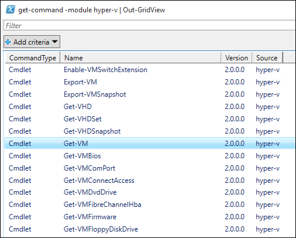
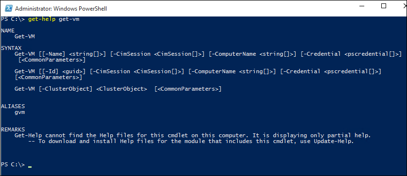

# Working with Hyper-V and Windows PowerShell

Now that you have walked through the basics of deploying Hyper-V, creating virtual machines and managing these virtual machines, let’s explore how you can automate many of these activities with PowerShell.

## Return a list of Hyper-V commands

1. Select the Windows start button, and then type **PowerShell**.

1. Run the following command to display a searchable list of PowerShell commands available with the Hyper-V PowerShell Module.

 ```powershell
Get-Command -Module hyper-v | Out-GridView
```

  You get something like this:

  

1. To learn more about a particular PowerShell command use `Get-Help`. For instance, running the following command returns information about the `Get-VM` Hyper-V command.

    ```powershell
    Get-Help Get-VM
    ```

    The output shows you how to structure the command, what the required and optional parameters are, and the aliases that you can use.

    

## Return a list of virtual machines

Use the `Get-VM` command to return a list of virtual machines.

1. In PowerShell, run the following command:

     ```powershell
     Get-VM
     ```

     This displays something like this:

     

1. To return a list of only powered on virtual machines add a filter to the `Get-VM` command. A filter can be added by using the `Where-Object` command. For more information on filtering, see [Using the Where-Object](/previous-versions/windows/it-pro/windows-powershell-1.0/ee177028(v=technet.10)) documentation.

     ```powershell
     Get-VM | where {$_.State -eq 'Running'}
     ```

1. To list all virtual machines in a powered off state, run the following command. This command is a copy of the command from step 2 with the filter changed from 'Running' to 'Off'.

     ```powershell
     Get-VM | where {$_.State -eq 'Off'}
     ```

## Start and shut down virtual machines

1. To start a particular virtual machine, run the following command with name of the virtual machine:

     ```powershell
     Start-VM -Name <virtual machine name>
     ```

1. To start all currently powered off virtual machines, get a list of those machines and pipe the list to the `Start-VM` command:

    ```powershell
    Get-VM | where {$_.State -eq 'Off'} | Start-VM
    ```

1. To shut down all running virtual machines, run the following command:

  ```powershell
  Get-VM | where {$_.State -eq 'Running'} | Stop-VM
  ```

## Create a virtual machine checkpoint

To create a checkpoint using PowerShell, select the virtual machine using the `Get-VM` command and pipe this to the `Checkpoint-VM` command. Finally give the checkpoint a name using `-SnapshotName`. The complete command looks like the following:

  ```powershell
  Get-VM -Name <VM Name> | Checkpoint-VM -SnapshotName <name for snapshot>
  ```

## Create a new virtual machine

The following example shows how to create a new virtual machine in the PowerShell Integrated Scripting Environment (ISE). This is a simple example and could be expanded on to include additional PowerShell features and more advanced VM deployments.

1. To open the PowerShell ISE click on start, type **PowerShell ISE**.

1. Run the following code to create a virtual machine. See the [New-VM](/powershell/module/hyper-v/new-vm) documentation for detailed information on the `New-VM` command.

     ```powershell
      $VMName = "VMNAME"
    
      $VM = @{
          Name = $VMName
          MemoryStartupBytes = 2147483648
          Generation = 2
          NewVHDPath = "C:\Virtual Machines\$VMName\$VMName.vhdx"
          NewVHDSizeBytes = 53687091200
          BootDevice = "VHD"
          Path = "C:\Virtual Machines\$VMName"
          SwitchName = (Get-VMSwitch).Name
      }
    
      New-VM @VM
     ```

## Wrap up and References

This document has shown some simple steps to explore the Hyper-V PowerShell module as well as some sample scenarios. For more information on the Hyper-V PowerShell module, see the [Hyper-V Cmdlets in Windows PowerShell reference](/powershell/module/hyper-v/index).  
