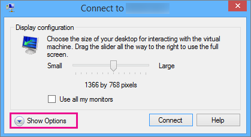
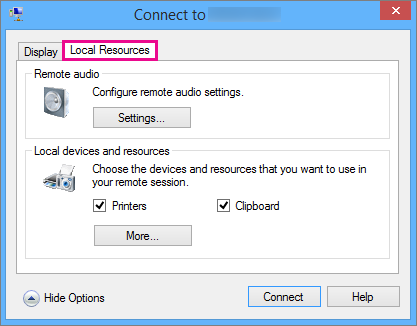
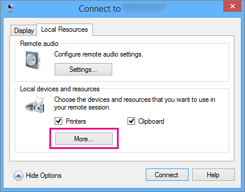
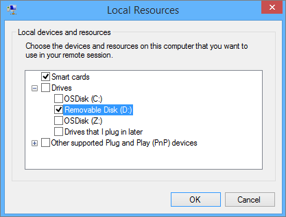
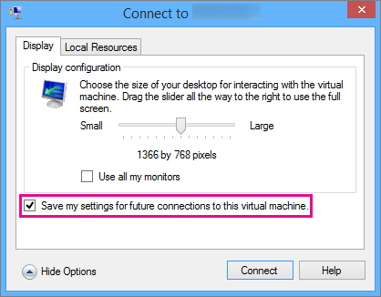

# Use local resources on Hyper-V virtual machine with VMConnect

Virtual Machine Connection (VMConnect) lets you use a computer's local resources in a virtual machine, like a removable USB flash drive or a printer. Enhanced session mode also lets you resize the VMConnect window. This article shows you how to configure the host and then give the virtual machine access to a local resource.

Enhanced session mode and Type clipboard text are available only for virtual machines that run recent Windows operating systems. See [Requirements for using local resources](#requirements-for-using-local-resources).

For virtual machines that run Ubuntu, see [Changing Ubuntu Screen Resolution in a Hyper-V VM](/archive/blogs/virtual_pc_guy/changing-ubuntu-screen-resolution-in-a-hyper-v-vm).

## Choose a local resource

Local resources include printers, the clipboard, and local drive(s) on the computer where you're running VMConnect. For more information, see [Requirements for using local resources](#requirements-for-using-local-resources).

To choose a local resource:

1. Open VMConnect.

1. Select the virtual machine that you want to connect to.

1. Select **Show options**.

    

1. Select **Local resources**.

    

1. Select **More**.

    

1. Select the drive that you want to use on the virtual machine and click **Ok**.

    

1. Select **Save my settings for future connections to this virtual machine**.

    

1. Select **Connect**.

The path to the local drive shared to the virtual machine, in a Windows-based guest VM, is located at **This PC** under **Redirected drives and folders**. The path for a Linux-based guest VM is located at **/home/shared-drives**.

## Edit VMConnect settings

You can easily edit your connection settings for VMConnect by running the following command in Windows PowerShell or the command prompt:

`VMConnect.exe <ServerName> <VMName> /edit`

> [!Note]
> An elevated command prompt may be required.

## Requirements for using local resources

To be able to use a computer's local resources on a virtual machine:

- The Hyper-V host must have **Enhanced session mode policy** and **Enhanced session mode** settings turned on.

- The computer on which you use VMConnect must run at least Windows 10, or Windows Server 2016.

- The virtual machine must have Remote Desktop Services enabled, and run at least Windows 10, or Windows Server 2016.

If the computer running VMConnect and the virtual machine both meet the requirements, you can use any of the following local resources if they're available:

- Display configuration

- Audio

- Printers

- Clipboards for copy and paste

- Smart cards

- USB devices

- Drives

- Supported plug and play devices

## Why use a computer's local resources?

You may want to use the computer's local resources to:

- Troubleshoot a virtual machine without a network connection to the virtual machine.

- Copy and paste files to and from the virtual machine in the same way you copy and paste using a Remote Desktop Connection (RDP).

- Sign in to the virtual machine by using a smart card.

- Print from a virtual machine to a local printer.

- Test and troubleshoot developer applications that require USB and sound redirection without using RDP.

## See also

- [Hyper-V Virtual Machine Connection](/windows-server/virtualization/hyper-v/learn-more/hyper-v-virtual-machine-connect)

- [Should I create a generation 1 or 2 virtual machine in Hyper-V?](plan/Should-I-create-a-generation-1-or-2-virtual-machine-in-Hyper-V.md)

