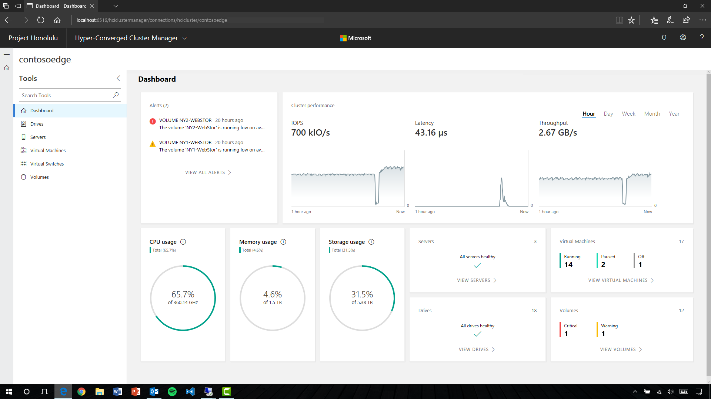

# What’s New in Windows Server 2019 Insider Preview Builds 
The features listed below are available in preview builds of Windows Server 2019 via the Windows Insider Program for Server. To obtain the Insider software downloads, registered Insiders may navigate directly to the [Windows Server Insider Preview download page](https://www.microsoft.com/en-us/software-download/windowsinsiderpreviewserver). If you have not yet registered as an Insider, see [Getting started with Server](https://insider.windows.com/en-us/for-business-getting-started-server/). 

We also encourage you to visit the [Windows Server Insiders space](https://techcommunity.microsoft.com/t5/Windows-Server-Insiders/bd-p/WindowsServerInsiders) on the [Microsoft Tech Communities forum](https://techcommunity.microsoft.com/) to collaborate, share, and learn from experts.

<b>Extending your Clusters with Cluster Sets</b>

“Cluster Sets” is the new cloud scale-out technology that increases cluster node count in a single SDDC (Software-Defined Data Center) cloud by orders of magnitude. A Cluster Set is a loosely-coupled grouping of multiple Failover Clusters: compute, storage or hyper-converged. Cluster Sets technology enables virtual machine fluidity across member clusters within a Cluster Set and a unified storage namespace across the "set" in support of virtual machine fluidity.  While preserving existing Failover Cluster management experiences on member clusters, a Cluster Set instance additionally offers key use cases around lifecycle management of a Cluster Set at the aggregate.

<b>Windows Defender Advanced Threat Protection</b>

We provide deep platform sensors and response actions, providing visibility to memory and kernel level attacker activities and abilities to take actions on compromised machines in response to incidents such as remote collection of additional forensic data, remediating malicious files, terminating malicious processes etc. 
 
If you’re already using Windows Defender Advanced Threat Protection (ATP), preview these features by simply installing the latest preview build of Windows Server, and onboard it to Windows Defender ATP. 

Otherwise, sign up for the Windows Defender ATP trial on [Windows
Defender Advanced Threat
Protection](https://www.microsoft.com/en-us/windowsforbusiness/windows-atp).

<b>Windows Defender ATP Exploit Guard</b>

Windows Defender ATP Exploit Guard is a new set of host-intrusion
prevention capabilities. The four components of Windows Defender Exploit
Guard are designed to lock down the device against a wide variety of
attack vectors and block behaviors commonly used in malware attacks,
while enabling enterprises to balance their security risk and
productivity requirements.

-   <b><a href="https://docs.microsoft.com/en-us/windows/threat-protection/windows-defender-exploit-guard/attack-surface-reduction-exploit-guard?ocid=cx-blog-mmpc">Attack Surface Reduction
    (ASR)</a></b>:
    A set of controls that enterprises can enable to prevent malware
    from getting on the machine by blocking suspicious malicious files
    (for example, Office files), scripts, lateral movement, ransomware
    behavior, and email-based threats.

-   [**Network
    protection**](https://docs.microsoft.com/en-us/windows/threat-protection/windows-defender-exploit-guard/network-protection-exploit-guard?ocid=cx-blog-mmpc):
    Protects the endpoint against web-based threats by blocking any
    outbound process on the device to untrusted hosts/IP addresses
    through Windows Defender SmartScreen.

-   [**Controlled folder
    access**](https://blogs.technet.microsoft.com/mmpc/2017/10/23/stopping-ransomware-where-it-counts-protecting-your-data-with-controlled-folder-access?ocid=cx-blog-mmpc):
    Protects sensitive data from ransomware by blocking untrusted
    processes from accessing your protected folders.

-   [**Exploit
    protection**](https://docs.microsoft.com/en-us/windows/threat-protection/windows-defender-exploit-guard/exploit-protection-exploit-guard?ocid=cx-blog-mmpc):
    A set of mitigations for vulnerability exploits (replacing EMET)
    that can be easily configured to protect your system and
    applications.

To deploy a default set of Exploit Guard policy on Windows Server, run
the following cmdlets:
<pre>
Set-MpPreference -EnableControlledFolderAccess Enabled

Set-MpPreference -EnableNetworkProtection Enabled

Add-MpPreference -AttackSurfaceReductionRules\_Ids
75668C1F-73B5-4CF0-BB93-3ECF5CB7CC84
-AttackSurfaceReductionRules\_Actions Enabled

Add-MpPreference -AttackSurfaceReductionRules\_Ids
3B576869-A4EC-4529-8536-B80A7769E899
-AttackSurfaceReductionRules\_Actions Enabled

Add-MpPreference -AttackSurfaceReductionRules\_Ids
D4F940AB-401B-4EfC-AADC-AD5F3C50688A
-AttackSurfaceReductionRules\_Actions Enabled

Add-MpPreference -AttackSurfaceReductionRules\_Ids
D3E037E1-3EB8-44C8-A917-57927947596D
-AttackSurfaceReductionRules\_Actions Enabled

Add-MpPreference -AttackSurfaceReductionRules\_Ids
5BEB7EFE-FD9A-4556-801D-275E5FFC04CC
-AttackSurfaceReductionRules\_Actions Enabled

Add-MpPreference -AttackSurfaceReductionRules\_Ids
BE9BA2D9-53EA-4CDC-84E5-9B1EEEE46550
-AttackSurfaceReductionRules\_Actions Enabled

Add-MpPreference -AttackSurfaceReductionRules\_Ids
92E97FA1-2EDF-4476-BDD6-9DD0B4DDDC7B
-AttackSurfaceReductionRules\_Actions Enabled

Add-MpPreference -AttackSurfaceReductionRules\_Ids
D1E49AAC-8F56-4280-B9BA-993A6D77406C
-AttackSurfaceReductionRules\_Actions Disabled

Add-MpPreference -AttackSurfaceReductionRules\_Ids
01443614-cd74-433a-b99e-2ecdc07bfc25
-AttackSurfaceReductionRules\_Actions Enabled

$url = 'https://demo.wd.microsoft.com/Content/ProcessMitigation.xml'

Invoke-WebRequest $url -OutFile ProcessMitigation.xml

Write-Host "Enabling Exploit Protection"

Set-ProcessMitigation -PolicyFilePath ProcessMitigation.xml
</pre>

<b>Windows Defender Application Control</b>

Windows Defender Application Control—also known as Code Integrity (CI) policy—was released in Windows Server 2016. Customer feedback has suggested that it is a great concept, but hard to deploy. To address this, we are building default CI policies, which will allow all Windows in-box files and Microsoft applications, such as SQL Server, and block known executables that can bypass CI.  

The package contains an audit version and an enforced version. If the server doesn’t require additional drivers/applications, you can deploy the enforced version. Otherwise, you can use the audit policy, check uncovered executables, and then merge them into the default CI policy. 

To deploy the default code integrity policy, run the following commands:

Copy-Item C:\\CI\\ServerDefault-EnforcedCI.bin
C:\\Windows\\System32\\CodeIntegrity\\SiPolicy.p7b

Reboot the server to allow code integrity service to load the policy.

<b>Failover Cluster removing use of NTLM authentication</b>

Windows Server Failover Clusters no longer use NTLM authentication by exclusively using Kerberos and certificate based authentication.  There are no changes required by the user, or deployment tools,  to take advantage of this security enhancement.  It also allows failover clusters to be deployed in environments where NTLM has been disabled. 

<b>Shielded virtual machines – Offline mode, VMConnect and Linux support</b>

You can now run [shielded virtual
machines](https://docs.microsoft.com/en-us/windows-server/virtualization/guarded-fabric-shielded-vm/guarded-fabric-and-shielded-vms)
on machines with intermittent connectivity to the Host Guardian Service
by leveraging the new fallback HGS and offline mode features. Fallback
HGS allows you to configure a second set of URLs for Hyper-V to try if
it can't reach your primary HGS server. To see how this can be used in a
branch-office scenario, see [Improved branch office support for shielded
VMs in Windows Server, version
1709](https://blogs.technet.microsoft.com/datacentersecurity/2017/11/15/improved-branch-office-support-for-shielded-vms-in-windows-server-version-1709/)
on our blog. [Offline
mode](https://docs.microsoft.com/en-us/windows-server/virtualization/guarded-fabric-shielded-vm/guarded-fabric-manage-branch-office#offline-mode)
allows you to continue to start up your shielded VMs, even if HGS can't
be reached, as long as the VM has started successfully once, and the
host's security configuration has not changed. (To enable offline mode,
run the following command on the Host Guardian Service:
**Set-HgsKeyProtectionConfiguration –AllowKeyMaterialCaching**.)

We've also made it easier to troubleshoot your shielded virtual machines
by enabling support for VMConnect Enhanced Session Mode and PowerShell
Direct. These tools are particularly useful if you've lost network
connectivity to your VM and need to update its configuration to restore
access. These features do not need to be configured, and they will
automatically become available when a shielded VM is placed on a Hyper-V
host running build 17040 or later.

For customers who run mixed-OS environments, we now support running
Ubuntu, Red Hat Enterprise Linux, and SUSE Linux Enterprise Server
inside shielded virtual machines. Try it out—[Create a Linux shielded VM
template
disk](https://docs.microsoft.com/en-us/windows-server/virtualization/guarded-fabric-shielded-vm/guarded-fabric-create-a-linux-shielded-vm-template)—and
send us your feedback in the Feedback Hub.

<b>Encrypted Network in SDN</b>

Network traffic going out from a VM host can be snooped on and/or
manipulated by anyone with access to the physical fabric. While shielded
VMs protect VM data from theft and manipulation, similar protection is
required for network traffic to and from a VM. While the tenant can
setup protection such as IPSEC, this is difficult due to configuration
complexity and heterogeneous environments.

Encrypted Networks is a feature which provides simple to configure
DTLS-based encryption using the Network Controller to manage the
end-to-end encryption and protect data as it travels through the wires
and network devices between the hosts It is configured by the
Administrator on a per-subnet basis.  This enables the VM to VM traffic
within the VM subnet to be automatically encrypted as it leaves the host
and prevents snooping and manipulation of traffic on the wire. This is
done without requiring any configuration changes in the VMs themselves.
Try it out—[Configure Encryption for a Virtual
Subnet](https://docs.microsoft.com/en-us/windows-server/networking/sdn/vnet-encryption/sdn-config-vnet-encryption)—and
send us your feedback in the Feedback Hub.

If you are using Storage Spaces Direct, take a look at another area to
explore for this release: performance history for Storage Spaces Direct.

<b>Software Defined Datacenter</b>
If you are using Storage Spaces Direct, take a look at  performance history for Storage Spaces Direct. 

<b>Performance history for Storage Spaces Direct</b>

Administrators of [Storage Spaces
Direct](https://docs.microsoft.com/windows-server/storage/storage-spaces/storage-spaces-direct-overview)
can now get easy access to historical performance and capacity data from
their cluster. *Did CPU usage spike last night? When did this drive
become slow? Which virtual machine used the most memory last month? Is
network activity trending up or down? The cluster is pushing 1,000,000
IOPS – is that my new record?* Previously, you'd need external tooling
to answer these questions. No more!

Beginning in build 17090, beautiful new charts in [Project
Honolulu](https://docs.microsoft.com/en-us/windows-server/manage/honolulu/honolulu-manage-hci)
(and new PowerShell cmdlets, for those so inclined) empower you to
answer these questions. There's nothing to install, configure, or
start—it's built-in and always-on. Learn more at
<https://aka.ms/clusterperformancehistory>.

*Caption: New charts in Project Honolulu, powered by built-in cluster
performance history.*

