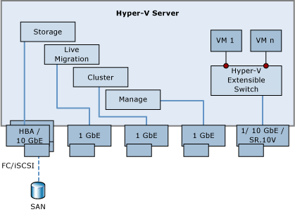

# Building Your Cloud Infrastructure: Non-Converged Data Center Configuration
This document contains the instructions that you need to follow to create a private or public cloud configuration that uses:  
  
-   Separate network adapters for live migration, cluster, management, and tenant traffic  
  
-   Traditional SAN storage  
  
-   Optionally use Single Root I\/O Virtualization \(SR\-IOV\)  
  
The design pattern discussed in this document is one of three design patterns we suggest for building the core cloud compute and storage infrastructure. For information about the other two cloud infrastructure design patterns, please see:  
  
-   [Converged Data Center without Dedicated Storage Nodes](assetId:///f38e1f6b-c18f-4135-9641-517754281570)  
  
-   [Converged Datacenter with File Server Storage](assetId:///d266e62d-8a95-4c03-9276-9aa6ac0c0474)  
  
## Design Considerations and Requirements for the Non\-Converged Data Center Configuration Pattern  
The Non\-Converged Data Center Configuration cloud infrastructure design pattern focuses on the following key requirements in the areas of networking, compute and storage:  
  
### Networking  
  
-   You have an existing investment in separate networks based on the recommended configuration of Hyper\-V in [!INCLUDE[firstref_server_7](../Token/firstref_server_7_md.md)] and you require that this physical network traffic segmentation be kept in place to avoid re\-architecting your network. Each type of infrastructure traffic \(management, cluster\/CSV, Live Migration and storage\) and tenant traffic are carried over physically separate networks and network adapters. This requirement is met by installing physically separate NICs for each traffic type and assigning VLAN 802.1q tags to each adapter.  
  
-   You require that each traffic type is dedicated to a specific adapter.  This requirement is met by configuring each of the traffic flows to use the correct subnet\/IP on the dedicated NIC.  
  
-   You require that the virtual machine workload has access to the highest network performance possible. This requirement is met by using the new [!INCLUDE[win8_server_1](../Token/win8_server_1_md.md)] Single Root I\/O Virtualization \(SR\-IOV\) feature, which enables the virtual machines running on the Hyper\-V server to have direct access to the network adapter hardware, thus bypassing the virtual networking stack.  
  
### Storage  
  
-   You have an existing investment in FC or iSCSI SANs and require well\-connected storage so that all members of the Hyper\-V failover cluster are connected to block storage. This requirement is met by configuring your Hyper\-V hosts to keep using the traditional SAN storage. Each member of the Hyper\-V failover cluster can connect to iSCSI, Fibre Channel or Fibre Channel over Ethernet.  
  
-   You require that each member of the Hyper\-V failover cluster be able to access the shared storage. This requirement is met by using [!INCLUDE[win8_server_2](../Token/win8_server_2_md.md)] Failover Clustering and Cluster Shared Volumes Version 2 \(CSV v2\) volumes to store virtual machine files and metadata.  
  
### Compute  
  
-   You require that you are able to reuse previous Hyper\-V hardware that ran Windows Server 2008 R2 server. This requirement is met by reusing previous hardware and making a single change to the hardware configuration, which is to add a 10GbE network adapter that supports SR\-IOV. Alternatively, you could use a 1 GbE adapter and not deploy SR\-IOV. In this document we will demonstrate how to use SR\-IOV.  
  
-   You require that access to virtual machines is resilient to hardware failure. This requirement can be met by using [!INCLUDE[win8_server_2](../Token/win8_server_2_md.md)] Failover Clustering together with the Hyper\-V Server Role.  
  
## Overview  
A [!INCLUDE[win8_server_2](../Token/win8_server_2_md.md)] cloud infrastructure is a high\-performing and highly available Hyper\-V cluster that hosts virtual machines that can be managed to create private or public clouds using the Non\-Converged Data Center Configuration infrastructure design pattern. This document explains how to configure the basic building blocks for such a cloud. It does not cover the System Center or other management software aspects of deployments; the focus is on configuring the core Windows Server hosts that are used to build cloud infrastructure.  
  
This cloud configuration consists of the following:  
  
-   Multiple computers in a Hyper\-V failover cluster.  
  
    A Hyper\-V cluster is created using the [!INCLUDE[win8_server_2](../Token/win8_server_2_md.md)] Failover Cluster feature. The [!INCLUDE[win8_server_2](../Token/win8_server_2_md.md)] Failover Clustering feature set is tightly integrated with the Hyper\-V server role and enables a high level of availability from a compute and networking perspective. In addition, [!INCLUDE[win8_server_2](../Token/win8_server_2_md.md)] Failover Clustering enhances virtual machine mobility which is critical in a cloud environment.  
  
-   A non\-converged networking infrastructure that supports multiple cloud traffic profiles.  
  
    Each computer in the Hyper\-V failover cluster must have enough network adapters installed to support each traffic type that needs to be isolated from other traffic types. In most cases, this will include network adapters that are assigned to infrastructure traffic such as management, cluster\/CSV, and Live Migration. If you decide to use an Ethernet\-based storage protocol \(such as iSCSI or FCoE\), then you will also need a network adapter for the storage traffic. The infrastructure traffic network adapters in this scenario are non\-teamed 1 GB adapters, although you can use 10 GB adapters or mix 1 GB and 10 GB adapters for the infrastructure traffic types you need to support. The tenant traffic adapter is a 10 GB adapter that supports SR\-IOV.  
  
-   SAN\-based storage what can be Ethernet or non\-Ethernet based. Storage options include iSCSI, Fibre Channel, Fibre Channel over Ethernet or Infiniband.  
  
-   The appropriate networking hardware to connect all of the computers in the Hyper\-V cluster to each other and to a larger network from which the hosted virtual machines are available.  
  
This configuration highlights the following technologies and features of [!INCLUDE[win8_server_2](../Token/win8_server_2_md.md)]:  
  
-   **Failover Clustering**: A failover cluster is a group of independent computers that work together to increase the availability and scalability of clustered roles \(formerly called clustered applications and services\). The clustered servers \(called nodes\) are connected by physical cables and by software. If one or more of the cluster nodes fail, other nodes begin to provide service \(a process known as failover\). In addition, the clustered roles are proactively monitored to verify that they are working properly. If they are not working, they are restarted or moved to another node. With the Failover Clustering feature, users experience a minimum of disruptions in service.  
  
-   **Single Root I\/O Virtualization**: Single Root I\/O Virtualization \(SR\-IOV\) is a standard introduced by the PCI\-SIG. SR\-IOV works in conjunction with system chipset support for virtualization technologies. This provides remapping of interrupts and DMA and allows SR\-IOV capable devices to be assigned directly to a virtual machine. Hyper\-V in [!INCLUDE[win8_server_2](../Token/win8_server_2_md.md)] enables support for SR\-IOV–capable network devices and allows an SR\-IOV virtual function of a physical network adapter to be assigned directly to a virtual machine. This increases network throughput and reduces network latency, while also reducing the host CPU overhead required for processing network traffic.  
  
## Non\-Converged Data Center Configuration Scenario Overview  
The Non\-Converged Data Center Configuration scenario includes the following:  
  
-   Multiple computers in a Hyper\-V failover cluster  
  
-   Separate 1 GB network adapters over which live migration, cluster, management, and tenant traffic traverse.  
  
-   One 10 GB adapter that is dedicated to tenant traffic that supports SR\-IOV. Note that in this scenario that all traffic bypasses the Hyper\-V virtual switch, so all traffic isolation depends on the capabilities of the unique SR\-IOV may provide in this area.  
  
-   SAN storage based on iSCSI, Fibre Channel, Fibre Channel over Ethernet or Infiniband.  
  
Figure 1 shows the Non\-Converged Data Center configuration. The following are the salient aspects of this cloud infrastructure design pattern:  
  
-   SAN connectivity is enabled either via an HBA or 10 GB Ethernet connection \(depending on the type of SAN deployed\)  
  
-   Live Migration, Cluster\/CSV and management traffic is assigned to separate 1 GB network adapters  
  
-   Virtual machine workloads connect to the tenant network using a 10 GB SR\-IOV capable adapter. The Hyper\-V extensible switch is configured to support SR\-IOV to enable the virtual machine to communicate directly with the adapter hardware.  
  
  
  
**Figure 1 High level overview of cluster member networking configuration**  
  
> [!NOTE]  
> At least one Active Directory Domain Services \(AD DS\) domain controller is needed for centralized security and management of the cluster member computers \(not shown\). It must be reachable by all of the cluster member computers, including the members of the shared storage cluster. DNS services are also required and are not depicted.  
  
The following sections describe how to set up this cloud configuration using UI\-based tools and Windows PowerShell.  
  
-   After the cloud is built, you can validate the configuration by doing the following:  
  
-   Install and configure virtual machines  
  
-   Migrate running virtual machines between servers in the Hyper\-V cluster \(live migration\)  
  
-   Failover storage from one owner to another  
  
## Install and configure  
Creating this cloud infrastructure configuration consists of the following steps:  
  
-   Step 1: Initial node configuration  
  
-   Step 2: Initial network configuration  
  
-   Step 3: Initial storage configuration  
  
-   Step 4: Failover cluster setup  
  
-   Step 5: Configure Hyper\-V settings  
  
-   Step 6: Cloud validation  
  
The following table summarizes the steps that this document describes:  
  
|||||  
|-|-|-|-|  
|Step|Task|Target|Tasks|  
|1|Initial Node Configuration|All Nodes|<ul><li>1.1\-Upgrade the machine to the latest BIOS and enable BIOS settings required for Hyper\-V and SR\-IOV</li><li>1.2\-Perform a clean operating system installation</li><li>1.3\-Perform post installation tasks:<br /><br /><ul><li>Set Windows PowerShell execution policy</li><li>Enable Windows PowerShell remoting</li><li>Enable Remote Desktop Protocol and Firewall rule</li><li>Join the domain</li></ul></li><li>1.4\-Install roles and features using default settings, rebooting as needed<br /><br /><ul><li>Hyper\-V \(plus management tools\)</li><li>Failover clustering \(plus management tools\)</li></ul></li></ul>|  
|2|Initial Network Configuration|All Nodes|-   2.1\-Disable unused and disconnected interfaces and rename active connections \(static IP addresses on all interfaces\)|  
|3|Initial Storage Configuration|Single Node|-   3.1\-Present all shared storage to relevant nodes<br />-   3.2\-For multipath scenarios, install and configure multipath I\/O \(MPIO\) as necessary|  
|4|Failover Cluster Setup|Single Node|<ul><li>4.1\-Run through the Cluster Validation Wizard</li><li>4.2\-Address any indicated warnings and\/or errors</li><li>4.3\-Complete the Create Cluster Wizard \(setting name and IP address but do not add eligible storage\)</li><li>4.4\-Create a witness disk</li><li>4.5\-Create a virtual machine storage disk</li><li>4.6\-Add the virtual machine storage disk to cluster shared volumes</li><li>4.7\-Add folders to the cluster shared volume:<br /><br /><ul><li>C:\\ClusterStorage\\Volume1\\VHDdisks\\</li><li>C:\\ClusterStorage\\Volume1\\VHDsettings\\</li></ul></li><li>4.8\-Configure quorum settings</li><li>4.9\-Configure cluster networks to prioritize traffic</li></ul>|  
|5|Hyper\-V Configuration|All Nodes|<ul><li>5.1\-Create the virtual switch</li><li>5.2\-Change default file locations, mapping to CSV volumes:<br /><br /><ul><li>C:\\ClusteredStroage\\Volume1\\VHDfiles\\</li><li>C:\\ClusterStorage\\Volume1\\VHDsettings\\</li></ul></li></ul>|  
|6|Cloud Validation|Single Node|-   6.1\-Create a virtual machine, attaching an existing operating system VHD and tagging to the appropriate VLAN<br />-   6.2\-Test network connectivity from the virtual machine<br />-   6.3\-Perform a Live Migration<br />-   6.4\-Perfomr a quick migration|  
  
### Step 1: Initial node configuration  
In step 1, you will perform the following steps on all nodes of the Hyper\-V cluster:  
  
-   1.1 Upgrade the machine to the latest BIOS release and enable BIOS settings for Hyper\-V and SR\-IOV.  
  
-   1.2 Perform a clean operating system installation.  
  
-   1.3 Perform post\-installation tasks.  
  
-   1.4 Install roles and features using the default settings.  
  
#### 1.1 Enable BIOS settings required for Hyper\-V for SR\-IOV  
You will need to enable virtualization support in the BIOS of each cluster member prior to installing the Hyper\-V server role. The procedure for enabling processor virtualization support will vary with your processors' make and model and the system BIOS. In addition, if you choose to enable SR\-IOV, this capability will need to be enabled in the system BIOS. Please refer to your hardware documentation for the appropriate procedures. In addition, make sure to upgrade your servers with their latest BIOS revision.  
  
#### 1.2 Perform a clean operating system installation  
Install [!INCLUDE[win8_server_2](../Token/win8_server_2_md.md)] using the Full Installation option.  
  
#### 1.3 Perform post\-installation tasks  
There are several tasks you need to complete on each node after the operating system installation is complete. These include:  
  
-   Join each node to the domain  
  
-   Enable remote access to each node via the Remote Desktop Protocol.  
  
-   Set the Windows PowerShell execution policy.  
  
-   Enable Windows PowerShell remoting.  
  
Perform the following steps to join each node to the domain:  
  
1.  Press the **Windows Key** on the keyboard and then press **R**. Type **Control Panel** and then click **OK**.  
  
2.  In the **Control Panel** window, click **System and Security**, and then click **System**.  
  
3.  In the **System** window under **Computer name, domain, and workgroup settings**, click **Change settings**.  
  
4.  In the **System Properties** dialog box, click **Change**.  
  
5.  Under **Member of**, click **Domain**, type the name of the domain, and then click **OK**.  
  
Run the following Windows PowerShell commands on each node to enable remote access using the Remote Desktop Protocol, to enable PowerShell execution policy and enable PowerShell Remoting:  
  
```  
(Get-WmiObject Win32_TerminalServiceSetting -Namespace root\cimv2\terminalservices).SetAllowTsConnections(1,1)  
Set-ExecutionPolicy Unrestricted –Force  
Enable-PSRemoting –Force  
```  
  
#### 1.4 Install roles and features using the default settings  
The following roles and features will be installed on each node of the cluster:  
  
-   Hyper\-V and Hyper\-V management Tools  
  
-   Failover cluster and failover cluster management tools  
  
Perform the following steps on each node in the cluster to install the required roles and features:  
  
1.  In **Server Manager**, click **Dashboard** in the console tree.  
  
2.  In **Welcome to Server Manager**, click **2 Add roles and features**, and then click **Next**.  
  
3.  On the **Before You Begin** page of the **Add Roles and Features Wizard**, click **Next**.  
  
4.  On the **Installation Type** page, click **Next**.  
  
5.  On the **Server Selection** page, click **Next**.  
  
6.  On the **Server Roles** page, select **Hyper\-V** from the **Roles** list. In the **Add Roles and Features Wizard** dialog box, click **Add Features**. Click **Next**.  
  
7.  On the **Features** page, select **Failover Clustering** from the **Features** list. In the **Add Roles and Features Wizard** dialog box, click **Add Features**. Click Next.  
  
    > [!NOTE]  
    > If you plan to use Multipath I\/O for your storage solution, select the Multipath I\/O feature while performing step 7.  
  
8.  On the **Hyper\-V** page, click **Next**.  
  
9. On the **Virtual Switches** page, click **Next**.  
  
10. On the **Migration** page, click **Next**.  
  
11. On the **Default Stores** page, click **Next**.  
  
12. On the **Confirmation** page, put a checkmark in the **Restart the destination server automatically if required** checkbox and then in the **Add Roles and Features** dialog box click **Yes**, then click **Install**.  
  
13. On the **Installation progress** page, click **Close** after the installation has succeeded.  
  
14. Restart the computer. This process might require restarting the computer twice. If so, the installer will trigger the multiple restarts automatically.  
  
After you restart the server, open **Server Manager** and confirm that the installation completed successfully. Click **Close** on the **Installation Progress** page.  
  
### Step 2: Initial network configuration  
The network configuration on each node in the cluster needs to be configured to support the non\-converged networking scenario where all traffic types move through their own dedicated network adapters. You will perform the following procedures on each of the nodes in the cluster to complete the initial network configuration:  
  
-   2.1 Disable unused and disconnected interfaces and rename active connections.  
  
#### 2.1 Disable unused and disconnected interfaces and rename active connections  
You can simplify the configuration and avoid errors when running the wizards and running PowerShell commands by disabling all network interfaces that are either unused or disconnected. You can disable these network interfaces in the **Network Connections** window.  
  
For the remaining network adapters, do the following:  
  
1.  Connect them to the network switch ports.  
  
2.  Configure appropriate IP addressing information for each network adapter based on your network addressing scheme for each traffic type. Make sure that each traffic type is assigned to a different network ID \(subnet ID\).  
  
3.  To help you more easily recognize the active network adapters, rename them with names that indicate their use or their connection to the intranet or Internet \(for example, **ManagementNet** and **LiveMigrationNet** and **ClusterNet** and **TenantNet**\). You can do this in the **Network Connections** window.  
  
> [!NOTE]  
> Configure a DNS server and default gateway address only on the management interface adapter.  
  
### Step 3: Initial storage configuration  
With the initial cluster node configuration complete, you are ready to perform initial storage configuration tasks on all nodes of the cluster. Initial storage configuration tasks include:  
  
-   3.1 Present all shared storage to relevant nodes.  
  
-   3.2 Install and configure MPIO as necessary for multipath scenarios.  
  
#### 3.1 Present all shared storage to relevant nodes  
Connect the host bus adapter \(HBA\) fiber optic cables to a FC hub or switch that is connected to the storage device. Each cluster node should have two HBAs in them if high availability of storage access is required.  
  
Configure the storage device with the appropriate RAID settings and volumes \(LUNs\) so that the storage on the device is available from the Disk Management console of the Computer Management snap\-in of each cluster member computer.  
  
For the first computer that is attached to the storage, create the following from this storage space:  
  
-   A 1 GB NTFS volume that may be used for the cluster witness disk.  
  
-   An NTFS volume with an appropriate amount of space that will be used to store the virtual machine folders and files of the Hyper\-V cluster.  
  
#### 3.2 Install and configure MPIO as necessary for multipath scenarios  
If you have multiple data paths to storage \(for example, two SAS cards\) make sure to install the Microsoft® Multipath I\/O \(MPIO\) on each node. This step might require you to restart the system. For more information about MPIO, see [What's New in Microsoft Multipath I\/O](http://technet.microsoft.com/library/dd878505(v=ws.10).aspx).  
  
### Step 4: Failover cluster setup  
You are now ready to complete the failover cluster settings. Failover cluster setup includes the following steps:  
  
-   4.1 Run through the Cluster Validation Wizard.  
  
-   4.2 Address any indicated warnings and\/or errors.  
  
-   4.3 Complete the Create Failover Cluster Wizard.  
  
-   4.4 Create the witness virtual disk.  
  
-   4.5 Create the virtual machine storage virtual disk.  
  
-   4.6 Add the virtual machine storage virtual disk and Witness disk to Cluster Shared Volumes.  
  
-   4.7 Add folders to the cluster shared volume.  
  
-   4.8 Configure Quorum Settings.  
  
-   4.9 Configure cluster networks to prioritize traffic.  
  
#### 4.1 Run through the Cluster Validation Wizard  
The Cluster Validation Wizard will query multiple components in the intended cluster hosts and confirm that the hardware and software is ready to support failover clustering. On one of the nodes in the server cluster, perform the following steps to run the Cluster Validation Wizard:  
  
1.  In the **Server Manager**, click **Tools**, and then click **Failover Cluster Manager**.  
  
2.  In the **Failover Cluster Manager** console, in the **Management** section, click **Validate Configuration**.  
  
3.  On the **Before You Begin** page of the **Validate a Configuration Wizard**, click **Next**.  
  
4.  On the **Select Servers or a Cluster** page, type the name of the local server, and then click **Add**. After the name appears in the **Selected servers** list, type the name of another Hyper\-V cluster member computer, and then click **Add**. Repeat this step for all computers in the Hyper\-V cluster. When all of the servers of the Hyper\-V cluster appear in the **Selected servers** list, click **Next**.  
  
5.  On the **Testing Options** page, click **Next**.  
  
6.  On the **Confirmation** page, click **Next**. The time to complete the validation process will vary with the number of nodes in the cluster and can take some time to complete.  
  
7.  On the **Summary** page, the summary text will indicate that the configuration is suitable for clustering. Confirm that there is a checkmark in the **Create the cluster now using the validated nodes...** checkbox.  
  
#### 4.2 Address any indicated warnings and\/or errors  
Click the **Reports** button to see the results of the Cluster Validation. Address any issues that have led to cluster validation failure. After correcting the problems, run the Cluster Validation Wizard again. After the cluster passes validation, then proceed to the next step. Note that you may see errors regarding disk storage. You may see this if you haven't yet initialized the disks. Click **Finish**.  
  
#### 4.3 Complete the Create Failover Cluster Wizard  
After passing cluster validation, you are ready to complete the cluster configuration.  
  
Perform the following steps to complete the cluster configuration:  
  
1.  On the **Before You Begin** page of the **Create Cluster Wizard**, click **Next**.  
  
2.  On the **Access Point for Administering the Cluster** page, enter a [valid NetBIOS name](http://support.microsoft.com/kb/188997) for the cluster, and then select the network you want the cluster on and then type in a static IP address for the cluster object, and then click **Next**. In this example, the network you would select is the Management Network. Unselect all other networks that appear here.  
  
3.  On the **Confirmation** page, clear **Add all eligible storage to the cluster** checkbox and then click **Next**.  
  
4.  On the **Creating New Cluster** page you will see a progress bar as the cluster is created.  
  
5.  On the **Summary** page, click **Finish**.  
  
6.  In the console tree of the **Failover Cluster Manager** snap\-in, open the **Networks** node under the cluster name.  
  
7.  Right\-click the cluster network that corresponds to the management network adapter network ID \(subnet\), and then click **Properties**. On the **General** tab, confirm that **Allow cluster communications on this network** is *not* selected and that **Allow clients to connect through this network** is enabled. In the **Name** text box, enter a friendly name for this network \(for example, ManagmentNet\), and then click **OK**.  
  
8.  Right\-click the cluster network that corresponds to the Cluster network adapter network ID \(subnet\) and then click **Properties**. On the **General** tab, confirm that **Allow cluster communications on this network** is selected and that **Allow clients to connect through this network** is not enabled. In the **Name** text box, enter a friendly name for this network \(for example, ClusterNet\), and then click **OK**.  
  
9. Right\-click the cluster network that corresponds to the live migration network adapter network ID \(subnet\) and then click **Properties**. On the **General** tab, confirm that **Allow cluster communications on this network** is selected and that **Allow clients to connect through this network** is not enabled. In the **Name** text box, enter a friendly name for this network \(for example, LiveMigrationNet\), and then click **OK**.  
  
#### 4.4 Create the witness disk  
You will need a disk of at least 1 GB and a volume on it formatted as NTFS to use it as a witness disk. Later you will use this disk when you configure the quorum model.  
  
#### 4.5 Create the virtual machine storage disk  
You will next need to a disk that you will place the virtual machine disk and configuration files on. This disk can be of any size but should be large enough to support the number of virtual machines you want to run on the cluster. You can use multiples disks if you like. This disk must have volumes on it that are formatted as NTFS so that they can be placed into a cluster shared volume.  
  
#### 4.6 Add the virtual machine storage disk and Witness disk to Cluster Shared Volumes  
The disk you created for virtual machine storage is now ready to be added to a Cluster Shared Volume. Perform the following steps to add the virtual disk to a Cluster Shared Volume.  
  
1.  In the **Failover Cluster Manager**, in the left pane of the console, expand the **Storage** node and click **Disks**. In the middle pane of the console, in the **Disks** section, right click the disk you created in the previous step and then click **Add to Cluster Shared Volumes**.  
  
2.  Repeat step 1 to add the witness disk to a cluster shared volume.  
  
#### 4.7 Add folders to the cluster shared volume  
Now you need to create the folders on the disk located on the Cluster Shared Volume to store the virtual machine files and the virtual machine data files.  
  
Perform the following steps to create the folders that will store the running VMs of the Hyper\-V cluster:  
  
1.  Open **Windows Explorer** and navigate to the C: drive and then double\-click **Cluster Storage** and then double\-click **Volume 1**.  
  
2.  Create two folders in **Volume 1**. One of the folders will contain the .vhd files for the virtual machines \(for example, VHDdisks\) and one folder will contain the virtual machine configuration files \(for example, VHDsettings\)  
  
#### 4.8 Configure Quorum Settings  
Perform the following steps to configure quorum settings for the cluster:  
  
1.  In the left pane of the **Failover Cluster Manager** console, right click on the name of the cluster and click **More Actions** and click **Configure Cluster Quorum Settings**.  
  
2.  On the **Before You Begin** page, click **Next**.  
  
3.  On the **Quorum Configuration Option** page, select **Use typical settings \(recommended\)** and click **Next**.  
  
4.  On the **Confirmation** page, click **Next**.  
  
#### 4.9 Configure cluster networks to prioritize traffic  
The cluster will use the network with the lowest metric for CSV traffic and the second lowest metric for live migration. Windows PowerShell® is the only method available to prescriptively specify the CSV network.  
  
Run the following Windows PowerShell commands on one node of the failover cluster to set the metric for the cluster network traffic, set the metric for the live migration network traffic and set the metric for the management network traffic:  
  
```  
(Get-ClusterNetwork "ClusterNet" ).Metric = 100  
(Get-ClusterNetwork "LiveMigrationNet" ).Metric = 500  
(Get-ClusterNetwork "ManagementNet" ).Metric = 1000.  
```  
  
### Step 5: Configure Hyper\-V settings  
To finalize the Hyper\-V configuration, you will need to:  
  
-   5.1 Create the Hyper\-V virtual switch  
  
-   5.2 Change default file locations for virtual machine files.  
  
#### 5.1 Create the Hyper\-V virtual switch  
On *each Hyper\-V cluster member*, perform the following steps to create the Hyper\-V virtual switch that will be used by the tenant virtual machines:  
  
1.  Right\-click the network icon in the notification area of the desktop, and then click **Open Network and Sharing Center**.  
  
2.  From the **Network and Sharing Center** window, click **Change adapter settings**.  
  
3.  In the **Network Connections** window, double\-click the adapter with the name of the network adapter that is attached to the tenant subnet \(for example, TenantNet\), and then click **Details**.  
  
4.  In the **Network Connections Details** window, note the value of the **Description** field, and then click **Close**. You will need this information to determine which physical network adapter to bind to the virtual switch.  
  
5.  In the console tree of the **Hyper\-V Manager**, right\-click the name of the server, and then click **Virtual Switch Manager**.  
  
6.  In **Create virtual switch**, click **External**, and then click **Create virtual switch**.  
  
7.  In **Name**, enter a name for the virtual network to indicate that it is connected to the tenant subnet \(for example, **TenantNetSwitch**\).  
  
8.  On **External**, select the description of the network adapter attached to the Tenant subnet, as noted in step 7, select **Enable Single\-Root I\/O Virtualization \(SR\-IOV\)**, and then click **OK**.  
  
    > [!NOTE]  
    > If your hardware does not support SR\-IOV or if SR\-IOV is not enabled in the BIOS, the option will not be available. You can use the Get\-NetAdapterSriov command to help make this assessment [http:\/\/technet.microsoft.com\/library\/jj130915.aspx](http://technet.microsoft.com/library/jj130915.aspx)  
  
9. When prompted with the **Apply Networking Changes** window, click **Yes**.  
  
    > [!NOTE]  
    > If you are performing these steps over a remote desktop connection, you will temporarily lose connectivity.  
  
#### 5.2 Change default file locations for virtual machine files  
On *each Hyper\-V cluster member*, perform the following steps to change the default file locations for virtual machine files:  
  
1.  In **Server Manager**, click **Tools**, then click **Hyper\-V Manager**.  
  
2.  From the console tree of the **Hyper\-V Manager**, right\-click the name of the Hyper\-V server, and then click **Hyper\-V Settings**.  
  
3.  In the **Hyper\-V Settings** dialog box, click **Virtual Hard Disks** under **Server**, type the path to the folder where the virtual hard disk files are stored or use the **Browse** button in **Specify the default folder to store virtual hard disk files**, and then click **Apply**.  
  
4.  Click **Virtual Machines under Server**, type the file folder location or use the **Browse** button in **Specify the default folder to store virtual machine configuration files**, and then click **OK**  
  
### Step 6: Cloud validation  
To verify the configuration of your cloud environment, perform the following operations.  
  
-   6.1 Create a new virtual machine.  
  
-   6.2 Test network connectivity from the virtual machine.  
  
-   6.3 Perform a live migration.  
  
-   6.4 Perform a quick migration.  
  
#### 6.1 Create a new virtual machine  
To create a new virtual machine in the cluster environment, perform the following steps.  
  
1.  **Open Failover Cluster Manager**, click **Roles** under the cluster name, click **Virtual Machines** under the **Actions** pane, and then click **New Virtual Machine**.  
  
2.  On the **New Virtual Machine** page, select the cluster node where you want to create the virtual machine, and then click **OK**.  
  
3.  On the **Before you Begin** page of the **New Virtual Machine Wizard**, click **Next**.  
  
4.  On the **Specify Name and Location** page, enter a friendly name for this virtual machine and then click **Next**.  
  
5.  On the **Assign Memory** page, enter the amount of memory that will be used for this virtual machine \(minimum for this lab is 1024 MB RAM\) and then click **Next**.  
  
6.  On the **Configuring Networking** page, select the **TenantNetSwitch** and then click **Next**.  
  
7.  On the **Connect Virtual Hard Disk** page, leave the default options selected and click **Next**.  
  
8.  On the **Installation Options** page, select **Install an operating system from a boot CD\/DVD\-ROM** and then select the location where the CD\/DVD is located. If you are installing the new operating system based on an ISO file, make sure to select the option Image file \(.iso\) and browse for the file location. After you select the appropriate option for your scenario, click **Next**.  
  
9. On the **Completing the New Virtual Machine Wizard** page, review the options, and then click **Finish**.  
  
10. The virtual machine creation process starts. After it is finished, you will see the **Summary** page, where you can access the report created by the wizard. If the virtual machine was created successfully, click **Finish**.  
  
At this point your virtual machine is created and you should use the Failover Cluster Manager to start the virtual machine and perform the operating system installation according to the operating system that you choose. For the purpose of this validation, the guest operating system can be any Windows Server version.  
  
#### 6.2 Test network connectivity from the virtual machine  
Once you finish installing the operating system in the virtual machine you should log on and verify if this virtual machine was able to obtain IP address from the enterprise network. Assuming that in this network you have a DHCP server, this virtual machine should be able to obtain the IP address. To perform the basic network connectivity test use the following approach.  
  
-   Use `ping` command for a reachable IP address in the same subnet.  
  
-   Use `ping` command for the same destination but now using the full qualified domain name for the destination host. The goal here is to test basic name resolution.  
  
    > [!NOTE]  
    > You may need to open Windows Firewall with Advanced Security and create a new rule to allow Internet Control Message Protocol \(ICMP\) before performing the previous tests. This may be true for other hosts you want to ping − confirm that the host\-based firewall on the target allows for ICMP Echo Requests.  
  
After you confirm that this basic test is working properly, leave a command prompt window open and enter the command ping <Destination\_IP\_Address\_or\_FQDN> \-t. The goal here is to have a continuous test while you perform the live migration to the second node.  
  
> [!NOTE]  
> If you prefer to work with PowerShell, instead of the ping command you can use the **Test\-Connection** command. This cmdlet provides you a number of connectivity testing options that exceed what is available with the simple ping command.  
  
#### 6.3 Perform a live migration  
To perform a live migration of this virtual machine from the current cluster node to the other node in the cluster, perform the following steps.  
  
1.  In the **Failover Cluster Manager**, click **Roles** under the cluster name. On the Roles pane, right click the virtual machine that you created, click **Move**, click **Live Migration**, and then click **Select Node**.  
  
2.  On the **Move Virtual Machine** page, select the node that you want to move the virtual machine to and click **OK**.  
  
You will notice in the **Status** column when the live migration starts, it will take some time for the **Information** column to update the current state of the migration. While the migration is taking place you can go back to the virtual machine that has the ping running and observe if there is any packet loss.  
  
#### 6.4 Perform a quick migration  
To perform the quick migration of this virtual machine from the current node to the other one, perform the following steps.  
  
1.  On the **Failover Cluster Manager**, click **Roles** under the cluster name. In the **Roles** pane, right\-click the virtual machine that you created, click **Move**, click **Quick Migration** and then click **Select Node**.  
  
2.  On the **Move Virtual Machine** window, select the node that you want to move the virtual machine to, and then click **OK**.  
  
You will notice in the status that the quick migration will start faster than the live migration did. While the migration is taking place you can go back to the virtual machine that has the ping running and observe if there is any packet loss.  
  
