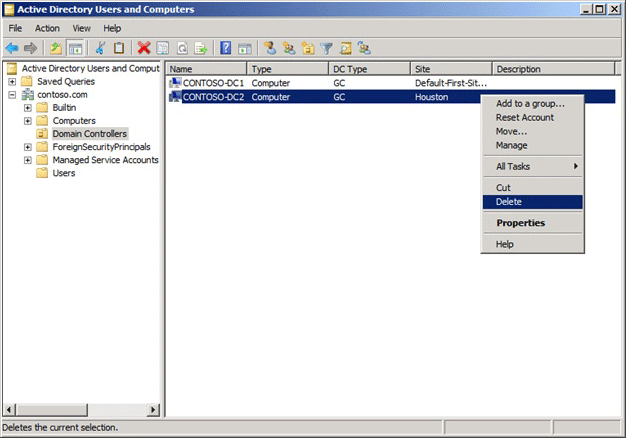

# Clean Up Server Metadata
  Metadata cleanup is a required procedure after a forced removal of Active Directory Domain Services \(AD DS\). You perform metadata cleanup on a domain controller in the domain of the domain controller that you forcibly removed. Metadata cleanup removes data from AD DS that identifies a domain controller to the replication system. Metadata cleanup also removes File Replication Service \(FRS\) and Distributed File System \(DFS\) Replication connections and attempts to transfer or seize any operations master \(also known as flexible single master operations or FSMO\) roles that the retired domain controller holds.  
  
 You can clean up server metadata by using the following:  
  
-   [Clean up server metadata by using GUI tools](#bkmk_graphical)  
  
-   [Clean up server metadata using the command line](#bkmk_commandline)  
  
-   [Clean up server metadata by using a script](#bkmk_script)  
  
> [!NOTE]  
>  If you receive an “Access is denied” error when you use any of these methods to perform metadata cleanup, make sure that the computer object and the NTDS Settings object for the domain controller are not protected against accidental deletion. To verify this right\-click the computer object or the NTDS Settings object, click **Properties**, click **Object**, and clear the **Protect object from accidental deletion** check box. In Active Directory Users and Computers, the **Object** tab of an object appears if you click **View** and then click **Advanced Features**.  
  
##   Clean up server metadata by using GUI tools  
 When you use Remote Server Administration Tools \(RSAT\) or the Active Directory Users and Computers console \(Dsa.msc\) that is included with [!INCLUDE[nextref_longhorn](../Token/nextref_longhorn_md.md)] or [!INCLUDE[nextref_server_7](../Token/nextref_server_7_md.md)] to delete a domain controller computer account from the Domain Controllers organizational unit \(OU\), the cleanup of server metadata is performed automatically. Previously, you had to perform a separate metadata cleanup procedure.  
  
 You can also use the Active Directory Sites and Services console \(Dssite.msc\) to delete a domain controller’s computer account, which also completes metadata cleanup automatically. However, Active Directory Sites and Services removes the metadata automatically only when you first delete the NTDS Settings object below the computer account in Dssite.msc.  
  
 As long as you are using the [!INCLUDE[nextref_longhorn](../Token/nextref_longhorn_md.md)], [!INCLUDE[nextref_server_7](../Token/nextref_server_7_md.md)], or RSAT versions of Dsa.msc or Dssite.msc, you can clean up metadata automatically for domain controllers running earlier versions of Windows operating systems.  
  
 Membership in **Domain Admins**, or equivalent, is the minimum required to complete these procedures. [!INCLUDE[review_details](../Token/review_details_md.md)]  
  
#### To clean up server metadata by using Active Directory Users and Computers  
  
1.  Open Active Directory Users and Computers: On the **Start** menu, point to **Administrative Tools**, and then click **Active Directory Users and Computers**.  
  
2.  If you have identified replication partners in preparation for this procedure and if you are not connected to a replication partner of the removed domain controller whose metadata you are cleaning up, right\-click **Active Directory Users and Computers \<DomainControllerName\>**, and then click **Change Domain Controller**. Click the name of the domain controller from which you want to remove the metadata, and then click **OK**.  
  
3.  Expand the domain of the domain controller that was forcibly removed, and then click **Domain Controllers**.  
  
4.  In the details pane, right\-click the computer object of the domain controller whose metadata you want to clean up, and then click **Delete**.  
  
       
  
5.  In the **Active Directory Domain Services** dialog box, click **Yes** to confirm the computer object deletion.  
  
6.  In the **Deleting Domain Controller** dialog box, select **This Domain Controller is permanently offline and can no longer be demoted using the Active Directory Domain Services Installation Wizard \(DCPROMO\)**, and then click **Delete**.  
  
       
  
7.  If the domain controller is a global catalog server, in the **Delete Domain Controller** dialog box, click **Yes** to continue with the deletion.  
  
8.  If the domain controller currently holds one or more operations master roles, click **OK** to move the role or roles to the domain controller that is shown.  
  
     You cannot change this domain controller. If you want to move the role to a different domain controller, you must move the role after you complete the server metadata cleanup procedure.  
  
#### To clean up server metadata by using Active Directory Sites and Services  
  
1.  Open Active Directory Sites and Services: On the **Start** menu, point to **Administrative Tools**, and then click **Active Directory Sites and Services**.  
  
2.  If you have identified replication partners in preparation for this procedure and if you are not connected to a replication partner of the removed domain controller whose metadata you are cleaning up, right\-click **Active Directory Users and Computers \<DomainControllerName\>**, and then click **Change Domain Controller**. Click the name of the domain controller from which you want to remove the metadata, and then click **OK**.  
  
3.  Expand the site of the domain controller that was forcibly removed, expand **Servers**, expand the name of the domain controller, right\-click the NTDS Settings object, and then click **Delete**.  
  
       
  
4.  In the **Active Directory Domain Services** dialog box, click **Yes** to confirm the NTDS Settings deletion.  
  
5.  In the **Deleting Domain Controller** dialog box, select **This Domain Controller is permanently offline and can no longer be demoted using the Active Directory Domain Services Installation Wizard \(DCPROMO\)**, and then click **Delete**.  
  
       
  
6.  If the domain controller is a global catalog server, in the **Delete Domain Controller** dialog box, click **Yes** to continue with the deletion.  
  
7.  If the domain controller currently holds one or more operations master roles, click **OK** to move the role or roles to the domain controller that is shown.  
  
8.  Right\-click the domain controller that was forcibly removed, and then click Delete.  
  
       
  
9. In the **Active Directory Domain Services** dialog box, click **Yes** to confirm the domain controller deletion.  
  
##   Clean up server metadata using the command line  
 As an alternative, you can clean up metadata by using Ntdsutil.exe, a command\-line tool that is installed automatically on all domain controllers and servers that have Active Directory Lightweight Directory Services \(AD LDS\) installed. Ntdsutil.exe is also available on computers that have RSAT installed.  
  
#### To clean up server metadata by using Ntdsutil  
  
1.  Open a command prompt as an administrator: On the **Start** menu, right\-click **Command Prompt**, and then click **Run as administrator**. If the **User Account Control** dialog box appears, provide Enterprise Admins credentials, if required, and then click **Continue**.  
  
2.  At the command prompt, type the following command, and then press ENTER:  
  
     `ntdsutil`  
  
3.  At the `ntdsutil:` prompt, type the following command, and then press ENTER:  
  
     `metadata cleanup`  
  
4.  At the `metadata cleanup:` prompt, type the following command, and then press ENTER:  
  
     `remove selected server <ServerName>`  
  
     Or  
  
     `remove selected server <ServerName1> on <ServerName2>`  
  
    |Value|Description|  
    |-----------|-----------------|  
    |ntdsutil: metadata cleanup|Initiates removal of objects that refer to a decommissioned domain controller.|  
    |remove selected server|Removes objects for a specified, decommissioned domain controller from a specified server.|  
    |\<ServerName\> or \<ServerName1\>|The distinguished name of the domain controller whose metadata you want to remove, in the form cn\=*ServerName*,cn\=Servers,cn\=*SiteName*, cn\=Sites,cn\=Configuration,dc\=*ForestRootDomain*. If you specify only one server name, the objects are removed from the current domain controller.|  
    |on \<ServerName2\>|Specifies removing server metadata on \<ServerName2\>, the Domain Name System \(DNS\) name of the domain controller to which you want to connect. If you have identified replication partners in preparation for this procedure, specify a domain controller that is a replication partner of the removed domain controller.|  
  
5.  In **Server Remove Configuration Dialog**, review the information and warning, and then click **Yes** to remove the server object and metadata.  
  
     At this point, Ntdsutil confirms that the domain controller was removed successfully. If you receive an error message that indicates that the object cannot be found, the domain controller might have been removed earlier.  
  
6.  At the `metadata cleanup:` and `ntdsutil:` prompts, type `quit`, and then press ENTER.  
  
7.  To confirm removal of the domain controller:  
  
     Open Active Directory Users and Computers. In the domain of the removed domain controller, click **Domain Controllers**. In the details pane, an object for the domain controller that you removed should not appear.  
  
     Open Active Directory Sites and Services. Navigate to the **Servers** container and confirm that the server object for the domain controller that you removed does not contain an NTDS Settings object. If no child objects appear below the server object, you can delete the server object. If a child object appears, do not delete the server object because another application is using the object.  
  
##   Clean up server metadata by using a script  
 Another option for cleaning up server metadata is to use a script. For information about using a script to clean up metadata, see Remove Active Directory Domain Controller Metadata \([http:\/\/go.microsoft.com\/fwlink\/?LinkID\=123599](http://go.microsoft.com/fwlink/?LinkID=123599)\).  
  
## See Also  
 [Delete a Server Object from a Site](../Topic/Delete-a-Server-Object-from-a-Site.md)   
 [Clean up server metadata \(Windows Server 2003\)](assetId:///012793ee-5e8c-4a5c-9f66-4a486a7114fd)  
  
  