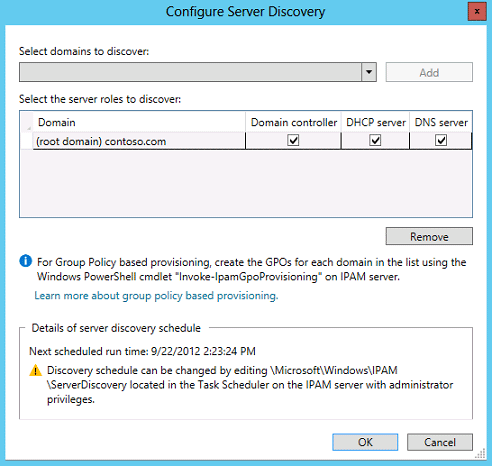

# Configure Server Discovery
[Checklist: Deploy IPAM Server](../Topic/Checklist--Deploy-IPAM-Server.md) > [Install IPAM Server](../Topic/Install-IPAM-Server.md) > [Choose an IPAM Provisioning Method](../Topic/Choose-an-IPAM-Provisioning-Method.md) > **Configure Server Discovery**  
  
After you complete selection of an IPAM provisioning method, you can configure server discovery. When you configure server discovery, you are defining the domains that the IPAM server can monitor and manage \(also called the scope of discovery\). An IPAM server can monitor and manage multiple domains as long as they are part of the same Active Directory forest as the IPAM server.  
  
You can modify the scope of discovery at any time. For more information, see [Getting Started with IPAM](../Topic/Getting-Started-with-IPAM.md).  
  
Membership in the **Administrators** group, or equivalent, is the minimum required to complete this procedure. [!INCLUDE[review_details](../Token/review_details_md.md)]  
  
## Configuring server discovery  
Use the following procedure to configure server discovery.  
  
#### To configure server discovery  
  
1.  On the IPAM Overview page, click **Configure server discovery**. The **Configure Server Discovery** dialog box will open.  
  
2.  Choose each domain that you will manage with the current IPAM server by selecting it from the drop\-down list and then clicking **Add**.  
  
      
  
3.  To remove a domain from the scope of discovery, click the domain and then click **Remove**.  
  
4.  By default all server roles are enabled in the domains you select. To remove a server role from the scope of discovery for a specific domain, de\-select the checkbox under the appropriate server role.  
  
5.  Click **OK** when you are finished.  
  
## See Also  
[Discover Servers on the Network](../Topic/Discover-Servers-on-the-Network.md)  
[Manually Add a Server to Server Inventory](../Topic/Manually-Add-a-Server-to-Server-Inventory.md)  
  
