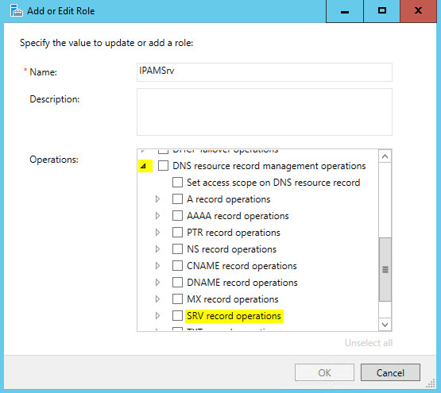

# Create a User Role for Access Control
You can use this topic to create a new Access Control user role in the IPAM client console.  
  
Membership in **Administrators**, or equivalent, is the minimum required to perform this procedure.  
  
> [!NOTE]  
> After you create a role, you can create an access policy to assign the role to a specific user or Active Directory group. For more information, see [Create an Access Policy](../Topic/Create-an-Access-Policy.md).  
  
### To create a role  
  
1.  In Server Manager, click  **IPAM**. The IPAM client console appears.  
  
2.  In the navigation pane, click **ACCESS CONTROL**, and in the lower navigation pane, click **Roles**.  
  
      
  
3.  Right\-click **Roles**, and then click **Add User Role**.  
  
      
  
4.  The **Add or Edit Role** dialog box opens. In **Name**, type a name for the role that makes the role function clear. For example, if you want to create a role that allows Administrators to manage DNS SRV resource records, you might name the role **IPAMSrv**. If needed, scroll down in **Operations** to locate the type of operations you want to define for the role. For this example, scroll down to **DNS resource record management operations**.  
  
      
  
5.  Expand **DNS resource record management operations**, and then locate **SRV record operations**.  
  
      
  
6.  Expand and select **SRV record operations**, and then click **OK**.  
  
      
  
7.  In the IPAM client console, click the role that you just created. In **Details View,** the permitted operations for the role are displayed.  
  
      
  
## See Also  
[Role-based Access Control](../Topic/Role-based-Access-Control.md)  
[Manage IPAM](../Topic/Manage-IPAM.md)  
  
