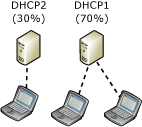

# DHCP Failover Modes
Two DHCP failover modes are available to use when you create a DHCP failover relationship:  
  
-   [Hot standby mode](../Topic/DHCP-Failover-Modes.md#hot_standby): This mode provides redundancy for DHCP services.  
  
-   [Load balance mode](../Topic/DHCP-Failover-Modes.md#load_sharing): This mode allocates DHCP client leases across two servers.  
  
> [!IMPORTANT]  
> Redundancy for DHCP is also provided in a load\-balancing configuration. DHCP clients can renew their leases with the failover partner server if their assigned DHCP server does not respond.  
  
You can switch between hot standby and load balance mode if desired, but you can only use one mode at a time with a single DHCP scope.  
  
For details about settings used for hot standby and load sharing, see [DHCP Failover Settings](../Topic/DHCP-Failover-Settings.md).  
  
For DHCP failover examples using hot standby and load sharing modes, see [DHCP Failover Examples](../Topic/DHCP-Failover-Examples.md).  
  
For information about deploying DHCP failover in hot standby and load sharing mode, see [DHCP Failover Architecture](../Topic/DHCP-Failover-Architecture.md).  
  
## Hot standby mode  
In hot standby mode, two servers operate in a failover relationship where an active server is responsible for leasing IP addresses and configuration information to all clients in a scope or subnet. The partner server assumes a standby role, with responsibility to issue leases to DHCP clients only if the active server becomes unavailable. Hot standby mode is ideal for scenarios where the failover partner is only intended to be used temporarily when the active server is unavailable.  
  
  
  
A server is active or standby in the context of a failover relationship. For instance, a server that has the role of active for a given relationship could be a standby server for another relationship. By default, the server that is used to create the failover relationship is the active server, but this is not required.  
  
When you choose hot standby, you must also configure the percentage of IP addresses on the active server that are reserved for use on the standby server in the event that the active server does not respond. By default, this reserve percentage is 5%.  
  
The reserve percentage is used for new DHCP leases. If a DHCP client attempts to renew a DHCP lease with the standby server that is unable to contact the active server \(COMMUNICATIONS INTERRUPTED or PARTNER DOWN state exists\), the same IP address that was previously assigned to the DHCP client will be renewed. In this situation, a temporary lease is granted for the maximum client lead time \(MCLT\) duration, not the full scope lease time.  
  
In a COMMUNICATIONS INTERRUPTED or PARTNER DOWN state, if the standby server issues all its available reserve percentage leases to new DHCP clients before the MCLT expires, it will refuse to issue new DHCP leases, but it will continue to renew existing leases. After the MCLT has expired, the standby server will be permitted to use the entire available IP address pool for new DHCP leases, provided the server is in PARTNER DOWN state. If the server is still in COMMUNICATIONS INTERRUPTED state, it will not use the entire available IP address pool for new DHCP leases.  
  
For more information about DHCP failover settings and states, see [DHCP Failover Settings](../Topic/DHCP-Failover-Settings.md).  
  
## Load balance mode  
Load balance mode is the default mode of deployment. In this mode, two DHCP servers simultaneously serve IP addresses and options to clients on a given subnet. DHCP client requests are load balanced and shared between the two DHCP servers. The default load balancing ratio between the two servers is 50:50, but this can be customized to any ratio from 0 to 100%.  
  
  
  
The load\-balancing mechanism is defined in [RFC 3074](http://tools.ietf.org/html/rfc3074), in which a hash is computed from the MAC address contained in each DHCP client request. A range of hash values \(also called the hash bucket\) is assigned to each DHCP server based on the load balancing percentages that are configured. Servers determine if they are designated to respond to the client based on their assigned hash bucket.  
  
In load balancing mode, when a DHCP server loses contact with its failover partner it will begin granting leases to all DHCP clients. If it receives a lease renewal request from a DHCP client that is assigned to its failover partner, it will temporarily renew the same IP address lease for the duration of the MCLT. If it receives a request from a client that was not previously assigned a lease, it will grant a new lease from its free IP address pool until this is exhausted, and then it will begin using the free IP address pool of its failover partner. If the DHCP server enters a partner down state, it will wait for the MCLT duration and then assume responsibility for 100% of the IP address pool.  
  
## See also  
[What is DHCP Failover?](../Topic/What-is-DHCP-Failover-.md)  
  
[DHCP Failover Examples](../Topic/DHCP-Failover-Examples.md)  
  
[DHCP Failover Settings](../Topic/DHCP-Failover-Settings.md)  
  
