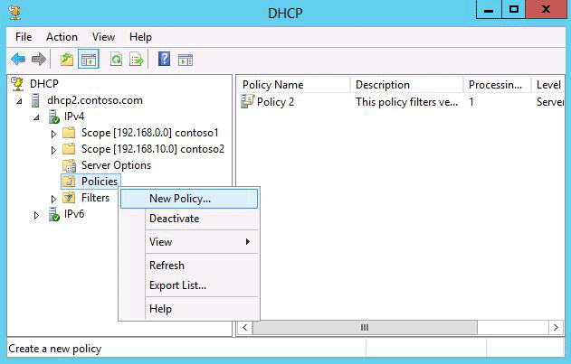

# Introduction to DHCP Policies
The DHCP Server role in [!INCLUDE[win8_server_1](../Token/win8_server_1_md.md)] introduces a new feature that allows you to create IPv4 policies that specify custom IP address and option assignments for DHCP clients based on a set of conditions.  
  
The policy based assignment \(PBA\) feature allows you to group DHCP clients by specific attributes based on fields contained in the DHCP client request packet. PBA enables targeted administration and greater control of the configuration parameters delivered to network devices with DHCP.  
  
## Why DHCP PBA?  
Consider the following scenarios:  
  
1.  A subnet has a mix of different types of clients: desktop computers, printers, IP phones, and other devices. You want different types of clients to get IP addresses from different IP address ranges within the subnet. This is possible using DHCP policies if the devices have different vendors. For example:  
  
    -   Printers can get IP addresses from 10.10.10.1 to 10.10.10.9.  
  
    -   IP phones can get IP addresses from 10.10.10.10 to 10.10.10.49.  
  
    -   Desktop computers can be assigned IP addresses from 10.10.10.50 to 10.10.10.239.  
  
    -   Additional devices can be assigned IP addresses of 10.10.10.240 to 10.10.10.254.  
  
    By specifying a different IP address range for different device types, you can more easily identify and manage devices on the network.  
  
2.  In a subnet which has a mix of wired and mobile computers, you might want to assign a shorter, 4 hour lease duration to mobile computers and longer, 4 day lease duration to wired computers.  
  
3.  You want to control who gets access to the network by providing a DHCP lease to only a known set of clients based on MAC address.  
  
4.  Employees bring in their own devices such as smartphones and tablets to work and you want to manage network traffic or control network access based on device type.  
  
5.  You want to provide a different set of scope options to different types of devices. For example, IP phones can get a different **Boot Server Host Name** \(TFTP server\) and **Bootfile Name** option.  
  
DHCP policies provide a very useful tool to achieve these goals. See the following example.  
  
  
  
In this example:  
  
-   Subnet A contains DHCP client devices of several different types including workstations, printers, and IP phones.  
  
-   A DHCP server on another subnet is configured to provide leases to these devices from scope A.  
  
-   Polices are configured at the scope level to control IP address range and at the server level to specify lease duration.  
  
DHCP client requests are processed as follows:  
  
1.  A client on subnet A submits a DHCPREQUEST that is sent to the DHCP server via DHCP relay.  
  
2.  The client’s vendor class and MAC prefix are included in the DHCPREQUEST packet along with the gateway IP address \(GIADDR\).  
  
3.  The DHCP server uses the GIADDR to determine that the client requires a lease from scope A, and begins processing policies in that scope.  
  
4.  Since scope B does not apply, these policies are ignored.  
  
5.  Based on the vendor class and MAC prefix values provided, the client request matches conditions of policy A3.  
  
6.  After all scope polices are processed, server level policies are processed and the client also matches conditions of policy 1.  
  
7.  After all policies are processed, the DHCP server returns an IP address configuration to the client using the settings specified in policies A3 and 1.  
  
Based on the client’s MAC address it is determined that the device is a printer \(it matches policy A3\). It is assigned the first available IP address in the IP address range 10.10.10.1 to 10.10.10.9, with a lease duration of 14 days.  
  
In [!INCLUDE[nextref_server_7](../Token/nextref_server_7_md.md)] and previous operating systems, if you want to specify the IP address range for a specific set of clients or devices, or assign different option values based on device type, the only way to achieve this is to configure a scope with individual reservations. This method can require high effort, and is difficult to manage on an ongoing basis.  
  
DHCP policies in [!INCLUDE[win8_server_2](../Token/win8_server_2_md.md)] provide much more flexibility to assign unique IP addresses and options to specific DHCP clients in a single subnet, or in multiple subnets.  
  
> [!NOTE]  
> See [Policy processing](../Topic/Introduction-to-DHCP-Policies.md#processing) to understand how settings are applied when they are configured in multiple policies, in reservations, at the scope level, or at the server level.  
  
## How DHCP PBA works  
DHCP policies are rules that you can define for DHCP clients. You can define a single policy, or several. Characteristics of DHCP policies include:  
  
-   **Policy level**: Polices can apply at the server level or the scope level. Server level policies are processed for all DHCP client requests received by the server. Scope level policies are processed only for DHCP client requests that apply to a specific scope.  
  
-   **Processing order**:  Each policy has an associated processing order that is unique within a server or scope. Policies with a lower numbered processing order are evaluated before higher number policies. If both scope and server level policies apply to a client, the scope level policies are always processed before any server level policies.  
  
-   **Conditions**: The conditions specified in a policy enable you to evaluate clients based on fields that are present in the DHCP client request. If a client request matches the conditions in the policy, the settings associated with a policy will be applied to the client by the DHCP server when it responds to the DHCP request.  
  
-   **Settings**:  Settings are network configuration parameters \(ex: IP address, options, lease duration\) that are provided to DHCP clients in the DHCP server response. Settings enable you to group clients by applying the same set of network parameters to them.  
  
-   **Enabled\/Disabled**:  Policies at the scope or server level can also be enabled or disabled. A policy that is disabled is skipped when processing incoming DHCP client requests.  
  
To create a policy at the server level using the Windows interface, open the DHCP console, navigate to IPv4, right\-click **Policies** and then click **New Policy**.  
  
  
  
If other server level policies exist, they are displayed in the details pane and can be modified by right\-clicking the policy and then clicking **Move Up**, **Move Down**, **Disable**, **Enable**, **Delete**, or **Properties**.  
  
  
  
To create a policy at the scope level using the Windows interface, open the DHCP console, navigate to an IPv4 scope, right\-click **Policies** and then click **New Policy**. If other scope level policies exist, they are displayed along with any server level policies that exist. You can modify existing scope level policies by right\-clicking them. You cannot modify a server level policy at the scope level.  
  
  
  
You must provide a unique policy name when creating a new policy. A policy description is optional. A policy must have at least one condition.  
  
Policy settings are optional, but DNS settings are included by default so it is not possible to have a policy with no settings. To view DNS settings for a policy, right\-click the policy, click **Properties**, and then click the **DNS** tab.  
  
  
  
### DHCP policy conditions and settings  
The following conditions and settings are available when creating a policy:  
  
**[Conditions](../Topic/Introduction-to-DHCP-Policies.md#conditions)**: Vendor Class, User Class, MAC Address, Client Identifier, Relay Agent Information.  
  
**[Settings](../Topic/Introduction-to-DHCP-Policies.md#settings)**: IP Address Range, Standard DHCP Options, Vendor Specific DHCP Options.  
  
#### Conditions  
In [!INCLUDE[win8_server_2](../Token/win8_server_2_md.md)], you can specify five conditional criteria to evaluate and group DHCP clients:  
  
-   **MAC Address**: The media access control \(MAC\) address or link\-layer address of the client.  
  
-   **Vendor Class**: Vendor managed DHCP option assignments.  
  
-   **User Class**: Non\-standard DHCP option assignments.  
  
-   **Client Identifier**: The client identifier \(ClientID\) is typically a MAC address. In the case of PXE clients, it can be the GUID of the network interface card \(NIC\).  
  
-   **Relay Agent Information**, including sub\-options: **Agent Circuit ID**, **Agent Remote ID**, and **Subscriber ID**: Information inserted into DHCP client requests by a DHCP relay using option 82.  
  
The operators that can be used with these conditions are **equals** and **not equals**. You can also use a trailing wildcard with MAC address, Vendor Class, User Class and Client Identifier conditions to perform a partial match. By combining the equals or not equals with a wildcard in the condition you can effectively achieve a **starts with** or **does not start with** condition.  
  
You can either have a single condition in a policy or a set of conditions which can be OR’ed or AND’ed. For example, "Vendor Class Equals Cisco IP Phone 7940" is a condition \(**Cisco IP Phone 7940** is the value of Vendor Class for Cisco IP Phone version 7940\). Also, a grouping such as "User Class Equals LabComputers" AND "MAC Address Not Equals 00\-11\-22\*" is a group of two conditions. Each policy is created with either a single condition or a set of such conditions.  
  
> [!IMPORTANT]  
> **Using multiple criterion values**: When you list multiple values for a single criterion, such as “User Class Equals \(valueA, valueB, valueC\)” or “MAC Address Not Equals \(value1, value2, value3\)” these values are interpreted as being OR’d if the EQ \(equals\) operator is used, but they are AND’d if the NEQ \(not equals\) operator is used.  
  
An incoming client request for an IP address and options from the DHCP server matches a policy if the client satisfies the cumulative set of conditions in the policy. A client that does not match conditions of any policy is granted an IP address lease from the rest of the IP address range of the scope, exclusive of all the policy IP address ranges, and is assigned the default option values configured in the scope.  
  
#### Settings  
In [!INCLUDE[win8_server_2](../Token/win8_server_2_md.md)], three types of policy settings are available that can be applied to DHCP clients:  
  
-   **IP Address Range**: A specified sub\-range of IP addresses within the scope range. The IP address range setting cannot be specified in a server\-level policy.  
  
-   **Standard DHCP Options**: Standard DHCP options like default gateway \(003 Router\) and preferred DNS servers list \(006 DNS Servers\).  
  
-   **Vendor Specific DHCP Options**: Vendor managed DHCP option assignments.  
  
In addition, you can also specify the following settings in policy properties:  
  
-   **DNS settings**: DNS registration and Name Protection settings can be specified on the **DNS** tab.  
  
-   **Lease duration**: The lease duration can be specified on the **General** tab. See the following example  
  
  
  
When a client matches the conditions of a policy, the DHCP server responds to the client and includes settings in that policy, provided these settings are not already applied in a higher priority policy or using a reservation. See [Policy processing](../Topic/Introduction-to-DHCP-Policies.md#processing) for more information.  
  
A policy can specify an IP address range with no options, or it can specify options with no IP address range, or it can specify both, or it can specify neither. A policy can also specify multiple standard options, vendor\-specific options, or both.  
  
### Policy processing  
Since you can configure multiple policies at both the scope level and server level, each policy is assigned a processing order. The processing order can also be modified, assuming more than a single policy exists. The following conditions exist:  
  
1.  When processing DHCP client requests, the DHCP server evaluates each client request against the conditions in all applicable policies, based on their processing order.  
  
2.  Scope level policies are processed first by the DHCP server, followed by server wide policies. Theoretically, a client can match the conditions of several scope policies and also several server policies.  
  
3.  If a client satisfies the conditions of more than 1 policy, it will get the combined settings from all policies that it matched. If the same option setting is provided in multiple policies, the client will use the setting from the first policy that is processed.  
  
For example, assume that policy\-1 has an option value for **003 Router** and policy\-2 has an option value for **006 DNS Servers**, and a client request matches both policies. The DHCP server will assign a default gateway value \(003 Router\) using policy\-1 and a DNS server value using policy\-2.  However, if policy\-1 has the higher processing priority \(a value of “1”\) and also has an option value for DNS server, the client will get both the router and DNS server option values from policy\-1. The DNS server option value in policy\-2 is ignored because policy\-2 has a lower processing priority \(a value of “2”\).  
  
A policy does not need to be configured with all option values that you have already configured at the scope or server level. If a policy client has requested an option which is not present in the policy but has been configured in scope level or server level options, these options are applied to the client in the server response. However, if you wish to specify options for certain clients, you can include these option settings in policies and they will have a higher priority than scope or server level options. The only type of option setting that has a higher priority than those configured in polices are options that you configure for a reservation.  
  
The priority for options settings is **reservation** > **scope policy** > **server policy** > **scope\-level** > **server\-level**. See the following figure.  
  
  
  
If a DHCP client obtains option settings because it matched a reservation, it will ignore the same options settings if they are present in any scope or server polices, or configured globally at the scope or server level.  
  
### Deploying DHCP policies  
A common reason to deploy DHCP policies is to provide unique settings to different types of devices on the network. Two common methods used to identify device type include:  
  
1.  **Vendor class**: A text string is sent in option 60 by most DHCP clients that identifies the vendor and therefore the type of the device.  
  
2.  **MAC address prefix**: The first three bytes of a MAC address is called the organizationally unique identifier \(OUI\), and can be used to identify the vendor or manufacturer of a device.  
  
For example, you might decide to group DHCP clients on the network by device type. After assigning IP address ranges to devices, you can configure your router to handle network traffic from each IP address range differently. In effect, you can configure network access control for a class of devices using DHCP policies. You might also manage network traffic by configuring route options such as default gateway \(option 003\) and classless static routes \(option 121\) based on device type.  
  
It is often desirable to configure a short lease duration for wireless devices, and grant a longer lease to wired devices. Since wireless access points are typically capable of behaving as a DHCP relay agent, or are connected to a DHCP relay, they can provide DHCP option 82 \(DHCP relay agent\). Presence of a specific value in the relay agent option can therefore indicate that the DHCP client is a wireless device.  
  
With DHCP policies, you can configure a policy with a condition based on the relay agent information option value that identifies wireless clients and provides a shorter lease duration. Other DHCP clients in the scope will continue to be provided with the longer lease duration configured at the scope level.  
  
These scenarios and others are discussed in detail in this guide.  
  
## See also  
[Scenario: Manage the network configuration of virtual machines](../Topic/Scenario--Manage-the-network-configuration-of-virtual-machines.md)  
  
[Scenario: Secure a subnet to a specific set of clients](../Topic/Scenario--Secure-a-subnet-to-a-specific-set-of-clients.md)  
  
[Scenario: Customize lease duration based on device type](../Topic/Scenario--Customize-lease-duration-based-on-device-type.md)  
  
