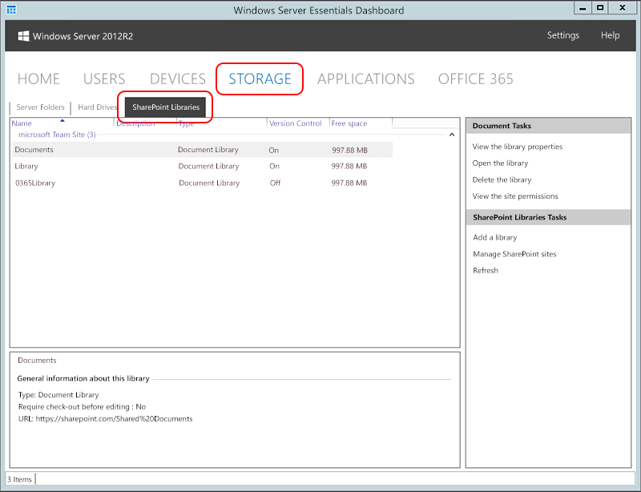

# Manage SharePoint Online in Windows Server Essentials
You can manage your [!INCLUDE[sp_online_2](../Token/sp_online_2_md.md)] libraries and team sites from the Dashboard, without signing in to [!INCLUDE[office_365_2](../Token/office_365_2_md.md)], if you integrate [!INCLUDE[office_365_2](../Token/office_365_2_md.md)] with your [!INCLUDE[wseblue_2](../Token/wseblue_2_md.md)] server. You get [!INCLUDE[sp_online_2](../Token/sp_online_2_md.md)] libraries and team sites with any [!INCLUDE[office_365_2](../Token/office_365_2_md.md)] business plan. [Find out how to integrate Office 365 with your server](../Topic/Manage-Office-365-in-Windows-Server-Essentials.md)  
  
As a bonus, your users will be able to use the My Server 2012 R2 app to access files in your [!INCLUDE[sp_online_2](../Token/sp_online_2_md.md)] libraries from anywhere using their mobile device or Windows phone. [Where can I get the My Server app?](../Topic/Use-the-My-Server-App-to-Connect-to-Windows-Server-Essentials.md)  
  
Haven't tried SharePoint yet? [What you can do now](http://office.microsoft.com/office365-sharepoint-online-enterprise-help/get-started-with-sharepoint-2013-HA102772778.aspx)  
  
## Where on the Dashboard will I manage my libraries and team sites?  
You'll use the new **SharePoint Online** tab, which is added to the **Storage** area of the Dashboard when you integrate [!INCLUDE[office_365_2](../Token/office_365_2_md.md)] with the server, to manage [!INCLUDE[sp_online_2](../Token/sp_online_2_md.md)] resources.  
  
  
  
## What can I manage from the Dashboard?  
  
### Manage your online libraries  
  
|||  
|-|-|  
|Add a library|On the **SharePoint Libraries** tab, use **Add a library**. You'll be able to make all of the usual choices:  -   Choose a team site and the library type. -   Decide whether to use version control. -   Assign access permissions. **Tip:** To find out what team site permissions your library will inherit if you don't assign permissions, use **View the site permissions**.|  
|Open a library|To work with the contents of the library, you'll need to open it in [!INCLUDE[office_365_2](../Token/office_365_2_md.md)]. Just select the library and click **Open the library**. What you can do with the content will depend on the credentials that you use to sign in to [!INCLUDE[sp_online_2](../Token/sp_online_2_md.md)].|  
|Change version controls or access permissions|You can use **View the library properties** to either view or change the version controls or access permissions for the library.|  
|Delete a library|**Warning:** Before you delete a SharePoint Online library, be sure to save any files that want to keep to another location. When you delete a library from SharePoint, everything is deleted—permanently. There's no way to retrieve anything.  After you've checked to make sure the library isn't storing anything you'll need later, select the library and click **Delete the library**.|  
  
### Manage your team sites  
  
|||  
|-|-|  
|Manage SharePoint team sites|The **Manage team sites** action lets you sign in to [!INCLUDE[office_365_2](../Token/office_365_2_md.md)] and manage your [!INCLUDE[sp_online_2](../Token/sp_online_2_md.md)] team sites. What you can do in [!INCLUDE[office_365_2](../Token/office_365_2_md.md)] will be determined by the online account that you sign in with.  When you close [!INCLUDE[office_365_2](../Token/office_365_2_md.md)] and return to the Dashboard, click **Refresh** to show the changes.|  
|View or change team site permissions|Since a library inherits permissions from its team site by default, it's helpful to have easy access to the team site permissions. To view—or change—permissions for a team site, select the team site or any of its libraries, and click **View the site permissions**. **Tip:** Need help with the fine points of SharePoint team site permissions? There's a useful [Learn more](http://office.microsoft.com/office365-sharepoint-online-enterprise-help/introduction-control-user-access-with-permissions-HA102771919.aspx?CTT=5&origin=HA102771924) link in the team site permissions.|  
  
## Tips  
  
-   **Click Refresh to show the latest changes made in the [!INCLUDE[office_365_2](../Token/office_365_2_md.md)] portal.** You'll need to refresh the display after you open [!INCLUDE[office_365_2](../Token/office_365_2_md.md)] to manage [!INCLUDE[sp_online_2](../Token/sp_online_2_md.md)]. If you keep the Dashboard open for long periods, click **Refresh** to make sure you're seeing the latest changes.  
  
-   **What you can do in [!INCLUDE[sp_online_2](../Token/sp_online_2_md.md)] depends on whether you're working on the Dashboard or in [!INCLUDE[office_365_2](../Token/office_365_2_md.md)].** On the Dashboard, [!INCLUDE[sp_online_2](../Token/sp_online_2_md.md)] changes are made using the administrator account for [!INCLUDE[office_365_2](../Token/office_365_2_md.md)] integration. But when you sign in to [!INCLUDE[office_365_2](../Token/office_365_2_md.md)] from the Dashboard, the access permissions for the online account that you use determine what you can do.  
  
    To find out the administrator account for [!INCLUDE[office_365_2](../Token/office_365_2_md.md)] integration, open the **Office 365** tab on the Dashboard.  
  
## Other things you might want to do  
  
-   [Use a My Server app to work with your SharePoint Online libraries from anywhere](../Topic/Use-the-My-Server-App-to-Connect-to-Windows-Server-Essentials.md)  
  
-   [Learn more about assigning permissions for SharePoint team sites](http://office.microsoft.com/office365-sharepoint-online-enterprise-help/introduction-control-user-access-with-permissions-HA102771919.aspx?CTT=5&origin=HA102771924)  
  
-   [Find out what you can do with SharePoint features](http://office.microsoft.com/office365-sharepoint-online-enterprise-help/get-started-with-sharepoint-2013-HA102772778.aspx)  
  
-   [Take a look at the Office 365 business plans that are available](http://office.microsoft.com/business/compare-office-365-for-business-plans-FX102918419.aspx?CR_CC=200061904&WT.srch=1&WT.mc_ID=PS_bing_O365Comm_what%20is%20office%20365%20for_Text)  
  
-   [Integrate Office 365 with your server](../Topic/Manage-Office-365-in-Windows-Server-Essentials.md)  
  
-   [Create online accounts for your users from the Dashboard](../Topic/Manage-Online-Accounts-for-Windows-Server-Essentials-Users.md)  
  
-   [Manage other Microsoft online services from the Dashboard](../Topic/Manage-Microsoft-Online-Services-in-Windows-Server-Essentials.md)  
  
