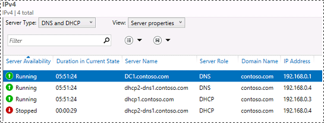
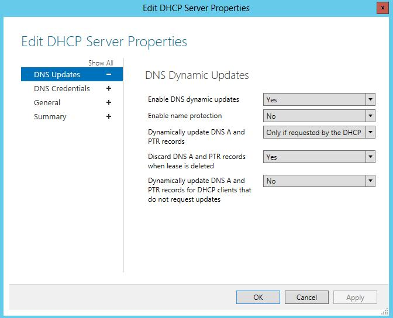

# Multi-server Management
This topic contains detailed information and procedures you can use to manage Microsoft DNS and DHCP servers with IPAM.  IPAM provides the following options for managing Microsoft DNS and DHCP servers on the network:  
  
-   [DNS and DHCP server monitoring](../Topic/Multi-server-Management.md#dns-dhcp-monitoring)  
  
-   [DNS zone monitoring](../Topic/Multi-server-Management.md#zone-monitoring)  
  
-   [DNS and DHCP record synchronization](../Topic/Multi-server-Management.md#sync)  
  
-   [DHCP server management](../Topic/Multi-server-Management.md#dhcp-manage)  
  
-   [DHCP scope management](../Topic/Multi-server-Management.md#scope-manage)  
  
> [!IMPORTANT]  
> Server and zone monitoring is unchanged for IPAM in [!INCLUDE[winblue_server_2](../Token/winblue_server_2_md.md)], however several additional options were added to IPAM in [!INCLUDE[winblue_server_2](../Token/winblue_server_2_md.md)] for management of:  
>   
> -   DHCP failover relationships and scopes  
> -   DHCP server and scope\-level policies  
> -   DHCP superscopes  
>   
> These options for DHCP server and scope management are discussed below in the [DHCP server management](../Topic/Multi-server-Management.md#dhcp-manage) section with separate topics for IPAM in [!INCLUDE[win8_server_2](../Token/win8_server_2_md.md)] and [!INCLUDE[winblue_server_2](../Token/winblue_server_2_md.md)]. Also see [DHCP Failover and IPAM](../Topic/DHCP-Failover-and-IPAM.md) for more information about differences in DHCP failover behavior when it is configured using IPAM instead of the DHCP console. For detailed information about how DHCP failover works and how to deploy it, see [Understand and Deploy DHCP Failover](../Topic/Understand-and-Deploy-DHCP-Failover.md). For information about DHCP policies, see the [DHCP Policy Based Assignment &#40;PBA&#41; Scenario Guide](../Topic/DHCP-Policy-Based-Assignment--PBA--Scenario-Guide.md).  
  
## DNS and DHCP server monitoring  
Click the **DNS and DHCP Servers** node in the upper navigation pane to quickly view the status of managed DNS and DHCP services. Servers with IPv4 addresses are displayed by default. Use the lower navigation pane to display servers with IPv6 addresses, or to choose a specific IPv4 or IPv6 network. The **Server Availability** and **Duration in Current State** fields provide information about the health of DNS and DHCP services.  
  
For example, if the DHCP Server service on a managed DHCP server is **Paused** or **Stopped**, this is displayed under **Server Availability**.  
  
  
  
To immediately refresh the status of a server, right\-click the server name, click **Retrieve Server Data**, wait for the **ServerAvailability** task to complete, and then refresh the console view.  
  
To view when service status was most recently refreshed, view the **Last Refreshed** field in the display pane details view. You can also add this column to the upper display pane search view \(see below\). This column is not displayed by default.  
  
If a server is not available due to network problems, it will display a status of **Not Reachable** for all services that the server provides.  
  
  
  
If only some services are not reachable, for example due to permission or firewall settings, then only those services will be **Not Reachable**.  
  
## DNS zone monitoring  
Click the **DNS Zone Monitoring** node in the upper navigation pane to view a list of all zones hosted by managed DNS servers. Forward lookup zones are displayed by default. To view reverse DNS zones, click **IPv4 Reverse Lookup** or **IPv6 Reverse Lookup** in the lower navigation pane. The health of reverse lookup zones is not displayed. The lower navigation pane also displays a nested list of forward DNS zones with their associated status icon.  
  
The health of a forward DNS zone is displayed in the **Zone Status** column next to the **Duration in Current State**. The zone status is a summary of status for all DNS servers that host the zone. Click the **Authoritative Servers** tab in the **Details View** to view a list of authoritative servers.  
  
When a DNS zone is paused, the status of the zone will remain as **OK** because the DNS server will continue to respond to DNS queries for a paused zone. However, if the DNS Server service on one or more DNS servers is stopped, paused or not responding for another reason, zones hosted by the DNS server will display a status of **Error** or **Warning**.  
  
  
  
An **Error** status displays as a red square, and indicates that none of the authoritative DNS servers for the zone are responding to DNS queries.  
  
A **Warning** status displays as a yellow triangle, and indicates that some of the authoritative DNS servers for the zone are not responding to DNS queries.  
  
Zone status will update periodically with information from scheduled data collection tasks. To update the status of a zone immediately, right\-click the zone, click **Reset Zone Status**, click **TASKS**, click **Retrieve Server Data**, and then refresh the console view.  
  
## DNS and DHCP record synchronization  
The IPAM database is separate from DHCP and DNS servers on your network, and full synchronization of hosts and IP addresses between IPAM and managed DNS or DHCP servers does not occur automatically unless you have configured automated tasks to perform this synchronization.  
  
Because the IPAM database is separate, it can be updated and customized for specific projects and needs without requiring any changes to your network. When you are ready to make these changes, they can be pushed to the network from IPAM. Alternatively, changes on the network can be synchronized to IPAM when you are ready.  
  
Certain automatic [Scheduled tasks](../Topic/IPAM-Architecture.md#scheduled_tasks) are performed by IPAM on a regular basis that can affect the IPAM database. These tasks synchronize DNS and DHCP at a scope or zone level, respectively. They do not synchronize individual DHCP and DNS records.  
  
For example, assume the following scenario:  
  
-   A managed DHCP server has a scope with an IP address range of 10.1.1.0\/24.  
  
-   A managed DNS server hosts the contoso.com and 1.1.10.in\-addr.arpa zones.  
  
-   You wish to create a DHCP reservation, a DNS host \(A\) record, and a reverse DNS \(PTR\) record for the IP address *10.1.1.1* corresponding to a fully qualified domain name of *IP\-phone01.contoso.com*.  
  
-   You want the reservation to be created on the DHCP server, and DNS records should be added to the DNS server, but not immediately.  
  
**Procedure**: You begin adding the information to IPAM. You click **IP Address Blocks** in the upper navigation pane, click the **TASKS** menu, and then click **Add IP Address**. In the **Add IP Address** dialog box, you complete the required fields, choosing the appropriate **Managed by service**, **Service instance**, **Reservation server name**, **Reservation type**, **Forward lookup zone**, **Forward lookup primary server**, **Reverse lookup zone**, and **Reverse lookup primary server**. You enter the **Device name**, **MAC Address**, and **Client ID** and clear any checkboxes to automatically create a DHCP reservation or DNS record if they are available.  
  
> [!IMPORTANT]  
> When adding an IP address to IPAM, two additional options are available if the IPAM server is running [!INCLUDE[winblue_server_2](../Token/winblue_server_2_md.md)]: **Automatically create DHCP reservation for this IP address** and **Automatically create DNS records for this IP address**. These options are not available if the IPAM server is running [!INCLUDE[win8_server_2](../Token/win8_server_2_md.md)]. By default, the DHCP reservation checkbox is selected, and the DNS records checkbox is cleared. In the scenario described here, both checkboxes are cleared to demonstrate how the IPAM database is separated from managed DHCP and DNS servers.  
  
After clicking **OK**, the IP address is added to IPAM with the information that is required to create both a DHCP reservation and DNS records.  
  
At this stage, you check the DHCP and DNS servers. Since checkboxes to automatically update DHCP and DNS servers were not selected \(or they were not available because the IPAM server is running [!INCLUDE[win8_server_2](../Token/win8_server_2_md.md)]\), the new reservation and DNS records are not yet added to DHCP and DNS.  
  
When you are ready to add these records, you right\-click the IP address in IPAM and then click **Create DHCP Reservation**, **Create DNS Host Record**, and **Create DNS PTR Record**. Next, you check the DHCP and DNS servers and verify that the new reservation and DNS records now exist.  
  
If IPAM is not synchronized with managed DHCP or DNS servers, you can use the **IP ADDRESS SPACE** node in the upper navigation pane to manually synchronize DNS and DHCP data in IPAM with data on managed DNS and DHCP servers. The following methods are available:  
  
1.  To import records from managed servers into the IPAM database, see [Importing DHCP lease data from the network](../Topic/Managing-IP-Address-Space.md#importing_ip_addresses_from_the_network).  
  
2.  To manually create records in the IPAM database that corresponds to existing data on managed servers, unmanaged servers, and other IP address infrastructure devices, see [Add or edit IP address space](../Topic/Managing-IP-Address-Space.md#add_or_edit_ranges).  
  
3.  To use IP address data in IPAM to create records on managed servers, see [Managing DHCP reservations](../Topic/Managing-IP-Address-Space.md#managing_dhcp_reservations) and [Managing DNS records](../Topic/Managing-IP-Address-Space.md#managing_dns_records).  
  
## DHCP server management  
To manage DHCP server properties, click **DNS and DHCP Servers** in the upper navigation pane. Choose **DHCP** or **DNS and DHCP** from the drop\-down list next to **Server Type**, and choose **Server properties** from the drop\-down list next to **View**.  Select one or more DHCP servers in the list, choose **IPv4** or **IPv6** in the lower navigation pane, and then right\-click the selected servers to access DHCP server management options.  
  
> [!IMPORTANT]  
> DHCP server management is enhanced if the IPAM server is running [!INCLUDE[winblue_server_2](../Token/winblue_server_2_md.md)]. Additional options that are available in [!INCLUDE[winblue_server_2](../Token/winblue_server_2_md.md)] include management of DHCP policies, DHCP failover replication, MAC address filters, and the role\-based access scope. More information is provided below.  
  
**DHCP server management options in [!INCLUDE[win8_server_2](../Token/win8_server_2_md.md)] and [!INCLUDE[winblue_server_2](../Token/winblue_server_2_md.md)] IPAM**:  
  
|[!INCLUDE[win8_server_2](../Token/win8_server_2_md.md)]|[!INCLUDE[winblue_server_2](../Token/winblue_server_2_md.md)]|  
|-----------------------------------------------------------|-----------------------------------------------------------------|  
|Edit DHCP Server Properties  Edit DHCP Server Options  Create DHCP Scope  Configure Predefined DHCP Options  Launch MMC  Configure User Class  Configure Vendor Class  Retrieve Server Data|Edit DHCP Server Properties  Edit DHCP Server Options  Create DHCP Scope  Configure Predefined DHCP Options  Configure DHCP User Class  Configure DHCP Vendor Class  Configure DHCP Policy  Import DHCP Policy  Add DHCP MAC Address Filter  Launch MMC  Activate DHCP Policies  Deactivate DHCP Policies  Replicate DHCP Server  Set Access Scope  Retrieve Server Data|  
  
Different options are also available on the property pages when the IPAM server is running [!INCLUDE[winblue_server_2](../Token/winblue_server_2_md.md)] compared to [!INCLUDE[win8_server_2](../Token/win8_server_2_md.md)]. For example, if you click **Edit DHCP Server Properties** on an IPAM server running [!INCLUDE[winblue_server_2](../Token/winblue_server_2_md.md)], you can enable the MAC address filter allow and deny lists, and DNS update settings include the ability to disable dynamic updates for PTR records. These options are not available if the IPAM server is running [!INCLUDE[win8_server_2](../Token/win8_server_2_md.md)]. See the following examples.  
  
**Edit DHCP server properties in [!INCLUDE[win8_server_2](../Token/win8_server_2_md.md)] and [!INCLUDE[winblue_server_2](../Token/winblue_server_2_md.md)] IPAM**:  
  
|[!INCLUDE[win8_server_2](../Token/win8_server_2_md.md)]|[!INCLUDE[winblue_server_2](../Token/winblue_server_2_md.md)]|  
|-----------------------------------------------------------|-----------------------------------------------------------------|  
|||  
  
Refer to the following sections below for details about DHCP server management when the IPAM server is running [!INCLUDE[win8_server_2](../Token/win8_server_2_md.md)] or [!INCLUDE[winblue_server_2](../Token/winblue_server_2_md.md)]:  
  
-   [DHCP server management in Windows Server 2012](../Topic/Multi-server-Management.md#WS2012)  
  
-   [DHCP server management in Windows Server 2012 R2](../Topic/Multi-server-Management.md#WS2012R2)  
  
### DHCP server management in Windows Server 2012  
The options that are available on an IPAM server running [!INCLUDE[win8_server_2](../Token/win8_server_2_md.md)] are the following:  
  
-   **Edit DHCP Server Properties** configures the following options on one DHCP server or on multiple DHCP servers simultaneously:  
  
    -   DNS dynamic update settings and name protection options. These options can also be configured on the **DNS** tab in the DHCP console.  
  
    -   DNS dynamic update credentials used by the DHCP server to register names on DNS servers. This option can also be configured on the **Advanced** tab in the DHCP console.  
  
    -   Enable or disable DHCP audit logging. This option can also be configured on the **General** tab in the DHCP console.  
  
-   **Edit DHCP Server Options** configures the following options on one DHCP server or on multiple DHCP servers simultaneously:  
  
    -   Vendor class  
  
    -   User class  
  
    -   Option  
  
    -   Value  
  
    These options can also be configured by right\-clicking **Server Options** under **IPv4** or **IPv6** in the DHCP console, and clicking **Configure Options**, and then clicking the **Advanced** tab.  
  
-   **Create DHCP Scope** adds a new DHCP scope to a single DHCP server. This option is not available when multiple DHCP servers are selected. To duplicate a DHCP scope, see [DHCP scope management](../Topic/Multi-server-Management.md#scope-manage).  
  
-   **Configure Predefined DHCP Options** adds, edits, or deletes predefined options and values on one DHCP server or on multiple DHCP servers simultaneously. These options can also be configured by right\-clicking **IPv4** or **IPv6** and then clicking **Set Predefined Options** in the DHCP console.  
  
-   **Launch MMC** opens the DHCP console to configure a single managed DHCP server. This option is not available when multiple DHCP servers are selected.  
  
-   **Configure User Class** creates, overwrites, or deletes DHCP user classes on one DHCP server or on multiple DHCP servers simultaneously. User classes can also be configured by right\-clicking **IPv4** or **IPv6** and then clicking **Define User Classes** in the DHCP console.  
  
-   **Configure Vendor Class** creates, overwrites, or deletes DHCP vendor classes on one DHCP server or on multiple DHCP servers simultaneously. Vendor classes can also be configured by right\-clicking **IPv4** or **IPv6** and then clicking **Define User Classes** in the DHCP console  
  
-   **Retrieve Server Data** runs the following IPAM data collection tasks immediately on the selected managed DHCP servers:  
  
    -   ServerConfiguration  
  
    -   ServiceMonitoring  
  
    -   ServerAvailability  
  
    -   Audit  
  
### DHCP server management in Windows Server 2012 R2  
The options that are available on an IPAM server running [!INCLUDE[winblue_server_2](../Token/winblue_server_2_md.md)] are the following:  
  
-   **Edit DHCP Server Properties** configures the following options on one DHCP server or on multiple DHCP servers simultaneously:  
  
    -   Enable or disable DHCP audit logging. This option can also be configured on the **General** tab in the DHCP console.  
  
    -   DNS dynamic update settings and name protection options. These options can also be configured on the **DNS** tab in the DHCP console. In [!INCLUDE[winblue_server_2](../Token/winblue_server_2_md.md)], this also includes the option to disable dynamic updates for PTR records.  
  
    -   DNS dynamic update credentials used by the DHCP server to register names on DNS servers. This option can also be configured on the **Advanced** tab in the DHCP console.  
  
    -   MAC address filters. You can enable the allow list or the deny list. This option can also be configured on the **Filters** tab in the DHCP console.  
  
-   **Edit DHCP Server Options** configures the following options on one DHCP server or on multiple DHCP servers simultaneously:  
  
    -   Vendor class  
  
    -   User class  
  
    -   Option  
  
    -   Value  
  
    These options can also be configured by right\-clicking **Server Options** under **IPv4** or **IPv6** in the DHCP console, and clicking **Configure Options**, and then clicking the **Advanced** tab.  
  
-   **Create DHCP Scope** adds a new DHCP scope to a single DHCP server. This option is not available when multiple DHCP servers are selected. To duplicate a DHCP scope, see [DHCP scope management](../Topic/Multi-server-Management.md#scope-manage).  
  
-   **Configure Predefined DHCP Options** adds, edits, or deletes predefined options and values on one DHCP server or on multiple DHCP servers simultaneously. These options can also be configured by right\-clicking **IPv4** or **IPv6** and then clicking **Set Predefined Options** in the DHCP console.  
  
-   **Configure DHCP User Class** creates, overwrites, or deletes DHCP user classes on one DHCP server or on multiple DHCP servers simultaneously. User classes can also be configured by right\-clicking **IPv4** or **IPv6** and then clicking **Define User Classes** in the DHCP console.  
  
-   **Configure DHCP Vendor Class** creates, overwrites, or deletes DHCP vendor classes on one DHCP server or on multiple DHCP servers simultaneously. Vendor classes can also be configured by right\-clicking **IPv4** or **IPv6** and then clicking **Define User Classes** in the DHCP console  
  
-   **Configure DHCP Policy** creates a server\-level DHCP policy on one DHCP server or on multiple DHCP servers simultaneously. DHCP policies can also be configured by right\-clicking the **Policies** container under **IPv4** and then clicking **New Policy** in the DHCP console. This option only creates new policies. Use the **Policies** view instead of **Server Properties** view to modify or delete an existing policy.  
  
-   **Import DHCP Policy** imports a server\-level DHCP policy from a server that you specify to one or multiple DHCP servers. If a policy with the same name already exists on one or more of the selected DHCP servers, DHCP policy import will fail on these servers. The policy will be imported on any DHCP servers that do not already have a server\-level policy with the same name.  
  
-   **Add DHCP MAC Address Filter** creates a MAC address filter on one or multiple DHCP servers. You can add an allow filter or a deny filter. If a filter for the same MAC address already exists on one or more of the selected DHCP servers, you are notified that the filter cannot be added on these servers. The filter will be added on any DHCP servers that do not already have a filter for the same MAC address.  
  
-   **Launch MMC** opens the DHCP console to configure a single managed DHCP server. This option is not available when multiple DHCP servers are selected.  
  
-   **Activate DHCP Policies** causes all DHCP policies on the selected servers to be active. This is the same action as right\-clicking a server\-level or scope\-level policies container in the DHCP console and then clicking **Activate**. All server\-level and scope\-level policies are activated. Policies that are in a disabled state are not enabled by this setting.  
  
-   **Deactivate DHCP Policies** causes all DHCP policies on the selected servers to be inactive. This is the same action as right\-clicking a server\-level or scope\-level policies container in the DHCP console and then clicking **Deactivate**. All server\-level and scope\-level policies are deactivated. This setting does not change the enabled or disabled status of policies.  
  
-   **Replicate DHCP Server** performs a server replication of the selected DHCP server. This type of replication copies the configuration of all failover\-enabled scopes on the DHCP server to its failover partner servers. This option is not available when multiple DHCP servers are selected in the IPAM console.  
  
-   **Set Access Scope** configures the selected DHCP servers to be members of an access scope. The access scope must already be configured. By default, all servers are members of the Global access scope.  
  
-   **Retrieve Server Data** runs the following IPAM data collection tasks immediately on the selected managed DHCP servers:  
  
    -   ServerConfiguration  
  
    -   ServiceMonitoring  
  
    -   ServerAvailability  
  
    -   Audit  
  
## DHCP scope management  
To manage DHCP scope properties, click **DHCP Scopes** in the upper navigation pane. You can also choose **DNS and DHCP Servers** in the upper navigation pane and then choose **DHCP** from the drop\-down list next to **Server Type**, and then choose **Scope properties** from the drop\-down list next to **View**.  
  
> [!TIP]  
> **IPv4** and **IPv6** nodes in the lower navigation pane refer to IP addresses assigned to scopes if you are using the DHCP Scopes view. These nodes refer to interface addresses for managed DHCP servers if you are using the DNS and DHCP Servers view.  
  
Select one or more scopes from the list, and then right\-click the selected scopes to access the scope management options.  
  
> [!IMPORTANT]  
> DHCP scope management is significantly enhanced if the IPAM server is running [!INCLUDE[winblue_server_2](../Token/winblue_server_2_md.md)]. Additional options that are available in [!INCLUDE[winblue_server_2](../Token/winblue_server_2_md.md)] include management of DHCP policies, DHCP failover replication, superscopes, and the role\-based access scope. See the following table.  
  
**DHCP scope management options in [!INCLUDE[win8_server_2](../Token/win8_server_2_md.md)] and [!INCLUDE[winblue_server_2](../Token/winblue_server_2_md.md)] IPAM**:  
  
|[!INCLUDE[win8_server_2](../Token/win8_server_2_md.md)]|[!INCLUDE[winblue_server_2](../Token/winblue_server_2_md.md)]|  
|-----------------------------------------------------------|-----------------------------------------------------------------|  
|Edit DHCP Scope  Duplicate DHCP Scope  Activate DHCP Scope  Deactivate DHCP Scope  Delete|Edit DHCP Scope  Duplicate DHCP Scope  Create DHCP Reservation  Add to DHCP Superscope  Configure DHCP Failover  Configure DHCP Policy  Import DHCP Policy  Activate DHCP Scope  Deactivate DHCP Scope  Activate DHCP Policies  Deactivate DHCP Policies  Clear Config Sync Error  Replicate DHCP Scope  Remove DHCP Failover Configuration  Remove from DHCP Superscope  Set Access Scope  Delete|  
  
Refer to the following sections below for details about DHCP server management when the IPAM server is running [!INCLUDE[win8_server_2](../Token/win8_server_2_md.md)] or [!INCLUDE[winblue_server_2](../Token/winblue_server_2_md.md)]:  
  
-   [DHCP scope management in Windows Server 2012](../Topic/Multi-server-Management.md#scope_2012)  
  
-   [DHCP scope management in Windows Server 2012 R2](../Topic/Multi-server-Management.md#scope_2012R2)  
  
### DHCP scope management in Windows Server 2012  
Scope management options that are available on an IPAM server running [!INCLUDE[win8_server_2](../Token/win8_server_2_md.md)] are the following:  
  
-   **Edit DHCP Scope** configures the following options on one DHCP server or on multiple DHCP servers simultaneously.  
  
    -   **General Properties**:  
  
        -   Scope name  
  
        -   Description  
  
        -   Start IP address  
  
        -   End IP address  
  
        -   Subnet mask  
  
        -   Lease duration  
  
        -   Exclusion range  
  
        If multiple scopes are selected, you can only configure the description and lease duration.  
  
    -   **DNS Dynamic Updates**:  
  
        -   Enable DNS dynamic updates  
  
        -   Enable name protection  
  
        -   Dynamically update DNS A and PTR records  
  
        -   Discard DNS A and PTR records when lease is deleted  
  
        -   Dynamically update DNS A and PTR records for DHCP clients that do not request updates  
  
        If multiple scopes are selected, you can only enable or disable DNS dynamic updates.  
  
    -   **DHCP Scope Options**: Add, overwrite, or delete vendor class and user class options and values.  
  
        All DHCP scope options can be configured simultaneously for multiple scopes.  
  
    -   **Advanced Properties**:  
  
        -   Assign IP addresses dynamically to DHCP clients, BOOTP clients, or both  
  
        -   Lease duration for BOOTP clients  
  
        -   Subnet delay  
  
        All advanced properties can be configured simultaneously for multiple scopes.  
  
-   **Duplicate DHCP Scope** creates a new scope on a single DHCP server. The new scope is configured with the same DNS dynamic update options, scope options, and advanced properties of the scope that is selected for duplication, however you have the option of changing these values prior to creating the new scope.  You must select the DHCP server on which to create the new scope. You are also required to provide a start IP address, end IP address, and subnet mask. DHCP failover relationships are not duplicated.  
  
    > [!IMPORTANT]  
    > The new DHCP scope will be active by default, even if the original scope was inactive.  
  
-   **Activate DHCP Scope** activates the selected scopes on managed DHCP servers. All scopes that you select must be inactive to use this option.  
  
-   **Deactivate DHCP Scope** deactivates the selected scopes on managed DHCP servers. All scopes that you select must be active to use this option.  
  
-   **Delete** deletes the selected scopes on managed DHCP servers.  
  
### DHCP scope management in Windows Server 2012 R2  
Scope management options that are available on an IPAM server running [!INCLUDE[winblue_server_2](../Token/winblue_server_2_md.md)] are the following:  
  
-   **Edit DHCP Scope** configures the following options on one DHCP server or on multiple DHCP servers simultaneously.  
  
    -   **General Properties**:  
  
        -   Scope name  
  
        -   Description  
  
        -   Start IP address  
  
        -   End IP address  
  
        -   Subnet mask  
  
        -   Lease duration  
  
        -   Exclusion range  
  
        If multiple scopes are selected, you can only configure the description and lease duration.  
  
    -   **DNS Dynamic Updates**:  
  
        -   Enable DNS dynamic updates  
  
        -   Enable name protection  
  
        -   Dynamically update DNS records  
  
        -   Discard DNS A and PTR records when lease is deleted  
  
        -   Dynamically update DNS records for DHCP clients that do not request updates  
  
        -   Disable dynamic updates for DNS PTR records  
  
        If multiple scopes are selected, you can only enable or disable DNS dynamic updates.  
  
    -   **DHCP Scope Options**: Add, overwrite, or delete vendor class and user class options and values.  
  
        All DHCP scope options can be configured simultaneously for multiple scopes.  
  
    -   **Advanced Properties**:  
  
        -   Assign IP addresses dynamically to DHCP clients, BOOTP clients, or both  
  
        -   Lease duration for BOOTP clients  
  
        -   Subnet delay  
  
        All advanced properties can be configured simultaneously for multiple scopes.  
  
-   **Duplicate DHCP Scope** creates a new scope on a single DHCP server. The new scope is configured with the same DNS dynamic update options, scope options, and advanced properties of the scope that is selected for duplication, however you have the option of changing these values prior to creating the new scope.  You must select the DHCP server on which to create the new scope. You are also required to provide a start IP address, end IP address, and subnet mask. DHCP failover relationships are not duplicated.  
  
    > [!IMPORTANT]  
    > The new DHCP scope will be active by default, even if the original scope was inactive.  
  
-   **Create DHCP Reservation** enables you to add a new DHCP reservation to the selected scope. This option is not available when multiple scopes are selected. You must specify a name, IP address, client ID, and the reservation type.  
  
-   **Add to DHCP Superscope** adds one or more DHCP scopes to a superscope. If multiple scopes are selected, they must belong to the same DHCP server. You can create a new superscope using the selected DHCP scopes, or select an existing superscope on the DHCP server.  
  
-   **Configure DHCP Failover** enables DHCP failover on one or more scopes. If multiple scopes are selected, they must belong to the same DHCP server. You can create a new DHCP failover relationship, or choose an existing relationship.  
  
-   **Configure DHCP Policy** creates a scope\-level DHCP policy for one or more scopes. If a policy with the same name exists in the scope, policy creation will fail for that scope.  
  
-   **Import DHCP Policy** imports a server\-level or scope\-level DHCP policy from a DHCP server that you specify to the selected scopes or servers.  
  
-   **Activate DHCP Scope** activates the selected scopes on managed DHCP servers. All scopes that you select must be inactive to use this option.  
  
-   **Deactivate DHCP Scope** deactivates the selected scopes on managed DHCP servers. All scopes that you select must be active to use this option.  
  
-   **Activate DHCP Policies** causes all DHCP policies on the selected scope to be active. This is the same action as right\-clicking a scope\-level policy container in the DHCP console and then clicking **Activate**. All policies that apply to this scope are activated. This setting does not override the server\-level policy setting. You cannot activate scope\-level policies when policies are inactive at the server level. Policies that are in a disabled state are not enabled by this setting.  
  
-   **Deactivate DHCP Policies** causes all DHCP policies that apply to the selected scope to be inactive. This includes server\-level policies that apply to clients that receive an IP address lease from the selected scope. This is the same action as right\-clicking the scope\-level policies container in the DHCP console and then clicking **Deactivate**. This setting does not change the enabled or disabled status of policies.  
  
-   **Clear Config Sync Error** removes the error status from the DHCP failover configuration synchronization state of the selected scopes. You should clear the configuration synchronization error if DHCP failover partners were replicated manually with no errors but the **Failover Config Sync Status** column in the IPAM console continues to display an error.  
  
-   **Replicate DHCP Scope** performs a scope replication for the selected DHCP scopes from the selected DHCP server to its failover partner. If one or more of the selected scopes is not enabled for DHCP failover, an error is reported and this scope is skipped. The selected scopes must all be from the same DHCP server.  
  
-   **Remove DHCP Failover Configuration** deconfigures DHCP failover on one or more scopes by removing them from the failover relationship. The scope is also removed from the DHCP failover partner server.  
  
-   **Remove from DHCP Superscope** removes one or more scopes from a DHCP superscope.  
  
-   **Set Access Scope** configures the selected DHCP scopes to be members of an access scope. The access scope must already be configured. By default, all scopes are members of the Global access scope.  
  
-   **Delete** deletes the selected scopes on managed DHCP servers.  
  
## See also  
[Using the IPAM Client Console](../Topic/Using-the-IPAM-Client-Console.md)  
  
[DHCP Failover and IPAM](../Topic/DHCP-Failover-and-IPAM.md)  
  
