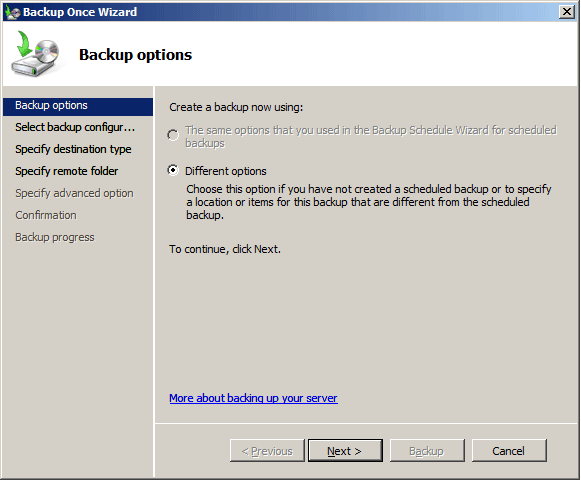
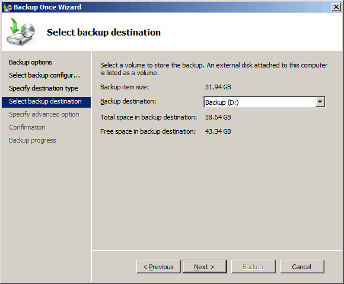

# Perform a Full Server Backup of a Domain Controller by Using the GUI (Windows Server Backup)
A full server backup captures all volumes on all locally attached volumes. Windows Server Backup treats Universal Serial Bus \(USB\) drives and Internet SCSI \(iSCSI\) devices as locally attached volumes. If the backup destination is a locally attached drive, it is excluded from the backup set.  
  
You can use this procedure to back up all the volumes on a domain controller by using the Windows Server Backup snap\-in.  
  
> [!NOTE]  
> Windows Server Backup appears on the **Administrative Tools** menu by default, even if the Windows Server Backup feature is not installed. If Windows Server Backup is not installed, when you open Windows Server Backup, a message appears, saying that the tool is not installed and providing the instructions for installing Windows Server Backup. For more information about installing Windows Server Backup, see Installing Windows Server Backup \([http:\/\/go.microsoft.com\/fwlink\/?LinkID\=96495](http://go.microsoft.com/fwlink/?LinkID=96495)\).  
  
Membership in **Builtin Administrators** or **Backup Operators**, or equivalent, is the minimum required to complete this procedure. [!INCLUDE[review_details](../Token/review_details_md.md)] In addition, you must have write access to the target backup location.  
  
#### To perform an unscheduled full server backup of all volumes by using the graphical user interface \(GUI\)  
  
1.  Click **Start**, point to **Administrative Tools**, and then click **Windows Server Backup**.  
  
2.  If you are prompted, in the **User Account Control** dialog box, provide Backup Operator credentials, and then click **OK**.  
  
3.  On the **Action** menu, click **Backup once**.  
  
4.  In the Backup Once Wizard, on the **Backup options** page, click **Different options**, as shown in the following figure, and then click **Next**.  
  
      
  
5.  If you are creating the first backup of the domain controller, click **Next** to select **Different options**.  
  
6.  On the **Select backup configuration** page, click **Full server**, as shown in the following figure, and then click **Next**.  
  
      
  
7.  On the **Specify destination type** page, click **Local drives** or **Remote shared folder**, and then click **Next**.  
  
8.  Choose the backup location as follows:  
  
    -   If you are backing up to a local drive, on the **Select backup location** page, in **Backup destination**, select a drive, and then click **Next**.  
  
          
  
    -   If you are backing up to a remote shared folder, on the **Specify remote folder** page, provide shared folder information, as shown in the following figure:  
  
          
  
    1.  Type the path to the shared folder.  
  
    2.  Under **Access Control**, select **Do not inherit** or **Inherit** to determine access to the backup, and then click **Next**.  
  
    3.  In the **Provide user credentials for Backup** dialog box, provide the user name and password for a user who has write access to the shared folder, and then click **OK**.  
  
9. On the **Specify advanced option** page, select **VSS copy backup \(recommended\)** and then click **Next**.  
  
10. On the **Confirmation** page, review your selections, and then click **Backup**.  
  
11. After the Backup Once Wizard begins the backup, click **Close** at any time. The backup runs in the background and you can view backup progress at any time during the backup. The wizard closes automatically when the backup is complete.  
  
#### Additional considerations  
The target volume for an unscheduled backup can be a local drive, but it cannot be any of the volumes that are included in the backup.  
  
