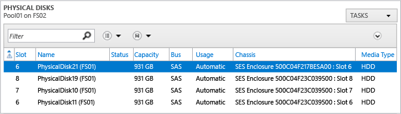
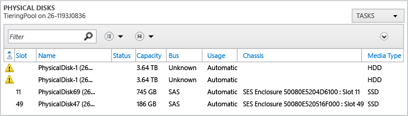

# Replace Failed Disks and Repair JBODs for Storage Spaces in Windows Server
This topic explains how to replace failed disks and repair JBODs in a storage solution that uses Storage Spaces in Windows Server. In addition, you’ll find best practices and requirements for replacement disks and JBODs, advice for planning fault tolerance for your storage system, and instructions for setting up monitoring for hardware failures \(install the enclosure management hotfix \(KB 2913766\); download the Test\-StorageHealth.ps1 script for verifying storage health\).  
  
## In this topic  
  
-   [Plan for disk and JBOD failures](#BKMK_PlanForFailures)  
  
    -   [Follow disk and JBOD requirements and best practices](#BKMK_RequirementsAndBestPractices)  
  
    -   [Plan for fault tolerance](#BKMK_PlanForFaultTolerance)  
  
-   [Set up monitoring for hardware failures](#BKMK_SetUpMonitoring)  
  
-   [Replace failed disks](#BKMK_ReplaceFailedDisks)  
  
-   [Repair a JBOD](#BKMK_RepairaJBOD)  
  
## <a name="BKMK_PlanForFailures"></a>Plan for disk and JBOD failures  
Use the information in the next two sections to help set up Storage Spaces to handle disk and JBOD enclosure failures with minimal impact on service and minimal risk of data loss.  
  
### <a name="BKMK_RequirementsAndBestPractices"></a>Follow disk and JBOD requirements and best practices  
Most problems with Storage Spaces occur because of incompatible hardware or because of firmware issues. To reduce problems, follow these best practices:  
  
-   **Use only certified SAS\-connected JBODs**—Those enclosure models have been tested with Storage Spaces and also enable you to easily identify the enclosure and slot for a physical disk, as shown in Figure 1. For a list of certified JBODs, see the [Windows Server Catalog](http://windowsservercatalog.com/results.aspx?&chtext=&cstext=&csttext=&chbtext=&bCatID=1645&cpID=0&avc=10&ava=0&avq=0&OR=1&PGS=25&ready=0).  
  
    **Figure 1—Disk and enclosure information in Server Manager's Physical Disks display**  
  
      
  
-   **Don't mix and match disk models within a JBOD**—Use one model of solid\-state drive \(SSD\) and one model of hard\-disk drive \(HDD\) for all disks in a JBOD \(assuming that you’re using storage tiers\), and make sure that the disks are fully compatible with the JBOD model.  
  
    If you need to vary from this—for example, if a particular model is no longer available—match the other disks as closely as possible, and stick with a single rotational speed \(usually 7200 rpm\) for your HDDs. Storage performance is limited by the slowest disk in a storage tier. If you have questions about disk compatibility, talk with your hardware vendor.  
  
-   **Install the latest firmware and driver versions on all disks**—Install the firmware version that is listed as approved for the device in the Windows Server Catalog or is recommended by your hardware vendor. Within a JBOD, it's important that all disks of the same model have the same firmware version.  
  
-   **Follow the vendor's recommendations for disk placement**—Install disks in the slots recommended by your hardware vendor. JBODs often have different requirements for placement of SSDs and HDDs, for cooling and other reasons.  
  
### <a name="BKMK_PlanForFaultTolerance"></a>Plan for fault tolerance  
Hardware fails—sometimes quite often in a large\-scale storage solution. To help avoid problems caused by failing hardware, plan for the types and number of failures you want to be able to handle without service interruption, and how your solution should handle each fault.  
  
-   **Design a fault\-tolerant storage solution**—For example, if you want your storage solution to be able to tolerate a single fault at any level, you need this minimum setup:  
  
    -   Two\-way mirror or single\-parity storage spaces  
  
    -   A clustered file server  
  
    -   Redundant SAS connections between each file server node and each JBOD  
  
    -   Redundant network adapters and network switches  
  
    -   Enough JBOD enclosures to tolerate an entire JBOD failing or becoming disconnected  
  
    [Additional design guidance for storage solutions that use Storage Spaces](http://technet.microsoft.com/library/dn554250.aspx)  
  
-   **Unless you're using hot spares, retire missing disks automatically**—The default policy for handling a physical disk that goes missing from a storage pool \(**\-RetireMissingPhysicalDisks** \= **Auto**\) simply marks the disk as missing \(**Lost Communication**\), and no repair operation on the virtual disks \(storage spaces\) takes place, if you're using existing disk capacity instead of a hot spare for virtual disk repairs. That avoids potentially I\/O\-intensive virtual disk repairs if a disk temporarily goes offline, from either a transient error or an administrator's action. But the storage pool health will remain degraded, compromising resiliency if another disk fails before an administrator takes action.  
  
    Unless you are using hot spares, we recommend that you change the **–RetireMissingPhysicalDisks** policy to **Always**, to initiate virtual disk repair operations automatically if a disk loses communication with the system, restoring the health of the pool and the dependent storage spaces as soon as possible. To change this setting, use [the Set\-StoragePool cmdlet](http://technet.microsoft.com/library/hh848672.aspx).  
  
    > [!IMPORTANT]  
    > Before you make a repair that requires taking the JBOD or JBOD tray offline, you should set the **RetireMissingPhysicalDisks** option to **Disabled** so that automatic disk repairs aren't initiated when the physical disk connections are lost. Then return the parameter to its original setting after the repair is complete. For instructions, see [Turn off automatic disk retirement in the storage pools](#BKMK_Step2TurnOffDiskRetirement).  
  
-   **Always replace the physical disk before you remove the drive from the storage pool**—Changing the storage pool configuration before you replace the physical disk in the enclosure can cause an I\/O failure or initiate virtual disk repair, which can result in a “STOP 0x50” error and potential data loss.  
  
-   **As a general rule, keep unallocated disk space in the pool for virtual disk repairs instead of using hot spares**—In [!INCLUDE[winblue_server_2](../Token/winblue_server_2_md.md)], you have the option to use available capacity on existing disks in the pool for disk repair operations instead of bringing a hot spare online. That enables Storage Spaces to automatically repair storage spaces with failed disks by copying data to multiple disks in the pool, significantly reducing the time it takes to recover from the failed disk when compared with using hot spares, and it lets you use the capacity on all disks instead of setting aside hot spares.  
  
    You need to keep sufficient unallocated disk space available to enable the repairs. Under\-provision your storage pool \(that is, limit the total capacity that you allocate to all storage spaces in the pool\) so that the pool can tolerate multiple disk failures without degraded health. If you're using storage tiers, keep the total free space in each of the storage pools equivalent to one HDD plus 8 GB \(for storage pool and storage spaces overhead\) and one SSD plus 8 GB per enclosure. For a space that does not have tiers, under\-provision as though you have a single tier.  
  
-   **When you configure column counts, make sure you have enough physical disks to support automatic virtual disk repairs**—Storage Spaces writes data across multiple disks in chunks called *stripes*. The number of disks in a stripe is called the *column count*. The column count is an important factor in determining whether virtual disks can be automatically repaired following a physical disk failure—and in the performance of the virtual disks.  
  
    Generally you'll want to stick to 3\-4 columns for a good balance of throughput and low latency. Increasing the column count increases the number of physical disks across which a virtual disk is striped, which increases throughput and IOPS for that virtual disk. However, it can also increase latency. For this reason, you can optimize overall cluster performance by using multiple virtual disks with 3–4 columns \(when using mirrors\) or seven columns when using parity spaces. The performance of the entire cluster remains high because multiple virtual disks are used in parallel, making up for the reduced column count.  
  
    > [!IMPORTANT]  
    > If you want to automatically repair virtual disks after a disk failure, don't use the maximum column count your hardware allows—even if it matches the numbers above. Instead, reduce the column count by the number of disk failures you want the pool to be able to automatically recover from \(one disk failure is a typical design point\).  
  
    Table  1 provides formulas for calculating your column count \(assuming that you have fewer SSDs than HDDs and that you temporarily ignore any SSDs used for journal disks\). Round the results down to the nearest whole number.  
  
    Whether or not your storage system is *enclosure aware*affects the number of columns that are required for automatic virtual disk repairs. When the ability to tolerate an enclosure failure \(called enclosure\-awareness\) is enabled, Storage Spaces writes each copy of data to a different enclosure. That way, if one enclosure fails or goes offline, the data remains available in one or more alternate enclosures.  
  
    ### Table 1: Calculating the column count for virtual disks  
  
    |Resiliency type|With enclosure\-awareness|Without enclosure\-awareness|  
    |-------------------|-----------------------------|--------------------------------|  
    |Mirror|*columns* \= \(*number of SSDs* \/ *number of pools* \/ *number of enclosures*\) \- *number of disk failures to automatically repair*|*columns* \= \(*number of SSDs* \/ *number of pools* \/ *number of data copies*\) \- *number of disk failures to automatically repair*|  
    |Parity|*columns* \= \(*number of enclosures* \* 2\) \-1|*columns* \= \(*number of disks* \/ *number of pools*\) \- *number of disk failures to automatically repair*|  
  
    > [!IMPORTANT]  
    > When using enclosure awareness, be careful not to use a larger column count than the number of SSDs per enclosure per pool \(assuming that you have fewer SSDs than HDDs\).  
  
    Additional recommendations for parity spaces:  
  
    -   For enclosure\-aware parity spaces, disks per enclosure should be at least 2 plus the number of disk failures that you want to be able to automatically repair.  
  
    -   Parity spaces with enclosure awareness enabled are limited to 7 columns, and we recommend 7 columns for non\-enclosure aware parity spaces as well for balanced performance.  
  
-   **Be prepared for multiple disk failures**—If you purchased all of the disks in an enclosure at the same time, the disks are the same age, and the failure of one disk might be followed fairly quickly by other disk failures. Even if the storage spaces return to health after the initial disk repairs, you should replace the failed disk as soon as possible to avoid the risk of additional disk failures, which might compromise storage health and availability and risk data loss. If you want to be able to delay disk repairs safely until your next scheduled maintenance, configure your storage spaces to tolerate two disk failures.  
  
-   **Optionally, provide fault tolerance at the enclosure level**—If you need to provide an added level of fault tolerance, at the enclosure level, deploy multiple, compatible JBODs that support enclosure awareness. In an enclosure\-aware storage solution, Storage Spaces writes each copy of data to a specific JBOD enclosure. That way, if one enclosure fails or goes offline, the data remains available in one or more alternate enclosures.  
  
    For enclosure awareness, each JBOD enclosure must contain the same mix of disks and must support SCSI Enclosure Services \(SES\), and you must deploy enough JBODs to allow for the failure of an entire enclosure without service interruption. The number of JBODs required will vary based on the resiliency setting for the storage pool \(2\-way mirror, 3\-way mirror, or, in [!INCLUDE[winblue_server_2](../Token/winblue_server_2_md.md)] only, dual parity\). For more information, see "What types of storage arrays can I use with Storage Spaces?" in [Storage Spaces Frequently Asked Questions \(FAQ\)](http://social.technet.microsoft.com/wiki/contents/articles/11382.storage-spaces-frequently-asked-questions-faq.aspx).  
  
## <a name="BKMK_SetUpMonitoring"></a>Set up monitoring for hardware failures  
  
-   **Install hotfixes and management packs for Storage Spaces:**  
  
    -   **Enclosure management hotfix \(KB 2913766\)**—[Hotfix 2913766](http://support.microsoft.com/kb/2913766) extends platform support for Storage Spaces in [!INCLUDE[winblue_server_2](../Token/winblue_server_2_md.md)] and [!INCLUDE[winblue_client_2](../Token/winblue_client_2_md.md)] to add Storage Management Application Programming Interface \(SMAPI\) support for enclosure awareness. The hotfix provides Storage Spaces events and Windows PowerShell cmdlets for management and health monitoring for JBOD storage enclosures.  
  
    -   **Microsoft System Center Operations Manager Management Pack for Windows Server Storage Spaces 2012 R2**—The Storage Spaces management pack monitors the health of storage enclosures, storage pools, storage spaces, and the CSV file shares assigned to the spaces; storage pool capacity; and physical disk failures. Health status is passed to Virtual Machine Manager and to Operations Manager. For more information, see the management pack guide included in the download. [Download the Storage Spaces management pack](http://www.microsoft.com/en-us/download/details.aspx?id=46832)  
  
-   **Check for additional monitoring tools available from the hardware manufacturer**—Some hardware manufacturers provide a management pack that gives greater visibility into the health and availability of their JBOD storage enclosures in System Center Operations Manager. Check with your hardware vendor for information.  
  
-   **Download the Storage Cluster Health Test script**—To get a Windows PowerShell script that you can use to perform routine end\-to\-end storage monitoring on your Windows Server–based storage cluster, [download Test\-StorageHealth.ps1 from the Microsoft Script Center](http://gallery.technet.microsoft.com/scriptcenter/Test-StorageHealthps1-66d84fd4).  
  
    The script is designed to monitor the clustered storage solution described in [Provide cost\-effective storage for Hyper\-V workloads by using Windows Server: planning and design guide](assetId:///3314f967-8a2c-48c6-bfc7-3137cc30a075). You run it on a node of the file server cluster.  
  
    What does the Test\-StorageHealth.ps1 script do?  
  
    -   Performs health checks on failover clusters, storage spaces, cluster shared volumes \(CSVs\), Server Message Block \(SMB\) file shares, and data deduplication \(optional\).  
  
    -   Reports capacity for storage pools, volumes, and deduplicated volumes.  
  
    -   Collects cluster logs, error events, SystemInfo, System\/Application logs, and Minidump files from all cluster nodes.  
  
    The script makes life easier by saving all the diagnostic information, including event logs, in a single ZIP file.  
  
    For additional script details, see the [Test\-StorageHealth.ps1 script download page](http://gallery.technet.microsoft.com/scriptcenter/Test-StorageHealthps1-66d84fd4) and the blog entry [How the Test\-StorageHealth.ps1 script check for Storage Cluster health](http://blogs.technet.com/b/josebda/archive/2014/07/26/how-the-test-storagehealth-ps1-script-checks-for-storage-cluster-health.aspx).  
  
## <a name="BKMK_ReplaceFailedDisks"></a>Replace failed disks  
The procedures in this section describe an end\-to\-end process for identifying failed disks, replacing them, and updating firmware and storage pool configurations afterward.  
  
When you replace a failed disk, it's important to perform the steps in the following order. Most important: Replace the *physical disk* in the JBOD before you make any changes to the storage pool configuration.  
  
-   [Step 1: Identify the failed disk](#BKMK_Step1IdentifyFailedDisk)  
  
-   [Step 2: Locate the physical disk in the storage enclosure](#BKMK_Step2LocatePhysicalDisk)  
  
-   [Step 3: Replace the physical disk in the JBOD](#BKMK_Step3ReplacePhysicalDisk)  
  
-   [Step 4: Update the firmware on the new disk](#BKMK_Step4UpdateDiskFirmware)  
  
-   [Step 5: Add the new disk to the storage pool](#BKMK_Step5Addnewdisktopool)  
  
-   [Step 6: Remove the old disk from the storage pool](#BKMK_Step6RemoveOldDisk)  
  
-   [Step 7: Verify storage health and dismiss alerts](#BKMK_Step7VerifyHealth)  
  
### <a name="BKMK_SchedulingDiskReplacements"></a>Scheduling disk replacements  
  
-   **During the next scheduled maintenance**—If, for your large enterprise deployment, you want to be able to safely wait to replace all failed disks during your scheduled maintenance periods, you will need to configure each storage pool to tolerate two disk failures. That requires three\-way mirror resiliency; even with significant under\-provisioning, a two\-way mirror pool is only resilient to a single disk failure. With significant under\-provisioning to accommodate virtual\-disk repairs, a dual\-parity pool can be resilient to two failures.  
  
-   **Immediate replacement**—If your storage unit isn't able to tolerate two simultaneous disk failures, we recommend that you replace failed disks as soon as you discover them—even if the dependent storage spaces have returned to full health. One disk failure often is followed fairly rapidly by other disk failures. And when a high\-capacity disk fails, the virtual disk repairs that follow can run for many hours. For a 4 TB disk, virtual disk repairs can take 12 hours or longer \(smaller drives typically take 3 to 4 hours\). If another disk fails during this period, and your storage system is only resilient to one disk failure, the virtual disks will go offline.  
  
-   **Multiple disk failures:**  
  
    -   If more than one disk has failed, replace one disk at a time. That avoids the risk of getting the disk configurations confused, and it enables you to repair virtual disks for the first disk as soon as possible to restore the health of the storage pool and dependent storage spaces as soon as possible. You don't need to wait until the final virtual disk repairs for the first disk are complete before you start the configuration updates for a second failed disk. Concurrent virtual disk repairs do not affect storage performance; the repair window is just longer.  
  
    -   If any storage pool contains more than one failed SSD or HDD, replace one of those disks first.  
  
### <a name="BKMK_Step1IdentifyFailedDisk"></a>Step 1: Identify the failed disk  
Use the method that is most convenient to uniquely identify the disk that needs to be replaced. Several methods are available.  
  
> [!NOTE]  
> In Windows Server, you can often identify a failed physical disk by turning on an LED indicator on the storage enclosure. However, on most home systems, the physical disks typically don't have LED indicators; you might have to identify a failed physical disk by its serial number.  
  
-   **Event Viewer**—When a disk returns an error indicating that the drive is failing, Windows logs an entry in the Event Viewer. Depending on the type of error, the disk might be identified by either a GUID or its physical disk number.  
  
    Event 154, shown below, includes additional SCSI sense information that can be used for diagnostic purposes:  
  
    |||  
    |-|-|  
    |Provider:|disk|  
    |Event ID:|154|  
    |Level:|Error|  
    |Text:|“The IO operation at logical block address <LBA> for Disk <Disk Number> \(PDO name: <PDO Name>\) failed due to a hardware error.”|  
    |Logged when:|A fatal hardware error is reported by the device.|  
    |Sense Key:|Byte 0x2D in the binary data|  
    |Add’l Sense Code:|Byte 0x2E in the binary data|  
    |Add’l Sense Code Qualifier:|Byte 0x2F in the binary data|  
  
    \(For more information about disk\-related errors, see [How Storage Spaces Responds to Errors on Physical Disks](http://social.technet.microsoft.com/wiki/contents/articles/17947.how-storage-spaces-responds-to-errors-on-physical-disks.aspx).\)  
  
    Use Windows PowerShell to identify the disk from the GUID or disk number that the event provides. You must run these commands from a Windows PowerShell session on the file server.  
  
    -   **Identify a disk from a GUID**—If the event records a GUID, you can use the following Windows PowerShell command to identify the physical disk associated with the I\/O error:  
  
        ```powershell  
        Get-PhysicalDisk | Where-Object -Property { $_.ObjectId.Contains( $PhysicalDiskGUID ) }  
        ```  
  
        To illuminate the LED indicator associated with the physical disk, run this command.  
  
        ```powershell  
        Get-PhysicalDisk | Where-Object -Property { $_.ObjectId.Contains( $PhysicalDiskGUID ) } | Enable-PhysicalDiskIndication  
        ```  
  
    -   **Identify a disk from a disk number**—If a physical disk number is displayed, as shown in Figure 2, you can use the following Windows PowerShell command to identify the physical disk associated with the I\/O error—in this case, Error 7.  
  
        ```powershell  
        Get-PhysicalDisk -FriendlyName <PhysicalDiskNumber>  
        ```  
  
        The physical disk number \(disk 3 in the example\) is embedded in the path: \\Device\\Harddisk3\\DR3.  
  
        > [!NOTE]  
        > On a scale\-out file server \(SOFS\), the cluster disk number assigned to a device drive can be different on different cluster nodes. In those cases, the more reliable method for identifying the disk is to use the GUID \(described above\).  
  
        **Figure 2—Failed disk warnings in Server Manager**  
  
          
  
-   **Server Manager**—In **File and Storage Services**, you'll see a warning in the **PHYSICAL DISKS** display after a disk failure, as shown in Figure 3. However, you won't be able to see the disk model and enclosure information for the failed disk.  
  
    **Figure 3—Event Viewer error information includes the disk number**  
  
      
  
-   **Windows PowerShell:**  
  
    As always when working with physical disks, run these commands from an elevated Windows PowerShell session on the file server.  
  
    -   Identify a physical disk based on a unique property such as a serial number \(shown below\) from an event or alert. [Other properties you can use with Get\-PhysicalDisk](http://technet.microsoft.com/library/hh848686.aspx)  
  
        ```powershell  
        Get-PhysicalDisk | Where-Object –Property SerialNumber -like *131109303905  
        ```  
  
    -   Or get a list of physical disks that aren’t healthy:  
  
        ```powershell  
        Get-PhysicalDisk | Where-Object –Property HealthStatus -ne Healthy  
        ```  
  
-   **Operations Manager**—If you're using Virtual Machine Manager to manage your file servers, physical disk alerts roll up to **VMM Fabric Health** or can be seen in **All Alerts** view in Operations Manager. Open the alert properties, **Context** tab \(shown in Figure 4\), to find the enclosure \(in the **Location** property\), slot, tray, and position.  
  
    **Figure 4—Operations Manager disk alert properties, Alert Context tab**  
  
      
  
### <a name="BKMK_Step2LocatePhysicalDisk"></a>Step 2: Locate the physical disk in the storage enclosure  
To make sure you replace the correct physical disk, you should if possible "blink" the disk to help identify the disk in the enclosure. All JBODs that are certified for use with Storage Spaces include LED indicators that can be turned on to identify a disk. On most certified JBODs, the LED indicator is turned on automatically when a failed disk is retired. Use the following procedures to turn on the LED indicator if the slot isn’t already blinking.  
  
> [!NOTE]  
> -   The physical disks used with most home systems don't include LED indicators; you might need to use the disk serial number to identify the disk.  
> -   Occasionally, simply reseating a “failed” disk in the same slot will clear the issue that caused the disk to fail, and the dependent storage pool and spaces return to a healthy state. The LED light will continue to blink until you reset physical disk usage to its original setting \(`-PhysicalDisk –Usage [AutoSelect | HotSpare | Journal | ManualSelect]`\) or until you remove the disk from the pool. \(For more information, see the cmdlet reference for [\-PhysicalDisk](http://technet.microsoft.com/library/hh848651.aspx).\)  
  
> [!WARNING]  
> After a physical disk fails, do not remove the drive from the storage pool configuration until *after* you replace the physical disk in the storage enclosure. Changing the storage pool configuration before you replace the physical disk can cause an I\/O failure or initiate virtual disk repair, which can result in a “STOP 0x50” error and potential data loss.  
  
##### Use LED blinking to locate a physical disk \(Server Manager\)  
  
-   In **File and Storage Services**, click **Storage Pools**, and click the pool that contains the failed disk. Then, in **PHYSICAL DISKS**, right\-click the failed disk, and click **Toggle Drive Light**.  
  
      
  
-   If the failed disk is unresponsive, you can toggle the drive light for the other disks in the enclosure and look for the disk that isn't blinking. Sort the **PHYSICAL DISKS** entries by the **Chassis** column, which identifies the enclosure. Then select all disks in the enclosure with the failed disk, and click **Toggle Drive Light**.  
  
##### Use LED blinking to locate a physical disk and enclosure \(Windows PowerShell\)  
  
-   Use LED blinking to help identify the JBOD enclosure that contains the bad disk:  
  
    ```powershell  
    $FailedDisk | Get-StorageEnclosure | Enable-StorageEnclosureIdentification  
    ```  
  
-   If the physical disk is responsive, blink just the disk that you need to replace:  
  
    ```powershell  
    $FailedDisk = Get-PhysicalDisk | Where-Object –Property HealthStatus –ne Healthy  
    $FailedDisk | Get-PhysicalDisk | Enable-PhysicalDiskIndication   
    ```  
  
-   If the failed disk isn't responsive, blink the other \(healthy\) disks, and look for the disk that isn't blinking:  
  
    ```powershell  
    Get-PhysicalDisk | Where-Object –Property HealthStatus -eq Healthy | Enable-PhysicalDiskIndication  
    ```  
  
### <a name="BKMK_Step3ReplacePhysicalDisk"></a>Step 3: Replace the physical disk in the JBOD  
Follow the instructions from your hardware vendor to replace the physical disk in the enclosure. [Review hardware and firmware requirements for replacement disks](#BKMK_RequirementsAndBestPractices)  
  
### <a name="BKMK_Step4UpdateDiskFirmware"></a>Step 4: Update the firmware on the new disk if needed  
Before you add the new disk to the storage pool, make sure the new disk has the correct firmware version. For best results when storage spaces are repaired, you will add the new disk to the pool before you remove the old disk.  
  
> [!NOTE]  
> We recommend that you not replace a failed disk with a previously used disk. If you’ve used the disk with another storage pool, all of the earlier configuration settings will be imported into Storage Spaces, and the settings are very difficult to clear.  
  
##### To update the firmware on the new disk \(Server Manager\)  
  
1.  Make sure the new disk has the correct firmware version. The firmware version should match the version for other disks of the same type and model. Use information from the hardware vendor to update the firmware if needed.  
  
    To find out the firmware version of a physical disk, open the disk properties and display the **Firmware Version** on the **Details** tab, as shown below. \(To see the disks in an enclosure together, you can sort the **PHYSICAL DISKS** list by the **Chassis** column.\)  
  
      
  
    > [!TIP]  
    > This is one task that you might find is easier in Windows PowerShell. To find out the firmware versions of all disks in your storage enclosures, run this command:  
    >   
    > `Get-StorageEnclosure | Get-PhysicalDisk | Select-Object –Property FriendlyName,FirmwareVersion`  
  
2.  Use **Rescan Storage** in File and Storage Services, shown below, to update the provider cache on the file server \(click **Volumes** to see the **Rescan Storage** task\). You will need to rescan the storage twice to update provision cache. There's a known issue in [!INCLUDE[winblue_server_2](../Token/winblue_server_2_md.md)] that sometimes requires a second scan.  
  
      
  
3.  If you had an unresponsive disk earlier, and you blinked the *other* disks to help you find the failed one, use **Toggle Drive Light** to turn off the LED lights on the storage enclosure.  
  
##### To update the firmware on the new disk \(Windows PowerShell\)  
  
1.  On the file server, open a Windows PowerShell session as an Administrator.  
  
2.  Make sure the firmware version on the new disk matches the firmware version on other disks of the same media type and model in the JBOD.  To find out the firmware versions of all disks in your storage enclosures, run this command:  
  
    ```  
    Get-StorageEnclosure | Get-PhysicalDisk | Select FriendlyName,FirmwareVersion  
    ```  
  
    **Sample output:**  
  
**PS C:\\> Get\-StorageEnclosure | Get\-PhysicalDisk | Select FriendlyName,FirmwareVersionFriendlyName                                               FirmwareVersion\-\-\-\-\-\-\-\-\-\-\-\-                                               \-\-\-\-\-\-\-\-\-\-\-\-\-\-\-PhysicalDisk137                                             W1CGPhysicalDisk141                                             W1CGPhysicalDisk131                                             W1CG**  
  
3.  If the firmware on the new disk doesn't match the firmware on the other disks, use information from the hardware vendor to update the firmware on the new disk.  
  
4.  Update the provider cache by running this command twice \(yes, twice; there's a known issue in [!INCLUDE[winblue_server_2](../Token/winblue_server_2_md.md)] that sometimes requires a second cache update\):  
  
    ```powershell  
    Update-StorageProviderCache –DiscoveryLevel Full  
    Update-StorageProviderCache –DiscoveryLevel Full  
    ```  
  
### <a name="BKMK_Step5Addnewdisktopool"></a>Step 5: Add the new disk to the storage pool  
You can add a new physical disk to a storage pool in Server Manager or you can use Windows PowerShell.  
  
##### To add the new disk to the storage pool \(Server Manager\)  
  
1.  In **Storage Pools**, right\-click the storage pool, and then click **Add Physical Disk**.  
  
    The **Add Physical Disk** dialog box \(shown below\) lists the unassigned physical disks that can be added to a storage pool.  
  
2.  Select the replacement disk.  
  
3.  Select the appropriate **Allocation** setting, shown below, and then click **OK**:  
  
    -   In [!INCLUDE[winblue_server_2](../Token/winblue_server_2_md.md)], select **Automatic**. This allocates data on the disk automatically instead of reserving the disk for manual allocation to virtual disks or saving the disk as a hot spare.  
  
    -   In [!INCLUDE[win8_server_2](../Token/win8_server_2_md.md)], select **HotSpare** to replace the hot spare that was brought online for repairs when the old disk failed.  
  
      
  
4.  In the **PHYSICAL DISKS** list, make sure the media type \(SSD or HDD\) for the replacement disk is displayed. The media type is discovered for all disks that are approved for use with Storage Spaces. If you’re using tiered spaces, the media type determines which tier the disk is added to. If you don't see a media type, work with your vendor to get an approved disk model.  
  
> [!NOTE]  
> The commands in the following procedure use the $NewDisk and $Pool variables, with the assumption that you will run all commands in the same Windows PowerShell session. If you open a new session, either define the variables again or substitute the GUID of the new disk and the friendly name of the storage pool.  
  
##### To add the new disk to the storage pool \(Windows PowerShell\)  
  
1.  If you're using hot spares, set the **HotSpare** usage type when you add the disk, to replace the hot spare that came online when the original disk failed. Otherwise, we recommend that you set the usage to **Automatic**, as shown below, to initiate automatic repair of storage spaces that depend on the disk after a disk failure.  
  
    ```powershell  
    Add-PhysicalDisk –StoragePool $Pool -PhysicalDisks $NewDisk -Usage Automatic  
    ```  
  
    After you add the new disk, you will repair any storage spaces that have degraded health. However, before you do that, you should connect any virtual disks that are detached.  
  
2.  Connect any virtual disks \(storage spaces\) in the storage pool that are in a **Detached** state \(**OperationalStatus** \= **Detached**\):  
  
    ```  
    Get-VirtualDisk | Where-Object -Filter { $_.OperationalStatus -eq "Detached" } | Connect-VirtualDisk  
    ```  
  
3.  Repair any storage spaces in the pool that still have degraded health:  
  
    ```powershell  
    $Pool | Get-Virtualdisk | Where-Object –Property HealthState –ne Healthy | Repair-VirtualDisk -Asjob  
    ```  
  
### <a name="BKMK_Step6RemoveOldDisk"></a>Step 6: Remove the old disk from the storage pool  
Before you can remove a disk from a storage pool, a couple of requirements must be met:  
  
-   **The storage pool must have enough available capacity to repair the storage spaces**—You can't remove a disk unless sufficient unallocated capacity and a sufficient number of disks are available to successfully repair the storage spaces that depend on the disk—either existing capacity on disks already in the pool or, when using hot spares, capacity provided by a hot spare in the same enclosure. In some cases, you might need to add a disk before you remove the failed disk. That is why we recommend that you add the new disk \(in [Step 5](#BKMK_Step5Addnewdisktopool), above\) before you remove the failed disk.  
  
-   **The disk must be retired before it's removed**—When a disk fails, it goes through an orderly retirement process to help ensure against any data loss. When a disk is retired, it stops receiving new data; data is written only to the remaining disks in the pool. Existing data on the drive will be re\-allocated to other drives in the pool as part of a repair operation. However, until re\-allocation starts, existing allocations on the drive continue to be updated in order to maintain redundancy of data.  
  
If you're replacing a failed disk, and you added the new disk to the storage pool in [Step 5](#BKMK_Step5Addnewdisktopool), you probably have met both requirements. In most cases, a failed disk is retired automatically, and the replacement disk that you added earlier will provide the capacity that's needed to repair the storage spaces. However, if for some reason the old disk has not been retired \(say, you're replacing a disk that hasn't yet failed\), you might need to retire the disk manually, and you can only do that in Windows PowerShell—you can't retire a disk in Server Manager. We've included that step in the procedures in case you need it.  
  
##### To remove the old disk from the storage pool \(Server Manager\)  
  
1.  If the old disk has not been retired, retire it:  
  
    1.  Go to **File and Storage Services** > **Volumes** > **Storage Pools**, select the storage pool, right\-click the old disk in **PHYSICAL DISKS**, and then click **Properties**.  
  
    2.  On the **Health** tab of the disk properties, check the **Usage status**. It should be **Retired**.  
  
    3.  If the disk has not been retired, retire it by running the following commands in an elevated Windows PowerShell session:  
  
        ```  
        $FailedDisk = Get-PhysicalDisk | Where-Object –Property HealthStatus –ne Healthy  
        $FailedDisk | Set-PhysicalDisk –Usage Retired  
        ```  
  
    4.  Repair all storage spaces in the pool:  
  
        ```  
  
        Get-StoragePool –FriendlyName <storagepoolfriendlyname> | Get-Virtualdisk | Repair-VirtualDisk -Asjob  
        ```  
  
2.  To remove the old physical disk from the storage pool, right\-click the old disk in **PHYSICAL DISKS**, and then click **Remove physical disk**.  
  
    > [!NOTE]  
    > If you can't remove the disk, you either haven't met the capacity requirements or the disk hasn't been retired. Make sure you added the replacement disk \(see [Step 5: Add the new disk to the storage pool](#BKMK_Step5Addnewdisktopool)\).  
  
    When you remove a disk from a storage pool, each virtual disk \(storage space\) in the pool is repaired, which can take a long time. For example, repairing after a full 4 TB hard disk fails can take 12 hours or longer. \(If you set the **–RetireMissingPhysicalDisks** policy for the storage pool to **Always**, as recommended, and the disk failed earlier, virtual disk repairs might already have completed.\)  
  
3.  To find out the status of the disk repairs, monitor the **VIRTUAL DISKS** display, shown below. Initially, you'll see **Degraded** operational status, with a yellow Warning icon by each virtual disk. When the repair kicks off, the status changes to **In Service**. When the repair completes, the warning icon should disappear, and the operational status should be **OK**. \(Open the disk properties to see the status.\)  
  
      
  
##### To remove the old disk from the storage pool \(Windows PowerShell\)  
  
1.  Retire the disk if it has not already been retired:  
  
    ```powershell  
    $FailedDisk = Get-PhysicalDisk | Where-Object –Property HealthStatus –ne Healthy  
    $FailedDisk | Set-PhysicalDisk –Usage Retired  
    ```  
  
2.  Repair all storage spaces in the pool:  
  
    ```  
    $Pool | Get-VirtualDisk | Repair-VirtualDisk -Asjob  
    ```  
  
    > [!NOTE]  
    > The $Pool variable was defined in an earlier procedure. If you've opened a new Windows PowerShell session, you can substitute the friendly name of the storage pool.  
  
3.  Remove the retired disk:  
  
    ```powershell  
    $Pool = $FailedDisk | Get-StoragePool   
    Remove-PhysicalDisk –StoragePool $Pool -PhysicalDisks $FailedDisk  
    ```  
  
    When you remove a physical disk from a storage pool, each storage space that depends on the disk is repaired. The virtual disk repairs start sequentially but are performed in parallel. This can take a long time. For example, repairing after a full 4 TB hard disk fails can take 12 hours or longer. \(If you set the **–RetireMissingPhysicalDisks** policy for the storage pool to **Always**, as recommended, and the disk failed earlier, virtual disk repairs might already have completed.\)  
  
4.  To see the status of the job, run the **Get\-StorageJob** cmdlet.  
  
    **Sample output:**  
  
**PS C:\\> Get\-StorageJob Name             ElapsedTime      JobState       PercentComplete     IsBackgroundTask\-\-\-\-              \-\-\-\-\-\-\-\-\-\-       \-\-\-\-\-\-\-        \-\-\-\-\-\-\-\-\-\-\-\-\-\-\-     \-\-\-\-\-\-\-\-\-\-\-\-\-\-\-\-Regeneration      00:00:00          Running       78                  TrueRegeneration      00:00:00          Running       63                  TrueRegeneration      00:00:00          Running       41                  TrueRegeneration      00:00:00          Running       28                  True**  
  
5.  If you “blinked” disks before the replacement, you might need to turn off the drive lights after replacement is complete:  
  
    -   If the disk was responsive, and you blinked just the disk that you were replacing, the LED indicator stopped blinking when you replaced the disk. No action is required.  
  
    -   If you blinked all disks except the disk that you needed to replace, turn off blinking for all disks:  
  
        ```powershell  
        Get-PhysicalDisk | Where-Object -Property HealthStatus -eq Healthy | Disable-PhysicalDiskIndication  
        ```  
  
    -   If you blinked the enclosure that contained the failed disk, turn off the LED indicators on storage enclosures:  
  
        ```powershell  
        Get-StorageEnclosure | Disable-StorageEnclosureIdentification  
        ```  
  
### <a name="BKMK_Step7VerifyHealth"></a>Step 7: Verify storage health and dismiss alerts  
After you add the new disk to the storage pool, it's a good idea to verify overall health of your storage cluster. When you have a clean bill of health, you can dismiss any alerts associated with the failed disk.  
  
##### To verify storage health and dismiss alerts  
  
1.  Run the Storage Cluster Health Test script \(Test\-StorageHealth.ps1\) to verify that the entire storage cluster is operating properly. [Download the Storage Cluster Health Test script](http://gallery.technet.microsoft.com/scriptcenter/Test-StorageHealthps1-66d84fd4)  
  
2.  Monitoring follow\-up:  
  
    -   If you are following up on a failed\-disk alert in Operations Manager, dismiss the alert.  
  
    -   If you're managing your storage spaces in Virtual Machine Manager, configuration updates made in Windows PowerShell go to VMM automatically. To see them immediately in the VMM console, you can scan the storage manually.  
  
## <a name="BKMK_RepairaJBOD"></a>Repair a JBOD  
JBOD storage enclosures are designed with redundant hardware—such as JBOD controllers, SAS ports, and power supplies—to avoid a single point of failure if a part goes down. However, to replace a part, you usually have to turn off power to the JBOD. Whether you can do that without temporary loss of access to the data depends on whether your storage spaces were created with enclosure awareness enabled and whether the storage pool is backed by enough compatible JBODs to provide fault tolerance at the JBOD level.  
  
> [!IMPORTANT]  
> When a JBOD is turned off, all physical disks in the storage enclosure go missing. To avoid triggering long\-running virtual disk repairs during replacement of a JBOD or JBOD fan, you should cancel automatic virtual disk repairs for all storage pools before you start the repair. Then turn it back on after the repairs are completed. The procedures below will guide you through this process.  
  
Repairing a failed JBOD involves these steps:  
  
-   [Step 1: Identify a JBOD failure](#BKMK_Step1IdentifyJBODFailure)  
  
-   [Step 2: Turn off automatic disk retirement in the storage pool](#BKMK_Step2TurnOffDiskRetirement)  
  
-   [Step 3: Repair the JBOD](#BKMK_Step3RepairJBOD)  
  
-   [Step 4: Turn automatic disk retirement back on](#BKMK_Step4TurnOnDiskRetirement)  
  
-   [Step 5: Verify storage health](#BKMK_Step5VerifyHealth_JBOD)  
  
### Scheduling a JBOD repair  
  
-   If you have enclosure awareness for the storage pool, and the storage spaces have not failed, arrange for the vendor representative to make the repair during your next scheduled storage maintenance.  
  
-   If the hardware issue has compromised the health of your storage spaces, you'll need to schedule the repair as soon as possible let users know when to expect a temporary loss of service.  
  
### <a name="BKMK_Step1IdentifyJBODFailure"></a>Step 1: Identify a JBOD failure  
  
> [!IMPORTANT]  
> The diagnostics in the following procedure rely on Storage Spaces events and Windows PowerShell cmdlets that are available after you [install hotfix 2913766 for JBOD enclosures](http://support.microsoft.com/kb/2913766) on [!INCLUDE[winblue_server_2](../Token/winblue_server_2_md.md)]. Check with your hardware vendor to find out whether additional monitoring tools are available to provide visibility into the specific JBOD model.  
  
##### To identify a JBOD failure  
  
1.  Use one of the following methods to identify the JBOD failure:  
  
    -   **Windows PowerShell**—Run this command to identify storage enclosure in an Unhealthy state:  
  
        ```  
        Get-StorageEnclosure -HealthStatus "Unhealthy"  
        ```  
  
    -   **Event Viewer**—Check for Storage Spaces events that indicate the health of a storage enclosure has changed or is unavailable, a storage enclosure has been removed, or a storage enclosure has failed to initialize properly. The events help identify the enclosure by providing the manufacturer, model number, serial number, and firmware version.  
  
        In **Event Viewer**, you will find the event logs on the following path: Applications and Services Logs\\Microsoft\\Windows\\StorageSpaces\-Driver\\.  
  
2.  Verify whether the storage spaces that depend on the disks in the JBOD will remain healthy when you take down the JBOD for repairs. Then call the vendor representative for the JBOD to schedule the repair.  
  
3.  If the JBOD repair will require any significant loss of service, notify your users of the expected down time.  
  
### <a name="BKMK_Step2TurnOffDiskRetirement"></a>Step 2: Turn off automatic disk retirement in the storage pool  
Before you start the physical replacement, turn off automatic retirement of missing disks so that virtual disk repairs aren't triggered when the disk connections are lost.  
  
##### To turn off automatic disk retirement in your storage pools  
  
1.  Open an elevated Windows PowerShell session on any node of the scale\-out file server.  
  
2.  Set the **RetireMissingDisk** policy on the storage pools to **Never** by running the following command in Windows PowerShell. This prevents Storage Spaces from automatically retiring the disks and initiating virtual disk \(storage space\) repairs while you are replacing the tray.  
  
    ```  
    Get-StoragePool -IsPrimordial $false | Set-StoragePool -RetireMissingPhysicalDisks Never  
    ```  
  
### <a name="BKMK_Step3RepairJBOD"></a>Step 3: Repair the JBOD  
Work with your vendor representative to complete the JBOD repair.  
  
### <a name="BKMK_Step4TurnOnDiskRetirement"></a>Step 4: Turn automatic disk retirement back on  
After the JBOD is turned back on, and the disks are back online, you can turn on automatic disk retirement again.  
  
##### To turn automatic disk retirement back on  
  
-   From an elevated Windows PowerShell session, run the following command, where <*FileServerName*> is the computer name of any node of the file server:  
  
    ```  
    Get-StoragePool -IsPrimordial $false | Set-StoragePool -RetireMissingPhysicalDisks Always  
    ```  
  
### <a name="BKMK_Step5VerifyHealth_JBOD"></a>Step 5: Verify storage health  
JBOD equipment repairs don't require any configuration or firmware updates. However, as with any repair, you should verify the health of your storage spaces after the repair is complete and you bring the JBOD back online.  
  
##### To verify the health of your storage spaces  
  
-   Run the Storage Cluster Health Test script \(Test\-StorageHealth.ps1\) to verify that the entire storage cluster is operating properly. [Download the Storage Health Test script](http://gallery.technet.microsoft.com/scriptcenter/Test-StorageHealthps1-66d84fd4)  
  
-   In Server Manager, **File and Storage Services**, verify the status of the storage pool, the physical disk, and virtual disks \(storage spaces\) for the storage pool.  
  
## See also  
  
-   [How Storage Spaces Responds to Errors on Physical Disks](http://social.technet.microsoft.com/wiki/contents/articles/17947.how-storage-spaces-responds-to-errors-on-physical-disks.aspx)  
  
-   [Find approved vendors and certified hardware for Windows Storage Spaces](http://windowsservercatalog.com/results.aspx?&chtext=&cstext=&csttext=&chbtext=&bCatID=1642&cpID=0&avc=79&ava=0&avq=0&OR=1&PGS=25&ready=0)  
  
-   Get answers to the following questions in [Storage Spaces Frequently Asked Questions \(FAQ\)](http://social.technet.microsoft.com/wiki/contents/articles/11382.storage-spaces-frequently-asked-questions-faq.aspx) on the TechNet Wiki:  
  
    -   What types of drives can I use with Storage Spaces?  
  
    -   What types of storage arrays can I use with Storage Spaces?  
  
    -   What are columns and how does Storage Spaces decide how many to use?  
  
    -   How does Windows let me know of a disk failure?  
  
    -   How do I check Storage Spaces resiliency health in a failover cluster?  
  
    -   How do I know repairing a storage space starts and successfully completes?  
  
    -   What information will Storage Spaces put in the Event log?  
  
-   [Provide cost\-effective storage for Hyper\-V workloads by using Windows Server: planning and design guide](assetId:///3314f967-8a2c-48c6-bfc7-3137cc30a075)  
  
-   [Storage Spaces Overview](../Topic/Storage-Spaces-Overview.md)  
  
-   [What’s new in Storage Spaces in Windows Server 2012 R2](assetId:///5de72fb5-e1e3-43a7-a176-d17cdf4d312e#versions)  
  
