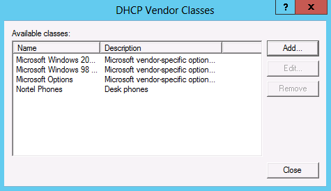

# Scenario: Customize lease duration based on device type
See the following sections in this topic.  
  
-   [Problem description](../Topic/Scenario--Customize-lease-duration-based-on-device-type.md#problem)  
  
-   [Grouping devices on the network](../Topic/Scenario--Customize-lease-duration-based-on-device-type.md#group)  
  
-   [Configure DHCP policies for different lease durations](../Topic/Scenario--Customize-lease-duration-based-on-device-type.md#ui)  
  
-   [Use Windows PowerShell to configure policies with different lease duration](../Topic/Scenario--Customize-lease-duration-based-on-device-type.md#ps)  
  
## <a name="problem"></a>Problem description  
An organization has the following known device types on the network:  
  
-   Desktop computers  
  
-   Desktop phones  
  
-   Servers  
  
-   Printers  
  
-   Mobile devices  
  
Servers, printers, and desktop phones are expected to be on the network for long periods of time. Mobile devices such as smartphones and tablets are expected to move in and out of the network frequently. Desktop computers are considered standard devices that will be on the network for 1 day to several days. The default lease duration for the DHCP scope is 8 days.  
  
To optimize IP address utilization, the network administrator would like to specify the lease duration based on device type as follows:  
  
|Device Type|Lease Duration|  
|---------------|------------------|  
|Desktop computers|8 days|  
|Desktop phones|30 days|  
|Servers|60 days|  
|Printers|60 days|  
|Mobile devices|8 hours|  
  
## <a name="group"></a>Grouping devices on the network  
Conditions you can use with DHCP policies to group devices on the network include:  
  
1.  **Vendor Class**: Most devices send this DHCP option with a DHCP lease request. The vendor class identifier is a string that is unique for the device type and the vendor. For example, Nortel phones might have a Vendor Class of Nortel\-i2004\-A.  
  
2.  **MAC address**: Every DHCP lease request contains the MAC address of the DHCP client, which is a unique 48 bit identifier for that device. The first three bytes of the MAC address contains the Organizationally Unique Identifier \(OUI\) which can be used to identify the device vendor. For example, devices manufactured by Apple will have a MAC address that begins with 00\-1B\-63, and HTC uses F8\-DB\-7F as one of its OUIs. Therefore, you can use the MAC address to identify device types.  
  
By defining conditions of a DHCP policy to be based on Vendor Class identifier or MAC address prefix, you can group clients into different device types. Using the previous example, devices might be grouped using the following conditions in DHCP policies:  
  
-   If your organization uses Hewlett\-Packard \(HP\) printers with JetDirect network adapter cards, you can define a new vendor class for **HP printers** using a vendor class definition of **Hewlett\-Packard JetDirect**.  
  
-   Servers can be grouped based on MAC addresses of the network adapter of each server, and desk phones might be grouped using a Vendor Class such as **Nortel\-i2004\-A** or **Cisco Systems, Inc. IP Phone CP\-7940G**.  
  
-   Mobile phones can typically be identified either by the Vendor Class identifier \(Android phones tend to use a Vendor Class starting with **dhcpcd**\) or by the OUI of the MAC address that specifies a vendor such as **Apple** or **HTC**.  
  
## <a name="ui"></a>Configure DHCP policies for different lease durations  
In the following example, a server\-based DHCP policy will be configured that enables different types of device to receive an IP address with a unique lease duration. For some devices, a new Vendor Class will be added.  
  
> [!IMPORTANT]  
> The value of the new Vendor Class must be the same as the value that is sent in the Vendor Class field by these devices in the DHCP packet when requesting for an address. Consult your vendor documentation to determine the appropriate vendor class.  
  
#### Create a new Vendor Class  
  
1.  In the DHCP console tree, right\-click **IPv4** and then click **Define Vendor Classes**.  
  
2.  Click **Add**, and then type the display name and description for the new vendor class under **Display name** and **Description**, respectively. For example, type **Nortel Phones** and **Desk phones**.  
  
3.  Under **ASCII**, type the vendor class identifier. For example, type **Nortel\-i2004\-A**. The corresponding **ID** and **Binary** values will be automatically added. When you are finished, click **OK**. See the following example.  
  
      
  
4.  Verify that the new Vendor Class was created successfully and then click **Close**. See the following example.  
  
      
  
    > [!IMPORTANT]  
    > The characters you type under ASCII must be an exact match. This includes using the same character casing and position and number of spaces.  
  
Similarly, you might create a Vendor Class for HP printers with **HP Printer** as the Display name and **Hewlett\-Packard JetDirect** in the ASCII data field, and so on for other types of devices.  
  
  
  
Add a vendor class for each device type that you wish to use in a DHCP policy and specify a custom configuration, such as lease duration. These vendor classes can be used for providing custom network configuration to different devices, such as a different lease duration.  
  
Next, create different policies for each type of device. The following procedure demonstrates how to create one such policy at the server level. You can also specify policies at the scope level which can also be used to group different device types by IP address range. If you use scope level policies instead of server level policies, you must configure similar policies in each scope to group devices in that subnet. If you use server level policies, they will apply to all scopes, but any scope level policies that exist will have precedence. For more information about policy processing, see [Policy processing](../Topic/Introduction-to-DHCP-Policies.md#processing).  
  
#### Create a server\-level Vendor Class based policy  
  
1.  In the DHCP console tree, under **IPv4**, right\-click **Policies** and then click **New Policy**.  
  
2.  Next to **Policy Name**, type a name for the policy. For example, type **Printer Policy** and then click **Next**.  
  
3.  Click **Add**, choose **Vendor Class** next to **Criteria**, choose **Equals** next to **Operator**, choose **HP Printer** \(or another value you added\) next to **Value**, and then click **Add**. See the following example.  
  
      
  
4.  Click **OK**, click **Next** twice, and then click **Finish**.  
  
5.  Right\-click **Printer Policy** and then click **Properties**.  
  
6.  On the **General** tab, select the **Set lease duration for the policy** checkbox and specify a lease of **60** days. See the following example.  
  
      
  
7.  Click **OK** to complete configuration of the policy.  
  
You can create policies for the other type of devices and set the policy lease duration as shown above. To create a policy for servers, you can create a MAC address based policy with all of the servers’ MAC addresses in the condition of the policy. Configuring a MAC address based condition is discussed in [Scenario: Secure a subnet to a specific set of clients](../Topic/Scenario--Secure-a-subnet-to-a-specific-set-of-clients.md).  
  
Similarly, policies for mobile phones can have conditions that match one of the possible phone vendors. You can attempt to identify Android phones by their Vendor Class identifier and other vendors such as HTC and Apple by their MAC address prefix \(OUI\).  
  
For each of these policies, you can configure the lease duration to the appropriate values.  
  
## <a name="ps"></a>Use Windows PowerShell to configure policies with different lease duration  
You can also use Windows PowerShell to create DHCP policies with a vendor class or MAC address based condition. To customize lease duration in these policies, you must set option value 51 \(lease duration\) in each policy.  
  
You can also specify new vendor classes with Windows PowerShell. For example, to add a new Vendor Class named **Printers** with ASCII data of **Hewlett\-Packard JetDirect**, type the following at an elevated Windows PowerShell prompt and then press ENTER:  
  
```  
Add-DhcpServerv4Class -Name "HP Printer" -Type Vendor -Data "Hewlett-Packard JetDirect"  
```  
  
To create a policy for printers similar to that in the previous procedure, type the following at an elevated Windows PowerShell prompt and then press ENTER:  
  
```  
Add-DhcpServerv4Policy -Name "Printer Policy" -Description "Policy for printers" -Condition "OR" -VendorClass "EQ", "HP Printer"  
  
```  
  
To create the same policy at the scope level, you must specify a scope ID. The following example specifies a scope with ID of 10.0.0.0:  
  
```  
Add-DhcpServerv4Policy -Name "Printers" -Description "Policy for printers" -ScopeId 10.0.0.0 -Condition "OR" -VendorClass "EQ", "HP Printer"  
  
```  
  
The following example shows how to create a MAC address based policy at the scope level with Windows PowerShell:  
  
```  
Add-DhcpServerv4Policy -Name "Servers" -Description "Policy for specific servers" -ScopeId 10.0.0.0 -Condition "OR" -MACAddress "EQ", "0012ABCD34D2", "EQ", "0123AB43CD6E", "EQ", "0A1234ABCDEF"  
```  
  
To add a lease duration setting to a policy, specify an **OptionId** of 51 with a lease duration in seconds. See the following example:  
  
```  
Set-DhcpServerv4OptionValue -ScopeId 10.0.0.0 -PolicyName "Printers" -OptionId 51 -Value 5184000  
```  
  
The value of 5184000 seconds can be calculated by multiplying 60 days \* \(24 hrs\/day \* 60 min\/hr \* 60 sec\/min\).  
  
## See also  
[Introduction to DHCP Policies](../Topic/Introduction-to-DHCP-Policies.md)  
  
