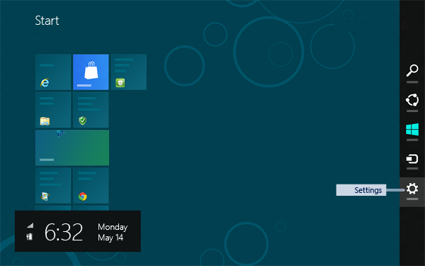
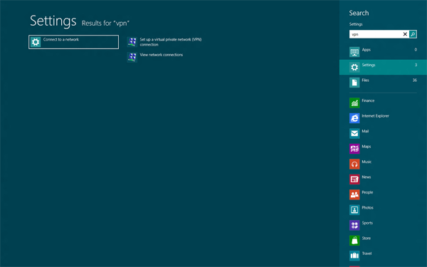
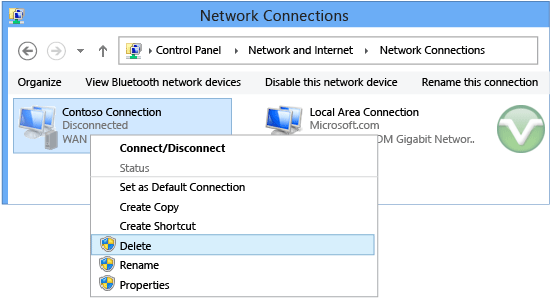

# Set Up and Edit VPN Connections in Windows 8
The virtual private network \(VPN\) in Windows 8 has been optimized to use with touch devices. Creating a VPN connection and connecting to corporate networks is faster and easier. The VPN connection icon appears in **View Available Networks** with other network connections. Creating a VPN profile requires only the server information. The Windows operating system automatically discovers authentication methods and tunnels when it connects, which provides a seamless experience for creating a VPN.  
  
The following sections describe how to use Windows 8 to set up and edit VPN connections:  
  
-   [Create a new VPN connection](#BKMK_Create)  
  
-   [Connect to a corporate network using an existing VPN Connection](#BKMK_Connect)  
  
-   [Edit connection properties](#BKMK_Edit)  
  
-   [Delete a connection](#BKMK_Delete)  
  
## Create a new VPN connection  
In Windows 8, you can use the Get Connected Wizard to create a VPN profile. To launch the wizard, type **vpn** in **Settings**, and then click **Set up a virtual private network \(VPN\) connection**.  
  
  
  
Figure 1: Launch the Get Connected Wizard  
  
In the wizard, you will provide the Internet address of the Remote Access VPN server to which you will connect, and a name for the new connection. You can use an IP address or the fully qualified domain name of the Remote Access server.  
  
To find your server settings, on a computer running Windows 8 with a VPN already configured, view the connection properties as shown in Figure 8. The destination name is the text that will be used for the VPN connection name \(profile name\), as shown in Figure 2.  
  
You can click **Remember Credentials** to save your credentials on the first successful connection attempt. This creates a new  REF \_Ref324847461 \\h Discovery Profile, which the client can use to connect to the VPN.  
  
### Discovery Profile  
Figure 2 shows the only information that is needed to create a VPN profile. During the first successful connection attempt, authentication and tunneling protocols are negotiated and configured for user name and password\-based VPN deployments. After these protocols are negotiated, you can edit the settings in **Connection Properties**.  
  
  
  
Figure 2: Get Connected Wizard Screen 1  
  
## Connect to a corporate network by use an existing VPN connection  
  
#### To connect with an existing VPN connection  
  
1.  Open **Charms** by moving the cursor to the top or bottom right corner of your computer screen. It can also be accessed by using the **Win\+C** keyboard shortcut.  
  
      
  
    Figure 3: Charms Bar  
  
2.  Click **Settings**, and then click the network icon that is displayed in the right corner of the screen, as shown in Figure 4.  
  
      
  
    Figure 4: Network icon location  
  
3.  In **Networks**, click the VPN connection that you want to use, and then click **Connect**.  
  
      
  
    Figure 5: Connect to VPN  
  
When you click **Connect**, a new connection is negotiated with the server by using the saved credentials. If you did not previously select **Remember Credentials** while creating the connection, you will be asked to provide credentials.  
  
> [!TIP]  
> When you select **Remember my credentials** when you create your connection, you won’t be asked for the credentials in further connection attempts. To clear the cached credentials, right\-click the connection, and then select **Clear Cached Credentials**, as shown in the following figure.  
  
  
  
Figure 6: Specify VPN connection credentials  
  
  
  
Figure 7: Clear cached credentials  
  
## Edit connection properties  
To edit a connection that you have already configured, right\-click the connection, and then select **Connection Properties**.  
  
To access **Connection Properties**, in the  **Networks**, click **View Connection Properties**.  
  
  
  
  
  
Figure 8: Connection Properties  
  
**Connection Properties** has four tabs as shown in Figure 8. Click each tab to perform the following tasks:  
  
-   **General**  
  
    Change the VPN server host name or IP address. Additionally, configure an interface to public network.  
  
-   **Options**  
  
    Configure point\-to\-point protocol \(PPP\) settings and enable or disable caching of credentials.  
  
-   **Security**  
  
    Configure tunnels, authentication, and encryption settings.  
  
-   **Networking**  
  
    Configure transports \(or protocols\). The most common protocols are TCP\/IPv4 and TCP\/IPv6.  
  
## Delete a connection  
On the **Start** screen, click **Search** in **Charms**, type **vpn**, and then click **View Network Connections** under **Settings**.  
  
  
  
Figure 9: View Network Connections  
  
Right\-click a VPN connection, and then click **Delete**, as shown in Figure 10.  
  
  
  
Figure 10: Deleting a connection  
  
