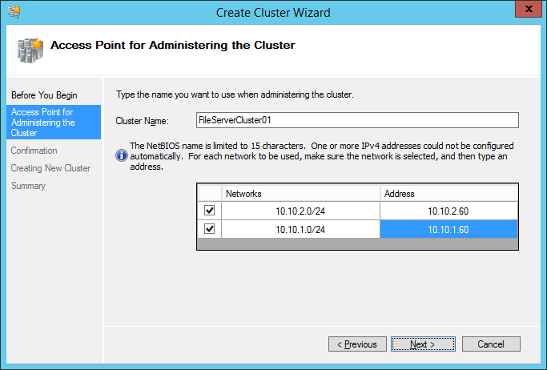

# Step 2 Create the Scale-Out File Server and storage pools
This topic discusses how to set up a clustered file server and create storage pools. It includes how to prepare storage for clustering, how to create the cluster and storage pools, as well as how to set storage pool defaults and create a clustered file server role \(scale\-out file server\).  
  
Before using this topic, you should already have installed the necessary server roles, configured MPIO, and done the other steps in [Step 1: Set up the cluster nodes for your file server](../Topic/Step-1--Set-up-the-cluster-nodes-for-your-file-server.md).  
  
Here's what's in this topic:  
  
-   [Step 1: Prepare Storage Spaces for clustering and pooling](#BKMK_Step1_Prepare)  
  
-   [Step 2: Create the cluster](#BKMK_Step2_CreateCluster)  
  
-   [Step 3: Create clustered storage pools](#BKMK_Step3_CreatePools)  
  
-   [Step 4: Set storage pool defaults](#BKMK_Step4_SetDefaults)  
  
-   [Step 5: Set up the cluster quorum witness](#BKMK_Step5_Quorum)  
  
-   [Step 6: Create the Scale\-Out File Server role](#BKMK_CreateSOFS)  
  
## <a name="BKMK_Step1_Prepare"></a>Step 1: Prepare Storage Spaces for clustering and pooling  
Before creating the cluster, it's a good idea to wipe out any existing Storage Spaces and Failover Clustering data, check that all physical disks are healthy, online and writeable, and initialize any RAW disks. Preparing the storage before clustering helps reduce cluster validation warnings.  
  
### To prepare storage by using Server Manager  
  
1.  If your storage enclosures and servers were previously used for something else, completely erase all Storage Spaces and Failover Clustering data from the physical disks and storage enclosures.  
  
    For a script that can completely erase everything from a Storage Spaces configuration \(and we do mean everything, so be careful\!\), see [Completely Clearing an Existing Storage Spaces Configuration](http://gallery.technet.microsoft.com/Completely-Clearing-an-ab745947).  
  
2.  Use Remote Desktop to connect to each cluster node, and then go to **Server Manager > File and Storage Services > Storage Pools**. Select the **Primordial** pool for the cluster node and confirm that the **Physical Disks** tile lists all disks in the shared storage enclosures. Also confirm that:  
  
    -   None of the disks have a checkmark in the **Read Only** column  
  
    -   None of the disks display any warnings in the Health \(**\!**\) column  
  
    -   All of the disks show the correct **Slot number**, **MediaType**, and **Chassis**.  
  
3.  For a script that can validate your physical disks and enclosures and perform some performance and health checks, see [Storage Spaces Physical Disk Validation Script](http://gallery.technet.microsoft.com/scriptcenter/Storage-Spaces-Physical-7ca9f304). Note that this script preconditions your SSDs and does performance testing, so it'll take quite a while to run \(up to a day or two\). It can also provision Storage Spaces, but we'll cover that after you create the cluster.  
  
4.  Initialize any disks with the RAW partition style so that Storage Spaces can use them.  
  
    To do so, in **Computer Management**, go to **Disk Management**. The Initialize Disk dialog box appears if you have any uninitialized disks \- choose the **GPT** partition style.  
  
### To prepare storage by using Windows PowerShell  
  
1.  If your storage enclosures and servers were previously used for something else, completely erase all Storage Spaces and Failover Clustering data from the physical disks and storage enclosures.  
  
    For a script that can completely erase everything from a Storage Spaces configuration \(and we do mean everything, so be careful\!\), see [Completely Clearing an Existing Storage Spaces Configuration](http://gallery.technet.microsoft.com/Completely-Clearing-an-ab745947).  
  
2.  Check all physical disks to make sure that they’re healthy, show the correct MediaType, and are showing as eligible for pooling. Also confirm that the storage enclosures are showing enclosure information properly.  
  
    For a script that can validate your physical disks and enclosures and perform some performance and health checks, see [Storage Spaces Physical Disk Validation Script](http://gallery.technet.microsoft.com/scriptcenter/Storage-Spaces-Physical-7ca9f304). Note that this script preconditions your SSDs and does performance testing, so it'll take quite a while to run \(up to a day or two\). It can also provision Storage Spaces, but we'll cover that after you create the cluster.  
  
3.  Initialize any disks with the RAW partition style, bring online any offline disks, and make all disks read\/write so that Storage Spaces can use the disks. To do so from a Windows PowerShell session on your management computer or one of the cluster nodes, use the following commands, replacing *FS01,FS02,FS03,FS04* with the node names of your cluster:  
  
    ```  
    Invoke-Command -ComputerName FS01,FS02,FS03,FS04 -ScriptBlock {  
        Get-Disk |   
        Where-Object -Property OperationalStatus -EQ "Offline" |   
        Set-Disk -IsOffline $false   
  
        Get-Disk |  
        Where-Object -Property IsReadOnly -EQ $true |   
        Set-Disk -IsReadOnly $false  
  
        Get-PhysicalDisk -CanPool $true |   
        Get-Disk |   
        Where-Object -Property PartitionStyle -EQ RAW |   
        Initialize-Disk  
    }  
    ```  
  
## <a name="BKMK_Step2_CreateCluster"></a>Step 2: Create the cluster  
Once your storage is prepped, you can cluster the file server nodes.  
  
### To create the cluster by using Server Manager  
To create the file server cluster, use the following procedure from one of the cluster nodes or a management computer in the same domain as the cluster:  
  
1.  In Server Manager click **Tools** > **Failover Cluster Manager**.  
  
2.  In the **Actions** pane, click **Validate Configuration…**.  
  
3.  Use the Validate a Configuration Wizard to specify the cluster nodes and then run all tests. This could take an hour or more, so get comfortable.  
  
4.  Fix any problems identified by the wizard.  
  
    If there aren't any problems, leave the **Create the cluster now using the validated nodes…** checkbox selected and then click **Finish** to create the cluster.  
  
    If you're having trouble getting disks to appear, check the **List Disks** section of the report for more details.  
  
5.  If you didn't already launch the Create Cluster Wizard, in the **Actions** pane of Failover Cluster Manager, click **Create Cluster…**.  
  
6.  On the **Access Point for Administering the Cluster** page shown in Figure 1, enter the name you want to use when administering the cluster itself \- you'll create a clustered file server instance that other computers will connect to later \(with a different name\).  
  
      
  
    **Figure 1** The Access Point for Administering the Cluster page of the Create Cluster Wizard  
  
7.  On the same page, enter static IP addresses for each network interface.  
  
8.  On the **Confirmation** page, clear the **Add all eligible storage to the cluster** checkbox \- you'll pool the disks later.  
  
    > [!NOTE]  
    > You might see "Name resolution not yet available" in Failover Cluster Manager for the first 15 minutes or so after creating the cluster due to DNS propagation delays. Server Manager also might report problems. The easiest thing to do is wait for the DNS data to propagate.  
  
### To create the cluster by using Windows PowerShell  
From a management computer on one of the subnets connected to the nodes, open a Windows PowerShell session and then use the following steps.  
  
1.  Run cluster validation.  
  
    To do so, enter the following commands from a management computer in the same domain as the cluster, replacing *FS01,FS02,FS03,FS04* with the names of your cluster nodes. This could take a few minutes or longer and requires Internet Explorer on the management computer to view the validation report.  
  
    ```  
    $report = Test-Cluster -Node FS01,FS02,FS03,FS04  
    Invoke-Item $report.versioninfo.filename  
    ```  
  
2.  To create the failover cluster, enter the following commands from a management computer in the same domain as the cluster, again replacing *FS01,FS02,FS03,FS04* with the names of your cluster nodes:  
  
    ```  
    New-Cluster -Name FileServerCluster01 -Node FS01,FS02,FS03,FS04 -NoStorage -StaticAddress 10.10.1.60,10.10.2.60  
    ```  
  
## <a name="BKMK_Step3_CreatePools"></a>Step 3: Create clustered storage pools  
Create the storage pools specified by your storage design. You can use Failover Cluster Manager to create a simple storage pool, or Windows PowerShell if you want to automate creating multiple pools to create or need to change advanced pool settings.  
  
For example, if you don't have any 4K native disks yet  but want the ability to  add some later, you'll have to use Windows PowerShell to create the pool and set the pool default to 4 KB logical sectors . For more info, see [Step 4: Prepare to deploy the solution](../Topic/Software-Defined-Storage-Design-Considerations-Guide.md#BKMK_Step4).  
  
### To create storage pools by using Failover Cluster Manager  
  
1.  In Failover Cluster Manager, go to *<ClusterName>* > **Storage** > **Pools**.  
  
2.  Right\-click **Pools**, and then click **New Storage Pool**.  
  
    The New Storage Pool wizard appears.  
  
3.  On the **Specify a storage pool name and subsystem** page, enter a name for the storage pool, and then select the group of available physical disks \(also known as a primordial pool\) that you want to use. In the **Available to** column, verify that the cluster name is listed.  
  
4.  On the **Select physical disks for the storage pool** page, select each physical disk that you want to include in the storage pool.  
  
    For a failover cluster, you must select at least three physical disks. If you're using enclosure awareness and  multiple pools, make sure that you evenly allocate disks from all enclosures to each pool.  
  
5.  Select any SSDs that you want to use as journal disks for use by parity spaces in the pool \(see [Software-Defined Storage Design Considerations Guide](../Topic/Software-Defined-Storage-Design-Considerations-Guide.md) for more details\), and then in the **Allocation** column, choose **Journal** from the drop\-down list.  
  
6.  Repeat these steps for any additional pools you're creating.  
  
### To create storage pools by using Windows PowerShell  
From a management computer on one of the subnets connected to the nodes, open a Windows PowerShell session and then use the following commands to create a single storage pool with all physical disks, and 4 KB logical sectors.  
  
```  
$DisksToAdd = Get-PhysicalDisk -CanPool $true  
New-StoragePool -PhysicalDisks $DisksToAdd -FriendlyName StoragePool1 -StorageSubSystemFriendlyName "Clustered Storage Spaces*" -LogicalSectorSizeDefault 4096  
```  
  
You can also use the ProvisionStorageConfiguration.ps1 script to automatically  create storage pools and virtual disks according to recommended best practices. For more information, see [Storage Spaces Deployment Guide for Automation Scripts](http://social.technet.microsoft.com/wiki/contents/articles/31664.storage-spaces-deployment-guide-for-automation-scripts.aspx) .  
  
## <a name="BKMK_Step4_SetDefaults"></a>Step 4: Set storage pool defaults  
After creating your storage pools, if you're using Storage Spaces there are a few settings that you should use Windows PowerShell to change:  
  
-   When to retire missing physical disks  
  
-   Enclosure awareness  
  
-   Default number of columns  
  
The first one you should change if you want Storage Spaces to automatically repair virtual disks after a disk failure \(we recommend this for all but the smallest environments\); the other two are necessary only if you use a GUI to create virtual disks.  
  
Consult your storage design, open a Windows PowerShell session with administrative permissions on the file server cluster, and then use this chunk of code to change these settings, modifying the first three lines to suit your design.  
  
```  
$PoolName = "Pool1"  
$EnclosureAwareDefault = $true  
$MirrorNumberofColumnsDefault = 4  
  
Write-Output "Current storage pool and resiliency type settings"  
Get-StoragePool -FriendlyName $PoolName |   
Format-Table FriendlyName, EnclosureAwareDefault, RetireMissingPhysicalDisks, RepairPolicy -AutoSize   
Get-ResiliencySetting -StoragePool (Get-StoragePool $PoolName) -Name Mirror |   
Format-Table -Property Name,NumberOfColumnsDefault,NumberOfDataCopiesDefault, InterleaveDefault -AutoSize  
  
Set-StoragePool -FriendlyName $PoolName -RetireMissingPhysicalDisks Always   
Set-StoragePool -FriendlyName $PoolName -EnclosureAwareDefault $EnclosureAwareDefault   
Set-ResiliencySetting -StoragePool (Get-StoragePool $PoolName) -Name Mirror -NumberOfColumnsDefault $MirrorNumberofColumnsDefault   
  
Write-Output "New storage pool and resiliency type settings"  
Get-StoragePool -FriendlyName $PoolName |   
Format-Table FriendlyName, EnclosureAwareDefault, RetireMissingPhysicalDisks, RepairPolicy -AutoSize  
Get-ResiliencySetting -StoragePool (Get-StoragePool $PoolName) -Name Mirror |   
Format-Table -Property Name,NumberOfColumnsDefault,NumberOfDataCopiesDefault, InterleaveDefault -AutoSize  
```  
  
## <a name="BKMK_Step5_Quorum"></a>Step 5: Set up the cluster quorum witness  
This solution uses a witness disk to provide quorum to the file server cluster. The following procedures describe how to create an appropriate storage space \(more generically called a virtual disk\) and how to assign it as the witness disk, using Failover Cluster Manager or Windows PowerShell.  
  
Later you can use this virtual disk as a file share witness for other clusters in your solution if you want.  
  
### To set up the cluster quorum witness by using Failover Cluster Manager  
Connect to the cluster using an account with administrative permissions and then use the following procedure to create a new virtual disk for use as the disk witness and set the cluster quorum to use the disk witness.  
  
##### Create a virtual disk for use as a disk witness  
  
1.  In Failover Cluster Manager, select the cluster, and then go to **Storage** > **Pools**.  
  
2.  Select a pool, and then click **New Virtual Disk**.  
  
3.  On the **Storage Pool** page, select the first pool \(if you have multiple pools\).  
  
4.  On the **Virtual Disk Name** page, enter a name for the virtual disk \(for example, **File Server Cluster Quorum**\).  
  
    Don't create storage tiers on this virtual disk \- the cluster quorum doesn't need the added performance of an SSD tier. Because your SSDs are likely set to **Automatic** allocation, some of the virtual disk will get written to SSD anyway, but not enough to worry about.  
  
5.  On the **Storage Layout** page, click **Mirror**.  
  
6.  On the **Resiliency Settings** page, click **Two\-way mirror**.  
  
7.  On the **Specify the size of the virtual disk** page, enter **4** \(GB\).  
  
8.  On the **Assign to a drive letter or folder** page of the **New Volume Wizard**, choose **Don't assign to a drive letter or folder** \(you'll probably want to save the drive letter for a more commonly used volume\).  
  
### To set up the cluster quorum witness by using Windows PowerShell  
In a Windows PowerShell session with administrative credentials that's connected to the file server cluster, enter the following commands to create a new virtual disk for use as the disk witness and then set the cluster quorum to use the disk witness.  
  
##### Create the virtual disk and assign it as the witness disk  
  
1.  Run these commands to create the virtual disk and assign it as the witness disk for the cluster:  
  
    ```  
    $WitnessDiskName = "WitnessDisk1"  
  
    New-Volume -StoragePoolFriendlyName "Pool1" -FriendlyName $WitnessDiskName -Size 4GB -ResiliencySettingName Mirror -NumberOfColumns 3 -FileSystem NTFS -PhysicalDiskRedundancy 2  
  
    Set-ClusterQuorum -DiskWitness (Get-ClusterResource -Name ("Cluster Virtual Disk (" + $WitnessDiskName + ")"))  
    ```  
  
    In the output from these commands, the virtual disk should be listed with the the **QuorumType** as **NodeAndDiskMajority**, as shown in this example output:  
  
    ```  
    Cluster        : FSCLUSTER  
    QuorumResource : Cluster Virtual Disk (WitnessDisk1)  
    QuorumType     : NodeAndDiskMajority  
    ```  
  
2.  Then run the following commands to confirm that the storage pools and virtual disk are listed as **Online** and that the correct quorum resource is listed.  
  
    ```  
    Get-ClusterResource |   
    Where-Object {$_.ResourceType -eq "Storage Pool" -or $_.ResourceType -eq "Physical Disk"} |   
    Format-Table -Autosize  
    Get-ClusterQuorum  
    ```  
  
    Here's an example of the output:  
  
    ```  
    Name                                    State  OwnerGroup        ResourceType   
    ----                                    -----  ----------        ------------   
    Cluster Pool 1                          Online Cluster Group     Storage Pool   
    Cluster Virtual Disk (WitnessDisk1)     Online Available Storage Physical Disk   
  
    Cluster              QuorumResource                                                                                                                                        
    -------              --------------                                                                                                                                        
    FSCLUSTER            Cluster Virtual Disk (WitnessDisk1)    
    ```  
  
## <a name="BKMK_CreateSOFS"></a>Step 6: Create the Scale\-Out File Server role  
The last step in setting up the cluster services for your file server is creating the clustered file server role, which is when you create the Scale\-Out File Server instance on which your continuously available file shares are hosted.  
  
### To create a Scale\-Out File Server role by using Server Manager  
  
1.  In Failover Cluster Manager, select the cluster, go to **Roles**, and then click **Configure Role…**.  
  
    The High Availability Wizard appears.  
  
2.  On the **Select Role** page, click **File Server**.  
  
3.  On the **File Server Type** page, click **Scale\-Out File Server for application data**.  
  
4.  On the **Client Access Point** page, type a name for the Scale\-Out File Server.  
  
5.  Verify that the role was successfully set up by going to **Roles** and confirming that the **Status** column shows **Running** next to the clustered file server role you created, as shown in Figure 2.   
  
    **Figure 2** Failover Cluster Manager showing the Scale\-Out File Server with the Running status  
  
> [!NOTE]  
> After creating the clustered role, there might be some network propagation delays that could prevent you from creating file shares on it for a few minutes, or potentially longer.  
  
### To create a Scale\-Out File Server role by using Windows PowerShell  
In a Windows PowerShell session that's connected to the file server cluster, enter the following commands to create the Scale\-Out File Server role, changing *FSCLUSTER* to match the name of your cluster, and *SOFS* to match the name you want to give the Scale\-Out File Server role:  
  
```  
Add-ClusterScaleOutFileServerRole -Name SOFS -Cluster FSCLUSTER  
```  
  
> [!NOTE]  
> After creating the clustered role, there might be some network propagation delays that could prevent you from creating file shares on it for a few minutes, or potentially longer.  
  
## Next steps  
After completing the steps in this topic, you should have a clustered file server and storage pool\(s\), and will be ready to create virtual disks and shares, as discussed in [Step 3 Create storage spaces CSVs and file shares on the Scale-Out File Server](../Topic/Step-3-Create-storage-spaces-CSVs-and-file-shares-on-the-Scale-Out-File-Server.md).  
  
