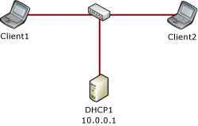
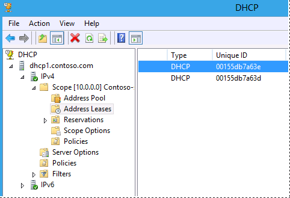
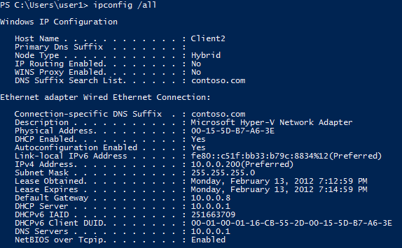

# Step-by-Step: Configure DHCP Using Policy-based Assignment
The Dynamic Host Configuration Protocol \(DHCP\) server role in [!INCLUDE[win8_server_2](../Token/win8_server_2_md.md)] introduces a new policy based IP address assignment feature. Policy based assignment \(PBA\) allows an administrator to group DHCP clients by specific attributes based on fields contained in the DHCP client request packet. This feature allows for targeted administration and greater control of configuration parameters delivered to network devices.  
  
## In this guide  
This guide provides step\-by\-step instructions for deploying DHCP policy based assignment in a test lab using one server computer and two client computers. Software and hardware requirements are provided, as well as an overview of DHCP policy based assignment.  
  
> [!IMPORTANT]  
> The following instructions are for configuring a test lab using the minimum number of computers. Individual computers are needed to separate the services provided on the network and to clearly show the desired functionality. This configuration is neither designed to reflect best practices nor does it reflect a desired or recommended configuration for a production network. The configuration, including IP addresses and all other configuration parameters, is designed only to work on a separate test lab network.  
  
## DHCP policy based assignment overview  
With a DHCP server running [!INCLUDE[win8_server_2](../Token/win8_server_2_md.md)], administrators can define an address assignment policy at the server level or scope level. A policy contains a set of conditions to evaluate when processing client requests. Policy based assignment enables flexibility for some common scenarios, including:  
  
1.  **Multiple device types**: A network includes many different DHCP client devices, such as printers, IP phones, and desktops. Administrators need the ability to classify these devices using different IP address ranges. This enables router policies and quality of service \(QoS\) based on IP address range policies to control network access or traffic. For example, you can add a vendor class of “Hewlett\-Packard JetDirect” or Cisco Systems, Inc. IP Phone CP\-7940G and configure printer and IP\-phone policies to assign a specific IP address range to these devices.  
  
2.  **Multiple roles**: A network includes different types of computers, such as laptops, desktops, and servers in the same subnet. Depending on the type of client, the administrator might wish to provide different lease duration settings. All the wireless clients that connect via a specific relay agent can be assigned a four\-hour lease duration. DNS dynamic update protocol can be disabled for clients matching this policy. Similarly, a server policy can be created using a list of server MAC addresses. Servers can be assigned a 12\-day lease duration  
  
3.  **Virtualization**: A data center network employs virtualization for different workloads and applications. Virtual machines are added and removed dynamically depending upon load requirements at a given time. An administrator wishing to route traffic on the network differently for VMs can create a policy based on MAC address prefix to assign a short lease duration, specific IP address range, and different default gateway.  
  
The following fields in the DHCP client request are available when defining policies.  
  
-   Vendor Class  
  
-   User Class  
  
-   MAC address  
  
-   Client Identifier  
  
-   Relay Agent Information  
  
### Policy settings and evaluation  
Policy settings can be of three types.  
  
-   **IP address range**: The IP address range within a scope from which to assign an IP address to a client. A server level policy cannot have a setting for an IP address range.  
  
-   **Standard DHCP options**: One or more standard DHCP options to send to a client in the response based on the options requested by the client in the parameter request list.  
  
-   **Vendor specific DHCP options**: One or more vendor specific DHCP options to send to the client based on the vendor class field in the client request.  
  
The DHCP server evaluates policies sequentially according to an assigned processing order. The DHCP administrator assigns the processing order to the policies. If policies exist at the server and scope levels, the server applies both sets of policies and evaluates the scope policies before the server policies. The processing order for a scope level policy defines the order of evaluation within the scope. If there are no policies defined at the scope level, the policies at the server level apply to the scope.  
  
#### Address assignment  
The DHCP server determines the scope to which a DHCP client belongs based on the gateway IP address of the relay agent or the interface of the DHCP server on which it receives the DHCP client packet. Once the server determines the client scope, the server evaluates the DHCP packet against the policies applicable for the scope in the processing order specified. The policies applicable at a scope are those configured at the scope and those inherited from the server. A single client request can match multiple policies.  
  
If a client request matches the conditions of a policy for which a specific IP address range is associated, the server will assign the first free IP address from the range as determined by the rule. If a policy is associated with multiple address ranges, the server will assign IP addresses by first attempting to assign an IP from the lowest address range. If no IP addresses are available to use from the lower address range, the server will then look for a free IP address from the higher address ranges. If no IP addresses are free from any of the address ranges associated with the policy, the server will process the next matched policy as defined by the processing order.  
  
If none of the matched policies has a free IP address, the server will drop the client packet and log an event. If a DHCP client packet does not match any of the policies applicable for the scope, or none of the matched policies for a client packet is associated with an IP address range, the server will lease the client an IP address from the IP address range configured for the scope exclusive of any policy\-specific IP address ranges.  
  
#### Option assignment  
A DHCP client uses the parameter request list field in a DHCP packet to request a list of standard options from the server. The option assignment processing for a client is similar to that of IP address assignment. The DHCP server evaluates the fields in the client request against each policy applicable for the scope in the processing order specified. If the client request matches the conditions of any of the policies applicable for the scope, and its settings include specific options, the server returns these options to the client. If multiple policies match the client request, the server returns the sum of the options specified for each of the matched policies. The DHCP server sends vendor class options to the client based on the vendor class contained in the DHCP client request.  
  
## Scenario overview  
This test lab demonstrates new DHCP functionality in [!INCLUDE[win8_server_2](../Token/win8_server_2_md.md)]. One server computer and two client computers are used. See the following figure.  
  
  
  
### Hardware and software requirements  
One server computer and two client computers are required to complete the test lab.  
  
The following are required components of the test lab:  
  
1.  The product disc or other installation media for [!INCLUDE[win8_server_2](../Token/win8_server_2_md.md)].  
  
2.  One computer that meets the minimum hardware requirements for [!INCLUDE[win8_server_2](../Token/win8_server_2_md.md)].  
  
3.  At least one DHCP client computer is required.  
  
    > [!NOTE]  
    > The lab uses two computers running [!INCLUDE[win8_client_1](../Token/win8_client_1_md.md)]. If only one client computer is available, or clients are not running [!INCLUDE[win8_client_2](../Token/win8_client_2_md.md)], you must alter some of the procedures in the test lab accordingly.  
  
### Steps for configuring the test lab  
The following procedures are used to configure computers for the demonstration portion of the test lab:  
  
1.  [Configure DHCP1](../Topic/Step-by-Step--Configure-DHCP-Using-Policy-based-Assignment.md#config_dhcp1): DHCP1 is a domain controller, DNS server, and DHCP server for the contoso.com Active Directory domain.  
  
2.  [Configure Client1](../Topic/Step-by-Step--Configure-DHCP-Using-Policy-based-Assignment.md#config_client1): Client1 is a DHCP client computer.  
  
3.  [Configure Client2](../Topic/Step-by-Step--Configure-DHCP-Using-Policy-based-Assignment.md#config_client2): Client2 is a DHCP client computer.  
  
## <a name="config_dhcp1"></a>Configure DHCP1  
DHCP1 is a computer running [!INCLUDE[win8_server_2](../Token/win8_server_2_md.md)], providing the following services:  
  
-   A domain controller for the contoso.com Active Directory domain.  
  
-   An authoritative DNS server for the contoso.com DNS zone.  
  
-   A DHCP server.  
  
Initial configuration of DHCP1 consists of the following steps:  
  
-   [Install the operating system and configure TCP\/IP on DHCP1](../Topic/Step-by-Step--Configure-DHCP-Using-Policy-based-Assignment.md#dhcp1_1)  
  
-   [Install AD DS, DNS Server, and DHCP Server](../Topic/Step-by-Step--Configure-DHCP-Using-Policy-based-Assignment.md#dhcp1_2)  
  
-   [Create a domain administrator account](../Topic/Step-by-Step--Configure-DHCP-Using-Policy-based-Assignment.md#dhcp1_3)  
  
-   [Create a DHCP scope on DHCP1](../Topic/Step-by-Step--Configure-DHCP-Using-Policy-based-Assignment.md#dhcp1_5)  
  
### <a name="dhcp1_1"></a>Install the operating system and configure TCP\/IP on DHCP1  
  
##### To install the operating system and configure TCP\/IP on DHCP1  
  
1.  Start your computer using the [!INCLUDE[win8_server_2](../Token/win8_server_2_md.md)] product disc or other digital media.  
  
2.  When prompted, enter a product key, accept license terms, configure clock, language, and regional settings, and provide a password for the local Administrator account.  
  
3.  Press **Ctrl\+Alt\+Delete** and sign\-in using the local Administrator account.  
  
4.  If you are prompted to enable Windows Error Reporting, click **Accept**.  
  
5.  Click **Start**, type **ncpa.cpl**, and then press **ENTER**. The **Network Connections** control panel will open.  
  
    > [!TIP]  
    > The previous step demonstrates new functionality in [!INCLUDE[win8_server_2](../Token/win8_server_2_md.md)] that enables you to search and run applications, settings, and files by clicking **Start** and then typing a search term. You can also open the **Network Connections** control panel by clicking next to **Wired Ethernet Connection** in Server Manager using the **Local Server** view. For more information, see [Common Management Tasks and Navigation](http://go.microsoft.com/fwlink/p/?LinkId=242147) in [!INCLUDE[win8_server_2](../Token/win8_server_2_md.md)] \(http:\/\/go.microsoft.com\/fwlink\/p\/?LinkId\=242147\).  
  
6.  In **Network Connections**, right\-click **Wired Ethernet Connection** and then click **Properties**.  
  
7.  Double\-click **Internet Protocol Version 4 \(TCP\/IPv4\)**.  
  
8.  On the **General** tab, choose **Use the following IP address**.  
  
9. Next to **IP address** type **10.0.0.1** and next to **Subnet mask** type **255.255.255.0**. It is not necessary to provide an entry next to **Default gateway**.  
  
10. Next to **Preferred DNS server**, type **10.0.0.1**.  
  
11. Click **OK** twice, and then close the **Network Connections** control panel.  
  
### <a name="dhcp1_2"></a>Install AD DS, DNS Server, and DHCP Server  
DHCP1 will serve as a domain controller, DNS server, and DHCP server for the contoso.com Active Directory domain.  
  
##### To configure DHCP1 as a domain controller, DNS server, and DHCP server  
  
1.  The Server Manager Dashboard is displayed by default. In the navigation pane, click **Configure this local server**.  
  
2.  Under **PROPERTIES**, click the name next to **Computer name**. The **System Properties** dialog box will open.  
  
3.  On the **Computer Name** tab, click **Change** and then type **DHCP1** under **Computer name**.  
  
4.  Click **OK** twice, and then click **Close**.  
  
5.  When you are prompted to restart the computer, click **Restart Now**.  
  
6.  After restarting the computer, sign\-in using the local Administrator account.  
  
7.  In Server Manager, under **Configure this local server**, click **Add Roles and Features**.  
  
8.  In the **Add Roles and Features Wizard**, click **Next** three times, and then on the **Select server roles** page select the **Active Directory Domain Services** checkbox.  
  
9. When you are prompted to add required features, click **Add Features**.  
  
10. Select the **DHCP Server** checkbox.  
  
11. When you are prompted to add required features, click **Add Features**.  
  
12. Select the **DNS Server** checkbox.  
  
13. When you are prompted to add required features, click **Add Features**.  
  
14. Click **Next** five times, and then click **Install**.  
  
15. Wait for the installation process to complete, verify on the **Installation progress** page that **Configuration required. Installation succeeded on DHCP1** is displayed, and then click **Close**.  
  
16. Click the Notification flag and then click **Promote this server to a domain controller**. See the following example.  
  
      
  
17. In the **Active Directory Domain Services Configuration Wizard**, on the **Deployment Configuration** page, choose **Add a new forest** and then next to **Root domain name**, type **contoso.com**.  
  
18. Click **Next**, and then on the **Domain Controller Options** page, under **Type the Directory Services Restore Mode \(DSRM\) password**, type a password next to **Password** and **Confirm password**. Confirm that **Domain Name System \(DNS\) server** and **Global Catalog \(GC\)** are selected, and then click **Next**.  
  
19. Click **Next** four times, verify that **All prerequisite checks passed successfully** is displayed, and then click **Install**.  
  
20. The computer will restart automatically to complete the installation process.  
  
21. Sign in using the local Administrator account.  
  
### <a name="dhcp1_3"></a>Create a domain administrator account  
A domain administrator account is required to configure settings in the test lab.  
  
> [!TIP]  
> You can use the CONTOSO\\Administrator account in this test lab and skip creation of a domain administrator account if desired. This account has domain administrator privileges, and other privileges. However, it is a best practice to disable or rename this account. For more information, see [Active Directory Best Practices](http://go.microsoft.com/fwlink/p/?LinkID=243071)\(http:\/\/go.microsoft.com\/fwlink\/p\/?LinkID\=243071\).  
  
##### To create a domain administrator account  
  
1.  On the Server Manager menu bar, click **Tools**, and then click **Active Directory Users and Computers**.  
  
2.  In the **Active Directory Users and Computers** console tree, double\-click **contoso.com**, right\-click **Users**, point to **New**, and then click **User**.  
  
3.  In the **New Object – User** dialog box, type **user1** under **User logon name** and next to **Full name**, then click **Next**.  
  
4.  Next to **Password** and **Confirm password**, type a password for the user1 account.  
  
5.  Clear the checkbox next to **User must change password at next logon**, select the **Password never expires** checkbox, click **Next**, and then click **Finish**.  
  
6.  Double\-click **user1** and then click the **Member Of** tab.  
  
7.  Click **Add**, type **domain admins** under **Enter the object names to select**, click **OK** twice, and then close the **Active Directory Users and Computers** console.  
  
8.  Click **Start**, click **Administrator**, and then click **Sign out**.  
  
9. Sign in to the computer using the user1 credentials by clicking the left arrow next to **CONTOSO\\Administrator** and then clicking **Other user**.  
  
### <a name="dhcp1_5"></a>Create a DHCP scope on DHCP1  
Next, create a DHCP scope on DHCP1.  
  
##### To create a DHCP scope on DHCP1  
  
1.  On the Server Manager menu bar, click **Tools** and then click **DHCP**. THE DHCP console opens.  
  
2.  In the DHCP console tree, navigate to **IPv4**. Right\-click **IPv4** and then click **New Scope**. The **New Scope Wizard** opens.  
  
3.  Click **Next** and then type a name for the new scope next to **Name** \(ex: Contoso\-scope1\).  
  
4.  Click **Next** and then in **IP Address Range**, type **10.0.0.1** next to **Start IP address**, type **10.0.0.254** next to **End IP address**, and type **24** next to **Length**. The value of Subnet mask will change automatically to **255.255.255.0**.  
  
5.  Click **Next**, and then in **Add Exclusions and Delay** type **10.0.0.1** under **Start IP address**, type **10.0.0.10** under **End IP address**, and then click **Add**. This allows the first ten IP addresses in the 10.0.0.0\/24 subnet to be used for static addressing of servers on the network.  
  
6.  Click **Next** and then in **Lease Duration** under **Limited to** enter **0 Days**, **0 Hours**, and **2 Minutes**. This very short lease duration will simplify the DHCP demonstration.  
  
7.  Click **Next** three times, and then in **Domain Name and DNS Servers**, verify that the **Parent domain** is **contoso.com** and **10.0.0.1** is listed as the only DNS server.  
  
8.  Click **Next** twice, and then in **Activate Scope** select **Yes, I want to activate this scope now**.  
  
9. Click **Next**, and then click **Finish**.  
  
10. In the DHCP console tree, right\-click **dhcp1.contoso.com**, and then click **Authorize**.  
  
11. Refresh the view in the DHCP console and verify that DHCP1 is authorized and that the Contoso\-scope1 is active.  
  
    Note: To review scopes on the current server using Windows PowerShell, right\-click **Windows PowerShell**, click **Run as Administrator**, click **Yes** in the User Account Control alert that appears, and then type the following command at the Windows PowerShell prompt, and then press ENTER.  
  
    ```  
    get-dhcpserverv4scope  
    ```  
  
**PS C:\\Windows\\system32> get\-dhcpserverv4scopeScopeId         SubnetMask      Name           State    StartRange      EndRange        LeaseDuration\-\-\-\-\-\-\-         \-\-\-\-\-\-\-\-\-\-      \-\-\-\-           \-\-\-\-\-    \-\-\-\-\-\-\-\-\-\-      \-\-\-\-\-\-\-\-        \-\-\-\-\-\-\-\-\-\-\-\-\-10.0.0.0        255.255.255.0   Contoso\-scope1 Active   10.0.0.1        10.0.0.254      00:02:00**  
  
## <a name="config_client1"></a>Configure Client1  
Client1 is a computer running [!INCLUDE[win8_client_1](../Token/win8_client_1_md.md)] that is acting as a DHCP client.  
  
Configuration of Client1 consists of the following steps:  
  
-   [Install the operating system on Client1](../Topic/Step-by-Step--Configure-DHCP-Using-Policy-based-Assignment.md#client1_1)  
  
-   [Pin Windows PowerShell to the taskbar](../Topic/Step-by-Step--Configure-DHCP-Using-Policy-based-Assignment.md#client1_3)  
  
During the demonstration portion of the test lab, Client1 will be used as a DHCP client.  
  
### <a name="client1_1"></a>Install the operating system on Client1  
  
##### To install the operating system on Client1  
  
1.  Start your computer using the [!INCLUDE[win8_client_2](../Token/win8_client_2_md.md)] product disc or other digital media.  
  
2.  When prompted, enter a product key and accept license terms.  
  
3.  When prompted to enter a computer name, type **Client1** and click **Next**.  
  
4.  Click **Use express settings**.  
  
5.  On the **Sign in to your PC** page, click **Don’t want to sign in with a Microsoft account** and then click **Local account**.  
  
6.  Next to **User name**, type **user1**, enter a password and password hint, and then click **Finish**.  
  
### <a name="client1_3"></a>Pin Windows PowerShell to the taskbar  
The DHCP failover demonstration on Client1 makes use of Windows PowerShell to verify DHCP lease information. To make Windows PowerShell more easily accessible, it will be pinned to the taskbar.  
  
##### To pin Windows PowerShell to the taskbar  
  
1.  The **Start** menu is displayed by default. If **Start** is not displayed, move the mouse cursor to the lower left corner of the screen until **Start** is displayed, and then click **Start**.  
  
2.  Type **powershell** and then under **Results for “powershell”** right\-click **Windows PowerShell** and then click **Pin to taskbar**.Confirm that Windows PowerShell is pinned to the taskbar.  
  
> [!NOTE]  
> Client1 can also be joined to the contoso.com domain; however this is not required to complete the test lab.  
  
## <a name="config_client2"></a>Configure Client2  
Client2 is a computer running [!INCLUDE[win8_client_2](../Token/win8_client_2_md.md)] that is acting as a DHCP client.  
  
Configuration of Client2 is nearly identical to Client1. To configure Client2, repeat the identical procedures used to configure Client1, except when you enter a computer name, type Client2 instead of Client1.  
  
## DHCP policy based assignment demonstration  
For the DHCP policy based assignment demonstration portion of the test lab, a MAC address based policy will be configured to assign unique DHCP options and IP address ranges to Client1 and Client2.  
  
A demonstration of DHCP policy based assignment on [!INCLUDE[win8_server_2](../Token/win8_server_2_md.md)] consists of the following procedures:  
  
1.  [Determine MAC addresses](../Topic/Step-by-Step--Configure-DHCP-Using-Policy-based-Assignment.md#pba_1)  
  
2.  [Create policies](../Topic/Step-by-Step--Configure-DHCP-Using-Policy-based-Assignment.md#pba_2a)  
  
3.  [Demonstrate policies](../Topic/Step-by-Step--Configure-DHCP-Using-Policy-based-Assignment.md#pba_3)  
  
### <a name="pba_1"></a>Determine MAC addresses  
Unique MAC addresses on Client1 and Client2 will be used to match different DHCP policies.  
  
##### To determine MAC addresses  
  
1.  On DHCP1, open the DHCP console and navigate to **IPv4\\Scope \[10.0.0.0\] Contoso\-scope1\\Address Leases**.  
  
2.  Click **Address Leases** and then in the details pane write down the MAC addresses listed for Client1 and Client2 under **Unique ID**.  
  
      
  
### <a name="pba_2a"></a>Create policies  
The DHCP Policy Configuration Wizard will be used to create a unique policy for Client1 and another policy for Client2. A policy configured for an individual computer is not typical and is only configured for demonstration purposes. On a corporate network, you can us wildcards and other conditions to match multiple DHCP client devices.  
  
##### To create policies  
  
1.  Right\-click **Policies** and then click **New Policy**.  
  
2.  Next to **Policy Name**, type **Client1 Policy**, and then click **Next**.  
  
3.  On the **Configure Conditions for the policy** page, click **Add**.  
  
4.  In the **Add\/Edit Condition** dialog box, choose **MAC Address** next to **Criteria**, type the MAC address for Client1 next to **Value** \(001DB7A63D in this example\), and then click **OK**.  
  
      
  
5.  Click **Next**, and then in **Configure settings for the policy**, type **10.0.0.100** next to **Start IP address** and type **10.0.0.199** next to **End IP address**.  
  
      
  
6.  Click **Next**, and then under **Available Options**, select **003 Router**, type **10.0.0.7** under **IP address**, and click **Add**.  
  
      
  
7.  Click **Next**, and then click **Finish**.  
  
8.  Repeat the previous steps for Client2 using the following conditions, IP address ranges, and options:  
  
    1.  **Policy Name**: Client2 Policy  
  
    2.  **Condition**: MAC Address equals \(in this example\) 00155DB7A63E.  
  
    3.  **Start IP address**: 10.0.0.200  
  
    4.  **End IP address**: 10.0.0.254  
  
    5.  **003 Router**: 10.0.0.8  
  
### <a name="pba_3"></a>Demonstrate policies  
Next, review the effect that these policies have on the IP address configuration of Client1 and Client2.  
  
##### To demonstrate policies  
  
1.  In the details pane, under **Policy Name**, right\-click one of the two policies you just created.  
  
2.  Note that you can move the policy up or down in the processing order, delete the policy, or disable the policy.  
  
3.  Click **Properties**.  
  
4.  Review the available parameters that you can edit on the **General**, **Conditions**, **IP Address Range**, **Options**, and **DNS** tabs.  
  
5.  Click **OK**, and then on Client1 type **ipconfig \/all** at the Windows PowerShell prompt.  
  
      
  
6.  Client1 has been assigned the first IP address in the 10.0.0.100 – 10.0.0.199 range, and a default gateway of 10.0.0.7, as determined by the policy based assignment.  
  
    Repeat the previous step on Client2.  
  
      
  
7.  Client2 has been assigned the first IP address in the 10.0.0.200 – 10.0.0.254 range, and a default gateway of 10.0.0.8.  
  
Policy based assignment in [!INCLUDE[win8_server_2](../Token/win8_server_2_md.md)] DHCP allows you to create simple yet powerful rules to administer DHCP on your network.  
  
