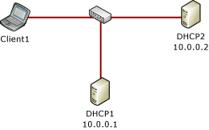
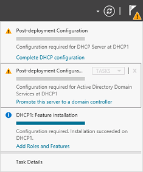
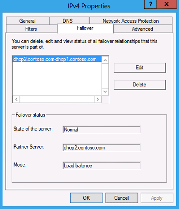
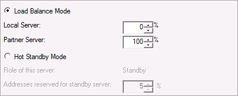

# Step-by-Step: Configure DHCP for Failover
Dynamic Host Configuration Protocol \(DHCP\) failover in [!INCLUDE[win8_server_2](../Token/win8_server_2_md.md)] is a new method for ensuring continuous availability of DHCP service to clients.  
  
## In this guide  
This guide provides step\-by\-step instructions for deploying DHCP failover in a test lab using two server computers and one client computer. Software and hardware requirements are provided, as well as an overview of DHCP failover.  
  
> [!IMPORTANT]  
> The following instructions are for configuring a test lab using the minimum number of computers. Individual computers are needed to separate the services provided on the network and to clearly show the desired functionality. This configuration is neither designed to reflect best practices nor does it reflect a desired or recommended configuration for a production network. The configuration, including IP addresses and all other configuration parameters, is designed only to work on a separate test lab network.  
  
## DHCP failover overview  
In [!INCLUDE[firstref_server_7](../Token/firstref_server_7_md.md)], there are two high availability options available for DHCP Server deployment. Each of these options is associated with some challenges.  
  
1.  **DHCP in a Windows failover cluster**. This option places the DHCP server in a cluster with an additional server configured with the DHCP service that assumes the load if the primary DHCP server fails. The clustering deployment option uses a single shared storage. This makes the storage a single point of failure, and requires additional investment in redundancy for storage. In addition, clustering involves relatively complex setup and maintenance.  
  
2.  **Split scope DHCP**. Split scope DHCP uses two independent DHCP servers that share responsibility for a scope. Typically 70% of the addresses in the scope are assigned to the primary server and the remaining 30% are assigned to the backup server. If clients cannot reach the primary server then they can get an IP configuration from the secondary server. Split scope deployment does not provide IP address continuity and is unusable in scenarios where the scope is already running at high utilization of address space, which is very common with Internet Protocol version 4 \(IPv4\).  
  
DHCP failover in [!INCLUDE[win8_server_2](../Token/win8_server_2_md.md)] enables administrators to deploy a highly resilient DHCP service to support a large enterprise without the challenges of the options discussed earlier. The main goals of the feature are the following:  
  
-   Provide DHCP service availability at all times on the enterprise network.  
  
-   If a DHCP server is no longer reachable, the DHCP client is able to extend the lease on its current IP address by contacting another DHCP server on the enterprise network.  
  
The DHCP server failover feature provides the ability to have two DHCP servers provide IP addresses and option configuration to the same subnet or scope, providing for continuous availability of DHCP service to clients. The two DHCP servers replicate lease information between them, allowing one server to assume responsibility for servicing of clients for the entire subnet when the other server is unavailable. It is also possible to configure failover in a load\-balancing configuration with client requests distributed between the two servers in a failover relationship.  
  
DHCP failover in [!INCLUDE[win8_server_2](../Token/win8_server_2_md.md)] provides support for a maximum of two DHCP servers, and the failover relationship is limited to IPv4 scopes and subnets. Network nodes using Internet Protocol version 6 \(IPv6\) typically determine their own IPv6 address using stateless IP auto configuration. In this mode, the DHCP server delivers only the DHCP option configuration, and the server does not maintain any lease state information. A high availability deployment for stateless DHCPv6 is possible by simply setting up two servers with identical option configuration. Even in a stateful DHCPv6 deployment, the scopes do not run under high address utilization, which makes split scope a viable solution for high availability.  
  
### DHCP failover architecture  
Administrators can deploy DHCP servers running [!INCLUDE[win8_server_2](../Token/win8_server_2_md.md)] as failover partners in either hot standby mode or load sharing mode.  
  
### Hot standby mode  
In hot standby mode, two servers operate in a failover relationship where an active server is responsible for leasing IP addresses and configuration information to all clients in a scope or subnet. The secondary server assumes this responsibility if the primary server becomes unavailable. A server is primary or secondary in the context of a subnet. For instance, a server that has the role of a primary for a given subnet could be a secondary server for another subnet.  
  
Hot standby mode of operation is best suited to deployments where a central office or data center server acts as a standby backup server to a server at a remote site, which is local to the DHCP clients \(ex: hub and spoke deployment\). In such deployments, it is undesirable to have a remote standby server service any clients unless the local DHCP server becomes unavailable. The figure below is an example of a hub and spoke deployment.  
  
  
  
### Load sharing mode  
In a load sharing mode deployment, which is the default mode of operation, the two servers simultaneously serve IP addresses and options to clients on a given subnet. The client requests are load balanced and shared between the two servers.  
  
The load sharing mode of operation is best suited to deployments where both servers in a failover relationship are located at the same physical site. Both servers respond to DHCP client requests based on the load distribution ratio configured by the administrator. See the following examples.  
  
#### Load sharing in a single site with a single subnet  
In the following example, two DHCP servers simultaneously provide IP addressing to clients on a single subnet.  
  
  
  
#### Load sharing in a single site with multiple subnets  
In the following example, two DHCP servers simultaneously provide IP addressing to clients on multiple subnets.  
  
  
  
## Scenario overview  
This test lab demonstrates new DHCP functionality in [!INCLUDE[win8_server_2](../Token/win8_server_2_md.md)]. Two server computers and one client computer are used. See the following figure.  
  
  
  
### Hardware and software requirements  
Two server computers and one client computer are required to complete the test lab.  
  
The following are required components of the test lab:  
  
1.  The product disc or other installation media for [!INCLUDE[win8_server_2](../Token/win8_server_2_md.md)].  
  
2.  Two computers that meet the minimum hardware requirements for [!INCLUDE[win8_server_2](../Token/win8_server_2_md.md)].  
  
3.  The product disc or other installation media for [!INCLUDE[win8_client_1](../Token/win8_client_1_md.md)].  
  
**Number of servers**: DHCP failover is not supported for more than two DHCP servers. The failover relationship is always comprised of two DHCP servers.  
  
**Domain membership**: In this guide, DHCP servers are domain member servers. You can also configure DHCP failover on workgroup computers.  
  
**Time synchronization**: For DHCP failover to function correctly, time must be kept synchronized between the two servers in a failover relationship. Time synchronization can be maintained by deployment of the Network Time Protocol \(NTP\) or any alternate mechanism. When the failover configuration wizard is run, it will compare the current time on the servers being configured for failover. If the time difference between the servers is greater than one minute, the failover setup process will halt with a critical error instructing the administrator to synchronize the time on the servers.  
  
### Steps for configuring the test lab  
The following procedures are used to configure computers for the demonstration portion of the test lab:  
  
1.  [Configure DHCP1](../Topic/Step-by-Step--Configure-DHCP-for-Failover.md#config_dhcp1): DHCP1 is a domain controller, DNS server, and DHCP server for the contoso.com Active Directory domain.  
  
    > [!IMPORTANT]  
    > Domain controller and DNS server roles are not required for DHCP failover. These roles are installed on DHCP1 to mimic a domain environment. DHCP failover can also be configured on a workgroup computer \(not demonstrated in this test lab\).  
  
2.  [Configure DHCP2](../Topic/Step-by-Step--Configure-DHCP-for-Failover.md#config_dhcp2): DHCP2 is a DHCP server and domain member computer.  
  
3.  [Configure Client1](../Topic/Step-by-Step--Configure-DHCP-for-Failover.md#config_client1): Client1 is a DHCP client computer.  
  
## <a name="config_dhcp1"></a>Configure DHCP1  
DHCP1 is a computer running [!INCLUDE[win8_server_2](../Token/win8_server_2_md.md)], providing the following services:  
  
-   A domain controller for the contoso.com Active Directory domain.  
  
-   An authoritative DNS server for the contoso.com DNS zone.  
  
-   A DHCP server.  
  
Initial configuration of DHCP1 consists of the following steps:  
  
-   [Install the operating system and configure TCP\/IP on DHCP1](../Topic/Step-by-Step--Configure-DHCP-for-Failover.md#dhcp1_1)  
  
-   [Install AD DS, DNS Server, and DHCP Server](../Topic/Step-by-Step--Configure-DHCP-for-Failover.md#dhcp1_2)  
  
-   [Create a domain administrator account](../Topic/Step-by-Step--Configure-DHCP-for-Failover.md#dhcp1_3)  
  
-   [Authorize DHCP1 in Active Directory](../Topic/Step-by-Step--Configure-DHCP-for-Failover.md#dhcp1_4)  
  
> [!NOTE]  
> It is not necessary to configure a DHCP scope on DHCP1. A DHCP scope will be configured automatically when a failover relationship is created with DHCP2.  
  
### <a name="dhcp1_1"></a>Install the operating system and configure TCP\/IP on DHCP1  
  
##### To install the operating system and configure TCP\/IP on DHCP1  
  
1.  Start your computer using the [!INCLUDE[win8_server_2](../Token/win8_server_2_md.md)] product disc or other digital media.  
  
2.  When prompted, enter a product key, accept license terms, configure clock, language, and regional settings, and provide a password for the local Administrator account.  
  
3.  Press **Ctrl\+Alt\+Delete** and sign\-in using the local Administrator account.  
  
4.  If you are prompted to enable Windows Error Reporting, click **Accept**.  
  
5.  Click **Start**, type **ncpa.cpl**, and then press **ENTER**. The **Network Connections** control panel will open.  
  
    > [!TIP]  
    > The previous step demonstrates new functionality in [!INCLUDE[win8_server_2](../Token/win8_server_2_md.md)] that enables you to search and run applications, settings, and files by clicking **Start** and then typing a search term. You can also open the **Network Connections** control panel by clicking next to **Wired Ethernet Connection** in Server Manager using the **Local Server** view. For more information, see [Common Management Tasks and Navigation](http://go.microsoft.com/fwlink/p/?LinkId=242147) in [!INCLUDE[win8_server_2](../Token/win8_server_2_md.md)] \(http:\/\/go.microsoft.com\/fwlink\/p\/?LinkId\=242147\).  
  
6.  In **Network Connections**, right\-click **Wired Ethernet Connection** and then click **Properties**.  
  
7.  Double\-click **Internet Protocol Version 4 \(TCP\/IPv4\)**.  
  
8.  On the **General** tab, choose **Use the following IP address**.  
  
9. Next to **IP address** type **10.0.0.1** and next to **Subnet mask** type **255.255.255.0**. It is not necessary to provide an entry next to **Default gateway**.  
  
10. Next to **Preferred DNS server**, type **10.0.0.1**.  
  
11. Click **OK** twice, and then close the **Network Connections** control panel.  
  
### <a name="dhcp1_2"></a>Install AD DS, DNS Server, and DHCP Server  
DHCP1 will serve as a domain controller, DNS server, and DHCP server for the contoso.com Active Directory domain.  
  
##### To configure DHCP1 as a domain controller, DNS server, and DHCP server  
  
1.  The Server Manager Dashboard is displayed by default. In the navigation pane, click **Configure this local server**.  
  
2.  Under **PROPERTIES**, click the name next to **Computer name**. The **System Properties** dialog box will open.  
  
3.  On the **Computer Name** tab, click **Change** and then type **DHCP1** under **Computer name**.  
  
4.  Click **OK** twice, and then click **Close**.  
  
5.  When you are prompted to restart the computer, click **Restart Now**.  
  
6.  After restarting the computer, sign\-in using the local Administrator account.  
  
7.  In Server Manager, under **Configure this local server**, click **Add Roles and Features**.  
  
8.  In the **Add Roles and Features Wizard**, click **Next** three times, and then on the **Select server roles** page select the **Active Directory Domain Services** checkbox.  
  
9. When you are prompted to add required features, click **Add Features**.  
  
10. Select the **DHCP Server** checkbox.  
  
11. When you are prompted to add required features, click **Add Features**.  
  
12. Select the **DNS Server** checkbox.  
  
13. When you are prompted to add required features, click **Add Features**.  
  
14. Click **Next** five times, and then click **Install**.  
  
15. Wait for the installation process to complete, verify on the **Installation progress** page that **Configuration required. Installation succeeded on DHCP1** is displayed, and then click **Close**.  
  
16. Click the Notification flag and then click **Promote this server to a domain controller**. See the following example.  
  
      
  
17. In the **Active Directory Domain Services Configuration Wizard**, on the **Deployment Configuration** page, choose **Add a new forest** and then next to **Root domain name**, type **contoso.com**.  
  
18. Click **Next**, and then on the **Domain Controller Options** page, under **Type the Directory Services Restore Mode \(DSRM\) password**, type a password next to **Password** and **Confirm password**. Confirm that **Domain Name System \(DNS\) server** and **Global Catalog \(GC\)** are selected, and then click **Next**.  
  
19. Click **Next** four times, verify that **All prerequisite checks passed successfully** is displayed, and then click **Install**.  
  
20. The computer will restart automatically to complete the installation process.  
  
21. Sign in using the local Administrator account.  
  
### <a name="dhcp1_3"></a>Create a domain administrator account  
A domain administrator account is required to configure settings in the test lab.  
  
> [!TIP]  
> You can use the CONTOSO\\Administrator account in this test lab and skip creation of a domain administrator account if desired. This account has domain administrator privileges, and other privileges. However, it is a best practice to disable or rename this account. For more information, see [Active Directory Best Practices](http://go.microsoft.com/fwlink/p/?LinkID=243071)\(http:\/\/go.microsoft.com\/fwlink\/p\/?LinkID\=243071\).  
  
##### To create a domain administrator account  
  
1.  On the Server Manager menu bar, click **Tools**, and then click **Active Directory Users and Computers**.  
  
2.  In the **Active Directory Users and Computers** console tree, double\-click **contoso.com**, right\-click **Users**, point to **New**, and then click **User**.  
  
3.  In the **New Object – User** dialog box, type **user1** under **User logon name** and next to **Full name**, then click **Next**.  
  
4.  Next to **Password** and **Confirm password**, type a password for the user1 account.  
  
5.  Clear the checkbox next to **User must change password at next logon**, select the **Password never expires** checkbox, click **Next**, and then click **Finish**.  
  
6.  Double\-click **user1** and then click the **Member Of** tab.  
  
7.  Click **Add**, type **domain admins** under **Enter the object names to select**, click **OK** twice, and then close the **Active Directory Users and Computers** console.  
  
8.  Click **Start**, click **Administrator**, and then click **Sign out**.  
  
9. Sign in to the computer using the user1 credentials by clicking the left arrow next to **CONTOSO\\Administrator** and then clicking **Other user**.  
  
### <a name="dhcp1_4"></a>Authorize DHCP1 in Active Directory  
So that DHCP1 can be configured as a failover partner, it must be authorized in Active Directory.  
  
##### To authorize DHCP1 in Active Directory  
  
1.  On the Server Manager menu, click **Tools** and then click **DHCP**.  
  
2.  In the DHCP console, right\-click **dhcp1.contoso.com** and then click **Authorize**.  
  
3.  Refresh the DHCP console and verify that DHCP1 was successfully authorized.  
  
4.  On the Server Manager menu, click the Notification flag and then click **Complete DHCP configuration**.  
  
5.  In the **DHCP Post\-Install configuration wizard**, click **Commit** and then click **Close**.  
  
## <a name="config_dhcp2"></a>Configure DHCP2  
DHCP2 is a computer running [!INCLUDE[win8_server_1](../Token/win8_server_1_md.md)], providing the following services:  
  
-   A DHCP server.  
  
Initial configuration of DHCP2 consists of the following steps:  
  
-   [Install the operating system and configure TCP\/IP on DHCP2](../Topic/Step-by-Step--Configure-DHCP-for-Failover.md#dhcp2_1)  
  
-   [Install and configure DHCP on DHCP2](../Topic/Step-by-Step--Configure-DHCP-for-Failover.md#dhcp2_2)  
  
During the demonstration portion of the test lab, DHCP2 will be used to create a failover relationship with DHCP1.  
  
### <a name="dhcp2_1"></a>Install the operating system and configure TCP\/IP on DHCP2  
  
> [!TIP]  
> The procedure below is identical to the steps used to install the operating system and configure TCP\/IP on DHCP1, with the exception that DHCP2 is configured with an IP address of 10.0.0.2.  
  
##### To install the operating system and configure TCP\/IP on DHCP2  
  
1.  Start your computer using the [!INCLUDE[win8_server_2](../Token/win8_server_2_md.md)] product disc or other digital media.  
  
2.  When prompted, enter a product key, accept license terms, configure clock, language, and regional settings, and provide a password for the local Administrator account.  
  
3.  Press **Ctrl\+Alt\+Delete** and sign\-in using the local Administrator account.  
  
4.  If you are prompted to enable Windows Error Reporting, click **Accept**.  
  
5.  In the Server Manager navigation pane, click **Local Server** and then click the IP address next to **Wired Ethernet Connection**. The **Network Connections** control panel will open.  
  
6.  In **Network Connections**, right\-click **Wired Ethernet Connection** and then click **Properties**.  
  
7.  Double\-click **Internet Protocol Version 4 \(TCP\/IPv4\)**.  
  
8.  On the **General** tab, choose **Use the following IP address**.  
  
9. Next to **IP address** type **10.0.0.2** and next to **Subnet mask** type **255.255.255.0**. It is not necessary to provide an entry next to **Default gateway**.  
  
10. Next to **Preferred DNS server**, type **10.0.0.1**.  
  
11. Click **OK** twice, and then close the **Network Connections** control panel.  
  
### <a name="dhcp2_2"></a>Install and configure DHCP on DHCP2  
DHCP2 is a domain member server running the DHCP Server role service.  
  
##### To install DHCP on DHCP2  
  
1.  In the Server Manager navigation pane, click **Local Server** and then click the name next to **Computer name**. The **System Properties** control panel will open.  
  
2.  On the **Computer Name** tab, click **Change** and then type **DHCP2** under **Computer name**.  
  
3.  Under **Member of**, select **Domain**, type **contoso.com**, and then click **OK**.  
  
4.  When you are prompted to provide credentials to join the domain, enter the credentials for the user1 account that was created previously and then click **OK**.  
  
5.  Confirm that computer name and domain changes were successful, click **OK** twice, and then click **Close**.  
  
6.  When you are prompted to restart the computer, click **Restart Now**.  
  
7.  After restarting the computer, sign\-in using the CONTOSO\\user1 account.  
  
8.  In Server Manager, under **Configure this local server**, click **Add Roles and Features**.  
  
9. In the **Add Roles and Features Wizard**, click **Next** three times, and then on the **Select server roles** page select the **DHCP Server** checkbox.  
  
10. When you are prompted to add required features, click **Add Features**.  
  
11. Click **Next** three times, and then click **Install**.  
  
12. Wait for the installation process to complete, verify on the **Installation progress** page that **Configuration required. Installation succeeded on DHCP2.contoso.com** is displayed, and then click **Close**.  
  
##### To configure DHCP on DHCP2  
  
1.  On the Server Manager menu bar, click **Tools** and then click **DHCP**. THE DHCP console opens.  
  
2.  In the DHCP console tree, navigate to **IPv4**. Right\-click **IPv4** and then click **New Scope**. The **New Scope Wizard** opens.  
  
3.  Click **Next** and then type a name for the new scope next to **Name** \(ex: Contoso\-scope1\).  
  
4.  Click **Next** and then in **IP Address Range**, type **10.0.0.1** next to **Start IP address**, type **10.0.0.254** next to **End IP address**, and type **24** next to **Length**. The value of Subnet mask will change automatically to **255.255.255.0**.  
  
5.  Click **Next**, and then in **Add Exclusions and Delay** type **10.0.0.1** under **Start IP address**, type **10.0.0.10** under **End IP address**, and then click **Add**. This allows the first ten IP addresses in the 10.0.0.0\/24 subnet to be used for static addressing of servers on the network.  
  
6.  Click **Next** and then in **Lease Duration** under **Limited to** enter **0 Days**, **0 Hours**, and **2 Minutes**. This very short lease duration will simplify the DHCP failover demonstration.  
  
7.  Click **Next** three times, and then in **Domain Name and DNS Servers**, verify that the **Parent domain** is **contoso.com** and **10.0.0.1** is listed as the only DNS server.  
  
8.  Click **Next** twice, and then in **Activate Scope** select **Yes, I want to activate this scope now**.  
  
9. Click **Next**, and then click **Finish**.  
  
10. In the DHCP console tree, right\-click dhcp2.contoso.com, and then click Authorize.  
  
11. Refresh the view in the DHCP console and verify that DHCP2 is authorized and that the Contoso\-scope1 is active.  
  
    Note: To review scopes on the current server using Windows PowerShell, right\-click **Windows PowerShell**, click **Run as Administrator**, click **Yes** in the User Account Control alert that appears, and then type the following command at the Windows PowerShell prompt, and then press ENTER.  
  
    ```  
    get-dhcpserverv4scope  
    ```  
  
**PS C:\\Windows\\system32> get\-dhcpserverv4scopeScopeId         SubnetMask      Name           State    StartRange      EndRange        LeaseDuration\-\-\-\-\-\-\-         \-\-\-\-\-\-\-\-\-\-      \-\-\-\-           \-\-\-\-\-    \-\-\-\-\-\-\-\-\-\-      \-\-\-\-\-\-\-\-        \-\-\-\-\-\-\-\-\-\-\-\-\-10.0.0.0        255.255.255.0   Contoso\-scope1 Active   10.0.0.1        10.0.0.254      00:02:00**  
  
## <a name="config_client1"></a>Configure Client1  
Client1 is a computer running [!INCLUDE[win8_client_1](../Token/win8_client_1_md.md)] that is acting as a DHCP client.  
  
Configuration of Client1 consists of the following steps:  
  
-   [Install the operating system on Client1](../Topic/Step-by-Step--Configure-DHCP-for-Failover.md#client1_1)  
  
-   [Pin Windows PowerShell to the taskbar](../Topic/Step-by-Step--Configure-DHCP-for-Failover.md#client1_3)  
  
During the demonstration portion of the test lab, Client1 will be used as a DHCP client.  
  
### <a name="client1_1"></a>Install the operating system on Client1  
  
##### To install the operating system on Client1  
  
1.  Start your computer using the [!INCLUDE[win8_client_2](../Token/win8_client_2_md.md)] product disc or other digital media.  
  
2.  When prompted, enter a product key and accept license terms.  
  
3.  When prompted to enter a computer name, type **Client1** and click **Next**.  
  
4.  Click Use express settings.  
  
5.  On the **Sign in to your PC** page, click **Don’t want to sign in with a Microsoft account** and then click **Local account**.  
  
6.  Next to **User name**, type **user1**, enter a password and password hint, and then click **Finish**.  
  
### <a name="client1_3"></a>Pin Windows PowerShell to the taskbar  
The DHCP failover demonstration on Client1 makes use of Windows PowerShell to verify DHCP lease information. To make Windows PowerShell more easily accessible, it will be pinned to the taskbar.  
  
##### To pin Windows PowerShell to the taskbar  
  
1.  The **Start** menu is displayed by default. If **Start** is not displayed, move the mouse cursor to the lower left corner of the screen until **Start** is displayed, and then click **Start**.  
  
2.  Type **power** and then under **Results for “power”** right\-click **Windows PowerShell** and then click **Pin to taskbar**.Confirm that Windows PowerShell is pinned to the taskbar.  
  
> [!NOTE]  
> Client1 can also be joined to the contoso.com domain, however this is not required to complete the test lab.  
  
## DHCP failover demonstration  
For the DHCP failover demonstration portion of the test lab, a failover relationship will be created using DHCP1 and DHCP2.  
  
A demonstration of DHCP failover on [!INCLUDE[win8_server_2](../Token/win8_server_2_md.md)] consists of the following procedures:  
  
1.  [Configure a failover relationship](../Topic/Step-by-Step--Configure-DHCP-for-Failover.md#failover_1)  
  
2.  [View or edit properties of the failover configuration](../Topic/Step-by-Step--Configure-DHCP-for-Failover.md#demo_2)  
  
3.  [Edit properties of the failover relationship and demonstrate load balancing](../Topic/Step-by-Step--Configure-DHCP-for-Failover.md#demo_3)  
  
4.  [Edit properties of the failover relationship and demonstrate hot standby mode](../Topic/Step-by-Step--Configure-DHCP-for-Failover.md#demo_4)  
  
### <a name="failover_1"></a>Configure a failover relationship  
First, configure a failover relationship using DHCP1 and DHCP2.  
  
##### To configure a failover relationship  
  
1.  On DHCP2, open the DHCP console, right\-click the **Contoso\-scope1** DHCP scope and then click **Configure failover**.  
  
      
  
2.  In the **Configure Failover** wizard, click **Next**.  
  
3.  In **Specify the partner server to use for failover**, next to **Partner Server**, type **dhcp1.contoso.com** and then click **Next**.  
  
4.  In **Create a new failover relationship**, type a name next to **Relationship Name**, or accept the default name that is displayed \(dhcp2.contoso.com\-dhcp1.contoso.com\).  
  
5.  Type a shared secret for this failover relationship next to **Shared Secret** \(ex: secret\).  
  
6.  Change the value next to **Maximum Client Lead Time** to **0** hours and **1** minute.  
  
    > [!IMPORTANT]  
    > The Maximum Client Lead Time \(MCLT\) is additional time provided to a DHCP client after expiration of a DHCP lease. The MCLT is transmitted from the primary to the secondary server in the CONNECT message, and is the maximum amount of time that one server can extend a lease for a client beyond the time known by the partner server.  
    >   
    > The 1 minute MCLT value used here is for test lab purposes only, to prompt lease renewal by the client. In a production environment, you should use a longer MCLT, such as 1 hour.  
  
7.  Review the options available in the drop\-down menu next to **Mode**. You can choose **Load balance** or **Hot standby**. By default, **Load balance** mode is chosen.  
  
      
  
8.  Click **Next** and then click **Finish**.  
  
9. Verify that failover configuration was successful, and then click **Close**.  
  
      
  
10. On DHCP1, refresh the DHCP console and verify that the same DHCP scope configuration that is present on DHCP2 is now present on DHCP1.  
  
### <a name="demo_2"></a>View or edit properties of the failover configuration  
After you configure a failover relationship on a DHCP server, details for the failover relationship are displayed in the DHCP console.  
  
##### To view or edit properties of the failover relationship  
  
1.  On DHCP1 or DHCP2, in the DHCP console, right\-click the **Contoso\-scope1** DHCP scope and then click **Properties**.  
  
2.  Click the **Failover** tab and review the information displayed. Verify that **Normal** is displayed next to **State of this Server** and also next to **State of Partner Server**.  
  
      
  
3.  Note that you can edit or delete the failover relationship.  
  
      
  
4.  Click **Edit** and review properties of the failover relationship that are available to edit.  
  
5.  Leave the dialog box open for the following procedure.  
  
### <a name="demo_3"></a>Edit properties of the failover relationship and demonstrate load balancing  
To demonstrate dynamic load balancing properties of the failover relationship, the load balancing percentage will be changed for an active DHCP scope.  
  
##### To edit properties of the failover relationship and demonstrate load balancing  
  
1.  On Client1, click **Windows PowerShell** and type the following command.  
  
    ```  
    ipconfig /all  
    ```  
  
2.  In the command output, note the DHCP server that is currently supplying an IP address configuration to Client1. The IP address of the DHCP server is displayed next to **DHCP Server**.  
  
3.  In the **View\/Edit Failover Relationship** dialog box DHCP1 or DHCP2 that was opened in the previous procedure, change the values under **Load Balance Mode** next to **Local Server** and **Partner Server** so that **100%** is assigned to the DHCP server that is currently not supplying an IP address to Client1. The server that is currently supplying an IP address to Client1 will have a value assigned of **0%**.  
  
      
  
4.  Click **OK** twice, wait until the current DHCP lease is expired on Client1, and then type **ipconfig \/all** again at the Windows PowerShell prompt.  
  
5.  Note that the DHCP server that is supplying an IP address configuration to Client1 has changed to the server that you assigned 100% weight in load balancing mode.  
  
### <a name="demo_4"></a>Edit properties of the failover relationship and demonstrate hot standby mode  
To demonstrate hot standby mode, the DHCP Server service on one of the failover partners will be stopped.  
  
##### To edit properties of the failover relationship and demonstrate hot standby mode  
  
1.  On DHCP1 or DHCP2, in the DHCP console, right\-click the **Contoso\-scope1** DHCP scope and then click **Properties**.  
  
2.  Click the **Failover** tab.  
  
3.  Click **Edit** and then choose **Hot Standby Mode**.  
  
4.  Depending on which DHCP server you are configuring, the local server will be assigned either **Active** or **Standby** status. The status is displayed next to **Role of this server**.  
  
      
  
    > [!TIP]  
    > The server that is designated to be Active in hot standby mode is the server that you used to create the failover relationship.  
  
5.  Click **OK** twice and then wait 2 minutes for the DHCP lease on Client1 to renew.  
  
6.  On Client1, type **ipconfig \/all** at the Windows PowerShell prompt and verify that the server that is assigned as Active is supplying an IP addresses configuration to Client1.  
  
7.  In the DHCP console on the DHCP server that is marked as **Active** for the hot standby failover relationship and is currently supplying an IP address to Client1, right\-click the server name, point to All Tasks, and then click Stop.  
  
8.  Verify that the DHCP service is stopped on the active DHCP server.  
  
      
  
9. Wait for the DHCP lease to renew on Client1, type **ipconfig \/all** at the Windows PowerShell prompt, and verify that the standby DHCP server is supplying an IP address to Client1.  
  
## Conclusion  
DHCP failover provides high availability of DHCP services without the challenges of clustering or split scope DHCP. Benefits of DHCP failover include:  
  
1.  **Simple**: A wizard is provided to create DHCP failover relationships between DHCP servers. The wizard automatically replicates scopes and settings from the primary server to the failover partner.  
  
2.  **Flexible**: DHCP failover can also be configured for load balancing, with client requests distributed between both DHCP servers in a failover relationship based on the values you choose.  
  
3.  **Seamless**: DHCP servers share lease information, allowing one server to assume responsibility for servicing of clients if the other server is unavailable. DHCP clients can keep the same IP address when a lease is renewed, even if the lease is issued by a different DHCP server.  
  
## See also  
[Dynamic Host Configuration Protocol &#40;DHCP&#41; Overview](../Topic/Dynamic-Host-Configuration-Protocol--DHCP--Overview.md)  
  
[What's New in DHCP in Windows Server 2012 \[redirected\]](assetId:///f82f8081-235d-4c5a-b47b-8009e705c5fd)  
  
[Step-by-Step: Configure DHCP Using Policy-based Assignment](../Topic/Step-by-Step--Configure-DHCP-Using-Policy-based-Assignment.md)  
  
