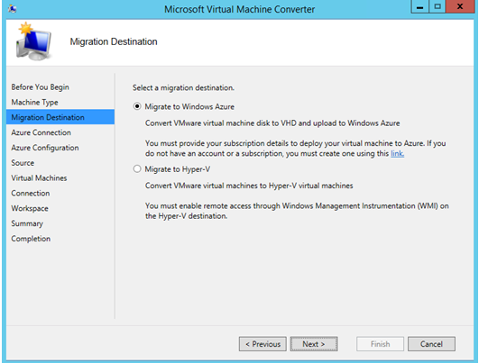
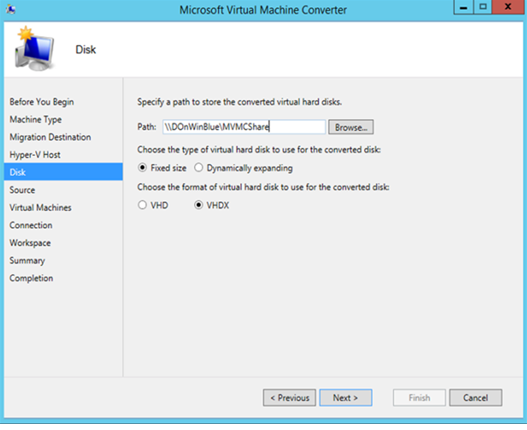
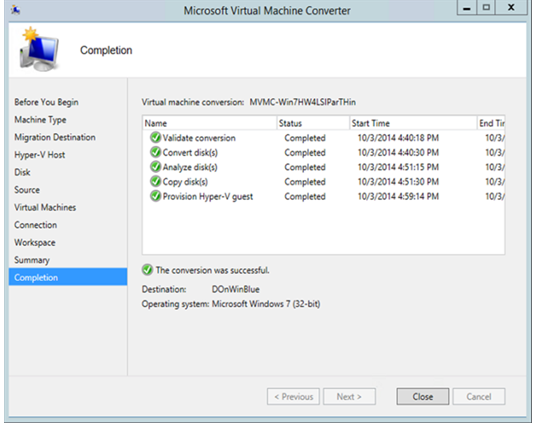
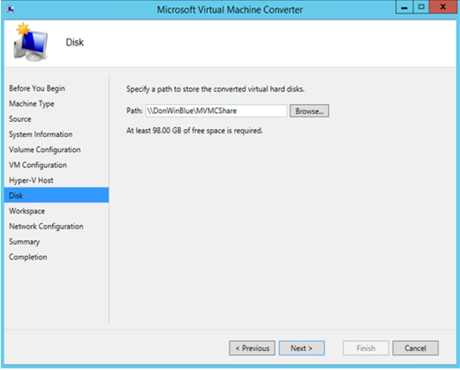
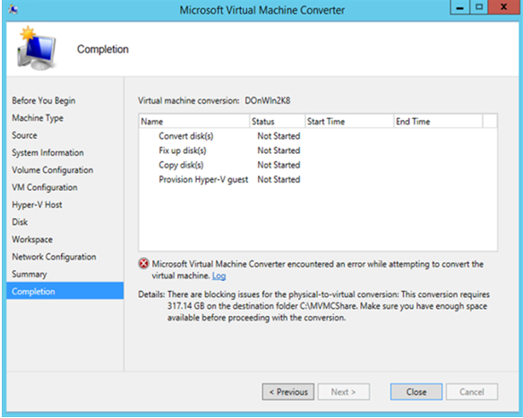

# Use Microsoft Virtual Machine Converter
After installing MVMC, you can use it to:  
  
-   Convert VMware virtual machines and virtual disks to Hyper\-V by using Windows PowerShell.  
  
-   Convert and upload disks to Microsoft Azure.  
  
-   Convert VMware virtual machines and virtual disks to Hyper\-V by using the GUI.  
  
-   Convert physical machines to Hyper\-V by using the GUI.  
  
-   Convert physical machines to Hyper\-V by using Windows PowerShell.  
  
## Convert VMware virtual machines and virtual disks by using Windows PowerShell  
Before using the MVMC cmdlets, you must do the following:  
  
-   Run the MVMC Windows PowerShell cmdlets on Windows Server 2012 R2 or Windows Server 2012. You can also run MVMC Windows PowerShell cmdlets on Windows Server 2008 R2 with SP1 provided that you installed Windows PowerShell 3.0 and Microsoft .NET Framework 4.  
  
-   Import the MVMC Windows PowerShell module manifest from the MVMC installation location. Run the following example command:  
  
    PS C:\\> Import\-Module "C:\\Program Files\\Microsoft Virtual Machine Converter\\MvmcCmdlet.psd1"  
  
For more information about using the Windows PowerShell cmdlets, see the Windows PowerShell cmdlet Help. The following script example is provided as a reference.  
  
**Sample Script**  
  
```  
Start-Transcript "c:\Test\SampleLog.log"  
# establish a connection to the source server  
$sourceUser= 'root'  
$sourcePassword = ConvertTo-SecureString 'SecurePassword' -AsPlainText -Force  
$sourceCredential = New-Object PSCredential ($sourceUser, $sourcePassword)  
$sourceConnection = New-MvmcSourceConnection -Server ' ContosoTestServer' -SourceCredential $sourceCredential -verbose  
  
# select the the virtual machine to convert  
 $sourceVM = Get-MvmcSourceVirtualMachine -SourceConnection $sourceConnection -verbose | where {$_.Name -match 'testvm'}  
  
# convert the source virtual machine  
$destinationLiteralPath = 'c:\test'   
$machineDriveCollection = ConvertTo-MvmcVirtualHardDiskOvf -SourceConnection $sourceConnection -DestinationLiteralPath $destinationLiteralPath -GuestVmId $sourceVM.GuestVmId -verbose  
  
# copy the disks and .ovf file to the destination Hyper-V host. The .ovf file contains the source virtual machine’s configuration information  
# NOTE:  this step is not needed on 2-box conversions, this represents a 3-box conversion.  
$hyperVServerVhdPath = '\\ContosoTestDestination\c$\Test'  
Copy-Item -Path $machineDriveCollection.Ovf.DirectoryName -Destination $hyperVServerVhdPath -recurse  
$destinationLiteralPath = Join-Path $hyperVServerVhdPath $machineDriveCollection.Ovf.Directory.Name  
  
# provision a Hyper-V virtual machine  
$hyperVServer = ' ContosoTestDestination '  
$convertedVM = New-MvmcVirtualMachineFromOvf -DestinationLiteralPath $destinationLiteralPath -DestinationServer $hyperVServer  
  
Stop-Transcript    
```  
  
## Convert and upload disks to Microsoft Azure  
Use the following procedure to convert and upload disks to Microsoft Azure.  
  
#### To convert and upload disks to Microsoft Azure  
  
1.  Open MVMC, open the **Migration Destination** page, select **Migrate to Microsoft Azure**, and then click **Next**.  
  
      
  
    **Figure 1.** The Migration Destination page  
  
2.  On the **Azure Connection** page, specify the subscription ID and certificate thumbprint that you obtained before beginning the conversion process. For more information, see [Requirements for Conversion to Microsoft Azure](../Topic/Requirements-for-Conversion-to-Microsoft-Azure.md) earlier in this guide.  
  
      
  
    **Figure 2.** The Azure Connection page  
  
3.  On the **Azure Configuration** page, select the Microsoft Azure storage account that you created for storing the converted virtual hard disk. For more information, see [Requirements for Conversion to Microsoft Azure](../Topic/Requirements-for-Conversion-to-Microsoft-Azure.md) earlier in this guide.  
  
      
  
    **Figure 3.** The Azure Configuration page  
  
4.  On the **Source** page, enter the following details to connect to a VMware vCenter Server, VMware ESX, or VMware ESXi server, and then click **Next**.  
  
    -   In the **Address** box, type the server IP address or the name of the VMware source server.  
  
    -   In the **User name** box, type the user name.  
  
    -   In the **Password** box, type the password.  
  
      
  
    **Figure 4.** The Source page  
  
5.  On the **Virtual Machines** page, select a virtual machine to convert from the source VMware server, and then click **Next**.  
  
      
  
    **Figure 5.** The Virtual Machines page  
  
    > [!NOTE]  
    > The disk that is attached to the source virtual machine is converted to an IDE\-based VHD, and all data disks that are attached to the source virtual machine are converted to SCSI VHDs.  
  
    > [!IMPORTANT]  
    > MVMC creates another instance of the virtual machine on Hyper\-V that is based on the source virtual machine configuration. If the source virtual machine is online during conversion, it remains intact but is shut down during the conversion process.  
  
6.  On the **Virtual Machine Connection** page, enter the following credentials of an administrative account that can connect to the virtual machine, and then click **Next**.  
  
    > [!NOTE]  
    > The connection is required for uninstalling VMware Tools on the source virtual machine. The virtual machine must be joined to an Active Directory domain.  
  
    -   In the **Virtual machine** box, type the name of the virtual machine.  
  
    -   In the **User name** box, type the domain and user name.  
  
    -   In the **Password** box, type the password.  
  
    -   Under **Final state of source virtual machine**, click **On** or **Off** to indicate whether the source virtual machine should be turned on or off when the restoration is complete.  
  
        > [!NOTE]  
        > All of the previous items apply only to online conversions. In an offline conversion, the tool does not connect to the source virtual machine to uninstall the VMware Tools and the source virtual machine is offline when it is restored.  
  
    -   In the **Final state of destination virtual machine** option, click **On** or **Off** to indicate whether the destination virtual machine should be turned on or off when the conversion is complete.  
  
      
  
    **Figure 6.** The Virtual Machine Connection page  
  
    > [!IMPORTANT]  
    > MVMC always takes a snapshot of the original source virtual machine before the VMware Tools are uninstalled and restores the virtual machine to its original state after the disks that are attached to the virtual machine are successfully copied.  
  
    > [!IMPORTANT]  
    > Remote access through Windows Management Instrumentation \(WMI\) must be enabled on the source virtual machine. For more information, see [Requirements for Conversion to Hyper-V Destination](../Topic/Requirements-for-Conversion-to-Hyper-V-Destination.md) in this guide.  
  
7.  On the **Workspace** page, click **Browse** to select the path to a workspace folder from where the user interface \(UI\) can be run \(select a location that has enough free disk space for the converted virtual hard disks\), and then click **Next**.  
  
      
  
    **Figure 7.** The Workspace page  
  
8.  On the **Summary** page, review the details, and then click **Finish** to complete the conversion. If warnings appear, review them before you proceed with the conversion.  
  
      
  
    **Figure 8.** The Summary page  
  
    When the virtual machine conversion has finished successfully, the **Completion** page appears.  
  
9. On the **Completion** page, when the virtual machine conversion is complete, click **Close**.  
  
## Convert VMware virtual machines and virtual disks to Hyper\-V by using the GUI  
Use the following procedure to convert a virtual machine to Hyper\-V by using the GUI.  
  
> [!NOTE]  
> For best performance, we recommend that you run the conversion on the destination host, which means that MVMC is installed and is run from the Hyper\-V hypervisor.  
  
#### To convert a virtual machine to Hyper\-V by using the GUI  
  
1.  Open MVMC, open the **Migration Destination** page, and then click **Migrate to Hyper\-V**, and then click **Next**.  
  
      
  
    **Figure 1A.** The Migration Destination page  
  
2.  On the **Hyper\-V Host** page, enter the following details to connect to the destination server running Hyper\-V where the virtual machine is to be created after conversion, and then click **Next**.  
  
    -   In the **Address** box, type the server IP address or the name of the Hyper\-V source server.  
  
    -   In the **User name** box, type the domain and user name.  
  
    -   In the **Password** box, type the password.  
  
        > [!NOTE]  
        > You should have access to the UNC path to be provided in the subsequent pages.  
  
      
  
    **Figure 2A.** The Hyper\-V Host page  
  
3.  On the **Disk** page, specify the following information for the UNC path to place the VHD files if the destination is a remote server running Hyper\-V, and then click **Next**.  
  
    > [!NOTE]  
    > You can specify a local network share but MVMC only accepts a UNC path. The subsequent buttons are disabled if you specify a local path.  
  
    -   In the **Path** box, click **Browse** to select the path to where the VHD file is copied on the destination server running Hyper\-V.  
  
    -   Click the type of virtual hard disk to use for the converted disk, **Fixed size** or **Dynamically expanding**.  
  
    -   Click the format of virtual hard disk to use for the converted disk, **VHD** or **VHDX**.  
  
        > [!NOTE]  
        > VHDX format is supported only on servers running Windows 8 or Windows Server 2012 with Hyper\-V.  
  
      
  
    **Figure 3A.** The Disk page  
  
4.  On the **Source** page, enter the following details to connect to a VMware vCenter Server, VMware ESX server, or VMware ESXi server, and then click **Next**.  
  
    -   In the **Address** box, type the server IP address or the name of the VMware source server.  
  
    -   In the **User name** box, type the user name.  
  
    -   In the **Password** box, type the password.  
  
      
  
    **Figure 4A.** The Source page  
  
5.  On the **Virtual Machines** page, select a virtual machine to convert from the source VMware server, and then click **Next**.  
  
    > [!NOTE]  
    > The disk that is attached to the source virtual machine is converted to an IDE\-based VHD and all data disks that are attached to the source virtual machine are converted to SCSI VHDs.  
  
    > [!IMPORTANT]  
    > MVMC creates another instance of the virtual machine on Hyper\-V that is based on the source virtual machine configuration. If the source virtual machine is online during conversion, it remains intact but is shut down during the conversion process. The virtual machine stays turned on only if you have installed VMware Tools.  
  
      
  
    **Figure 5A.** The Virtual Machines page  
  
6.  On the **Virtual Machine Connection** page, enter the following credentials for an administrative account that can connect to the virtual machine, and then click **Next**.  
  
    > [!NOTE]  
    > The connection is required to uninstall VMware Tools on the source virtual machine. The virtual machine must be joined to an Active Directory domain.  
  
    -   In the **Virtual machine** box, type the name of the virtual machine.  
  
    -   In the **User name** box, type the domain and user name.  
  
    -   In the **Password** box, type the password.  
  
    -   Under **Final state of source virtual machine**, click **On** or **Off** to indicate whether the source virtual machine should be turned on or off when the restoration is complete.  
  
        > [!NOTE]  
        > All of the previous items apply only to online conversions. In an offline conversion, the tool does not connect to the source virtual machine to uninstall the VMware Tools, and the source virtual machine is offline when it is restored.  
  
    -   Under **Final state of destination virtual machine**, click **On** or **Off** to indicate whether the destination virtual machine should be turned on or off when the conversion is complete.  
  
    > [!IMPORTANT]  
    > MVMC always takes a snapshot of the original source virtual machine before the VMware Tools are uninstalled and restores the virtual machine to its original state after the disks that are attached to the virtual machine are successfully copied.  
  
    > [!IMPORTANT]  
    > Remote access through Windows Management Instrumentation \(WMI\) must be enabled on the source virtual machine. For more information, see [Requirements for Conversion to Hyper-V Destination](../Topic/Requirements-for-Conversion-to-Hyper-V-Destination.md) in this guide.  
  
      
  
    **Figure 6A.** The Virtual Machine Connection page  
  
7.  On the **Workspace** page, click **Browse** to select the path, which can be a local path, to a workspace folder where the converted VHDs can be temporarily stored \(select a location that has enough free disk space for the converted virtual hard disks\), and then click **Next**.  
  
      
  
    **Figure 7A.** The Workspace page  
  
8.  On the **Summary** page, review the details, and then click **Finish** to complete the conversion. If warnings appear, review them before you proceed with the conversion.  
  
    When the virtual machine conversion has finished successfully, the **Completion** page appears.  
  
9. On the **Completion** page, when the virtual machine conversion is complete, click **Close**.  
  
      
  
    **Figure 8A.** The Completion page  
  
## Convert physical machine to Hyper\-V by using the GUI  
Use the following procedure to convert a physical machine to Hyper\-V by using the GUI.  
  
> [!NOTE]  
> For best performance, we recommend that you run the conversion on the destination host, which means that MVMC is installed and is run from the Hyper\-V hypervisor.  
  
#### To convert a physical machine to Hyper\-V by using the GUI  
  
1.  Open MVMC, open the **Machine Type** page, click **Physical machine conversion**, and then click **Next**.  
  
      
  
    **Figure 1B.** The Machine Type page  
  
2.  On the **Source** page, enter the following details to connect to a physical machine, and then click **Next**.  
  
    -   In the **Address** box, type the server IP address, computer name, or fully qualified domain name of the source physical machine.  
  
    -   In the **User name** box, type the user name.  
  
    -   In the **Password** box, type the password.  
  
      
  
    **Figure 2B.** The Source page  
  
3.  On the **System Information** page, click **Scan System** to temporarily install an agent on the source physical machine.  
  
      
  
    **Figure 3B.** The System Information page  
  
4.  On the **Volume Configuration** page, select the volumes that you want to include in the conversion. Each converted virtual hard disk can be either fixed size or dynamically expanding. Click **Next**.  
  
    > [!NOTE]  
    > The boot volume is selected by default. If volumes are part of the same partition, you should select all those volumes to avoid failures.  
  
      
  
    **Figure 4B.** The Volume Configuration page  
  
5.  On the **VM Configuration** page, type the name, processors, and memory allocation for the target virtual machine, and then click **Next**.  
  
      
  
    **Figure 5B.** The VM Configuration page  
  
6.  On the **Hyper\-V Host** page, enter the following details to connect to the destination server running Hyper\-V where the virtual machine is to be created after conversion, and then click **Next**.  
  
    -   In the **Address** box, type the server IP address or the name of the Hyper\-V source server.  
  
    -   In the **User name** box, type the domain and user name.  
  
    -   In the **Password** box, type the password.  
  
    > [!NOTE]  
    > You should have access to the UNC path to be provided in the subsequent pages.  
  
      
  
    **Figure 6B.** The Hyper\-V Host page  
  
7.  On the **Disk** page, In the **Path** box, click **Browse** to select the path to where the VHD file is copied on the destination server running Hyper\-V, and then click **Next**.  
  
    > [!NOTE]  
    > You can specify a local network if the converter and destination host are on the same server.  
  
      
  
    **Figure 7B.**The Disk page  
  
8.  On the **Workspace** page, click **Browse** to select the path, which can be a local path, to a workspace folder where the converted VHDs can be temporarily stored \(select a location that has enough free disk space for the converted virtual hard disks\), and then click **Next**.  
  
      
  
    **Figure 8B.** The Workspace page  
  
9. On the **Network Conifguration** page, select any virtual switches to use for the target virtual machine, cand then click **Next**.  
  
    > [!NOTE]  
    > If the Hyper\-V host doesn’t have any virtual switches, the network adapters on the virtual machine will be **Not Connected**.  
  
      
  
    **Figure 9B.** The Network Configuration page  
  
10. On the **Summary** page, review the details, and then click **Finish** to complete the conversion. If errors appear, review them before you proceed with the conversion.  
  
    When the virtual machine conversion has finished successfully, the **Completion** page appears.  
  
      
  
    **Figure 10B.** The Completion page  
  
11. On the **Completion** page, when the virtual machine conversion is complete, click **Close**.  
  
      
  
    **Figure 11B.** The Completion page showing in error with a link to the log file  
  
## Convert physical machines to Hyper\-V by using Windows PowerShell  
Before using the MVMC cmdlets, you must do the following:  
  
-   Run the MVMC Windows PowerShell cmdlets on Windows Server 2012 R2 or Windows Server 2012. You can also run MVMC Windows PowerShell cmdlets on Windows Server 2008 R2 with SP1 provided that you installed Windows PowerShell 3.0 and Microsoft .NET Framework 4.  
  
-   Import the MVMC Windows PowerShell module manifest from the MVMC installation location. Run the following example command:  
  
    PS C:\\> Import\-Module "C:\\Program Files\\Microsoft Virtual Machine Converter\\MvmcCmdlet.psd1"  
  
For more information about using the Windows PowerShell cmdlets, see the Windows PowerShell cmdlet Help. The following script example is provided as a reference.  
  
> [!NOTE]  
> All of the *italicized* variables need to be substituted with actual values.  
  
**Sample Script**  
  
```  
## Create the credentials  
$user = 'domain\username'  
$pass = convertto-securestring 'Password' -asplaintext -force  
$cred = new-object pscredential ($user, $pass)  
## Import the module  
Import-Module "C:\Program Files\Microsoft Virtual Machine Converter\MvmcCmdlet.psd1"  
  
$SourceMachine = 'SourceMachineName'   
  
$VMName = 'NameOfTheVM'   
  
## Get system information and logical drives  
$conn = new-mvmcp2vsourceconnection -physicalserver $SourceMachine -sourcecredential $cred  
$sys = Get-MvmcP2VSourceSystemInformation -P2VSourceConnection $conn  
$lcs = $sys.LogicalDrives  
$lcs | ft driveletter  
$nads = $sys.NetworkAdapters  
  
## Create the P2V target VM configuration  
$p2vparam = New-MvmcP2VRequestParam  
  
## Disks created for the VM are “Dynamic” by default. To explicity change the disk(s) to ## be fixed disks, the following step should be done.  
## $lcs[0].IsFixed = $true  
  
$p2vparam.SelectedDrives.AddRange($lcs)  
$p2vparam.CpuCount = 1  ##Number of Processors on the destination VM  
$p2vparam.StartupMemoryInMB = 512 ##Memory for the destination VM  
$p2vparam.SelectedNetworkAdapters.add($nads[0], "NameOFVSwitch") ##VSwitch Name on the HyperV Host  
  
$HyperVHostName = 'NameOFDestination'  
$HyperVHostUser = 'domain\username'  
$HyperVHostPass = convertto-securestring 'Password' -asplaintext -force  
$HyperVHostCred = new-object pscredential ($HyperVHostUser, $HyperVHostPass)  
  
$hvconn = New-MVMCHyperVHostConnection -HyperVServer $HyperVHostName -HostCredential $HyperVHostCred  
  
$DestinationPath = 'path' #THis can be a local path (c:\VMPath), if the converter and host are the same machine, else only a share path (\\Server\Share)  
$TempWorkingFolder = 'tempPath' #this path is used for disk fixups, and must be a local path (c:\temp)  
  
## P2V conversion  
ConvertTo-MvmcP2V -SourceMachineConnection $conn -DestinationLiteralPath $DestinationPath -DestinationHyperVHostConnection $hvconn -TempWorkingFolder $TempWorkingFolder -VmName $VMName -P2VRequestParam $p2vparam -Verbose -Debug  
  
```  
  
### New cmdlets for MVMC 3.0  
For a full list of the new cmdlets for MVMC 3.0, see [MVMC – Virtual Machine Conversion Cmdlets](http://download.microsoft.com/download/9/1/E/91E9F42C-3F1F-4AD9-92B7-8DD65DA3B0C2/MVMC_cmdlets.doc).  
  
