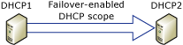

# What is DHCP Failover?
DHCP failover in [!INCLUDE[win8_server_1](../Token/win8_server_1_md.md)] is a new feature that enables two Microsoft DHCP servers to share service availability information with each other, providing DHCP high availability. DHCP failover works by replicating IP address leases and settings in one or more DHCP scopes from a primary DHCP server to a failover partner server.  
  
  
  
All scope information is shared between the two DHCP servers, including active leases. This enables either DHCP server to assume responsibility for DHCP clients if the other server becomes unavailable.  
  
See the following sections in this topic for an overview of DHCP failover:  
  
-   [Introduction to DHCP failover](../Topic/What-is-DHCP-Failover-.md#intro)  
  
-   [DHCP failover specifications](../Topic/What-is-DHCP-Failover-.md#specs)  
  
-   [DHCP failover and IPv6](../Topic/What-is-DHCP-Failover-.md#ipv6)  
  
-   [DHCP failover and Windows Failover Clustering](../Topic/What-is-DHCP-Failover-.md#cluster)  
  
-   [DHCP failover and DNS dynamic updates](../Topic/What-is-DHCP-Failover-.md#dynamic_updates)  
  
The following topics in this guide provide more detailed information about DHCP failover concepts, examples, and troubleshooting:  
  
-   [DHCP Failover Relationships](../Topic/DHCP-Failover-Relationships.md)  
  
-   [DHCP Failover Modes](../Topic/DHCP-Failover-Modes.md)  
  
-   [DHCP Failover Communications](../Topic/DHCP-Failover-Communications.md)  
  
-   [DHCP Failover Settings](../Topic/DHCP-Failover-Settings.md)  
  
-   [DHCP Failover Examples](../Topic/DHCP-Failover-Examples.md)  
  
-   [DHCP Failover Events and Performance](../Topic/DHCP-Failover-Events-and-Performance.md)  
  
## <a name="intro"></a>Introduction to DHCP failover  
With DHCP failover, DHCPv4 scopes can be replicated from a primary DHCP server to a partner DHCP server, enabling redundancy and load balancing of DHCP services. DHCP servers that share a failover\-enabled DHCP scope are called failover partners. Microsoft’s implementation of DHCP failover is based on the Internet Engineering Task Force \(IETF\) [DHCP Failover Protocol](http://www.ietf.org/proceedings/59/I-D/draft-ietf-dhc-failover-12.txt) draft.  
  
When two DHCP servers are configured for failover, they will share scope information, including all active leases. This enables both DHCP servers to provide leases to the same subnet for load balancing or redundancy purposes. Scope settings are replicated when you first configure DHCP failover, and can be replicated again later if configuration changes are made.  
  
The following figure illustrates how components and settings for a failover\-enabled DHCP scope are shared between two DHCP servers.  
  
  
  
The scopes and settings used with DHCP servers that are configured for DHCP failover are shared using a new object called the DHCP failover relationship. For more information, see [DHCP Failover Relationships](../Topic/DHCP-Failover-Relationships.md).  
  
Several configuration options are available with DHCP failover. You can configure failover on all scopes that exist on a DHCP server, or only on some scopes. You can also easily use the same DHCP failover settings for many scopes by adding them to the same failover relationship. A failover relationship is always between only two DHCP servers. However, a server can have many failover relationships, and each failover relationship can be with a different DHCP server.  
  
> [!IMPORTANT]  
> If changes are made to a failover\-enabled scope, you must manually replicate these changes to the partner server in order to synchronize scopes on both DHCP servers. Replication copies scope settings from the DHCP server where replication is initiated to the partner server, overwriting settings on the partner server. Therefore, it is important to always initiate replication from the server that has DHCP scope settings you wish to use.  
  
## <a name="specs"></a>DHCP failover specifications  
The following specifications apply to DHCP failover:  
  
-   You cannot configure DHCP failover on a DHCP scope to include more than two DHCP servers.  
  
-   DHCP failover supports DHCPv4 scopes only. DHCPv6 scopes cannot be failover\-enabled.  
  
-   DHCP failover partners must both be running [!INCLUDE[win8_server_2](../Token/win8_server_2_md.md)] or a later operating system.  
  
-   DHCP failover can be configured, and settings can be modified without the need to pause, stop, or restart the DHCP Server service.  
  
-   If parameters of a failover\-enabled scope are modified, these settings must be manually replicated to the partner DHCP server. Note: Automatic replication of scope settings is available if you use IP address management \(IPAM\) in [!INCLUDE[winblue_server_2](../Token/winblue_server_2_md.md)] to modify failover\-enabled scope settings.  
  
-   Replication of scope settings can be initiated from either DHCP server to its failover partner server.  
  
-   Clustered DHCP is supported in conjunction with DHCP failover. For purposes of failover, a DHCP cluster is considered a single DHCP server. See [DHCP failover and Windows Failover Clustering](../Topic/What-is-DHCP-Failover-.md#cluster) for more information.  
  
-   DHCP clients must be able to communicate with both DHCP failover partner servers, either directly or using a DHCP relay.  
  
-   DHCP servers configured as failover partners can be located on different subnets, but this is not required.  
  
-   When DHCP failover is enabled on a DHCP scope, the DHCP server that renews a DHCP client lease can be different from the DHCP server that initially granted the lease.  
  
-   Two DHCP servers configured as failover partners will attempt to maintain a persistent TCP\/IP connection.  
  
-   Two separate, synchronized client lease databases are maintained independently by each DHCP failover partner server.  
  
-   DHCP servers configured as failover partners are both aware of the status of the DHCP service on the other server, and are informed of any change in that status with minimal delay.  
  
-   If two DHCP servers configured as failover partners are unable to communicate, precautions are taken to avoid the same IP address lease being issued to two different DHCP clients.  
  
-   If a DHCP server becomes unavailable before it is able to successfully synchronize all DHCP client information with its failover partner, precautions are taken to ensure DHCP lease continuity for DHCP clients.  
  
> [!IMPORTANT]  
> When replicating settings between DHCP failover partner servers that have different operating system versions \(ex: [!INCLUDE[win8_server_2](../Token/win8_server_2_md.md)] and [!INCLUDE[winblue_server_2](../Token/winblue_server_2_md.md)]\), always modify settings and initiate replication from the DHCP server with the more recent operating system version. This ensures that settings are recognized by both failover partners and replicated consistently.  
  
DHCP failover can be configured using Windows PowerShell or using the DHCP console. For information about using Windows PowerShell, see [DHCP Server Cmdlets in Windows PowerShell](http://technet.microsoft.com/library/jj590751.aspx) \(http:\/\/technet.microsoft.com\/library\/jj590751.aspx\). For detailed guidance on configuring DHCP failover, see [Deploy DHCP Failover](../Topic/Deploy-DHCP-Failover.md).  
  
## <a name="ipv6"></a>DHCP failover and IPv6  
DHCP failover is not supported for Internet Protocol version 6 \(IPv6\) scopes. Network adapters using IPv6 typically determine their own IPv6 address using stateless IP auto\-configuration. In this mode, the DHCP server delivers only the DHCP option configuration, and the server does not maintain any lease state information. A high availability deployment for stateless DHCPv6 is possible by simply setting up two servers with identical option configuration. Even in a stateful DHCPv6 deployment, the scopes do not run under high address utilization, which makes split scope a viable solution for high availability.  
  
## <a name="cluster"></a>DHCP failover and Windows Failover Clustering  
DHCP failover is supported with clustered DHCP in the following configurations:  
  
-   A single DHCP server can have a failover relationship with a DHCP failover cluster.  
  
-   A DHCP failover cluster can have a failover relationship with another DHCP failover cluster.  
  
In both cases, you must configure DHCP failover to use the name or IP address of the cluster, not the name or IP address of an cluster node. If an individual cluster node is configured as the failover partner, the primary server will enter a communications interrupted state if the DHCP Server service moves to a different node in the cluster.  
  
> [!IMPORTANT]  
> If you use a shared secret, you must manually replicate the shared secret to all cluster nodes. See the following procedure for more information.  
  
#### Replicate a shared secret on DHCP failover cluster nodes  
  
1.  On the Server Manager menu, click **Tools** and then click **Failover Cluster Manager**.  
  
2.  In Failover Cluster Manager, determine the currently active node. To determine the active node, you can click on each node under **Nodes** until you see the **DHCP Server** role with a status of **Running**. You can also type the following command at a Windows PowerShell prompt:  
  
    ```  
    Get-ClusterResource –Name DHCPMCSDhcp | select OwnerNode  
    ```  
  
    In this example, the cluster name is **DHCPMCSDhcp**. Output from this command will be the name of the currently active node.  
  
3.  On the currently active cluster node, type the following command at an elevated Windows PowerShell prompt, and then press ENTER.  
  
    ```  
    Set-DhcpServerv4Failover –Name ”DHCPMCSDhcp”  -SharedSecret “123”  
    ```  
  
    In this example, the cluster name is **DHCPMCSDhcp** and the shared secret is **123**.  
  
4.  Next, move the DHCP Server role to another node. To move a role, click **Action** on the Failover Cluster Manager menu, point to **Move**, and then click **Select Node**.  
  
5.  In the **Move Clustered Role** dialog box, click on a node under **Cluster nodes** and then click **OK**.  
  
6.  Repeat steps 3\-5 until you have set the shared secret on all nodes in the cluster.  
  
The reason you must replicate the shared secret is because it is encrypted in the Windows Registry.  
  
Windows Failover Clustering will automatically replicate registry parameters related to the DHCP Server service when it moves to a new node, but encryption of a shared secret is specific to each node. Therefore, each node can only decrypt a shared secret if it was configured on the same node.  
  
## <a name="dynamic_updates"></a>DHCP failover and DNS dynamic updates  
If DHCP servers are configured to perform DNS dynamic updates on behalf of the client computer, both DHCP servers in a DHCP failover relationship must use the same DNS credentials to update DNS records. If the failover partner attempts to use different credentials to update DNS resource records, this update will fail.  
  
The following steps describe how DNS dynamic updates might fail when a client computer uses a different DHCP server:  
  
1.  A Windows DHCP server performs a dynamic update on behalf of a DHCP client.  
  
2.  The DHCP server creates the client’s DNS name and becomes the owner of that name.  
  
3.  Now only the DHCP server itself can update the DNS records for the client’s name.  
  
4.  The original server fails and a second backup DHCP server comes online; now the second server cannot update the client name because it is not the name’s owner.  
  
Also see [DNS Record Ownership and the DnsUpdateProxy Group](http://technet.microsoft.com/library/dd334715.aspx) for a discussion of this scenario.  
  
## See also  
[Deploy DHCP Failover](../Topic/Deploy-DHCP-Failover.md)  
  
[Step-by-Step: Configure DHCP for Failover](../Topic/Step-by-Step--Configure-DHCP-for-Failover.md)  
  
