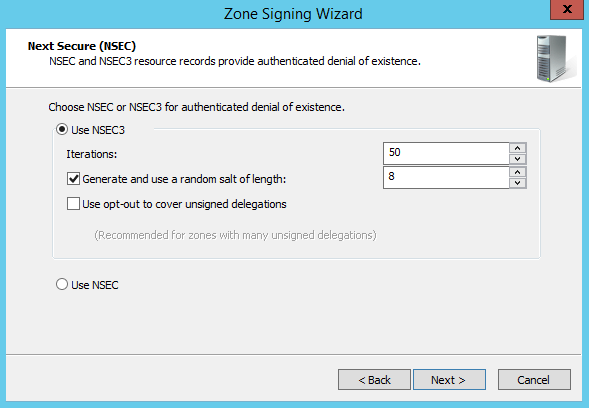

# DNS Zones
Signing a zone with DNSSEC adds several new [DNSSEC\-related resource records](../Topic/Overview-of-DNSSEC.md#RR) to the zone. These new resource records can be sent in response to DNS queries for the zone along with the traditional, non\-DNSSEC\-related resource records. See the following figure.  
  
  
  
In the preceding figure, both DNS1 and DNS2 are authoritative for the signed zone *secure.contoso.com*. DNS2 is the Key Master for the zone, and DNS1 can be either an Active Directory\-integrated primary DNS server, or a file\-backed secondary authoritative DNS server. The DNS server Resolver1 will resolve DNS names through recursion or forwarding on behalf of a DNS client, and is capable of validating DNS responses for the *secure.contoso.com* zone.  
  
DNS servers must specifically request that DNSSEC records be included in DNS responses. Therefore, servers that do not support DNSSEC will receive only traditional resource records in a DNS response.  
  
A signed zone can be a forward or reverse lookup zone, a static or dynamic zone, and can be Active Directory\-integrated or file\-backed. If the zone is Active Directory\-integrated, private zone signing keys replicate automatically to all primary, master DNS servers through Active Directory replication. Each master server signs its own copy of the zone when it receives the key. For optimal performance, and to prevent increasing the size of the Active Directory database file, the signed copy of the zone remains in memory for Active Directory\-integrated zones. A DNSSEC signed zone is only committed to disk for file\-backed zones.  
  
In an Active Directory multi\-master configuration, zone settings, including DNSSEC parameters, can be modified on any primary authoritative DNS server provided that the Key Master is online. You cannot perform zone signing and unsigning or modify DNSSEC parameters of a zone on a secondary DNS server.  
  
## In this section  
  
-   [Signing a zone](../Topic/DNS-Zones.md#sign)  
  
    -   [Examples](../Topic/DNS-Zones.md#Examples)  
  
-   [DNS Manager](../Topic/DNS-Zones.md#dns_mgr)  
  
    -   [Zone Signing Wizard](../Topic/DNS-Zones.md#zsw)  
  
        -   [Signing options](../Topic/DNS-Zones.md#options)  
  
            -   [Custom parameters](../Topic/DNS-Zones.md#custom_parameters)  
  
            -   [Existing parameters](../Topic/DNS-Zones.md#existing_params)  
  
            -   [Default parameters](../Topic/DNS-Zones.md#default_params)  
  
        -   [Parameter values](../Topic/DNS-Zones.md#params)  
  
    -   [Unsign zone wizard](../Topic/DNS-Zones.md#unsign)  
  
    -   [DNSSEC properties page](../Topic/DNS-Zones.md#prop)  
  
        -   [Modifying DNSSEC properties](../Topic/DNS-Zones.md#poc)  
  
-   [Windows PowerShell](../Topic/DNS-Zones.md#ps)  
  
    -   [Sign a zone](../Topic/DNS-Zones.md#ps_sign)  
  
    -   [Unsign a zone](../Topic/DNS-Zones.md#ps_unsign)  
  
    -   [Review DNSSEC properties](../Topic/DNS-Zones.md#ps_review)  
  
    -   [Review the status of signing keys](../Topic/DNS-Zones.md#ps_signing)  
  
    -   [Modify DNSSEC properties](../Topic/DNS-Zones.md#ps_change)  
  
## <a name="sign"></a>Signing a zone  
In [!INCLUDE[win8_server_2](../Token/win8_server_2_md.md)] and [!INCLUDE[winblue_server_2](../Token/winblue_server_2_md.md)], the process of zone signing is greatly simplified over previous operating systems.  
  
On a DNS server running [!INCLUDE[win8_server_2](../Token/win8_server_2_md.md)] or [!INCLUDE[winblue_server_2](../Token/winblue_server_2_md.md)] with role administration tools including **DNS Server Tools** installed, you can use DNS Manager or Windows PowerShell to sign a zone. These methods are summarized below. The dnscmd.exe command line tool can also be used, but is deprecated and not recommended.  
  
-   [DNS Manager](../Topic/DNS-Zones.md#dns_mgr) \- The zone signing wizard provides a step\-by\-step interface to input DNSSEC parameters and initiate zone signing. If the zone is already signed, you can also view or edit settings and re\-sign a zone using the DNSSEC properties page. An unsign zone wizard is also provided to remove DNSSEC\-signed records from a zone.  
  
-   [Windows PowerShell](../Topic/DNS-Zones.md#ps) \- Many cmdlets are available to sign and unsign DNS zones, and to view or edit DNSSEC parameters.  
  
Both methods for zone signing are compatible with each other. You can sign a zone with DNS Manager and view or edit settings with Windows PowerShell, and vice versa.  
  
After selecting a zone signing method, you must also define the DNSSEC [Parameter values](../Topic/DNS-Zones.md#params) to use. Three options are available to specify DNSSEC parameter values:  
  
-   [Custom parameters](../Topic/DNS-Zones.md#custom_parameters) \- You can provide custom values for each parameter.  
  
-   [Existing parameters](../Topic/DNS-Zones.md#existing_params) \- You can use values that were used previously.  
  
-   [Default parameters](../Topic/DNS-Zones.md#default_params) \- You can use a default parameter value set.  
  
For more information about specifying DNSSEC parameter values using the zone signing wizard in DNS Manager, see [Signing options](../Topic/DNS-Zones.md#options) in this topic. For information about specifying DNSSEC parameters in Windows PowerShell, see [Checklist: Sign a Zone](../Topic/Checklist--Sign-a-Zone.md) and [Appendix B: Windows PowerShell for DNS Server](../Topic/Appendix-B--Windows-PowerShell-for-DNS-Server.md).  
  
### <a name="Examples"></a>Examples  
In the following example, Windows PowerShell is used to:  
  
1.  Create a file\-backed DNS zone  
  
2.  Add an address \(A\) and mail exchanger \(MX\) record to the zone  
  
3.  View the contents of the zone prior to zone signing  
  
4.  Sign the zone with DNSSEC using default parameters  
  
5.  View the contents of the zone after zone signing  
  
```  
PS C:\> Add-DnsServerPrimaryZone -Name example.com -ZoneFile example.com.dns  
PS C:\> Add-DnsServerResourceRecord -ZoneName example.com -A -Name mail -IPv4Address 10.0.1.1  
PS C:\> Add-DnsServerResourceRecord -ZoneName example.com -MX -Name . -MailExchange mail.example.com -Preference 10  
PS C:\> Get-DnsServerResourceRecord -ZoneName example.com  
  
HostName                  RecordType Timestamp            TimeToLive      RecordData  
--------                  ---------- ---------            ----------      ----------  
@                         NS         0                    01:00:00        dc2.contoso.com.  
@                         SOA        0                    01:00:00        [3][dc2.contoso.com.][hostmaster.contoso.com.]  
@                         MX         0                    01:00:00        [10][mail.example.com.]  
mail                      A          0                    01:00:00        10.0.1.1  
  
PS C:\> Invoke-DnsServerZoneSign -ZoneName example.com -SignWithDefault -Force  
PS C:\> Get-DnsServerResourceRecord -ZoneName example.com  
  
HostName                  RecordType Timestamp            TimeToLive      RecordData  
--------                  ---------- ---------            ----------      ----------  
@                         NS         0                    01:00:00        dc2.contoso.com.  
@                         SOA        0                    01:00:00        [4][dc2.contoso.com.][hostmaster.contoso.com.]  
@                         MX         0                    01:00:00        [10][mail.example.com.]  
@                         RRSIG      0                    01:00:00        [NS][RsaSha256][7849]  
@                         RRSIG      0                    01:00:00        [SOA][RsaSha256][7849]  
@                         RRSIG      0                    01:00:00        [MX][RsaSha256][7849]  
@                         RRSIG      0                    01:00:00        [DNSKEY][RsaSha256][7849]  
@                         RRSIG      0                    01:00:00        [DNSKEY][RsaSha256][9797]  
@                         RRSIG      0                    01:00:00        [NSEC3PARAM][RsaSha256][7849]  
@                         DNSKEY     0                    01:00:00        [ZoneKey][RsaSha256][7849]  
@                         DNSKEY     0                    01:00:00        [ZoneKey][RsaSha256][17983]  
@                         DNSKEY     0                    01:00:00        [SEP][ZoneKey][RsaSha256][9797]  
@                         DNSKEY     0                    01:00:00        [SEP][ZoneKey][RsaSha256][9044]  
@                         NSEC3PARAM 0                    01:00:00        [RsaSha1][50][F2738D980008F73C]  
2vf77rkf63hrgismnuvnb8... RRSIG      0                    01:00:00        [NSEC3][RsaSha256][7849]  
2vf77rkf63hrgismnuvnb8... NSEC3      0                    01:00:00        [RsaSha1][False][50][F2738D980008F73C]  
7ceje475rse25gppr3vphs... RRSIG      0                    01:00:00        [NSEC3][RsaSha256][7849]  
7ceje475rse25gppr3vphs... NSEC3      0                    01:00:00        [RsaSha1][False][50][F2738D980008F73C]  
mail                      A          0                    01:00:00        10.0.1.1  
mail                      RRSIG      0                    01:00:00        [A][RsaSha256][7849]  
```  
  
As shown in the preceding example, zone signing with DNSSEC adds several new resource records to the zone. For more information about these new records, see [DNSSEC\-related resource records](../Topic/Overview-of-DNSSEC.md#RR). The zone is displayed below as it appears in DNS Manager:  
  
  
  
> [!TIP]  
> In the DNS Manager console tree, zones that are signed with DNSSEC are indicated with a lock icon.  
  
Because the example.com zone is file\-backed, it has only one primary authoritative DNS server. In the next example, an Active Directory\-integrated zone is signed on one DNS server and then displayed in a Windows multi\-master DNS environment on another primary, authoritative DNS server.  
  
In the following example, Windows PowerShell is used to:  
  
1.  Create an Active Directory\-integrated DNS zone with a forest\-wide replication scope  
  
2.  Add an address \(A\) and mail exchanger \(MX\) record to the zone  
  
3.  Specify a Key Master for the zone  
  
4.  Specify NSec for the denial of existence method to be used  
  
5.  Add a custom KSK to the zone  
  
6.  Add a custom ZSK to the zone  
  
7.  Sign the zone with DNSSEC using the specified custom parameters and signing keys  
  
8.  View the contents of the zone on the Key Master after zone signing  
  
9. View the contents of the zone on another primary authoritative DNS server prior to zone signing on that server  
  
10. View the contents of the zone on another primary authoritative DNS server after zone signing on that server  
  
```  
PS C:\> Add-DnsServerPrimaryZone -Name fabrikam.com -ReplicationScope Forest  
PS C:\> Add-DnsServerResourceRecord -ZoneName fabrikam.com -A -Name mail -IPv4Address 10.0.1.1  
PS C:\> Add-DnsServerResourceRecord -ZoneName example.com -MX -Name . -MailExchange mail.fabrikam.com -Preference 10  
PS C:\> Reset-DnsServerZoneKeyMasterRole -ZoneName fabrikam.com -KeyMasterServer dc2.contoso.com -SeizeRole -Force  
PS C:\> Set-DnsServerDnsSecZoneSetting -ZoneName fabrikam.com -DenialOfExistence NSec  
PS C:\> Add-DnsServerSigningKey -ZoneName fabrikam.com -Type KeySigningKey -CryptoAlgorithm RsaSha1 -KeyLength 2048  
PS C:\> Add-DnsServerSigningKey -ZoneName fabrikam.com -Type ZoneSigningKey -CryptoAlgorithm RsaSha1 -KeyLength 1024  
PS C:\> Invoke-DnsServerZoneSign -ZoneName fabrikam.com -Force  
PS C:\> Get-DnsServerResourceRecord -ZoneName fabrikam.com -ComputerName dc2.contoso.com  
  
HostName                  RecordType Timestamp            TimeToLive      RecordData  
--------                  ---------- ---------            ----------      ----------  
@                         NS         0                    01:00:00        dc3.contoso.com.  
@                         NS         0                    01:00:00        dc2.contoso.com.  
@                         SOA        0                    01:00:00        [3][dc2.contoso.com.][hostmaster.contoso.com.]  
@                         RRSIG      0                    01:00:00        [NS][RsaSha1][31021]  
@                         RRSIG      0                    01:00:00        [SOA][RsaSha1][31021]  
@                         RRSIG      0                    01:00:00        [NSEC][RsaSha1][31021]  
@                         RRSIG      0                    01:00:00        [DNSKEY][RsaSha1][31021]  
@                         RRSIG      0                    01:00:00        [DNSKEY][RsaSha1][26984]  
@                         NSEC       0                    01:00:00        [mail.fabrikam.com.][NS SOA RRSIG NSEC DNSKEY]  
@                         DNSKEY     0                    01:00:00        [ZoneKey][RsaSha1][31021]  
@                         DNSKEY     0                    01:00:00        [ZoneKey][RsaSha1][62320]  
@                         DNSKEY     0                    01:00:00        [SEP][ZoneKey][RsaSha1][26984]  
@                         DNSKEY     0                    01:00:00        [SEP][ZoneKey][RsaSha1][37376]  
mail                      A          0                    01:00:00        10.0.1.1  
mail                      RRSIG      0                    01:00:00        [A][RsaSha1][31021]  
mail                      RRSIG      0                    01:00:00        [NSEC][RsaSha1][31021]  
mail                      NSEC       0                    01:00:00        [fabrikam.com.][A RRSIG NSEC]  
  
PS C:\> Get-DnsServerResourceRecord -ZoneName fabrikam.com -ComputerName dc3.contoso.com  
  
HostName                  RecordType Timestamp            TimeToLive      RecordData  
--------                  ---------- ---------            ----------      ----------  
@                         NS         0                    01:00:00        dc3.contoso.com.  
@                         NS         0                    01:00:00        dc2.contoso.com.  
@                         SOA        0                    01:00:00        [2][dc3.contoso.com.][hostmaster.contoso.com.]  
mail                      A          0                    01:00:00        10.0.1.1  
  
PS C:\> Get-DnsServerResourceRecord -ZoneName fabrikam.com -ComputerName dc3.contoso.com  
  
HostName                  RecordType Timestamp            TimeToLive      RecordData  
--------                  ---------- ---------            ----------      ----------  
@                         NS         0                    01:00:00        dc3.contoso.com.  
@                         NS         0                    01:00:00        dc2.contoso.com.  
@                         SOA        0                    01:00:00        [3][dc3.contoso.com.][hostmaster.contoso.com.]  
@                         RRSIG      0                    01:00:00        [DNSKEY][RsaSha1][26984]  
@                         RRSIG      0                    01:00:00        [DNSKEY][RsaSha1][31021]  
@                         RRSIG      0                    01:00:00        [NS][RsaSha1][31021]  
@                         RRSIG      0                    01:00:00        [SOA][RsaSha1][31021]  
@                         RRSIG      0                    01:00:00        [NSEC][RsaSha1][31021]  
@                         NSEC       0                    01:00:00        [mail.fabrikam.com.][NS SOA RRSIG NSEC DNSKEY]  
@                         DNSKEY     0                    01:00:00        [SEP][ZoneKey][RsaSha1][37376]  
@                         DNSKEY     0                    01:00:00        [SEP][ZoneKey][RsaSha1][26984]  
@                         DNSKEY     0                    01:00:00        [ZoneKey][RsaSha1][62320]  
@                         DNSKEY     0                    01:00:00        [ZoneKey][RsaSha1][31021]  
mail                      A          0                    01:00:00        10.0.1.1  
mail                      RRSIG      0                    01:00:00        [A][RsaSha1][31021]  
mail                      RRSIG      0                    01:00:00        [NSEC][RsaSha1][31021]  
mail                      NSEC       0                    01:00:00        [fabrikam.com.][A RRSIG NSEC]  
```  
  
When the **Invoke\-DnsServerZoneSign** cmdlet is used, the fabrikam.com zone is immediately signed on the Key Master, dc2.contoso.com. However, the zone is not yet signed on other primary, authoritative DNS servers like dc3.contoso.com. The zone is signed on dc3.contoso.com about 10 minutes later.  
  
## <a name="dns_mgr"></a>DNS Manager  
DNS Manager in [!INCLUDE[win8_server_2](../Token/win8_server_2_md.md)] and [!INCLUDE[winblue_server_2](../Token/winblue_server_2_md.md)] provides a [Zone Signing Wizard](../Topic/DNS-Zones.md#zsw) and [Unsign zone wizard](../Topic/DNS-Zones.md#unsign) to greatly simplify the process of applying or removing DNSSEC from a zone. After a zone has been signed, you can also view and edit several properties and values using the [DNSSEC properties page](../Topic/DNS-Zones.md#prop).  
  
### <a name="zsw"></a>Zone Signing Wizard  
To start the **Zone Signing Wizard** in DNS Manager, right\-click a forward or reverse DNS zone on a primary, authoritative DNS server, point to **DNSSEC**, and click **Sign the Zone**. See the following example.  
  
  
  
> [!IMPORTANT]  
> You cannot sign or unsign a zone, or view DNSSEC properties of a zone on a secondary DNS server. The server must be a primary, authoritative DNS server. DNSSEC\-related resource records are transferred to secondary servers, but you cannot view or edit the DNSSEC properties of a secondary zone.  
  
After you click **Sign the Zone**, the wizard displays an introductory page with a summary of DNSSEC \(not shown\). Click **Next** to view the **Signing Options** page.  
  
#### <a name="options"></a>Signing options  
The **Signing Options** page requires you to choose a method for specifying DNSSEC parameter values. See the following example.  
  
  
  
The method that you choose on this page determines which pages the zone signing wizard will display. Choosing to use default settings or parameters of an existing zone will skip custom parameter pages. Some parameter values can also be modified after the zone is signed if desired.  
  
The following options are available to specify the DNSSEC parameter values that will be used for zone signing:  
  
-   **Customize zone signing parameters**. This is the default option. If you choose this option, the wizard displays several pages that you can use to specific different parameter values, and provides you with default values for each parameter. These values can also be modified to any value within an acceptable range. If the zone was previously signed and then un\-signed, the parameters that were most recently used are provided as the default values. For more information about this option, see [Custom parameters](../Topic/DNS-Zones.md#custom_parameters).  
  
-   **Sign the zone with parameters of an existing zone**. To use this option, the DNS server must already be authoritative for one or more DNSSEC\-signed zones. If you choose this option, you must provide the name of a signed zone to use as a template for signing the current zone. For more information about this option, see [Existing parameters](../Topic/DNS-Zones.md#existing_params).  
  
-   **Use default settings to sign the zone**. If you choose this option, the zone will be signed with default parameters. These parameters are the same as those that are displayed by default if you choose to customize zone signing parameters, provided the zone has not been previously signed with a different set of parameters. If you choose to sign the zone with default settings, the wizard will skip to the summary page. For more information about this option, see [Default parameters](../Topic/DNS-Zones.md#default_params).  
  
For a list of the default parameter values that are used in the wizard and the allowed range of custom parameter values, see [Parameter values](../Topic/DNS-Zones.md#params).  
  
The length of time that is required to sign a zone will depend on the parameters that you specify and the size of the zone.  
  
##### <a name="custom_parameters"></a>Custom parameters  
The following table lists pages that are displayed in the zone signing wizard when you choose to customize zone signing parameters. Click the link in the "More information" column for an explanation and example of each page.  
  
|Action|Description|More information|  
|----------|---------------|--------------------|  
|Select the Key Master|Only one server can be the Key Master at a given time. By default, the Key Master is the local server, but a different DNS server can be selected if it meets requirements.|[Key Master](../Topic/DNS-Zones.md#KM)|  
|Add signing keys|You must choose at least one zone signing key \(ZSK\) and one key signing key \(KSK\).|[Signing keys](../Topic/DNS-Zones.md#signing)|  
|Specify KSK parameter values|For each KSK that is added to a zone, you must specify individual parameter values.|[KSK configuration](../Topic/DNS-Zones.md#ksk_config)|  
|Specify ZSK parameter values|For each ZSK that is added to a zone, you must specify individual parameter values.|[ZSK configuration](../Topic/DNS-Zones.md#zsk_config)|  
|Specify Next Secure \(NSEC\) values|You can choose **Use NSEC** or **Use NSEC3** to provide authenticated denial of existence.|[NSEC](../Topic/DNS-Zones.md#nsec)|  
|Choose trust anchor distribution options|Select how trust anchors will be distributed and if automatic updates are enabled.|[Trust anchors](../Topic/DNS-Zones.md#ta)|  
|Specify signing and polling parameters|Specify DS and DNSKEY parameters.|[Signing and polling](../Topic/DNS-Zones.md#signing_polling)|  
|Summary|Before zone signing starts, you are provided with a summary of all DNSSEC parameter values that will be used to sign the zone. Clicking **Next** on this page will initiate zone signing.|[Summary](../Topic/DNS-Zones.md#summary)|  
  
###### <a name="KM"></a>Choose the Key Master  
In Windows DNS, signing a zone requires that you designate one DNS server as the Key Master. You can change the Key Master, but only one DNS server can be the Key Master at a given time. The Key Master is the DNS server where zone signing occurs, and it is responsible for DNSSEC\-related cryptographic processes, such as signing key creation and management. The Key Master must be a primary authoritative DNS server for the zone.  
  
The following options are available when selecting the Key Master:  
  
-   The DNS server <local computer> is the Key Master.  
  
-   Select another primary server as the Key Master: <allowed list>  
  
See the following example:  
  
  
  
By default, the local server is selected as the Key Master. You also have the option of choosing a different DNS server from a list of online, primary, authoritative DNS servers that support online DNSSEC signing.  
  
> [!TIP]  
> The signed\-in user must have administrative privileges on a DNS server in order for it to be displayed in the allowed list of Key Master servers.  
  
Only one DNS server can be the Key Master for a given zone at a given time. For more information about the Key Master, that includes options to transfer the Key Master role to a different DNS server after a zone is signed, see [The Key Master](../Topic/DNS-Servers.md#KM).  
  
###### <a name="signing"></a>Signing keys  
The zone signing wizard displays the following six pages that provide information and enable you to add signing keys to the zone:  
  
1.  **Key signing key \(KSK\)**: *A KSK is an authentication key that is used to sign other keys*.  
  
    This introductory page provides a short description of a KSK and a link to more information. Click **Next** on this page to add or edit KSKs.  
  
2.  **Key signing key \(KSK\)**: *Configure one or more KSKs*.  
  
    This page lists the current KSKs. Click **Add**, **Edit**, or **Remove** to modify KSKs, and then click **Next** when you have finished.  
  
3.  **New\/Edit Key Signing Key \(KSK\)**  
  
    Use this page to edit individual KSK parameter values.  
  
4.  **Zone signing key \(ZSK\)**: *A ZSK is an authentication key used to sign the zone data*.  
  
    This page provides a short description of a ZSK and a link to more information. Click **Next** on this page to add or edit ZSKs.  
  
5.  **Zone Signing Key \(ZSK\)**: *Configure one or more ZSKs*.  
  
    This page lists the current ZSKs. Click **Add**, **Edit**, or **Remove** to modify ZSKs, and then click **Next** when you have finished.  
  
6.  **New\/Edit Zone Signing Key \(ZSK\)**  
  
    Use this page to edit individual ZSK parameter values.  
  
For more information, including examples of these pages, see the [KSK configuration](../Topic/DNS-Zones.md#ksk_config) and [ZSK configuration](../Topic/DNS-Zones.md#zsk_config) topics in this section.  
  
To sign a zone with DNSSEC, you must configure at least one KSK and one ZSK. Multiple keys are also supported: up to three \(3\) for each cryptographic algorithm. A list of available [Cryptographic algorithms](../Topic/DNS-Zones.md#crypt) is provided later in this topic.  
  
Typically, a zone is signed with a single ZSK and a single KSK. You might use more than one key to sign a zone under the following circumstances:  
  
1.  All DNS validators do not support a single cryptographic algorithm.  
  
2.  You are transitioning the DNS infrastructure to use new signing key properties.  
  
3.  You are merging DNS zones or network elements that use different signing key properties.  
  
Each additional signing key and cryptographic algorithm that you add increases the time and computational cost of zone signing. For more information about signing keys and DNS server performance, see [DNSSEC Performance Considerations](../Topic/DNSSEC-Performance-Considerations.md).  
  
> [!IMPORTANT]  
> To support automatic key rollover, an additional signing key is generated for each ZSK and KSK that is added to the zone. For automatic KSK rollover, only the double signature rollover method is supported. For automatic ZSK rollover, only the pre\-publish rollover method is supported.  
  
###### <a name="crypt"></a>Cryptographic algorithms  
The following cryptographic algorithms are available for use in either a KSK or ZSK. You do not have to use the same algorithm for both types of signing keys, but you cannot use RSA\/SHA\-1 and RSA\-SHA\-1 \(NSEC3\) together.  
  
The following table shows cryptographic algorithms and compatible NSEC methods.  
  
|Algorithm|Compatible NSEC methods|  
|-------------|---------------------------|  
|ECDSAP256\/SHA\-256|NSEC, NSEC3|  
|ECDSAP384\/SHA\-384|NSEC, NSEC3|  
|RSA\/SHA\-1|NSEC|  
|RSA\/SHA\-1 \(NSEC3\)|NSEC3|  
|RSA\/SHA\-256|NSEC, NSEC3|  
|RSA\/SHA\-512|NSEC, NSEC3|  
  
You must have at least one \(1\) KSK and one \(1\) ZSK. You can have up to three \(3\) KSKs and three \(3\) ZSKs that use the same cryptographic algorithm, and you have multiple cryptographic algorithms.  
  
###### <a name="ksk_config"></a>KSK configuration  
If the zone has not been previously signed, the KSK configuration page requires that you add at least one KSK. See the following example:  
  
  
  
Click **Add** to display the **New Key Signing Key \(KSK\)** page.  
  
  
  
> [!NOTE]  
> If the zone has been signed and then unsigned, the KSKs and settings that were used to previously sign the zone are automatically provided again. You have the option to use the same keys and settings as before, to edit parameter values for these keys, or to remove these keys, and add new keys.  
  
Click **OK** to accept default parameter values for the KSK, or enter new parameter values, and then click **OK**. Information about KSK parameters is provided in the following section.  
  
Add additional KSKs if desired, and then click **Next** to continue.  
  
###### <a name="ksk_param"></a>KSK parameters  
The key signing key \(KSK\) is an authentication key that signs all of the DNSKEY records at the root of the zone, and it is part of the chain of trust.  
  
When you generate a new KSK, the Key Master can create an active and a standby key. Properties for the KSK include the following:  
  
-   **Cryptographic algorithm**: By default, the RSA\/SHA\-1 \(NSEC3\) algorithm is chosen. To sign a zone with NSEC3, you cannot choose the RSA\/SHA\-1 algorithm. RSA\/SHA\-1 \(NSEC3\) and RSA\/SHA\-1 are two different available algorithms.  
  
-   **Key length**: By default, this is 2048 bits for keys that use the RSA\/SHA\-1 \(NSEC3\) algorithm. Typically, for greater security, the KSK has a longer key length than a ZSK. The KSK key length affects the time that is required for zone signing less than the ZSK key length.  
  
-   **Key storage provider**: If keys will be distributed using Active Directory Domain Services, you must choose **Microsoft Software Key Storage Provider**.  
  
-   **DNSKEY RRSET signature validity period**: By default, this is set to 72 hours. Signatures that are generated using the KSK might have a longer validity period than signatures that are generated by the ZSK to provide a more stable secure entry point into the zone.  
  
-   **Key Rollover**: You can enable automatic rollover and specify the rollover frequency. We highly recommend automatic key rollover. You can also delay the first rollover by a specified number of days.  
  
For additional information, see [Parameter values](../Topic/DNS-Zones.md#params).  
  
###### <a name="zsk_config"></a>ZSK configuration  
If the zone has not been previously signed, the ZSK configuration page requires that you add at least one ZSK. See the following example:  
  
  
  
Click **Add** to display the **New Zone Signing Key \(ZSK\)** page.  
  
  
  
> [!NOTE]  
> If the zone has been signed and then unsigned, the ZSKs and settings that were used to previously sign the zone are automatically provided again. You have the option to use the same keys and settings as before, to edit parameter values for these keys, or to remove these keys and add new keys.  
  
Click **OK** to accept default parameter values for the ZSK, or enter new parameter values, and then click **OK**.  
  
Add additional ZSKs if desired, and then click **Next** to continue.  
  
###### <a name="zsk_param"></a>ZSK parameters  
The zone signing key \(ZSK\) is used to sign zone data. A ZSK is typically rolled over more frequently than a KSK. Properties for the ZSK include the following:  
  
-   **Cryptographic algorithm**: By default, the RSA\/SHA\-1 \(NSEC3\) algorithm is selected. To sign a zone with NSEC3, you cannot select the RSA\/SHA\-1 algorithm. RSA\/SHA\-1 \(NSEC3\) and RSA\/SHA\-1 are two different available algorithms. The algorithm that you specify can affect the time that is required for zone signing.  
  
-   **Key length**: By default, this is 1024 bits for keys that use the RSA\/SHA\-1 \(NSEC3\) algorithm. Typically, the ZSK has a shorter key length than a KSK. The ZSK key length can affect the time that is required for zone signing.  
  
-   **Key storage provider**: If keys will be distributed by using Active Directory Domain Services, you must select **Microsoft Software Key Storage Provider**.  
  
-   **DNSKEY signature validity period**: By default, it is set to 72 hours.  
  
-   **DS signature validity period**: By default, it is set to 72 hours.  
  
-   **Zone record validity period**: By default, it is set to 240 hours.  
  
-   **Key Rollover**: You can enable automatic rollover and specify the rollover frequency. We highly recommend automatic key rollover. You can also delay the first rollover by a specified number of days.  
  
For additional information, see [Parameter values](../Topic/DNS-Zones.md#params).  
  
###### <a name="nsec"></a>NSEC  
The next page in the zone signing wizard is the **Next Secure \(NSEC\)** page. On this page, you are asked to choose whether to use NSEC3 or NSEC for authenticated denial of existence. See the following example:  
  
  
  
You should choose **NSEC3** on this page unless you have a good reason to use NSEC, such as a requirement to use the RSA\/SHA\-1 algorithm, or some other incompatibility with NSEC3. For more information about NSEC and NSEC3, see [DNSSEC\-related resource records](../Topic/Overview-of-DNSSEC.md#RR).  
  
Customize settings on this page, and then click **Next** to continue.  
  
###### <a name="ta"></a>Trust anchors  
On the **Trust Anchors \(TAs\)** page, you can configure distribution and update settings for trust anchors \(TAs\). See the following example:  
  
  
  
Customize settings on this page, and then click **Next** to continue.  
  
###### <a name="signing_polling"></a>Signing and polling  
On the **Signing and Polling Parameters** page, you can configure values for DS and DNSKEY records in the zone. See the following example:  
  
  
  
Customize settings on this page, and then click **Next** to continue.  
  
###### <a name="summary"></a>Summary  
The summary page is entitled **DNS Security Extensions \(DNSSEC\)**.  
  
> [!CAUTION]  
> Click **Next** on the summary page to initiate zone signing.  
>   
> Do not click **Next** on this page unless you are ready to begin signing the zone.  
  
You can also click **Back** to change settings, or click **Cancel** to skip signing the zone. See the following example:  
  
  
  
If you click **Next**, and zone signing is successful, a final page is displayed that indicates that the zone has been successfully signed. Error details are displayed if zone signing was not successful. Click **Finish** to close the wizard.  
  
##### <a name="existing_params"></a>Existing parameters  
If you choose **Sign the zone with parameters of an existing zone**, you must provide the name of another zone hosted by the local DNS server that is signed with DNSSEC. See the following example:  
  
  
  
> [!NOTE]  
> A zone that was signed offline on a DNS server running [!INCLUDE[nextref_server_7](../Token/nextref_server_7_md.md)] is not considered to be signed by DNS servers running [!INCLUDE[win8_server_2](../Token/win8_server_2_md.md)] or [!INCLUDE[winblue_server_2](../Token/winblue_server_2_md.md)]. If the local DNS server is a secondary DNS server for the specified zone, it attempts to retrieve DNSSEC settings from the primary DNS server.  
  
If DNSSEC settings for the specified zone are successfully retrieved, the zone signing wizard skips to the [Choose the Key Master](../Topic/DNS-Zones.md#KM) page. Click **Next** this page to display the [summary](../Topic/DNS-Zones.md#summary) page, and click **Next** on this page to initiate zone signing.  
  
##### <a name="default_params"></a>Default parameters  
Click **Use default settings to sign the zone** and click **Next** to designate the local DNS server as the Key Master and to skip to the [summary](../Topic/DNS-Zones.md#summary) page. Click **Next** on the summary page to initiates zone signing. Default settings that are used to sign a zone are provided in the table later in this topic.  
  
#### <a name="params"></a>Parameter values  
The following table lists default and allowed DNSSEC parameter values that are used in the zone signing wizard.  
  
|Action|Default|Allowed|  
|----------|-----------|-----------|  
|Key Master|The local DNS server is the Key Master.|Any DNS server found in Active Directory that is primary and authoritative for the zone can be the Key Master.<br /><br />The signed\-in user must have Domain Admin credentials, or equivalent, to designate the Key Master.|  
|KSK|One KSK|A minimum of one KSK is required. Up to three KSKs can be added for each of the available cryptographic algorithms.|  
|KSK: GUID|By default, all zeros are displayed. These values are a placeholder. The key’s GUID is generated automatically during zone signing.|No values are allowed in this field. You cannot manually input a GUID. The key GUID is also called the KeyId.|  
|KSK: Key Generation|Generate new signing keys|Use pre\-generated keys: If this option is chosen, you must specify an available active and standby key. Use the **Get\-DnsServerSigningKey** cmdlet to view available keys.|  
|KSK: Key Properties**\***|Cryptographic algorithm: RSA\/SHA\-256<br /><br />Key length \(bits\): 2048<br /><br />Select a key storage provider to generate and store keys: Microsoft Software Key Storage Provider<br /><br />DNSKEY RRSET signature validity period \(hours\): 168<br /><br />Replicate this private key to all DNS servers authoritative for this zone: Enabled|Cryptographic algorithm: ECDSAP256\/SHA\-256, ECDSAP256\/SHA\-384, RSA\/SHA\-1, RSA\/SHA\-1 \(NSEC3\), RSA\/SHA\-256, RSA\/SHA\-512.<br /><br />Key length \(bits\): 1024 – 4096 in increments of 64<br /><br />Select a key storage provider to generate and store keys: Microsoft Software Key Storage Provider, Microsoft Platform Crypto Provider, Microsoft Smart Card Key Storage Provider<br /><br />DNSKEY RRSET signature validity period \(hours\): 6 \- 720<br /><br />Replicate this private key to all DNS servers that are authoritative for this zone: Enabled or disabled|  
|KSK: Key Rollover|Enable automatic rollover: Enabled<br /><br />Rollover frequency \(days\): 755<br /><br />Delay the first rollover by \(days\): 0|Enable automatic rollover: Enabled or disabled<br /><br />Rollover frequency \(days\): 7 \- 7300<br /><br />Delay the first rollover by \(days\): 0 \- 30|  
|ZSK|One ZSK|A minimum of one ZSK is required. Up to three ZSKs can be added for each of the available cryptographic algorithms.|  
|ZSK: GUID|By default, all zeros are displayed. These values are a placeholder. The key’s GUID is generated automatically during zone signing.|No values are allowed in this field. You cannot manually input a GUID. The key GUID is also called the KeyId.|  
|ZSK: Key Properties**\***|Cryptographic algorithm: RSA\/SHA\-256<br /><br />Key length \(bits\): 1024<br /><br />Select a key storage provider to generate and store keys: Microsoft Software Key Storage Provider<br /><br />DNSKEY signature validity period \(hours\): 168<br /><br />DS signature validity period \(hours\): 168<br /><br />Zone record validity period \(hours\): 240|Cryptographic algorithm: ECDSAP256\/SHA\-256, ECDSAP256\/SHA\-384, RSA\/SHA\-1, RSA\/SHA\-1 \(NSEC3\), RSA\/SHA\-256, RSA\/SHA\-512.<br /><br />Key length \(bits\): 1024 – 4096 in increments of 64<br /><br />Select a key storage provider to generate and store keys: Microsoft Software Key Storage Provider, Microsoft Platform Crypto Provider, Microsoft Smart Card Key Storage Provider<br /><br />DNSKEY signature validity period \(hours\): 6 \- 720<br /><br />DS signature validity period \(hours\): 6 \- 720<br /><br />Zone record validity period \(hours\): 6 \- 720|  
|ZSK: Key Rollover|Enable automatic rollover: Enabled<br /><br />Rollover frequency \(days\): 90<br /><br />Delay the first rollover by \(days\): 0|Enable automatic rollover: Enabled or disabled<br /><br />Rollover frequency \(days\): 7 \- 1825<br /><br />Delay the first rollover by \(days\): 0 \- 30|  
|Next Secure \(NSEC\) **\*\***|Choose NSEC or NSEC3 for authenticated denial of existence: Use NSEC3|Choose NSEC or NSEC3 for authenticated denial of existence: Use NSEC3, Use NSEC|  
|Next Secure \(NSEC\): NSEC3 options|Iterations: 50<br /><br />Generate and use a random salt of length: 8<br /><br />Use opt\-out to cover unsigned delegations: Disabled|Iterations: For key length values of 256\-1024, 1088\-2048, and 2112\-4096, iterations must be in the range of 0\-150, 0\-500, and 0\-2500, respectively<br /><br />Generate and use a random salt of length: 1 \- 255<br /><br />Use opt\-out to cover unsigned delegations: Enabled or disabled|  
|Trust Anchors|Enable the distribution of trust anchors for this zone: Disabled<br /><br />Enable automatic update of trust anchors on key rollover \(RFC 5011\): Enabled|Enable the distribution of trust anchors for this zone: Enabled or disabled<br /><br />Enable automatic update of trust anchors on key rollover \(RFC 5011\): Enabled or disabled|  
|Signing and polling parameters|DS record generation algorithm: SHA\-1 and SHA\-256<br /><br />DS record TTL \(seconds\): 3600<br /><br />DNSKEY record TTL \(seconds\): 3600<br /><br />Secure delegation polling period \(hours\): 12<br /><br />Signature inception \(hours\): 1|DS record generation algorithm: All, None, SHA\-1, SHA\-1 and SHA\-256, SHA\-1 and SHA\-384, SHA\-256, SHA\-256 and SHA\-384, SHA\-384<br /><br />DS record TTL \(seconds\): 0 \- 604800<br /><br />DNSKEY record TTL \(seconds\): 0 \- 604800<br /><br />Secure delegation polling period \(hours\): 1 \- 168<br /><br />Signature inception \(hours\): 0 \- 168|  
  
**\*\***You cannot sign a zone with a key that uses the RSA\/SHA\-1 \(NSEC3\) algorithm if another signing key uses the RSA\/SHA\-1 algorithm. These two cryptographic algorithms are incompatible.  
  
**\*\***You cannot use NSEC for authenticated denial of existence if you have chosen RSA\/SHA\-1 \(NSEC3\) as a cryptographic algorithm in any KSK or ZSK. You also cannot use NSEC3 if you are using RSA\/SHA\-1 with any signing key.  
  
### <a name="unsign"></a>Unsign zone wizard  
DNS Manager also provides a wizard to unsign a DNS zone. To use DNS Manager to unsign a zone that was previously signed on a server running [!INCLUDE[win8_server_2](../Token/win8_server_2_md.md)] or [!INCLUDE[winblue_server_2](../Token/winblue_server_2_md.md)], right\-click the zone in the DNS Manager console tree, point to **DNSSEC**, and then click **Unsign the Zone** to display the **Unsign zone** wizard. See the following example:  
  
  
  
To unsign the zone, click **Next**. The zone is immediately unsigned. You can unsign a zone on any primary, authoritative DNS server.  
  
After unsigning a zone using the wizard, you cannot click **Back** to re\-sign the zone. Similarly, you cannot unsign a zone by clicking **Back** after you have finished the zone signing process.  
  
However, when you unsign a zone, the parameters that were used for zone signing are saved so that you can use them again. To re\-sign a zone using the same parameters that were used previously, choose **Customize zone signing parameters** and accept the default values that are provided for each parameter. The KSK and ZSKs that were used to sign the zone previously, along with values for all custom DNSSEC parameters are automatically populated in the **Zone Signing Wizard**. If you are using Windows PowerShell, you can re\-use the same parameters by specifying the **DoResign** parameter with the **Invoke\-DnsServerZoneSign** cmdlet.  
  
If you do not wish to use the same parameters, you also have the option of changing them. Re\-signing the zone again replaces this default parameter set with the current one.  
  
### <a name="prop"></a>DNSSEC properties page  
To view the DNSSEC properties of a signed zone in DNS Manager, right\-click the signed zone in the DNS Manager console tree, point to **DNSSEC**, and then click **Properties**.  
  
> [!TIP]  
> To view DNSSEC properties, you must view the zone on a primary, authoritative DNS server. You cannot view the DNSSEC properties page on a secondary, authoritative DNS server. The DNS server does not have to be the Key Master.  
  
Click the **Key Master**, **KSK**, **ZSK**, **Next Secure \(NSEC\)**, **Trust Anchor**, or **Advanced** tab to see information about the zone. See the following example:  
  
  
  
> [!TIP]  
> The DNSSEC node in DNS Manager introduces a second properties page for each DNS zone. You can right\-click a zone, and then click **Properties**, or right\-click a zone, point to **DNSSEC**, and then click **Properties**. If you do not see the DNSSEC properties page, verify that you pointed to **DNSSEC** first.  
  
You can modify DNSSEC parameters on the properties page. For example, you can click the **ZSK** tab, click a ZSK in the list, click **Edit**, and modify one or more of the parameters.  
  
If you edit DNSSEC parameters, the zone is re\-signed using these new parameters when you click **OK** in the DNSSEC properties page, and you are provided with zone signing status. See the following example:  
  
  
  
If you do not wish to commit the changes that you made to DNSSEC parameters, click **No**, and parameters will not be changed. Clicking **Yes** will re\-sign the zone with new parameters.  
  
  
  
#### <a name="poc"></a>Modifying DNSSEC properties  
After a zone is signed, certain DNSSEC properties can be modified. For example, keys can be added after the zone is signed. If you add a new signing key, the zone is immediately signed again with this key and any other keys that are still present in the zone. Active signing keys cannot be deleted, but you can retire a signing key provided that it is not the last KSK or ZSK in the zone. For more information, see [Procedure: Retire a Signing Key](../Topic/Procedure--Retire-a-Signing-Key.md).  
  
Some properties can be changed without un\-signing and re\-signing the zone. However, settings will not be used immediately. For example, changes to KSK settings will not take effect until the next KSK rollover. This behavior includes signature and polling settings on the **Advanced** tab of the DNSSEC properties page. Similarly, changes to ZSK settings do not take effect until the next ZSK rollover.  
  
Certain DNSSEC settings cannot be modified when a zone is signed. Changing these settings requires that the zone first be unsigned, and then signed again. In this scenario, any trust anchors that have been distributed to resolving DNS servers must be manually updated.  
  
For more information about how to modify DNSSEC properties of a zone that is currently signed, see [Procedure: Modify Zone Signing Parameters](../Topic/Procedure--Modify-Zone-Signing-Parameters.md).  
  
## <a name="ps"></a>Windows PowerShell  
For a summary of Windows PowerShell cmdlets that you can use to manage a DNSSEC deployment, see [Appendix B: Windows PowerShell for DNS Server](../Topic/Appendix-B--Windows-PowerShell-for-DNS-Server.md). Some basic examples are also provided later in this topic.  
  
### <a name="ps_sign"></a>Sign a zone  
You can use the [Invoke\-DnsServerZoneSign](http://technet.microsoft.com/library/jj649935.aspx) cmdlet to sign a DNS zone, as shown in the following example.  
  
```  
PS C:\> Invoke-DnsServerZoneSign -ZoneName secure.contoso.com -ComputerName DC1 -SignWithDefault -PassThru -Verbose -Force  
VERBOSE: This will reset the DNSSEC settings for the zone to defaults and sign it.  
The following parameters will be configured:  
One KeySigningKey with:  
 CryptoAlgorithm: RsaSha256  
 Key Length: 2048  
 Rollover Period: 755.00:00:00  
One ZoneSigningKey with:  
 CryptoAlgorithm: RsaSha256  
 Key Length: 1024  
 Rollover Period: 90.00:00:00  
Authenticated Denial of Existence: NSec3  
Random Salt Length: 8 octets  
NSec3 Hash Algorithm: RsaSha1  
NSec3 Iterations: 50  
NSec3 OptOut: No.  
  
ZoneName                            ZoneType        IsAutoCreated   IsDsIntegrated  IsReverseLookupZone  IsSigned  
--------                            --------        -------------   --------------  -------------------  --------  
secure.contoso.com                  Primary         False           True            False                True  
```  
  
In this example, the secure.contoso.com zone is signed using default parameters. The computer DC1 is specified as the Key Master because it is where zone signing occurs. If the **ComputerName** parameter is not specified, signing will be attempted using the local computer as the Key Master.  
  
### <a name="ps_unsign"></a>Unsign a zone  
You can use the [Invoke\-DnsServerZoneUnSign](http://technet.microsoft.com/library/jj649870.aspx) cmdlet to sign a DNS zone, as shown in the following example.  
  
```  
PS C:\> Invoke-DnsServerZoneUnSign -ZoneName secure.contoso.com -ComputerName DC2 -PassThru -Verbose -Force  
VERBOSE: This will initiate unsigning of the zone secure.contoso.com on server DC2.  
  
ZoneName                            ZoneType        IsAutoCreated   IsDsIntegrated  IsReverseLookupZone  IsSigned  
--------                            --------        -------------   --------------  -------------------  --------  
secure.contoso.com                  Primary         False           True            False                False  
```  
  
In this example, the secure.contoso.com zone is unsigned from the computer DC2. You can unsign a zone from any primary, authoritative DNS server that hosts a signed version of the zone; it does not have to be [The Key Master](../Topic/DNS-Servers.md#KM). If the **ComputerName** parameter is not specified, unsigning will be attempted using the local computer.  
  
### <a name="ps_review"></a>Review DNSSEC properties  
You can use the [Get\-DnsServerDnsSecZoneSetting](http://technet.microsoft.com/library/jj649866.aspx) cmdlet to view settings for a signed zone, as shown in the following example.  
  
```  
PS C:\> Get-DnsServerDnsSecZoneSetting -ZoneName secure.contoso.com -ComputerName DC1  
  
ZoneName                      : secure.contoso.com  
IsKeyMasterServer             : True  
KeyMasterServer               : DC1.contoso.com  
KeyMasterStatus               : Online  
DenialOfExistence             : NSec3  
NSec3HashAlgorithm            : RsaSha1  
NSec3Iterations               : 50  
NSec3OptOut                   : False  
IsNSec3SaltConfigured         : True  
NSec3RandomSaltLength         : 8  
NSec3UserSalt                 : -  
DnsKeyRecordSetTTL            : 01:00:00  
DSRecordSetTTL                : 01:00:00  
DSRecordGenerationAlgorithm   : {Sha1, Sha256}  
DistributeTrustAnchor         : {None}  
EnableRfc5011KeyRollover      : True  
ParentHasSecureDelegation     : False  
SecureDelegationPollingPeriod : 12:00:00  
PropagationTime               : 2.00:00:00  
SignatureInceptionOffset      : 01:00:00  
```  
  
In this example, the secure.contoso.com zone is viewed on DC1. Because DC1 is [The Key Master](../Topic/DNS-Servers.md#KM), the value of **IsKeyMasterServer** is **True**. If a different primary, authoritative DNS server is specified on the command line, this value will be **False** to indicate that DNSSEC information is being viewed on a server that is not the Key Master. The server that you use to view settings can be important if zone settings have recently changed and are not yet fully replicated to all primary DNS servers. You cannot view DNSSEC properties of a signed zone on a secondary DNS server.  
  
Several other Windows PowerShell cmdlets are also available to view more detailed information for individual DNSSEC settings. For more information, see [Appendix B: Windows PowerShell for DNS Server](../Topic/Appendix-B--Windows-PowerShell-for-DNS-Server.md).  
  
### <a name="ps_signing"></a>Review the status of signing keys  
A DNSSEC key management strategy includes planning for key generation, key storage, key expiration, and key replacement. Together, key expiration and replacement in DNSSEC is called key rollover. In [!INCLUDE[win8_server_2](../Token/win8_server_2_md.md)], key management is made easier with simple and flexible key generation, Active Directory storage and replication, and automated key rollover.  
  
You can use the [Get\-DnsServerSigningKey](http://technet.microsoft.com/library/jj649913.aspx) cmdlet to view the status of KSKs and ZSKs for a signed zone, as shown in the following example.  
  
```  
PS C:\> Get-DnsServerSigningKey -ZoneName secure.contoso.com | fl *  
  
KeyId                         : 7479d44e-70ff-48d3-8f64-95622692f647  
IsRolloverEnabled             : True  
ActiveKey                     : {68550441-8E4D-4D99-921C-BC1807FFF7ED}  
CryptoAlgorithm               : RsaSha256  
CurrentRolloverStatus         : NotRolling  
CurrentState                  : Active  
DnsKeySignatureValidityPeriod : 7.00:00:00  
DSSignatureValidityPeriod     : 7.00:00:00  
InitialRolloverOffset         : 00:00:00  
KeyLength                     : 2048  
KeyStorageProvider            : Microsoft Software Key Storage Provider  
KeyType                       : KeySigningKey  
LastRolloverTime              :  
NextKey                       :  
NextRolloverAction            : Normal  
NextRolloverTime              : 12/3/2015 2:05:12 PM  
RolloverPeriod                : 755.00:00:00  
RolloverType                  : DoubleSignature  
StandbyKey                    : {287C4DF6-E3A4-40F0-B09A-F7287343F2A9}  
StoreKeysInAD                 : True  
ZoneName                      : secure.contoso.com  
ZoneSignatureValidityPeriod   : 10.00:00:00  
PSComputerName                :  
CimClass                      : root/Microsoft/Windows/DNS:DnsServerSigningKey  
CimInstanceProperties         : {ActiveKey, CryptoAlgorithm, CurrentRolloverStatus, CurrentState...}  
CimSystemProperties           : Microsoft.Management.Infrastructure.CimSystemProperties  
  
KeyId                         : 00be2f93-ae8b-4381-8165-74f9028210d6  
IsRolloverEnabled             : True  
ActiveKey                     : {38C23E3E-6A6C-4C40-A792-208962C8EF21}  
CryptoAlgorithm               : RsaSha256  
CurrentRolloverStatus         : NotRolling  
CurrentState                  : Active  
DnsKeySignatureValidityPeriod : 7.00:00:00  
DSSignatureValidityPeriod     : 7.00:00:00  
InitialRolloverOffset         : 00:00:00  
KeyLength                     : 1024  
KeyStorageProvider            : Microsoft Software Key Storage Provider  
KeyType                       : ZoneSigningKey  
LastRolloverTime              :  
NextKey                       : {ABF62EF6-3F6D-43D5-A09B-CECEF22E99C8}  
NextRolloverAction            : Normal  
NextRolloverTime              : 2/6/2014 2:05:12 PM  
RolloverPeriod                : 90.00:00:00  
RolloverType                  : PrePublish  
StandbyKey                    :  
StoreKeysInAD                 : True  
ZoneName                      : secure.contoso.com  
ZoneSignatureValidityPeriod   : 10.00:00:00  
PSComputerName                :  
CimClass                      : root/Microsoft/Windows/DNS:DnsServerSigningKey  
CimInstanceProperties         : {ActiveKey, CryptoAlgorithm, CurrentRolloverStatus, CurrentState...}  
CimSystemProperties           : Microsoft.Management.Infrastructure.CimSystemProperties  
```  
  
To limit the output of this command to specified signing keys and options, use the **KeyId** parameter with the **Select** option, as shown in the following example.  
  
```  
PS C:\> Get-DnsServerSigningKey -ZoneName secure.contoso.com -KeyId 925795c2-4772-48d8-b0f0-0d79c8a7e5c7 | Select CurrentState, CurrentRolloverStatus, NextRolloverAction, NextRolloverTime  
  
CurrentState                       CurrentRolloverStatus              NextRolloverAction                 NextRolloverTime  
------------                       ---------------------              ------------------                 ----------------  
Active                             NotRolling                         Normal                             4/16/2014 6:09:37 PM  
```  
  
Since any cryptographic security protocol like DNSSEC can be subject to brute force attacks, it is advisable to roll over \(replace\) zone signing keys on a regular basis. Several properties that relate to rollover status of a signing key are displayed by the **Get\-DnsServerSigningKey** cmdlet, including **CurrentRolloverStatus**, **LastRolloverTime**, **NextRolloverAction**, **NextRolloverTime**, and others. Additionally, DNS events are logged each time DNSSEC keys are rolled over, or when keys do not roll over because of a problem.  
  
> [!IMPORTANT]  
> It is a best practice to monitor key rollovers and to ensure that they are successful. If a key rollover does not occur, an administrator must identify and correct the problem, and then initiate a manual key rollover. The DNS server does not attempt to repeat a signing key rollover attempt that has failed.  
  
### <a name="ps_change"></a>Modify DNSSEC properties  
You can use the [Set\-DnsServerDnsSecZoneSetting](http://technet.microsoft.com/library/jj649924.aspx) cmdlet to configure settings for a signed zone, as shown in the following example.  
  
```  
  
PS C:\> Set-DnsServerDnsSecZoneSetting -ZoneName secure.contoso.com -ComputerName DC1 -PropagationTime 1:00:00 -Verbose  
VERBOSE: Modifies the DNSSEC properties for the zone secure.contoso.com on server DC1.  
VERBOSE: PropagationTime successfully set on server DC1.  
```  
  
In this example, the propagation time for secure.contoso.com zone is modified on DC1. This change must be made on DC1 because it is [The Key Master](../Topic/DNS-Servers.md#KM) for the secure.contoso.com zone.  You cannot specify a non\-Key Master DNS server on the command line to modify DNSSEC properties.  
  
As previously stated, some DNSSEC settings cannot be modified when a zone is signed. Changing these settings requires that the zone first be unsigned, and then signed again.  
  
For information about additional Windows PowerShell cmdlets that you can use to modify DNSSEC settings, see [Appendix B: Windows PowerShell for DNS Server](../Topic/Appendix-B--Windows-PowerShell-for-DNS-Server.md).  
  
## See also  
[DNS Servers](../Topic/DNS-Servers.md)  
  
[DNS Clients](../Topic/DNS-Clients.md)  
  
[Trust Anchors](../Topic/Trust-Anchors.md)  
  
[The NRPT](../Topic/The-NRPT.md)  
  
